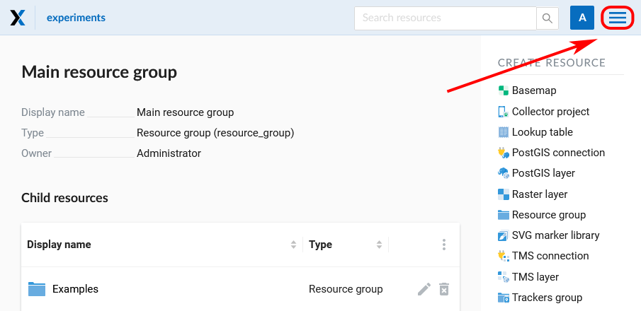
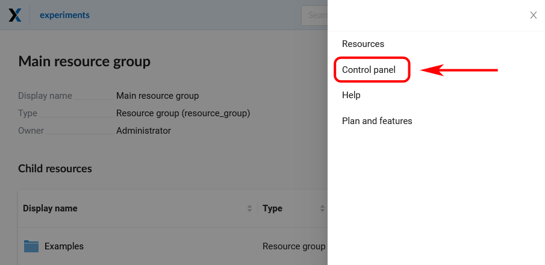
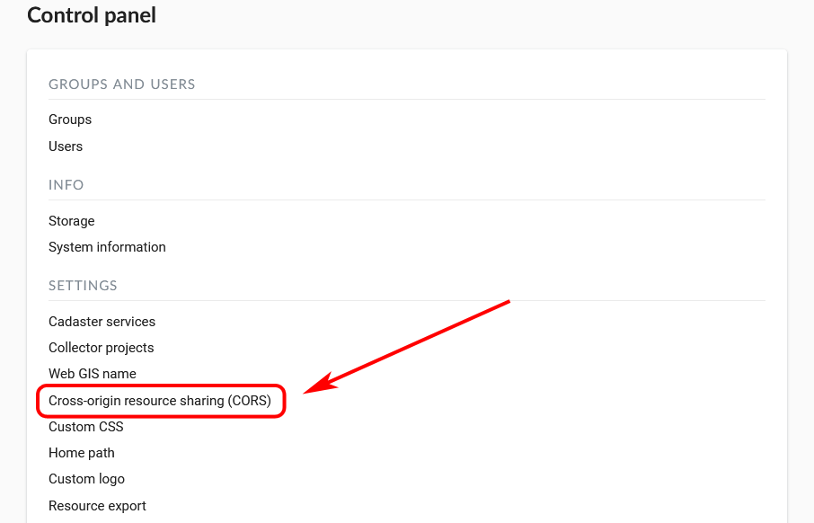
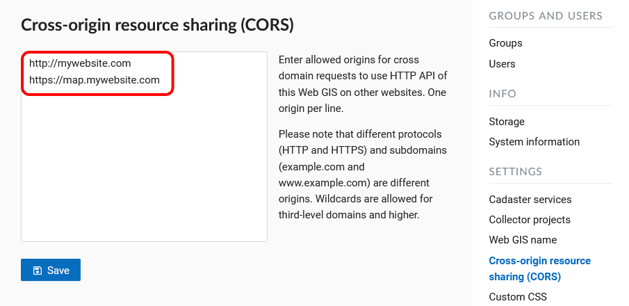

.. _ngcom_CORS:

How to switch on CORS for your Web GIS
=======================================

.. note:: 
	This functionality is available only to nextgis.com `Mini and Premium users <http://nextgis.com/nextgis-com/plans>`_.

If you’re a developer and would like to use your Web GIS as a backend for your own map or an app, you can switch on and set up `CORS <https://wikipedia.org/wiki/Cross-origin_resource_sharing>`_. 
This mode allows to use data from Web GIS for a map or system on your ogranization's domain, while all geodata uploads and management pains will be taken care of by your Web GIS at nextgis.com.

1. To switch on CORS, first go to your Web GIS Control panel:

   
   Opening the main menu

   
   Selecting Control panel

2. Select "Cross-origin resource sharing (CORS)" section and enter allowed origins for cross-domain requests on CORS Settings page:

   
   Selecting CORS in the Control panel

   
   CORS settings page
   
Press **Save**.
