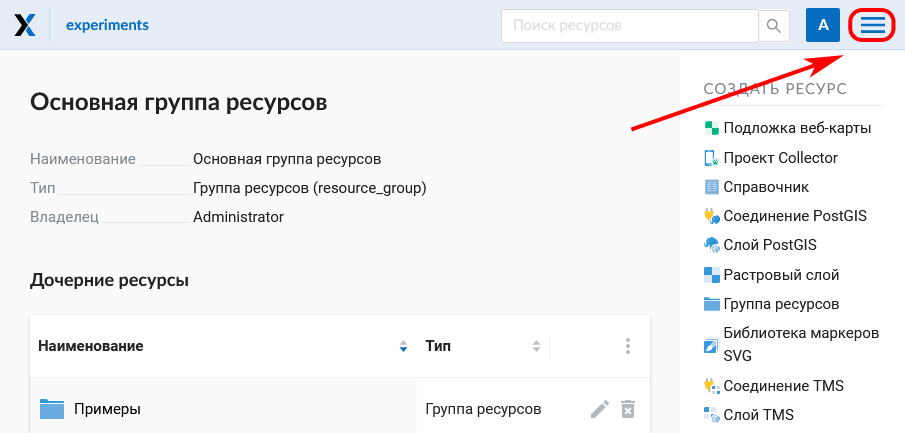
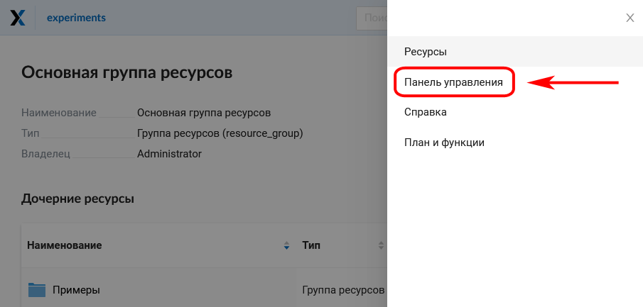
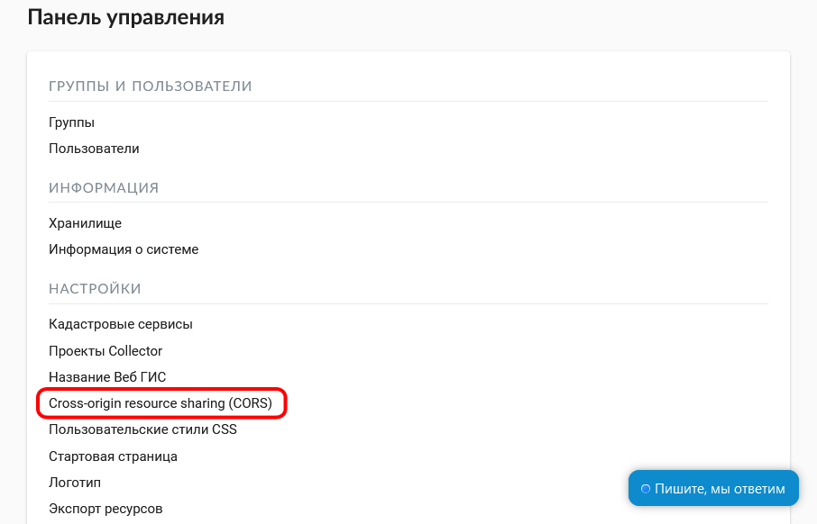
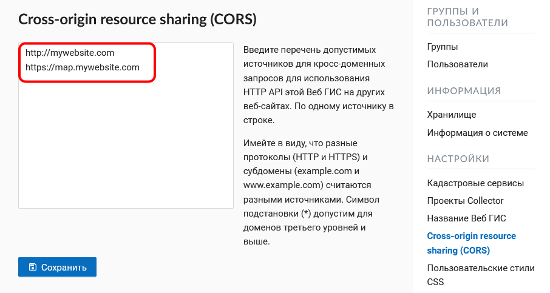

.. _ngcom_CORS:

Как включить режим CORS в своей Веб ГИС
========================================

.. note:: 
	Эта функциональность доступна только для пользователей планов `Mini и Premium <http://nextgis.ru/nextgis-com/plans>`_.

Если вы разработчик и хотите использовать свою Веб ГИС как источник данных для других карт или систем, у вас есть возможность включить и настроить режим `CORS <https://ru.wikipedia.org/wiki/Cross-origin_resource_sharing>`_. 
Этот режим позволит вам использовать данные на карте на сайте своей организации, а головную боль с загрузкой и управлением данными возьмет на себя сервис nextgis.com.

1. Чтобы включить режим CORS, зайдите в Панель управления своей Веб ГИС:

   
   Вызов меню

   
   Выбор Панели управления

2. Выберите раздел "Cross-origin resource sharing (CORS)" и введите перечень допустимых источников для кросс-доменных запросов на странице настроек CORS:

   
   Выбор пункта CORS в Панели управления

   
   Настройки CORS
   
Нажмите **Сохранить**.
