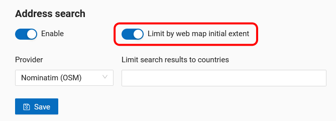

.. sectionauthor:: Юлия Григоренко <grigorenko.j@gmail.com>

.. ngcom_address_search:

How to set up address search for your Web Map
=============================================

In NextGIS Web you can search features on the Web Map. Results appear as you type, sorted in the following order: 

1. Coordinates.
2. Matches found in attributes of features in the layers added to the Web Map.
3. Addresses containing the search text.
 
After a click on a search result the map changes extent to show the selected feature.

.. note::
   To find a point using the coordinates, enter the latitude and longitude in degrees, minutes and seconds or decimal degrees, for example: 79°4'14.08"W, 43°4'59.37"N or -79 43; -79,07 43,08; -79.068493 43.079920.
   

   
   Search results for «Madison». Attributes of feature #1 are opened on the map with the search text highlighted

The address search in NextGIS Web uses two data bases (providers):

*	OpenStreetMap - used by default
*	Yandex.Maps - an external geocoder with an API key

To modify address search parameters open the main menu, go to the control panel, then select "Web Map" in the "Settings" section.

   
   Selecting Web Map settings in the control panel

Disabling address search
---------------------------

Address search can be turned off. In that case the search will only be performed in the feature attributes of the layers added to the Web Map (except the basemap).
From the control panel go to `Web Map settings <https://docs.nextgis.com/docs_ngweb/source/admin_tasks.html#web-map-settings>`_. Set the toggle of the "Address search" section to the off position.

   
   Address search disabled

Selecting search provider
---------------------------

NextGIS Web can use one of the two data bases for searching: Nominatim of OpenStreetMap or Yandex.Maps API Geocoder 
By default the OSM search is used.
To select a provider, go to control panel and open `Web Map settings <https://docs.nextgis.com/docs_ngweb/source/admin_tasks.html#web-map-settings>`_. In the "Address search" section use the dropdown menu of the "Provider" field to select the desired geocoder.

   
   Selecting address search provider

To use Yandex.Maps enter your API key in the field on the right. API keys can be obtained by users signed up on https://developer.tech.yandex.ru.

   
   Entering API key to use Yandex.Maps

Limit search area
-----------------------

You can limit the search area to the Web Map's initial extent.
From the control panel go to `Web Map settings <https://docs.nextgis.com/docs_ngweb/source/admin_tasks.html#web-map-settings>`_. Set the toggle of the "Limit by Web Map initial extent" to the on position.

   
   Search limited to the initial extent of the Web Map

While using OSM, you can also limit the search to a particular country. In the field "Limit search results to countries" enter the code of the country using the ISO of the OSM data base: de, gb, fi etc. To find out the code, use the search on https://www.openstreetmap.org.

.. figure:: _static/address_search_country_en.png
   :name: address_search_country_pic
   :align: center
   :width: 16cm
   
   Search limited to the territory of France
