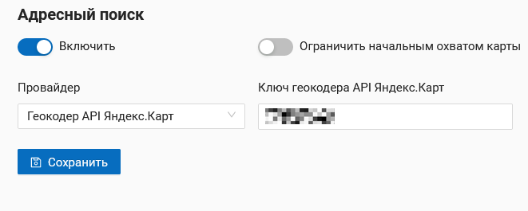

.. sectionauthor:: Юлия Григоренко <grigorenko.j@gmail.com>

.. ngcom_address_search:

Как настроить адресный поиск на веб-картах
==========================================

NextGIS Web позволяет осуществлять поиск объектов на веб-карте. Результаты появляются по мере ввода в следующем порядке: 

1. Координаты.
2. Объекты, найденные по атрибутивным значениям из добавленных слоев. 
3. Адреса, содержащие строку поиска. 
 
При выборе результата поиска из списка карта осуществляет переход к нему.

.. note::
   Для того, чтобы найти точку по координатам, в строку поиска следует ввести значения долготы и широты в градусах, минутах и секундах (используйте только прямые кавычки и прямой апостроф) или в десятичном формате, например: 
   
.. code-block:: bash

    79 W 43 N
    W 79 N 43
    -79 43 (результаты поиска будут включать две точки: 79 W, 43 N и 43 E, 79 S)
    79- 43
    -79 W 43 N
    79°4'14.08" W 43°4'59.37" N
    -79°4'14.08"  43°4'59.37"
    -79 4.25 W  43 4.95 N
    -79 4.25  43 4.95
    79.068493 43.079920
    79.068 W 43.08 N

   
   Результаты поиска по запросу «трамвайный». На карте открыты атрибуты объекта #10 векторного слоя, где содержится запрашиваемое слово

Адресный поиск в NextGIS Web осуществляется по двум базам адресов (провайдерам):

*	OpenStreetMap - используется по-умолчанию
*	Yandex Maps - внешний геокодер с использованием API ключа

Для настройки параметров адресного поиска откройте главное меню, перейдите в панель управления и в разделе «Настройки» выберите «Веб-карта».

   
   Выбор настроек веб-карты в панели управления

Отключение адресного поиска
---------------------------

Адресный поиск можно отключить. Тогда поиск будет осуществляться только по атрибутивной информации добавленных на карту слоёв (не считая подложки).
Через панель управления перейдите в `настройки веб-карты <https://docs.nextgis.com/docs_ngweb/source/admin_tasks.html#web-map-settings>`_ и передвиньте ползунок в пункте «Адресный поиск» в выключенное состояние.

   
   Адресный поиск отключен

Выбор провайдера для поиска
---------------------------

NextGIS Web может производить поиск, используя одну из двух баз данных: Nominatim OpenStreetMap или Геокодер API Яндекс.Карт. 
По умолчанию на веб-карте подключен поиск OSM.
Для того, чтобы выбрать провайдера, через панель управления перейдите в `настройки веб-карты <https://docs.nextgis.com/docs_ngweb/source/admin_tasks.html#web-map-settings>`_. В разделе «Адресный поиск» в пункте «Провайдер» выберете необходимый геокодер в выпадающем меню.

   
   Выбор провайдера для адресного поиска

Для провайдера Яндекс.Карты необходимо ввести Ключ API в поле справа. Пользователь получает ключ самостоятельно через https://developer.tech.yandex.ru.

   
   Введение ключа API для использования базы данных Яндекс.Карт

Ограничение зоны поиска
-----------------------

Можно ограничить зону поиска начальным охватом веб-карты.
Через панель управления перейдите в `настройки веб-карты <https://docs.nextgis.com/docs_ngweb/source/admin_tasks.html#web-map-settings>`_  и передвиньте ползунок в пункте "Ограничить начальным охватом карты" во включенное состояние.

   
   Поиск ограничен начальным охватом веб-карты

При использовании OSM можно ограничить поиск территорией определенной страны. Для этого в поле «Ограничить поиск странами» введите код страны в формате ru, gb, de и т.п. в соответствии с ISO базы OSM (можно проверить на сайте https://www.openstreetmap.org, введя в строку поиска название страны).

   
   Поиск ограничен территорией Франции
