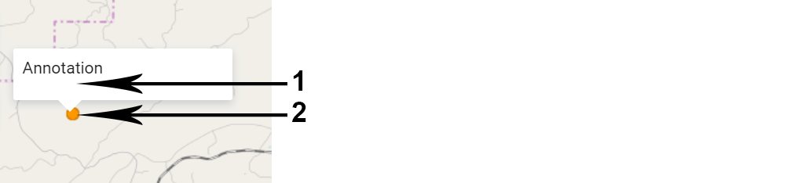
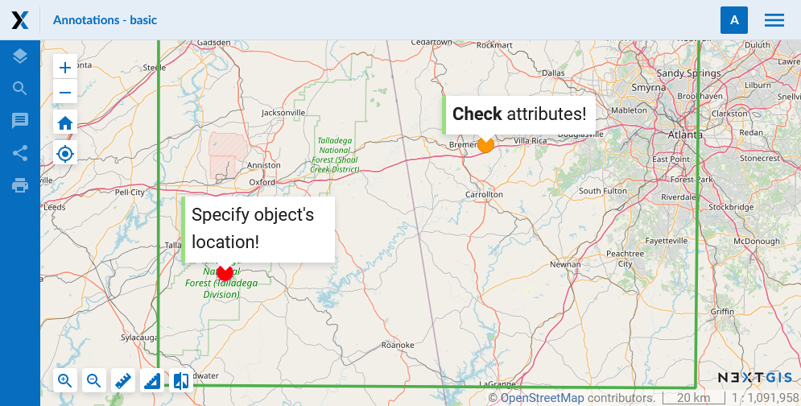
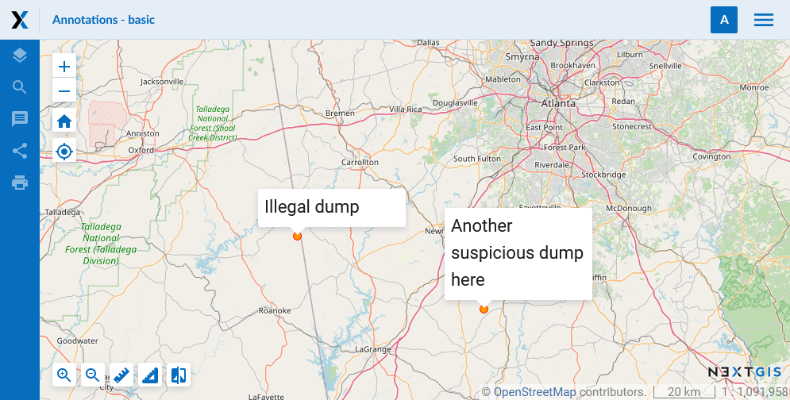
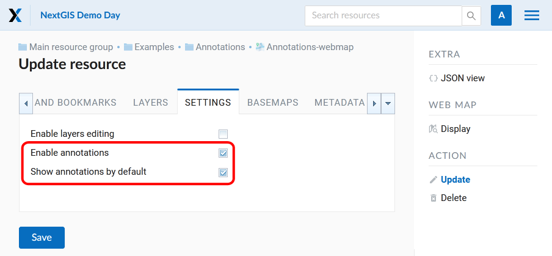
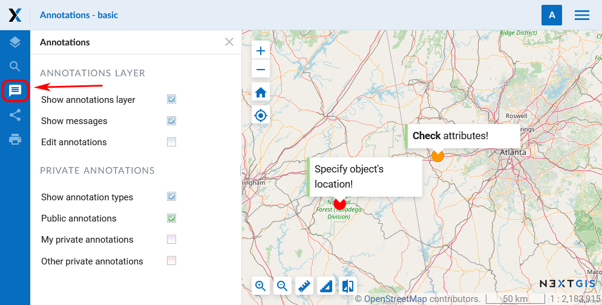
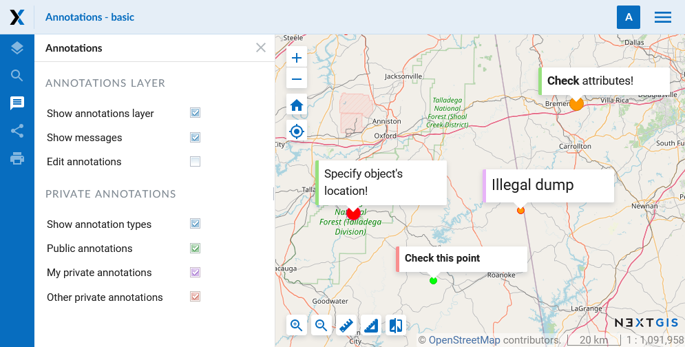
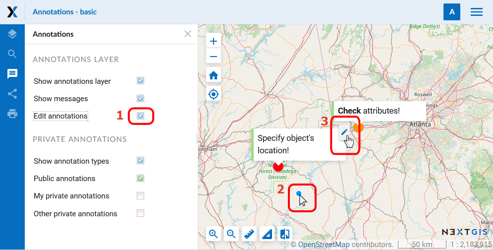
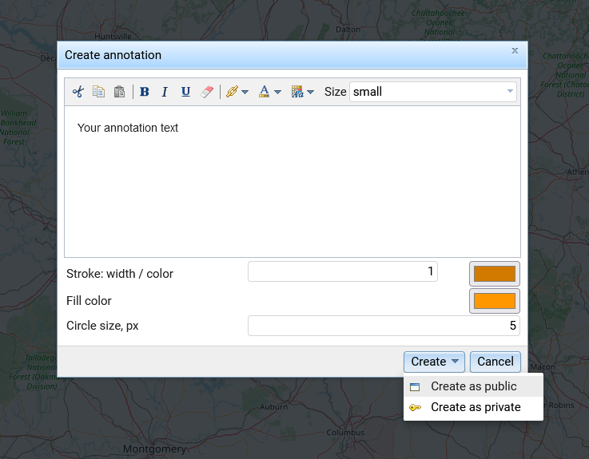

.. _ngcom_annotation:

.. _nextgis.com: http://nextgis.com/
.. _WYSIWYG: https://en.wikipedia.org/wiki/WYSIWYG
.. role:: raw-html(raw)
    :format: html

Web Map annotations
===================

.. note:: 
	You can use the described functionality in Web GIS created in nextgis.com_ service on `Premium plan <http://nextgis.com/pricing/#premium/>`_

Annotation. What is it?
~~~~~~~~~~~~~~~~~~~~~~~~

Annotations are text messages attached to the points, which you can create and display on any :ref:`Web Map <ngcom_webmap_create>`. You can create your own set of annotations for each Web Map.

Annotation consists of a point and a message attached to this point.

   Annotation structure (1 - a text message of annotation, 2 - a point of annotation)

The main aim of annotations is to specify user's data by placing temporary messages on a Web Map.

   An example of annotation display

At the same time, you can use annotations as a simple tool to create point data with text attributes attached to the Web Map.

   An example of annotation display (as point data)

.. note::
    In contrast to a full vector layer, annotation tool does not allow to export data, search for it etc. Therefore, we recommend using :ref:`vector layers <ngcom_vector_layer>` to create the bulk of the data.

How to plug in Web Map annotations?
~~~~~~~~~~~~~~~~~~~~~~~~~~~~~~~~~~~~~

You can enable creation of annotations and set the display options in the Settings tab of the "Create resource" or "Update resource" windows for the Web Map (see :ref:`Update resource <ngw_update_resource>`). By default the annotation tool is inactive.

   Settings tab of a Web Map for managing annotations (annotations are enabled and are shown on a Web Map when it opens)

There are two parameters in the Settings tab of a Web Map:

- **Enable annotations** - enable or forbid working with annotations while working with the Web Map.
- **Show annotations by default** - if there is a tick next to *"Enable annotations"*, annotations are shown on a Web Map when it opens. Otherwise they will be hidden.

Web Map: a panel for work with annotations
~~~~~~~~~~~~~~~~~~~~~~~~~~~~~~~~~~~~~~~~~~

If the *"Enable annotations"* option is active, the "Annotations" panel appears on the Web Map:

   "Annotations" panel on a Web Map

"Annotations" panel consists of several options:

- **Show annotations layer** - allows to show or hide points and messages of annotations.
- **Show messages** - allow to show or hide annotation messages, but does not influence points of annotations. (Active only if *Show annotations layer* is on.)
- **Edit annotations** - activate or inactivate annotation edit mode.

- **Show annotation types** - Annotations can be public or private. If there is a tick next to this option, the annotation texts will be color-coded.

Below you can choose which types of annotations to view. The color of the tick corresponds to the color marking the side of the annotation text of the selected type.

- **Public annotations** - marked green. One doesn't need to be logged in to see them.
- **My private annotations** - marked purple
- **Other private annotations** - marked red

   Three color-coded types of annotations

Web Map: annotation editting
~~~~~~~~~~~~~~~~~~~~~~~~~~~~~

You can create and edit annotations, if the option *Edit annotations* on the *"Annotations" panel* is active. When it is active, the mouse pointer has a blue point next to it and a pencil pictogram appears above existing annotations:

   Annotation edit mode

To **create** an annotation you need to click the left mouse button on the Web Map. Then a dialog window of annotation creation will be opened:

   Dialog window of annotation creation

Dialog of annotation creation consists of:

- **Editor of annotation message** - WYSIWYG_ editor of the annotation text message.
- **Stroke: width / color** - width and color of the annotation point stroke.
- **Fill color** - color of the annotation point.
- **Circle size, px** - size (diameter) of the annotation point in pixels.

After clicking **Save**, a drop-down menu appears. In it you need to select the type for your annotation - public or private. After you do so, the newly created annotation will appear on the Web Map.

To **edit** annotations you need to activate annotation edit mode, point to an annotation and click the pictogram on it with the left mouse button. The dialog window for annotation editting looks like a dialog window of annotation creation, but has a *"Delete"* button, which allows to **delete** the chosen annotation. In order to change the font size of the message or its part, you need to select the text first. 
You can edit both your own private annotations and those created by other users if you have the necessary permissions. The type of the annotation is marked at the top of the edit window. For private annotations of other users you will see the creator's name in brackets.

Web Map: user's permissions associated with annotations
~~~~~~~~~~~~~~~~~~~~~~~~~~~~~~~~~~~~~~~~~~~~~~~~~~~~~~

To further manage the work with annotations you can use access permissions (you can read more in :ref:`Setting permissions <ngw_access_rights>` of NextGIS Web documentation).

There are three permissions associated with annotations:

- **Web Map: View annotations** - allows or forbids annotations viewing by selected users for particular resources. If it is set to Deny value, "Annotations" panel is inactive.
- **Web Map: Edit annotations** - determines whether the selected user can edit public annotations and their own private annotations in a particular resource. If it is set to Deny value, "Edit annotations" option on the "Annotations" panel is inactive.
- **Web Map: Manage annotations** - determines whether the selected user can edit all types of annotation, included those created by other users. If it is set to Deny value, the “Other private annotations” option is not shown on the “Annotations” panel and the other users' private annotations can not be viewed on the Web Map.

Using above-mentioned permissions you can set annotations as following.

In the Settings tab of the Web Map

.. list-table::

   * - Settings
     - Result
   * - | Enable annotations - No
     - | Annotations panel is not shown on the Web Map.
       | Annotations can not be shown on the Web Map.
   * - | Enable annotations - Yes
       | Show annotations by default - No
     - | Annotations panel is available on the Web Map.
       | No tick for "Show annotations layer".
       | Annotations are not displayed on the Web Map when it opens but can be viewed.
   * - | Enable annotations - Yes
       | Show annotations by default - Yes
     - | Annotations panel is available on the Web Map.
       | "Show annotations layer" is ticked.
       | Annotations are displayed on the Web Map when it opens.
       
In the Permissions tab of the Web Map
If annotations are enabled in the Web Map settings, a particular user can have certain permissions:

.. list-table::

   * - Settings
     - Result
   * - | Web-map: View annotations - Deny
       | annotation_read - Deny
     - | Annotations panel is not shown on the Web Map.
       | No annotations are displayed on the Web Map, even the public annotations that are shown to unlogged users are hidden.
   * - | Web-map: View annotations - Allow
       | annotation_read - Allow
     - | Annotations panel is available on the Web Map.
       | Annotations can be viewed.
       | Editing of annotations is possible.
   * - | Web-map: View annotations - Allow
       | Web-map: Edit annotations - Deny
       | annotation_read - Allow
       | annotation_write - Deny
     - | Annotations panel is available on the Web Map.
       | Public annotations and this user's annotations can be displayed.
       | Annotations created by other users can not be displayed.
       | Annotation editing tools are unavailable.
   * - | Web-map: View annotations - Allow
       | Web-map: Edit annotations - Allow
       | annotation_read - Allow
       | annotation_write - Allow
     - | Annotations panel is available on the Web Map.
       | Public annotations and annotations created by all users can be displayed.
       | Editing of annotations is possible.
 

