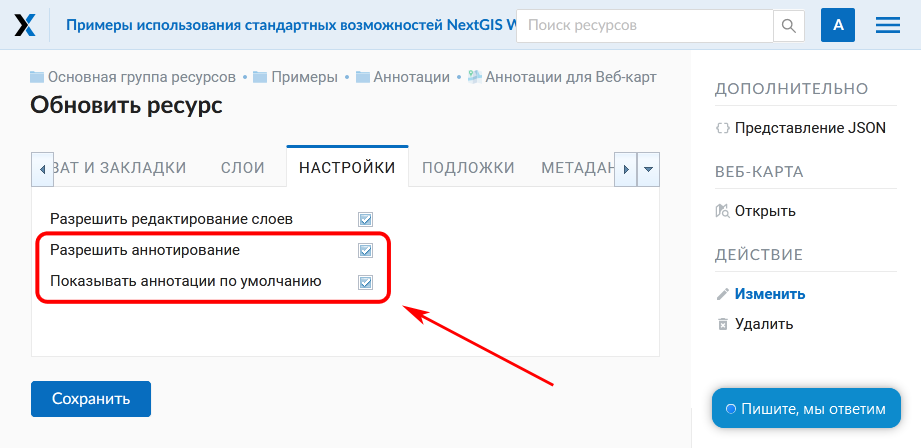
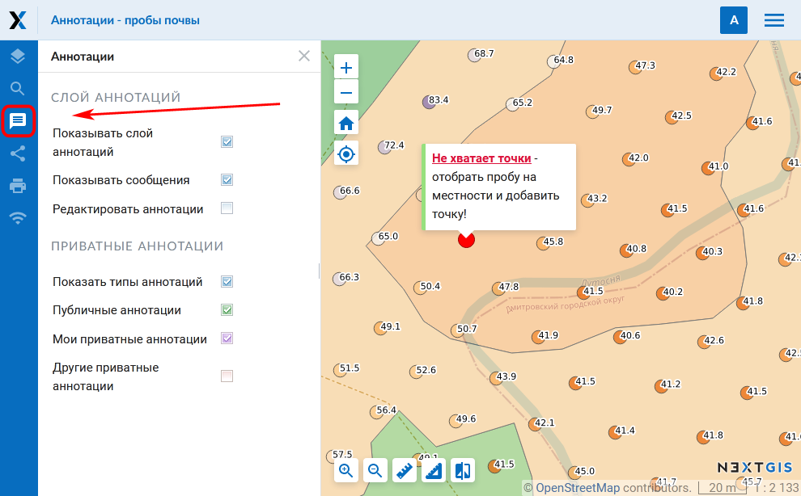
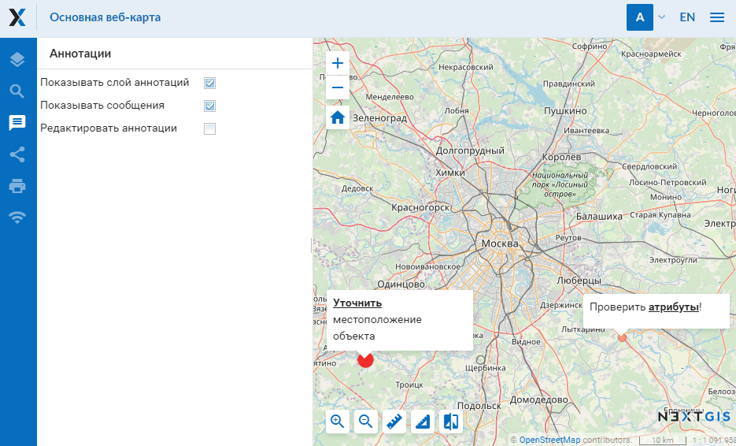

.. _ngcom_annotation:

.. _nextgis.com: http://nextgis.com/
.. _WYSIWYG: https://ru.wikipedia.org/wiki/WYSIWYG
.. role:: raw-html(raw)
    :format: html

Аннотации веб-карты
===================

.. note::
    Описываемая в данном разделе функциональность доступна в :ref:`Веб ГИС <ngcom_description>`,
    созданной с помощью сервиса nextgis.com_ и
    находящейся на тарифном плане `Премиум <http://nextgis.ru/pricing/#premium/>`_

Что такое аннотации?
~~~~~~~~~~~~~~~~~~~~
Аннотации - это текстовые сообщения, привязанные к точкам, которые вы можете создавать
и отображать поверх любой :ref:`веб-карты <ngcom_webmap_create>`. Для каждой веб-карты
вы можете создавать свой собственный набор аннотаций.

Визуально аннотация состоит из точки и сообщения, привязанного к этой точке.

.. figure:: _static/ann_annotation_structure_new.png
   :name: ann_messages_example
   :align: center
   :width: 16cm

   Визуальная структура аннотации (1 - сообщение аннотации, 2 - точка аннотации)

Аннотации предназначены, в первую очередь, для уточнения пользовательских данных путем
размещения временных сообщений на веб-карте.

.. figure:: _static/ann_messages_example_ru.png
   :name: ann_messages_example
   :align: center
   :width: 16cm

   Пример отображения аннотаций

В то же время, аннотации можно рассматривать как простой инструмент для создания
точечных данных с текстовой атрибутикой, привязанный к опеределенной веб-карте.

.. figure:: _static/ann_data_example_ru.png
   :name: ann_data_example
   :align: center
   :width: 16cm

   Пример отображения аннотаций (как точечных данных)

.. note::
    В отличие от полноценного векторного слоя, инструмент аннотаций не позволяет осуществлять экспорт данных, поиск по ним и т.д.
    Поэтому для создания массива ваших данных рекомендуется использовать :ref:`векторные слои <ngcom_vector_layer>`.

Как включить аннотации для веб-карты?
~~~~~~~~~~~~~~~~~~~~~~~~~~~~~~~~~~~~~

Настройка возможности создания и опций отображения аннотаций для веб-карты осуществляется в секции "Настройки" окна
"Создать ресурс" или "Обновить ресурс" для веб-карты (про :ref:`Обновление ресурса <ngw_update_resource>`). По умолчанию
инструмент аннотаций для веб-карты выключен.

   Секция настроек веб-карты для управления аннотациями (аннотации для веб-карты разрешены и отображаются на веб-карте при ее открытии)

В секции настроек веб-карты доступны следующие опции управления аннотациями:

- **Разрешить аннотирование** - включает или выключает возможность работы с аннотациями в редактируемой веб-карте.
- **Показывать аннотации по умолчанию** - при включенной опции *"Разрешить аннотирование"* устаналивает
отображение аннотаций на веб-карте при ее открытии. Если опция не установлена - аннотации на веб-карте
при ее открытии будут скрыты.

Веб-карта: панель для работы с аннотациями
~~~~~~~~~~~~~~~~~~~~~~~~~~~~~~~~~~~~~~~~~~

При включенной опции *"Разрешить аннотирование"* на веб-карте появляется панель "Аннотации", приведенная на рисунке ниже.

   Панель "Аннотации" на веб-карте

Панель "Аннотации" содержит следующие опции:

- **Показывать слой аннотаций** - позволяет скрыть или отобразить точки и сообщения аннотаций.
- **Показывать сообщения** - позволяет скрыть или отобразить сообщения аннотаций. Не влияет на отображение точек аннотаций.
Неактивна, если опция *Показывать слой аннотаций* выключена.
- **Редактировать аннотации** - включает или отключает режим редактирования аннотаций.

Веб-карта: редактирование аннотаций
~~~~~~~~~~~~~~~~~~~~~~~~~~~~~~~~~~~

Создание и изменение аннотаций становится возможным при включении опции *Редактировать аннотации*, расположенной в
*Панели аннотаций*. После ее включения курсор изменяет свой вид на точку синего цвета. Кроме того, над созданными
аннотациями появляется пиктограмма редактирования:

   Включение режима редактирования аннотаций на веб-карте

Для **создания** аннотации необходимо кликнуть левой кнопкой мыши на свободной от созданных аннотаций области веб-карты.
После этого отобразится окно создания аннотации, приведенное ниже.

.. figure:: _static/ann_create_ru.png
   :name: ann_create
   :align: center
   :width: 16cm

   Окно создания аннотации

Окно создания аннотации состоит из следующих блоков:

- **Редактор сообщения аннотации** - WYSIWYG_ редактор текста сообщения аннотации.
- **Обводка: ширина / цвет** - ширина и цвет обводки точки аннотация.
- **Цвет заливки** - цвет заливки точки аннотации.
- **Размер пунсона, пикс** - размер (диаметр) точки аннотации в пикселях.

После нажатия кнопки *"Сохранить"* на веб-карте отобразится созданная аннотация.

Для **редактирования** аннотаций необходимо включить режим редактирования аннотаций, навести курсор на аннотацию,
кликнуть левой кнопкой мыши по возникшей пиктограмме редактирования аннотации. Окно редактирования аннотации
по своей структуре аналогично окну создания аннотации, за исключением наличия кнопки *"Удалить"*, которая позволяет
**удалить** выбранную аннотацию. Для того, чтобы полностью или частично изменить размер или начертание текста аннотации, необходимо его выделить.

Веб-карта: права пользователя, связанные с аннотациями
~~~~~~~~~~~~~~~~~~~~~~~~~~~~~~~~~~~~~~~~~~~~~~~~~~~~~~

Для тонкой настройки возможности работы с аннотациями предназначен механизма прав доступа (подробнее
про работу с правами доступа можно прочитать в разделе :ref:`Настройка прав доступа <ngw_access_rights>` документации NextGIS Web).

Применительно к инструменту аннотаций, существует два права пользователя:

- **Веб-карта: Просмотр аннотаций** - разрешает или запрещает просмотр аннотаций для установленного субъекта прав и целевого ресурса. Панель аннотаций при установлении запрещающего значения будет недоступна.
- **Веб-карта: Редактировать аннотации** - разрешает или запрещает возможность редактирования аннотаций для установленного субъекта прав и целевого ресурса. При установлении запрещающего значения инструмент редактирования аннотаций на панели аннотаций будет недоступен.

С учетом описанных выше прав пользователя инструмент аннотаций можно настроить следующим образом.

.. list-table::

   * - Настройки
     - Результат
   * - | Веб-карта: Разрешить аннотирование - Да
       | Веб-карта: Показывать аннотации по умолчанию - Да
       | AnnotationScope.Read - Allowed
       | AnnotationScope.Write - Allowed
     - | Панель аннотаций доступна на веб-карте
       | Установлена галка “Показывать аннотации по умолчанию”
       | Инструменты управления аннотациями доступны
       | Аннотации отображаются на карте
   * - | Веб-карта: Разрешить аннотирование - Да
       | Веб-карта: Показывать аннотации по умолчанию - Да
       | AnnotationScope.Read - Allowed
       | AnnotationScope.Write - Deny
     - | Панель аннотаций доступна на веб-карте
       | Установлена галка “Показывать аннотации по умолчанию”
       | Инструменты управления аннотациями доступны
       | Аннотации отображаются на карте
   * - | Веб-карта: Разрешить аннотирование - Да
       | Веб-карта: Показывать аннотации по умолчанию - Да
       | AnnotationScope.Read - Deny
       | AnnotationScope.Write - Deny
     - | Панель аннотаций недоступна на веб-карте
       | Аннотации не отображаются на карте
   * - | Веб-карта: Разрешить аннотирование - Нет
     - | Панель аннотаций недоступна на веб-карте
       | Аннотации не отображаются на карте
   * - | Веб-карта: Разрешить аннотирование - Да
       | Веб-карта: Показывать аннотации по умолчанию - Нет
       | AnnotationScope.Read - Allowed
       | AnnotationScope.Write - Allowed
     - | Панель аннотаций доступна на веб-карте
       | Не установлена галка “Показывать аннотации по умолчанию”
       | Инструменты управления аннотациями недоступны
       | Аннотации не отображаются на карте
