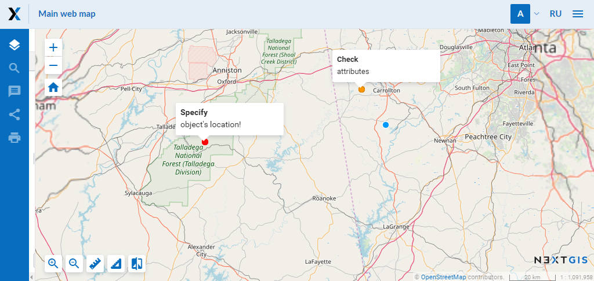
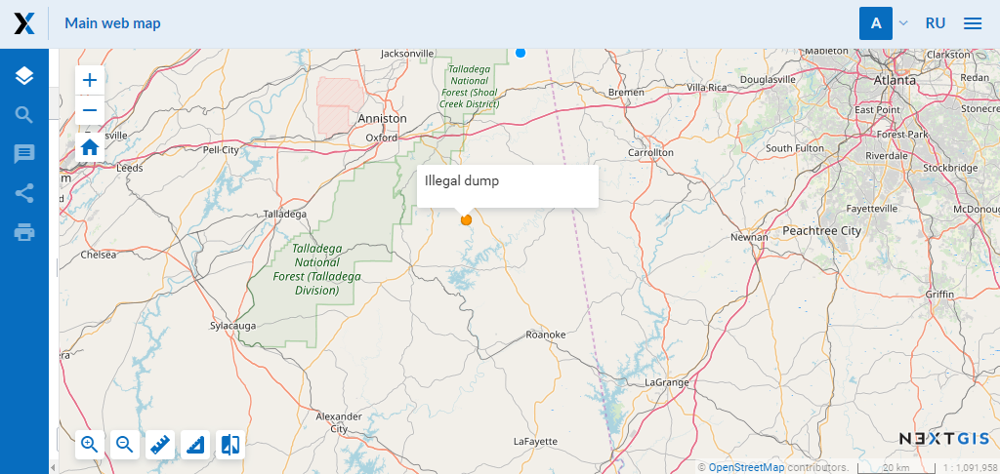
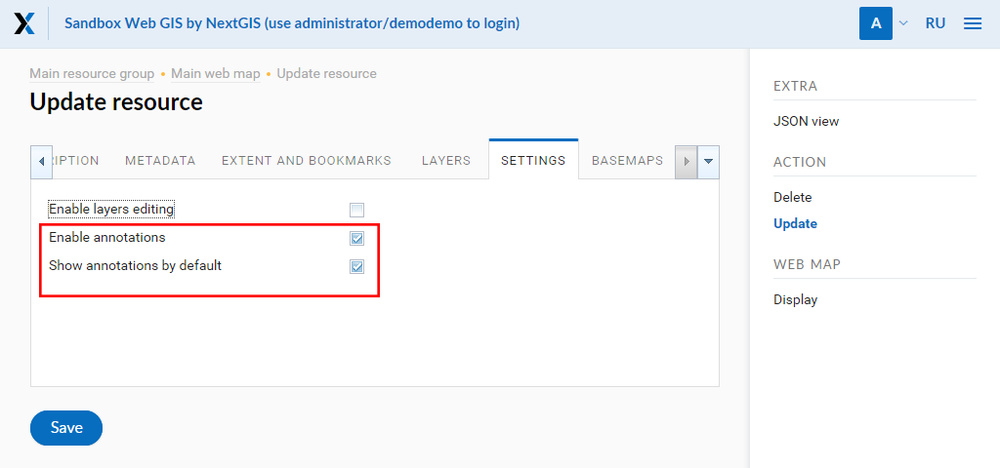

.. _ngcom_annotation:

.. _nextgis.com: http://nextgis.com/
.. _WYSIWYG: https://en.wikipedia.org/wiki/WYSIWYG
.. role:: raw-html(raw)
    :format: html

Web map annotations
===================

.. note:: 
	You can use described functionality in Web GIS created in nextgis.com_ service on `Premium plan <http://nextgis.com/pricing/#premium/>`_

Annotation. What is it?
~~~~~~~~~~~~~~~~~~~~~~~~

Annotations are text messages attached to the points, which you can create and display on any :ref:`Web map <ngcom_webmap_create>`. You can create your own set of annotations for each Web map.

Annotation consists of a point and a message attached to this point.

.. figure:: _static/ann_annotation_structure_new_eng.png
   :name: ann_messages_example
   :align: center
   :width: 16cm

   Annotation structure (1 - a text message of annotation, 2 - a point of annotation)

The main aim of annotations is to specify user's data by placing of temporary messages on a Web map.

   An example of annotation display

At the same time, you can use annotations as a simple tool for creation of point data with text attributes attached to the Web map.

   An example of annotation display (as point data)

.. note::
    In contrast to a full vector layer annotation tool does not allow to export data, search for it etc. Therefore, we reccomend you to use :ref:`vector layers <ngcom_vector_layer>` for creation of a great amount of data.

How to plug in Web map annotations?
~~~~~~~~~~~~~~~~~~~~~~~~~~~~~~~~~~~~~

You can enable creation and set display options for annotations in Settings tab of "Create resource" or "Update resource" windows for a certain Web map (see :ref:`Update resource <ngw_update_resource>`). By default annotation tool is inactive.

   Settings tab of a Web map for administration of annotations (annotations are enabled and are showed on a Web map when opened)

