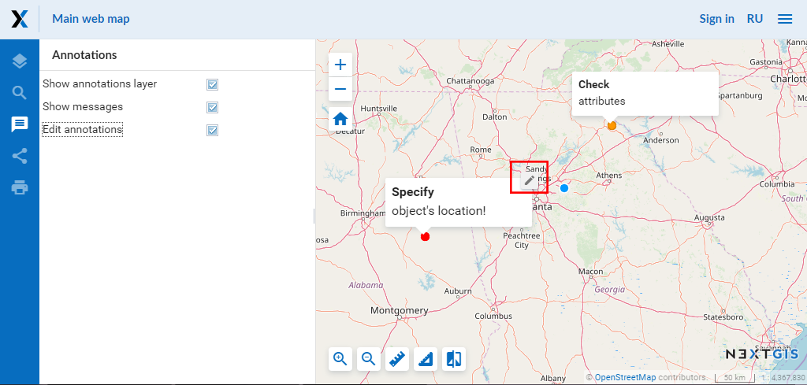
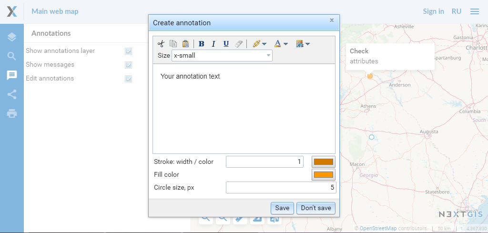

.. _ngcom_annotation:

.. _nextgis.com: http://nextgis.com/
.. _WYSIWYG: https://en.wikipedia.org/wiki/WYSIWYG
.. role:: raw-html(raw)
    :format: html

Web Map annotations
===================

.. note:: 
	You can use the described functionality in Web GIS created in nextgis.com_ service on `Premium plan <http://nextgis.com/pricing/#premium/>`_

Annotation. What is it?
~~~~~~~~~~~~~~~~~~~~~~~~

Annotations are text messages attached to the points, which you can create and display on any :ref:`Web Map <ngcom_webmap_create>`. You can create your own set of annotations for each Web Map.

Annotation consists of a point and a message attached to this point.

.. figure:: _static/ann_annotation_structure_new_eng.png
   :name: ann_messages_example
   :align: center
   :width: 16cm

   Annotation structure (1 - a text message of annotation, 2 - a point of annotation)

The main aim of annotations is to specify user's data by placing temporary messages on a Web Map.

.. figure:: _static/ann_messages_example_eng.png
   :name: ann_messages_example
   :align: center
   :width: 16cm

   An example of annotation display

At the same time, you can use annotations as a simple tool to create point data with text attributes attached to the Web Map.

.. figure:: _static/ann_data_example_eng.png
   :name: ann_data_example
   :align: center
   :width: 16cm

   An example of annotation display (as point data)

.. note::
    In contrast to a full vector layer, annotation tool does not allow to export data, search for it etc. Therefore, we reccomend using :ref:`vector layers <ngcom_vector_layer>` to create the bulk of the data.

How to plug in Web Map annotations?
~~~~~~~~~~~~~~~~~~~~~~~~~~~~~~~~~~~~~

You can enable creation of annotations and set the display options in the Settings tab of the "Create resource" or "Update resource" windows for the Web Map (see :ref:`Update resource <ngw_update_resource>`). By default the annotation tool is inactive.

.. figure:: _static/ann_settings_eng_2.png
   :name: ann_settings
   :align: center
   :width: 16cm

   Settings tab of a Web Map for managing annotations (annotations are enabled and are shown on a Web Map when it opens)

There are two parameters in the Settings tab of a Web Map:

- **Enable annotations** - enable or forbid working with annotations while editting Web Map.
- **Show annotations by default** - if there is a tick next to *"Enable annotations"*, annotations are shown on a Web Map when it opens. Otherwise they will be hidden.

Web Map: a panel for work with annotations
~~~~~~~~~~~~~~~~~~~~~~~~~~~~~~~~~~~~~~~~~~

If the *"Enable annotations"* option is active, the "Annotations" panel appears on the Web Map:

.. figure:: _static/ann_panel_eng.png
   :name: ann_panel
   :align: center
   :width: 16cm

   "Annotations" panel on a Web Map

"Annotations" panel consists of several options:

- **Show annotations layer** - allows to show or hide points and messages of annotations.
- **Show messages** - allow to show or hide annotation messages, but does not influence points of annotations. (Only if *Show annotations layer* is on.)
- **Edit annotations** - activate or inactivate annotation edit mode. (Only if *Show annotations layer* is on.)

Web Map: annotation editting
~~~~~~~~~~~~~~~~~~~~~~~~~~~~~

You can create and edit annotations, if option *Edit annotations* on the *"Annotations" panel* is active. When it is active, the mouse pointer has a blue point next to it and a pencil pictogram appears above existing annotations:

   Annotation edit mode

To **create** an annotation you need to click the left mouse button on the Web Map. Then a dialog window of annotation creation will be opened:

   Dialog window of annotation creation

Dialog of annotation creation consists of:

- **Editor of annotation message** - WYSIWYG_ editor of the annotation text message.
- **Stroke: width / color** - width and color of the annotation point stroke.
- **Fill color** - color of the annotation point.
- **Circle size, px** - size (diameter) of the annotation point in pixels.

Click *"Save"* button, and the annotation will appear on the Web Map.

To **edit** annotations you need to activate annotation edit mode, point to an annotation and click the pictogram on it with the left mouse button. The dialog window for annotation editting looks like a dialog window of annotation creation, but has a *"Delete"* button, which allows to **delete** the chosen annotation.

Web Map: user's permissions associated with annotations
~~~~~~~~~~~~~~~~~~~~~~~~~~~~~~~~~~~~~~~~~~~~~~~~~~~~~~

To further manage the work with annotations you can use access permissions (you can read more in :ref:`Setting permissions <ngw_access_rights>`of NextGIS Web documentation).

There are two permissions associated with annotations:

- **Web Map: View annotations** - allows or forbids annotation view for some users for separate resources. If it is set to Deny value, "Annotations" panel is inactive.
- **Web Map: Edit annotations** - allows of forbids editting of annotations for some users for separate resources. If it is set to Deny value, "Edit annotations" option on "Annotations" panel is inactive.

Using above-mentioned permissions you can set annotations as following:

.. list-table::

   * - Settings
     - Result
   * - | Web Map: Enable annotations - Yes
       | Web Map: Show annotations by default - Yes
       | AnnotationScope.Read - Allowed
       | AnnotationScope.Write - Allowed
     - | "Annotations" panel is active on a Web Map
       | There is a tick next to "Show annotations by default"
       | Annotation editting tools are available
       | Annotations are shown on a Web Map
   * - | Web Map: Enable annotations - Yes
       | Web Map: Show annotations by default - Yes
       | AnnotationScope.Read - Allowed
       | AnnotationScope.Write - Deny
     - | "Annotations" panel is active on a Web Map
       | There is a tick next to "Show annotations by default"
       | Annotation editting tools are available
       | Annotations are shown on a Web Map
   * - | Web Map: Enable annotations - Yes
       | Web Map: Show annotations by default - Yes
       | AnnotationScope.Read - Deny
       | AnnotationScope.Write - Deny
     - |"Annotations" panel is inactive on a Web Map
       | Annotations are not shown on a Web Map
   * - | Web Map: Enable annotations - No
     - | "Annotations" panel is inactive on a Web Map
       | Annotations are not shown on a Web Map
   * - | Web Map: Enable annotations - Yes
       | Web Map: Show annotations by default - No
       | AnnotationScope.Read - Allowed
       | AnnotationScope.Write - Allowed
     - | "Annotations" panel is active on a Web Map
       | There is no tick next to "Show annotations by default"
       | Annotation editting tools are not available
       | Annotations are not shown on a Web Map

