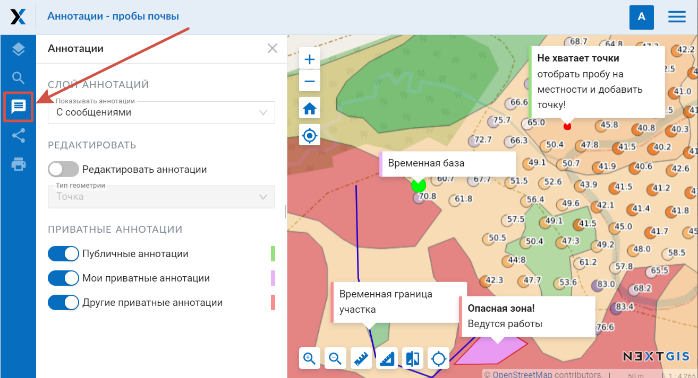

.. _ngcom_annotation:

.. _nextgis.com: http://nextgis.com/
.. _WYSIWYG: https://ru.wikipedia.org/wiki/WYSIWYG
.. role:: raw-html(raw)
    :format: html

Аннотации веб-карты
===================

.. note::
    Описываемая в данном разделе функциональность доступна в :ref:`Веб ГИС <ngcom_description>`,
    созданной с помощью сервиса nextgis.com_ и
    находящейся на тарифном плане `Премиум <http://nextgis.ru/pricing/#premium/>`_

Что такое аннотации?
~~~~~~~~~~~~~~~~~~~~
Аннотации - это текстовые сообщения, привязанные к точкам, линиям или полигонам, которые вы можете создавать
и отображать поверх любой :ref:`веб-карты <ngcom_webmap_create>`. Для каждой веб-карты
вы можете создавать свой собственный набор аннотаций.

Визуально аннотация состоит из символа (точки, линии или полигона) и сообщения, привязанного к этому символу.

.. figure:: _static/ann_annotation_structure_new.png
   :name: ann_messages_example
   :align: center
   :width: 20cm

   Визуальная структура аннотации (1 - сообщение аннотации, 2 - точка аннотации)

Аннотации предназначены, в первую очередь, для уточнения пользовательских данных путем
размещения временных сообщений на веб-карте.

.. figure:: _static/ann_messages_example_ru.png
   :name: ann_messages_example
   :align: center
   :width: 20cm

   Пример отображения аннотаций

В то же время, аннотации можно рассматривать как простой инструмент для создания
точечных данных с текстовой атрибутикой, привязанный к опеределенной веб-карте.

.. figure:: _static/ann_data_example_ru.png
   :name: ann_data_example
   :align: center
   :width: 20cm

   Пример отображения аннотаций (как точечных данных)

.. note::
    В отличие от полноценного векторного слоя, инструмент аннотаций не позволяет осуществлять экспорт данных, поиск по ним и т.д.
    Поэтому для создания массива ваших данных рекомендуется использовать `векторные слои <https://docs.nextgis.ru/docs_ngweb/source/layers.html#ngw-create-empty-vector-layer>`_.

Как включить аннотации для веб-карты?
~~~~~~~~~~~~~~~~~~~~~~~~~~~~~~~~~~~~~

Настройка возможности создания и опций отображения аннотаций для веб-карты осуществляется в секции "Настройки" окна
"Создать ресурс" или "Обновить ресурс" для веб-карты (про :ref:`Обновление ресурса <ngw_update_resource>`). По умолчанию
инструмент аннотаций для веб-карты выключен.

   Секция настроек веб-карты для управления аннотациями (аннотации для веб-карты разрешены и отображаются на веб-карте при ее открытии)

В секции настроек веб-карты доступны следующие опции управления аннотациями:

**Разрешить аннотирование** - включает или выключает возможность работы с аннотациями в редактируемой веб-карте.

**Показывать аннотации**:

- *Нет* - аннотации на веб-карте при ее открытии будут скрыты. 
- *Да* - отображаются символы аннотаций (точки, линии и полигоны). 
- *С сообщениями* - отображаются как символы аннотаций, так и текст

Веб-карта: панель для работы с аннотациями
~~~~~~~~~~~~~~~~~~~~~~~~~~~~~~~~~~~~~~~~~~

При включенной опции *"Разрешить аннотирование"* на веб-карте появляется панель "Аннотации", приведенная на рисунке ниже.

   Панель "Аннотации" на веб-карте

Панель "Аннотации" содержит следующие опции:

**Показывать аннотации** - позволяет скрыть или отобразить символы и сообщения аннотаций.

**Редактировать аннотации** - включает или отключает режим редактирования аннотаций. Ниже можно выбрать тип геометрии для создаваемой аннотации: точка, линия, полигон.

**Приватные аннотации** - здесь можно выбрать, какие аннотации отображать на карте. Тексты аннотаций будут отображаться с цветными полосками сбоку, соответствующими их типу.

- **Публичные аннотации** - обозначены зеленым. Доступны всем, в том числе неавторизованным пользователям.
- **Мои приватные аннотаци** - обозначены сиреневым. Видны самому пользователю и пользователям с соответствующими правами.
- **Другие приватные аннотации** - обозначены красным, это приватные аннотации, созданные другими пользователями ВебГИС.

   
   Аннотации трех типов, обозначенные разными цветами: 1 - публичные, 2 - мои приватные, 3 - другие приватные

Веб-карта: редактирование аннотаций
~~~~~~~~~~~~~~~~~~~~~~~~~~~~~~~~~~~

Создание и изменение аннотаций становится возможным при включении опции *Редактировать аннотации*, расположенной в
*Панели аннотаций*. После ее включения курсор изменяет свой вид на точку синего цвета. Кроме того, над созданными аннотациями при наведении появляется пиктограмма редактирования:

   Режим редактирования аннотаций на веб-карте (1 - редактирование аннотаций включено, 2 - вид курсора на свободном месте карты в процессе создания линии, 3 - пиктограмма редактирования, появляющаяся при наведении курсора на аннотацию)

Для **создания** аннотации необходимо кликнуть левой кнопкой мыши на свободной от созданных аннотаций области веб-карты. Если выбран тип точка, то достаточно кликнуть один раз. При создании линии или полигона для завершения рисования контура кликните дважды на последней точке. Полигон при этом замкнется автоматически.
После этого отобразится окно создания аннотации, приведенное ниже.

.. figure:: _static/ann_create_ru.png
   :name: ann_create
   :align: center
   :width: 13cm

   Окно создания аннотации

Окно создания аннотации состоит из следующих блоков:

- **Редактор сообщения аннотации** - WYSIWYG_ редактор текста сообщения аннотации.
- **Обводка: ширина / цвет** - ширина и цвет обводки точки аннотация.
- **Цвет заливки** - цвет заливки точки аннотации.
- **Размер пунсона, пикс** - размер (диаметр) точки аннотации в пикселях.

При нажатии на кнопку *"Создать"* в выпадающем меню необходимо выбрать, какую аннотацию вы хотите создать - публичную или приватную. В дальнейшем тип этой аннотации изменить будет невозможно. Созданная аннотация сразу отобразится на веб-карте.

Для **редактирования** аннотаций необходимо включить режим редактирования аннотаций, навести курсор на аннотацию,
кликнуть левой кнопкой мыши по возникшей пиктограмме редактирования аннотации. Окно редактирования аннотации
по своей структуре аналогично окну создания аннотации, за исключением наличия кнопки *"Удалить"*, которая позволяет
**удалить** выбранную аннотацию. Для того, чтобы полностью или частично изменить размер или начертание текста аннотации, необходимо его выделить.

Редактировать можно как свои, так и чужие приватные аннотации при наличии соответствующих прав пользователя. В верхней части окна редактирования обозначен тип аннотации. Для приватных аннотаций других пользователей в скобках будет указано имя создателя.

Веб-карта: права пользователя, связанные с аннотациями
~~~~~~~~~~~~~~~~~~~~~~~~~~~~~~~~~~~~~~~~~~~~~~~~~~~~~~

Для тонкой настройки возможности работы с аннотациями предназначен механизма прав доступа (подробнее
про работу с правами доступа можно прочитать в разделе :ref:`Настройка прав доступа <ngw_access_rights>` документации NextGIS Web).

Применительно к инструменту аннотаций, существует три права пользователя:

- **Веб-карта: Просмотр аннотаций** - разрешает или запрещает просмотр аннотаций для установленного субъекта прав и целевого ресурса. Панель аннотаций при установлении запрещающего значения будет недоступна.
- **Веб-карта: Редактировать аннотации** - разрешает или запрещает возможность редактирования *публичных и собственных приватных* аннотаций для установленного субъекта прав и целевого ресурса. При установлении запрещающего значения инструмент редактирования аннотаций на панели аннотаций будет недоступен.
- **Веб-карта: Администрирование аннотаций** - разрешает или запрещает возможность редактирования *всех типов* аннотаций, в том числе созданных другими пользователями. При установлении запрещающего значения пункт «Другие приватные аннотации» отсутствует в панели аннотаций и они не отображаются на карте.

С учетом описанных выше прав пользователя инструмент аннотаций можно настроить следующим образом.

Во вкладке **Настройки веб-карты**

.. list-table::

   * - Настройки
     - Результат
   * - | Разрешить аннотирование - **Нет**
     - | Панель аннотаций недоступна на веб-карте.
       | Аннотации не отображаются на карте.
   * - | Разрешить аннотирование - **Да**
       | Показывать аннотации по умолчанию - **Нет**
     - | Панель аннотаций доступна на веб-карте.
       | Не установлена галка “Показывать слой аннотаций”.
       | Аннотации не отображаются на карте при ее открытии, но могут быть включены вручную.
   * - | Разрешить аннотирование - **Да**
       | Показывать аннотации по умолчанию - **Да**
     - | Панель аннотаций доступна на веб-карте.
       | Установлена галка “Показывать слой аннотаций”.
       | Аннотации отображаются на карте при ее открытии.

Во вкладке **Права доступа**

Если в настройках веб-карты разрешено аннотирование, права отдельного пользователя могут быть следующими:

.. list-table::

   * - Настройки
     - Результат для **администратора**
     - Результат для **обычного пользователя**
   * - | Веб-карта: Просмотр аннотаций - **Запретить**
       | annotation_read - Deny
     - | Панель аннотаций недоступна на веб-карте.
       | Никакие аннотации не отображаются на карте, если зайти в выбранный аккаунт. 
       | Скрыты даже публичные аннотации, видимые незалогиненным пользователям.
     - | Панель аннотаций недоступна на веб-карте.
       | Никакие аннотации не отображаются на карте, если зайти в выбранный аккаунт. 
       | Скрыты даже публичные аннотации, видимые незалогиненным пользователям.
   * - | Веб-карта: Просмотр аннотаций - **Разрешить**
       | annotation_read - Allow
     - | Панель аннотаций доступна на веб-карте.
       | Аннотации могут быть отображены.
       | *Доступно редактирование* аннотаций.
     - | Панель аннотаций доступна на веб-карте.
       | Могут быть отображены *публичные аннотации и аннотации пользователя*.
       | Не отображаются аннотации других пользователей.
       | *Недоступно редактирование* аннотаций.
   * - | Веб-карта: Просмотр аннотаций - **Разрешить**
       | Веб-карта: Редактировать аннотации - **Запретить**
       | annotation_read - Allow
       | annotation_write - Deny
     - | Панель аннотаций доступна на веб-карте.
       | Могут быть отображены публичные аннотации и аннотации пользователя.
       | Не отображаются аннотации других пользователей.
       | Инструменты редактирования аннотаций недоступны.
     - | Панель аннотаций доступна на веб-карте.
       | Могут быть отображены публичные аннотации и аннотации пользователя.
       | Не отображаются аннотации других пользователей.
       | Инструменты редактирования аннотаций недоступны.
   * - | Веб-карта: Просмотр аннотаций - **Разрешить**
       | Веб-карта: Редактировать аннотации - **Разрешить**
       | annotation_read - Allow
       | annotation_write - Allow
     - | Панель аннотаций доступна на веб-карте.
       | Могут быть отражены публичные аннотации и аннотации *всех пользователей*.
       | Доступно редактирование аннотаций.
     - | Панель аннотаций доступна на веб-карте.
       | Могут быть отображены публичные аннотации и *аннотации пользователя*.
       | *Не отображаются аннотации других пользователей*.
       | Доступно редактирование аннотаций.
   * - | Веб-карта: Просмотр аннотаций - **Разрешить**
       | Веб-карта: Редактировать аннотации - **Разрешить**
       | Веб-карта: Администрировать аннотации - **Разрешить**
       | annotation_read - Allow
       | annotation_write - Allow
       | annotation_manage - Allow
     - | Панель аннотаций доступна на веб-карте.
       | Могут быть отражены публичные аннотации и аннотации всех пользователей.
       | Доступно редактирование аннотаций.
     - | Панель аннотаций доступна на веб-карте.
       | Могут быть отражены публичные аннотации и аннотации *всех пользователей*.
       | Доступно редактирование аннотаций.

