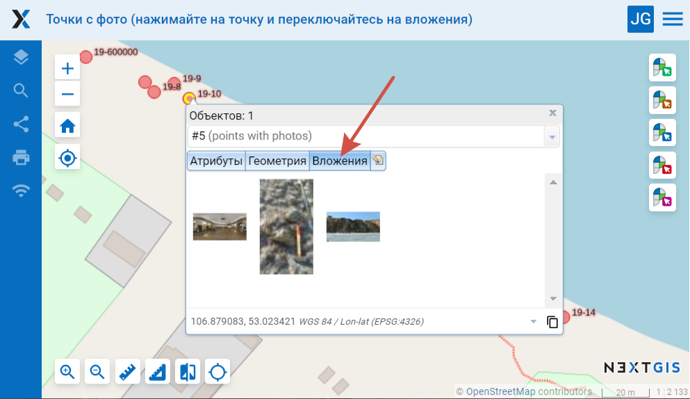
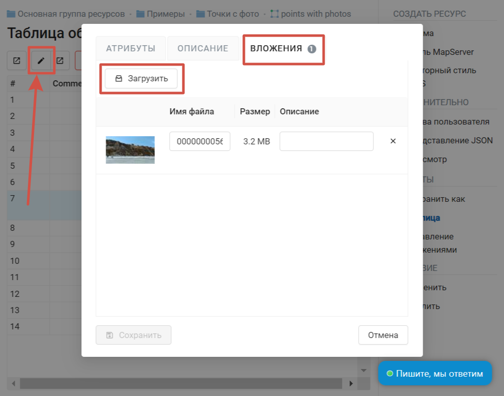
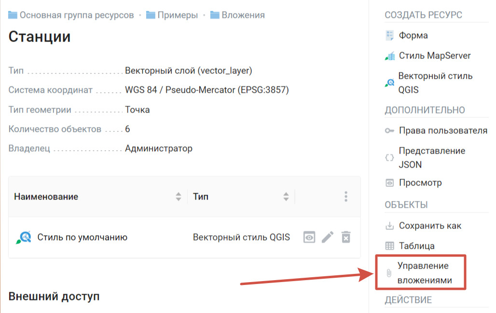
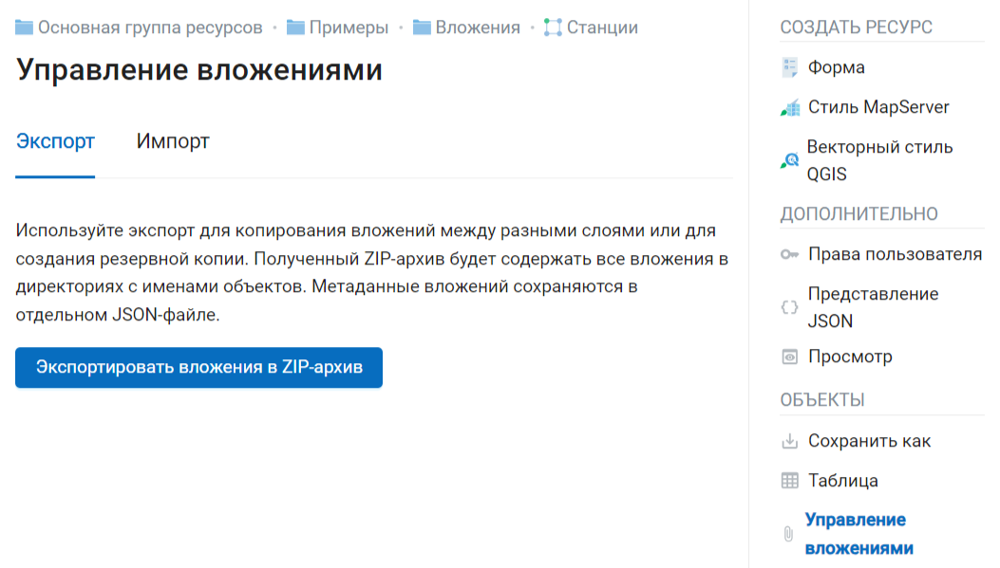
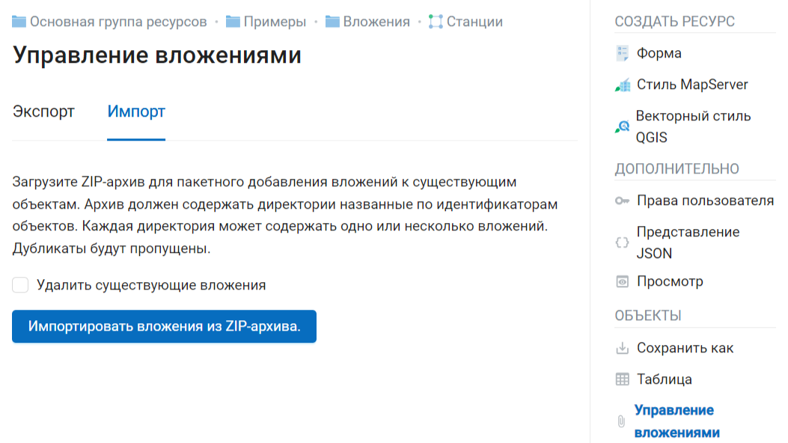
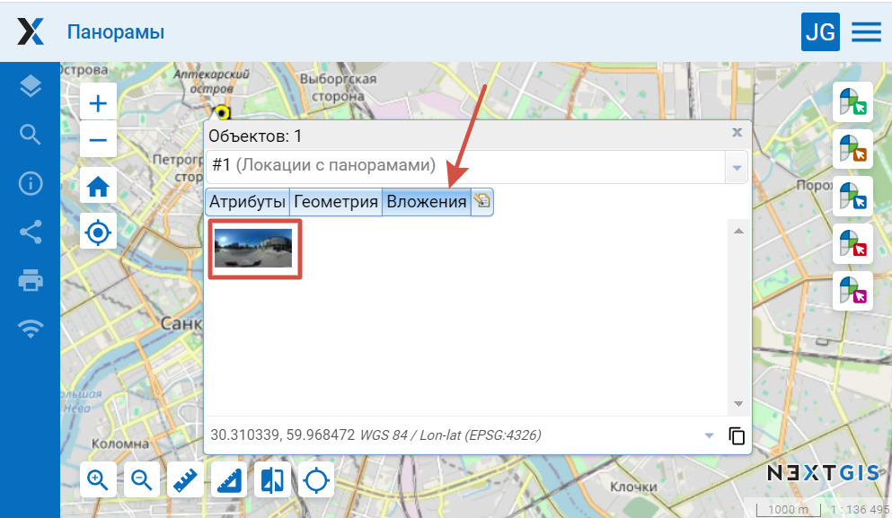
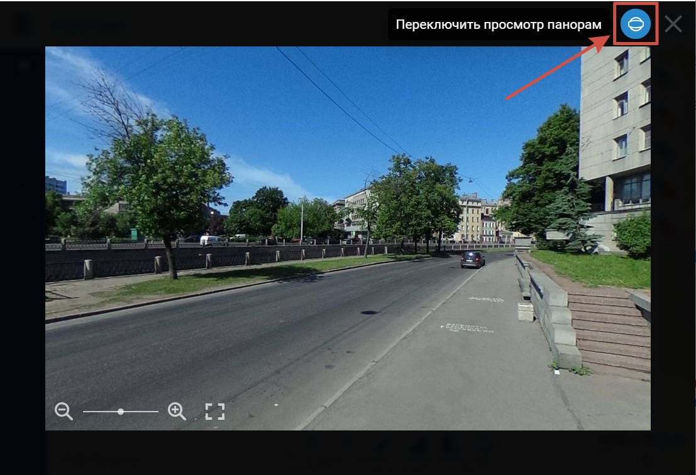

.. sectionauthor:: Юлия Григоренко <grigorenko.j@gmail.com>

.. _ngcom_attachments:

Как управлять вложениями
===========================

К объектам векторного слоя можно прикреплять фотографии, панорамы и другие файлы. При клике по объекту на карте во всплывающем окне будет отображены как атрибуты объекта, так и вложения.

   Вложения на карточке объекта

- Использовать можно любые файлы.
- Просмотр работает только для фото и сферических панорам, соответствующих `спецификации <https://developers.google.com/streetview/spherical-metadata?hl=ru>_.

.. _ngcom_attachments_add:

Добавление вложений поштучно через карточку объекта
------------------------------------------------------

Чтобы прикрепить файл к объекту, откройте окно редактирования. Его можно вызвать разными способами:

* Кликнуть на нужном объекте на веб-карте и во всплывающем окошке нажать кнопку редактирования.
* Открыть на карте таблицу объектов, выделить нужный и нажать кнопку **Редактировать**.
* Открыть таблицу объектов со страницы ресурса, выделить нужную строку и нажать кнопку **Редактировать**.

В окне редактирования объекта перейдите во вкладку "Вложения".

   Добавление вложения

Нажмите **Загрузить** и выберите нужный файл на устройстве. Затем нажмите **Сохранить**

Можно редактировать имя файла и описание ранее добавленных вложений. Чтобы удалить вложение, нажмите на крестик справа от него.

Если при редактировании вы ошиблись, нажмите кнопку **Сбросить**, внесённые изменения будут отменены.

.. _ngcom_attach_import_export:

Импорт и экспорт вложений
-------------------------

Для массового копирования вложений между слоями или создания резервной копии все вложения слоя можно экспортировать в виде архива (При стандартном сохранении слоя они включены в файл не будут).

На странице слоя выберите действие **Управление вложениями**.

   Управление вложениями

Для того, чтобы сохранить вложения, выберите вкладку **Экспорт** и нажмите кнопку **Экспортировать вложения в ZIP-архив**. Полученный архив будет содержать все вложения в директориях с именами объектов. Метаданные вложений сохраняются в отдельном JSON-файле.

   Экспорт вложений на устройство

Полученный таким образом архив можно импортировать, чтобы добавить вложения к слою. Для этого откройте вкладку **Импорт**, нажмите **Импортировать вложения из ZIP-архива** и выберите на устройстве соответствующий файл. Архив должен содержать директории названные по идентификаторам объектов. Каждая директория может содержать одно или несколько вложений. Дубликаты будут пропущены. Если нужно заменить ранее добавленные вложения, отметьте галочку "Удалить существующие вложения".

   Импорт вложений из архива

.. _ngcom_attachments_panoramas:

Использование панорам
--------------------------

К объектам можно добавлять не только фографии, но и панорамы. Они дают возможность погружаться в новые локации и изучать детали уже знакомых мест.

   Превью панорамы в карточке объекта

Загружаемые панорамные снимки должны соответствовать спецификации `Google XMP Photo Sphere <https://developers.google.com/streetview/spherical-metadata?hl=ru>`_.

Навигация по панорамам осуществляется мышью. Зажимайте левую кнопку мыши и вращайте камеру. Колёсиком приближайте и отдаляйте обзор. Режим панорамы у снимка можно отключать (круглая синяя кнопка в верхнем углу).

   Панорама, открытая с веб-карты

