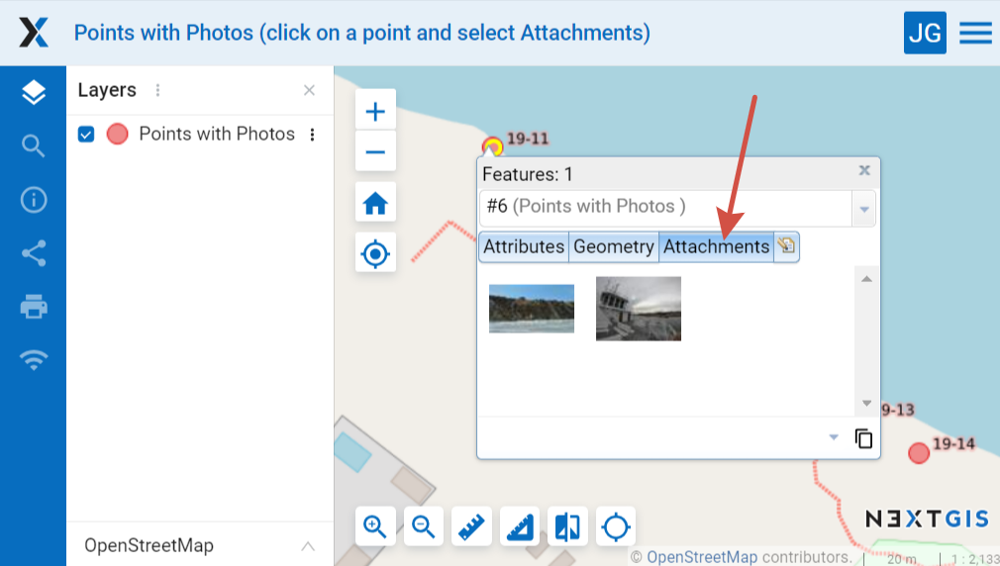
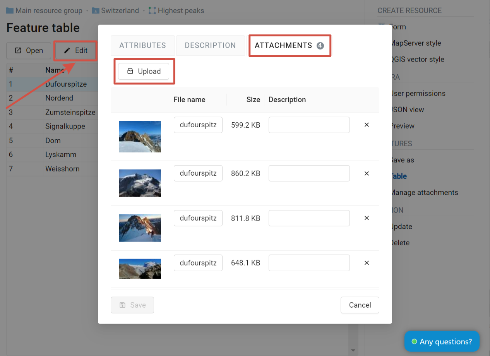
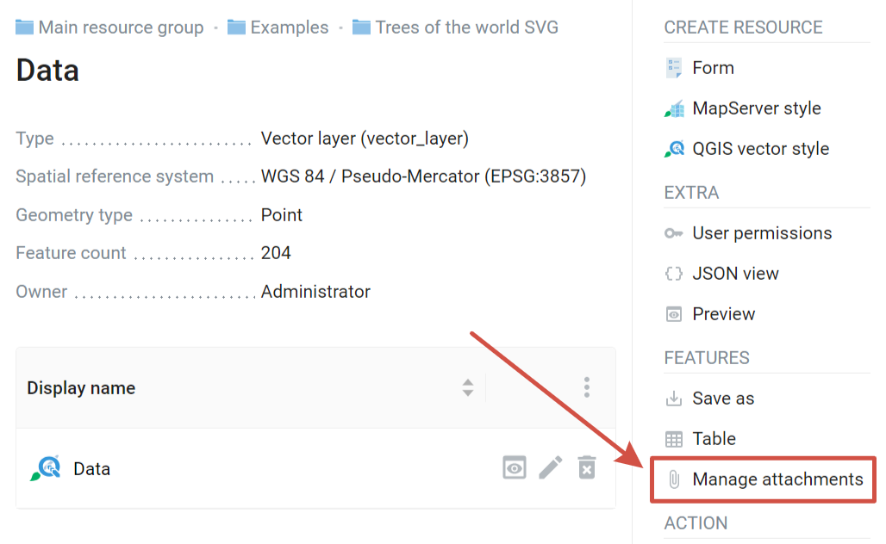
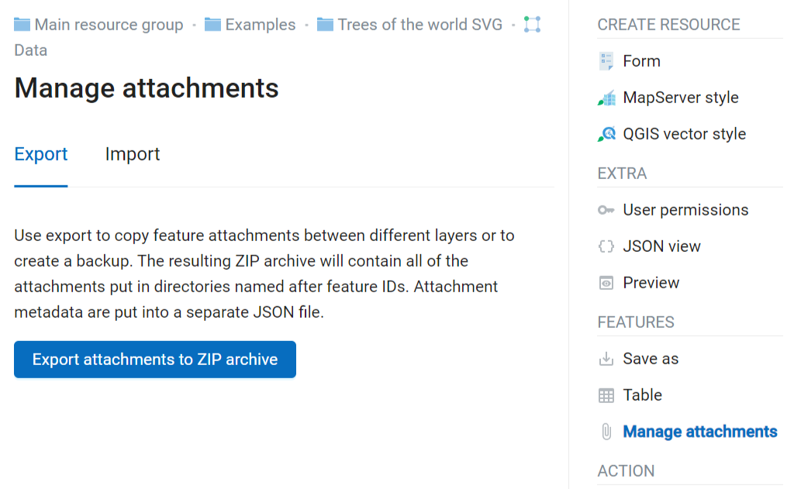
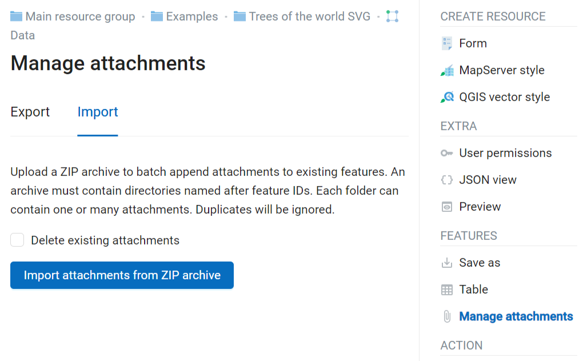
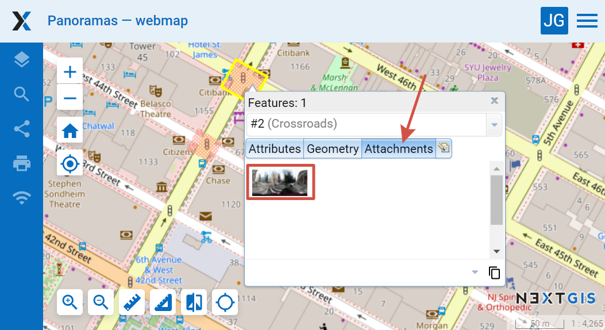
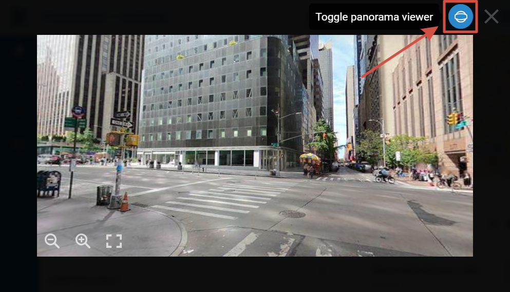

.. sectionauthor:: Юлия Григоренко <grigorenko.j@gmail.com>

.. _ngcom_attachments:

How to manage attachments
===========================

Photos, panoramas and other files can be added to a vector layer feature. By clicking on the feature you can view them in the identify pop-up along with the feature's attribute values.

   Attachments in the identify pop-up

- Any file type can be used.
- From the web interface you can display photos and spherical panoramas conforming to the `specification <https://developers.google.com/streetview/spherical-metadata?hl=en>`_.

.. _ngcom_attachments_add:

Add attachments to specific feature
------------------------------------------------------

To add an attachment to a feature, go to the edit window. There are several ways to open it:

* Click on the feature on the Web Map, then in the pop-up window press the edit button.
* Open the feature table on the Web Map, select the feature and click **Edit** in the toolbar.
* Open the feature table from the resource page,  select the feature and click **Edit** in the toolbar.

In the edit window navigate to the "Attachments" tab.

   Adding file as attachment

Press **Upload** and select a file from your device. Then press **Save** to complete.

You can edit file names and descriptions of the added attachments. To delete an attachment, press the cross icon to its right.

If you've made an error during editing, press **Reset**, all modifications will be cancelled.

.. _ngcom_attach_import_export:

How to import and export attachments
-------------------------

To copy feature attachments between different layers as a package or to create a backup you can save them to your device as an archive (Standard layer saving does not include attachments).

Navigate to the layer resource page and select **Manage attachments**.

   How to manage attachments

To save the attachments, go to the **Export** tab and press **Export attachments to ZIP archive**. The resulting ZIP archive will contain all of the attachments put in directories named after feature IDs. Attachment metadata are put into a separate JSON file.

   Exporting attachments as ZIP archive

The resulting archive can be imported to add the attachments to the layer features. Open the **Import** tab, click **Import attachments from ZIP archive** and select the archive on your device. An archive must contain directories named after feature IDs. Each folder can contain one or many attachments. Duplicates will be ignored. If you need to replace the current attachments, tick "Delete existing attachments".

   Importing attachments from ZIP archive

.. _ngcom_attachments_panoramas:

How to use panoramas
--------------------------

Not only photos, but also panoramas can be added as attachments. They allow to immerse explore new locations or find new details in familiar places.

   Panorama preview in the identify pop-up

Uploaded panoramic images must comply with the Google XMP Photo Sphere `specification <https://developers.google.com/streetview/spherical-metadata?hl=en>`_.

To navigate within the panorama, use the mouse. Hold down the left mouse button to rotate the camera. Use the wheel to zoom in and out. Panorama mode can be disabled by clicking on the blue round button in the upper right corner.

   Panorama opened from Web Map

