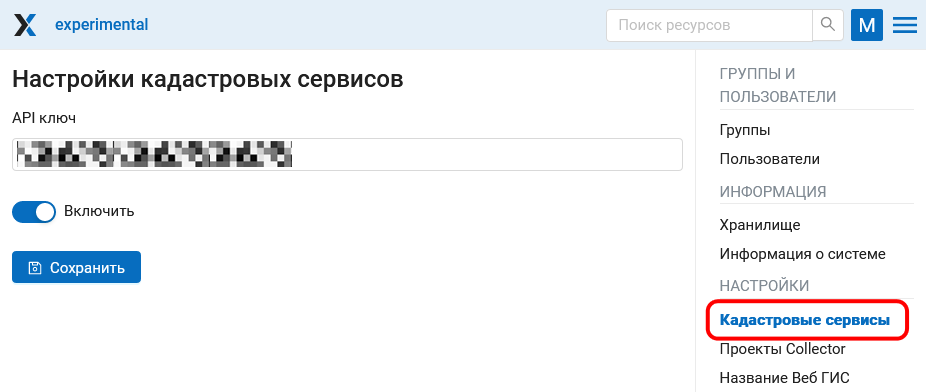

.. sectionauthor:: Юлия Григоренко <grigorenko.j@gmail.com>

.. _ngcom_cadaster:

Как работать с кадастровыми сервисами
======================================

.. note::
   Функционал доступен на плане `Premium <https://nextgis.ru/pricing-base/>`_.

Для получения доступа к кадастровым сервисам необходим API ключ. 

1. Зайдите на сайт `NextGIS GeoServices <https://geoservices.nextgis.com/settings/profile>`_, авторизуйтесь с помощью NextGIS ID.
2. В разделе "Профиль" скопируйте содержимое поля "Ключ API".

.. figure:: _static/geoservices_profile_api.png
   :name: geoservices_profile_api_pic
   :align: center
   :width: 20cm
   
   Ключ API в профиле пользователя Геосервисов

3. Перейдите в свою ВебГИС. В панели управления откройте Настройки --> Кадастровые сервисы.
4. На странице настроек введите скопированный Ключ API, переключите ползунок в положение "Включить" и нажмите **Сохранить**.

   
   Подключение кадастровых сервисов в Панели управления

Доступные следующие слои кадастрового деления:

1. Единицы кадастрового деления (ngrr1)
2. Земельные участки (ngrr2)
3. Зоны с особыми условиями использования территории (ngrr3)

.. _ngcom_cadaster_basemap:

Подключение подложек ПКК
--------------------------------

Для того, чтобы подключить один из этих слоёв в качестве подложки, скопируйте его URL.

   
   URL слоя на сайте Геосервисов

Создайте в своей ВебГИС новую подложку, добавив этот URL. `Подробнее о создании подложек <https://docs.nextgis.ru/docs_ngcom/source/data_connect.html#ngcom-basemap-layer>`_.

.. figure:: _static/create_basemap_cadaster_ru.png
   :name: create_basemap_cadaster_pic
   :align: center
   :width: 20cm
   
   Добавление слоя земельных участков в качестве подложки

Подключение слоев кадастрового деления через TMS
---------------------------------------------------

Если на карте нужно отобразить одновременно несколько слоев кадастрового деления, их удобнее подключить через TMS.

Для этого сначала нужно создать **соединение TMS**.

В диалоге создания ресурса выберите в выпадающем меню "Геосервисы NextGIS" и введите свой ключ API (получить ключ API можно на сайте `NextGIS GeoServices <https://geoservices.nextgis.com/settings/profile>`_).

   
   Создание TMS-соединения для Геосервисов

Для завершения нажмите **Создать**.

Затем нужно создать **слой TMS**. В настройках слоя выберите созданное на предыдущем шаге соединение. При помощи кнопки справа выберите нужный слой. Его имя и другие параметры автоматически подставятся в соответствующие поля.

   
   Создание TMS-слоя 

   
   Выбор нужного слоя из TMS-соединения

Для завершения нажмите **Создать**.

Далее этот слой можно `добавить на веб-карту <https://docs.nextgis.ru/docs_ngcom/source/webmap_create.html#id2>`_.

   
   Слои кадастрового деления одновременно отображаются на веб-карте как слой TMS и подложка

.. _ngcom_cadaster_identify:

Получение информации о кадастровых единицах
----------------------------------------------------

После подключения кадастровых сервисов в любой карте ВебГИС становятся доступны инструменты идентификации кадастровых единиц. Они располагаются в правой части карты. 

   
   Инструменты идентификации кадастровых единиц 

Доступны следующие инструменты (см. :numref:`cadaster_tools_webmap_pic`):

1. Идентификация кадастровых кварталов
2. Идентификация земельных участков
3. Идентификация объектов капитального строительства
4. Идентификация зон с особыми условиями использования территории
5. Идентификация кадастровых округов

Для того, чтобы получить информацию по объекту, выберите инструмент и кликните им в нужном месте карты.

   
   Пример использования инструмента идентификации. Желтым выделен идентифицируемый объект 

Идентификация кадастровых кварталов
~~~~~~~~~~~~~~~~~~~~~~~~~~~~~~~~~~~

Окно идентификации содержит следующие поля: 

* Идентификатор	
* Кадастровый номер	
* Кадастровый номер района	
* Округ
* Тип	(цифровой код)

Идентификация земельных участков
~~~~~~~~~~~~~~~~~~~~~~~~~~~~~~~~~~~~~
Окно идентификации содержит следующие поля: 

* Адрес	
* Дата внесения сведений о КС	
* Дата установления стоимости	
* Денежная единица стоимости	
* Идентификатор	
* Кадастровая стоимость	
* Кадастровый номер	
* Кадастровый номер квартала	
* Квартал	
* Размерность площади	
* Разрешенное использование по документу	
* Статус	
* Тип	(цифровой код)
* Тип категории	
* Тип площади	(цифровой код)
* Уточненная площадь	

Идентификация объектов капитального строительства
~~~~~~~~~~~~~~~~~~~~~~~~~~~~~~~~~~~~~~~~~~~~~~~~~

Окно идентификации содержит следующие поля: 

* Адрес	
* Год постройки	
* Дата внесения сведений о КС	
* Дата установления стоимости	
* Денежная единица стоимости	
* Идентификатор	
* Кадастровая стоимость	
* Кадастровый номер	
* Кадастровый номер квартала	
* Квартал	
* Назначение	
* Наименование	
* Округ	
* Размерность площади	
* Статус	
* Тип	(цифровой код)
* Тип ОКС	
* Тип площади	(цифровой код)
* Уточненная площадь	
* Этажность	

Идентификация зон с особыми условиями использования территории
~~~~~~~~~~~~~~~~~~~~~~~~~~~~~~~~~~~~~~~~~~~~~~~~~~~~~~~~~~~~~

Окно идентификации содержит следующие поля: 

* Вид	(цифровой код)
* Идентификатор	
* Кадастровый номер района	
* Наименование	
* Округ	
* Реестровый номер	
* Тип	(цифровой код)

Идентификация кадастровых округов
~~~~~~~~~~~~~~~~~~~~~~~~~~~~~~~~~~~~~~~

Окно идентификации содержит следующие поля: 

* Идентификатор	
* Кадастровый номер	
* Наименование	
* Тип (цифровой код)

.. _ngcom_cadaster_link:

Ссылка на объект по кадастровому номеру
---------------------------------------

Для того, чтобы сгенерировать ссылку на объект, вам нужно знать адрес веб-карты и кадастровый номер объекта.

Скопируйте **ссылку на веб-карту**, например https://demo.nextgis.ru/resource/3931/display?panel=layers, где *demo* - это имя Веб ГИС, а *3931* - ID веб-карты.

Воспользуйтесь `инструментом идентификации <https://docs.nextgis.ru/docs_ngcom/source/cadaster.html#ngcom-cadaster-identify>`_ кадастровых кварталов или земельных участков и скопируйте **кадастровый номер** из карточки объекта.

В ссылке на веб-карту замените часть, которая идет после *display* на ``?cadno=`` + кадастровый номер.

Итоговая ссылка имеет следующий вид: https://demo.nextgis.ru/resource/3931/display?cadno=77:04:0004019

Этот механизм можно использовать и для поиска объекта на веб-карте, если вы знаете его кадастровый номер.

