.. _collector:

.. _nextgis.com: http://nextgis.com/
.. _NextGIS Collector: https://play.google.com/store/apps/details?id=com.nextgis.collector

How to begin data collection in your Web GIS
==============================================

.. note:: 
	You can use described functionality in Web GIS created in nextgis.com_ service on `Premium plan <http://nextgis.com/pricing/#premium/>`_
  
Introduction
------------

You need to collect spatial data to get geographic and attributive information about objects located in some area. Geographic information is described by a set of coordinates. 
Attributive information is a description of object's features.

.. note::
    As an **example** we can describe a task of monitoring of road infrastructure objects' condition.
    A road and operational entity should perform monitoring of roadbed condition.
    Objects of spatial data collecting in this case are roadbed damages.
    Geographical information in this example is damages coordinates. Attributive information includes
    damage type, its size, a description of its location within roadbed, photos of the damage.
    The NextGIS Collector was developed to simplify the procedure of such data collection and to give an instrument to do it.

However before a technical description of this system possibilities lets look at main participants of data collection
for better understanding of how this system works.

There are two roles in a process of spatial data collection:

* An organizer of data collection.
* A participant of data collection.

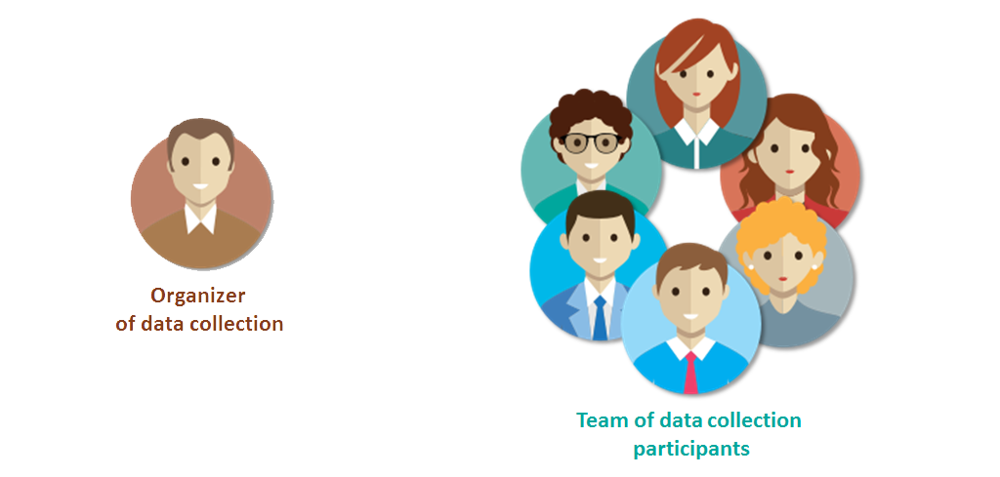

   Abstract roles in the process of data collection
   
An *organizer of data collection* is a subject who organizes a process of data collection, gathers a team of participants, controls a process and verified the data. An organizer could be a group of people as well as a separate person. In the above-mentioned example a road and operational entity was an organizer.

Below there are some more examples of data collection organizers and their tasks.

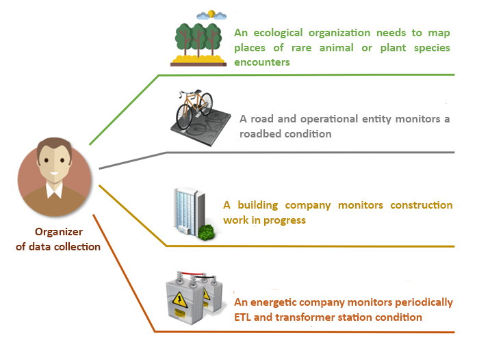

   Examples of data collection organizers

A *participant of data collection* is a person who collects data in the field. His task is to describe properties of a real object in the field. Before active spreading of mobile devices people collected data using a paper notebook and writing implements. Nowadays mobile devices help to simplify this process and decrease a number of mistakes, so that we suppose, that every participant of data collection has a mobile device.

Principles of work with NextGIS Collector
-----------------------------------------

NextGIS Collector is a technology created for simplifying of spatial data collection in the field.

NextGIS Collector allows an owner of created on nextgis.com Web GIS to organize a team and to begin data collection using mobile devices.

NextGIS Collector is a technologic stack allowing to create a dataflow between an organizer and participants of data collection for effective supervision over the process and for an easement of data collection (a process is described in a previous section).

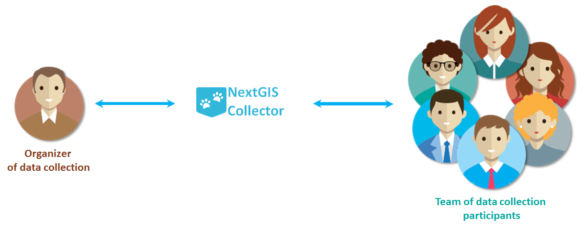

   A place of NextGIS Collector among participants of data collection process

There are the next stages of data collection process in NextGIS Collector:

1. An organizer of data collection registers in nextgis.com_ and creates a Web GIS on `Premium plan <http://nextgis.com/pricing/#premium/>`_.
2. A team of data collection participants registers in nextgis.com_.
3. The organizer of data collection adds a team of data collection participants in his Web GIS and creates a project of data collection.
4. Data collection participants install the `NextGIS Collector`_ app and join the project.
5. Data collection participants begin data collection. Data is sent to Web GIS automatically.

These stages of work with NextGIS Collector could be described schematically as follows:

.. raw:: html

   <iframe width="560" height="315" src="https://www.youtube.com/watch?v=xsMcjVUUEQQ&feature=youtu.be" 
    frameborder="0" allow="accelerometer;
    autoplay; encrypted-media; gyroscope; picture-in-picture" allowfullscreen></iframe>

To sum up, for beginning of data collection:

- A data collection organizer should have a Web GIS on `Premium plan <http://nextgis.com/pricing/#premium/>`_.
- Every data collection team participant should have a mobile device with Android OS.
- Every data collection team participant should register in nextgis.com_ and know his registration email and a password.

Organizer of data collection: adding of team participants in Web GIS
----------------------------------------------------------------------

The first stage of work with the system presumes a registration of data collection participants in Web GIS of the data collection organizer. Data collection team participants should have a mobile device with Android OS. They need to install the `NextGIS Collector`_ mobile app on each of mobile devices - it will allow to update data and synchronize updates with Web GIS of the data collection organizer.

Besides, each data collection team participant should be registered in nextgis.com_. Team participant can do it himself or pass his login to the data collection organizer. A login in nextgis.com_ is an email used for a registration.

When all data collection team participants are registered in nextgis.com_, the data collection organizer will have a list of their emails.

To add team participants to Web GIS you need to do the following:

1. Open Web GIS as administrator.

.. important::
    Described below actions demand administrator privilegies

2. The home page of your Web GIS resources will be opened. Open a "Main menu" panel:

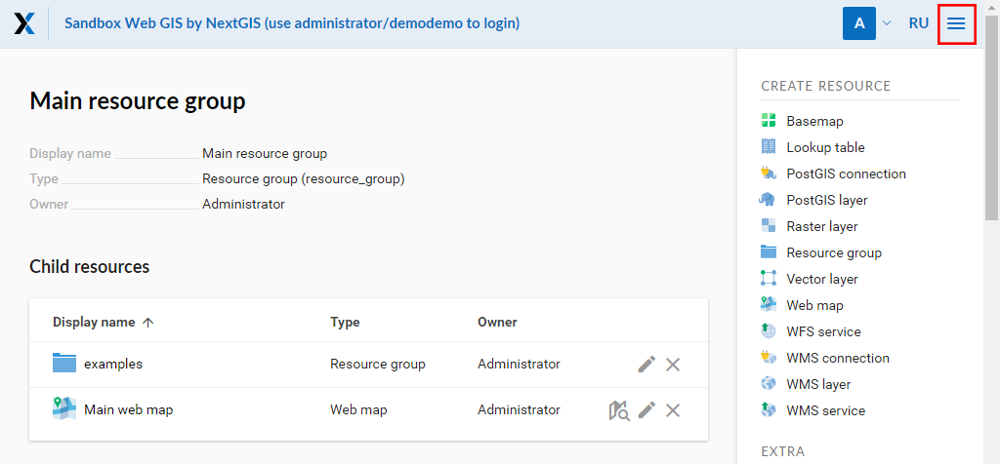

   Open main menu

3. In main menu select «Control panel»:

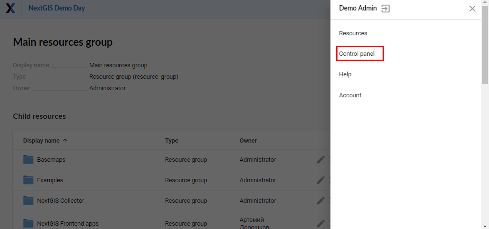

   Select «Control panel»

4. In «Settings» of the control panel select «Collector projects»:

.. figure:: _static/ngc-stages-003_eng.png
   :name: ngc-stages-003
   :align: center

   Select «Collector projects»

5. «NextGIS Collector settings» will be opened:

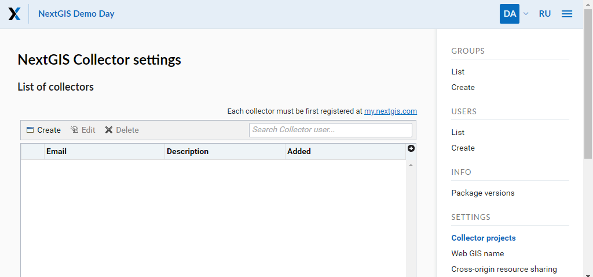

   «NextGIS Collector settings»

6. To add a team participant to Web GIS press "Create" button. In opened window "New collector"
fill up fields.

.. note::
    We advice to fill up a field "Description" with the name and the surname of a team participant in order to have data about all 
    NextGIS Collector users in one place. You can always find the participant you need with a search tool in a table of Collector users, which is quite suitable when there are a lot of participants.

.. figure:: _static/ngc-stages-005_eng.png
   :name: ngc-stages-005
   :align: center

   Add a new data collection team participant

7. As a result of this stage all data collection team participants will be registered in your Web GIS.

.. figure:: _static/ngc-stages-006_eng.png
   :name: ngc-stages-006
   :align: center

   An example of a filled table of data collection team participants

Users with a registration in your Web GIS can get data collection projects from your Web GIS and begin data collection after they installed the `NextGIS Collector`_ mobile app and successfully authorized there. However you can control over an access of different users in each separate project. It is described in details below.

Organizer of data collection: creation of a data collection project
-------------------------------------------------------------------

Data collection project is a resource in your Web GIS, it is a set of layers for editing.
In a Web GIS "data collection project" is called "Collector Project".
Data collection project allows a data collection team participant to edit layers from it.
Web GIS owner can restrain access to the project for separate participants.

Suppose, that layers with data are already downloaded in your Web GIS, and you want to create a project
and to allow data collection team participants to collect or to edit data in your Web GIS. 
To do it:

1. Open a Web GIS.

2. In «Create resource» select «Collector project»:

.. important::
    Creation of data collection project is recomended for Web GIS administrator.

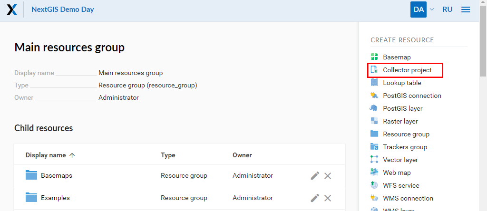

   Select «Collector project»

3. Name a project. This name will be displayed in the `NextGIS Collector`_ mobile app :

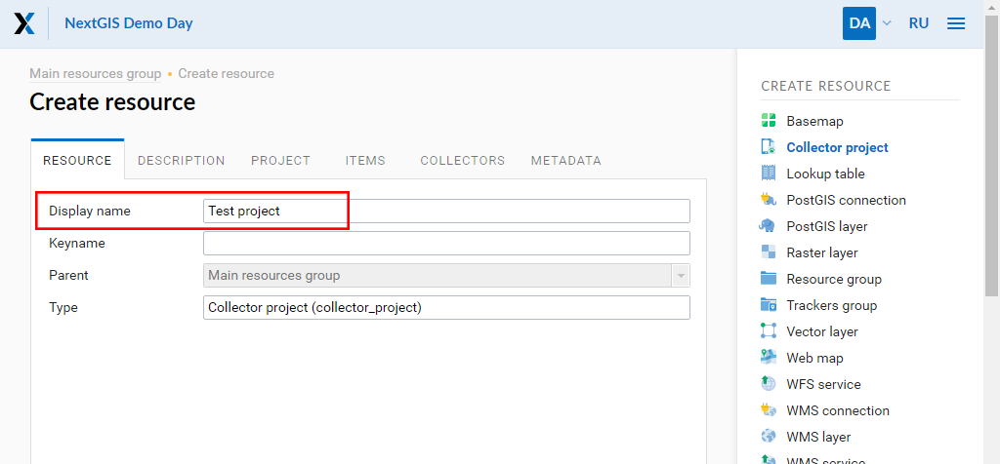

4. Open "Project" tab and fill up "Starting screen" and "NextGIS Collector user credentials" fields.

«Starting screen» describes a starting screen in the `NextGIS Collector`_ mobile app: it could be a list of forms or a map.

`NextGIS Collector`_ mobile app of all data collection team participants will use "User name" and "Password" of «NextGIS Collector user credentials» to bring changes in your Web GIS layers in.

.. note::
    We advice to create a new user assigned only to the `NextGIS Collector`_ mobile app for filling up 
    «NextGIS Collector user credentials». You need to give him permissions to read and write data for the layers in your Web GIS.
    It will allow you to provide a safety of your data during the process of data collection.

.. important::
    It is highly unrecommeneded to use for «NextGIS Collector user credentials» data of the user with administrator privileges, because in the case of loss or interception of this data malefactor will get an access to your Web GIS.

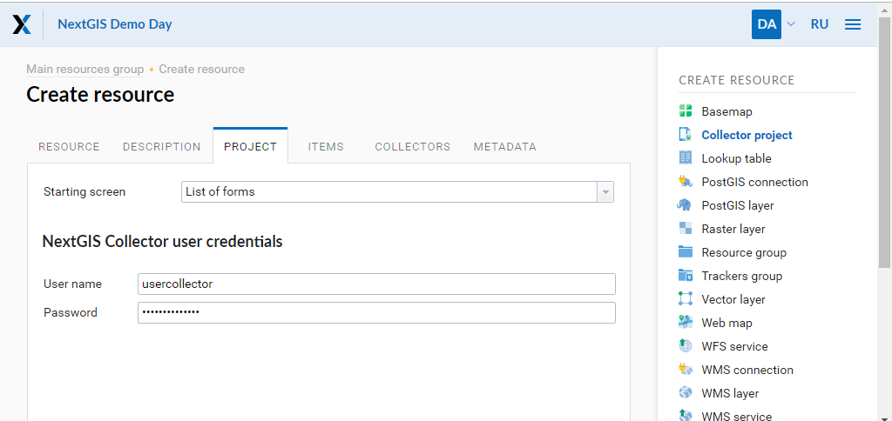

   "Project" tab

5. The next stage is adding necessary items to the project on a tab "Items".

An item of Collector project could be a editable data layer, displaying only data layer, cartographical mat or a form for data collection.

.. note::
            You could add PostGIS layers in Collector project, but the NextGIS Collector mobile app does not support work with them now

Adding of items is like adding of layers when creating a web map. You need to press "Add item" button to add a layer or a data collection form. Press "Add group" button to create a group of items. Pulling of items is available within an item tree.

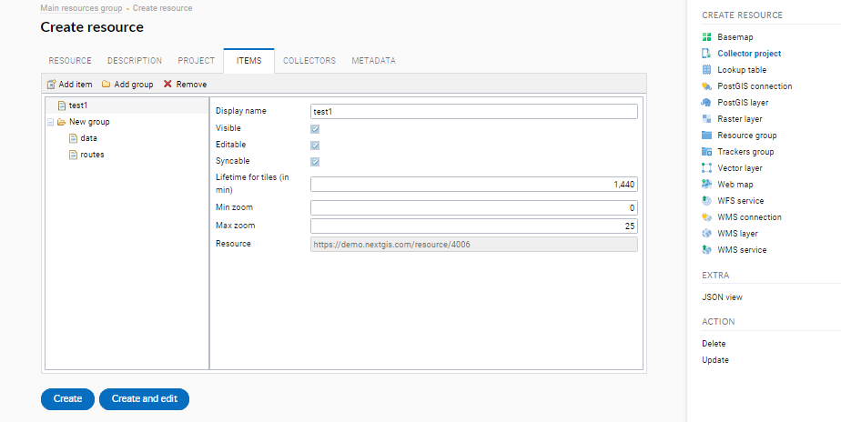

   "Items" tab

Each item of Collector project has next attributes:

- «Display name» - a layer name, which is displayed in the NextGIS Collector mobile app.
- «Visible» - controls layer's visibility in the NextGIS Collector mobile app.
- «Editable» - allow or deny editing of the layer in the NextGIS Collector mobile app.
- «Syncable» - allow or deny synchronization of the layer with your Web GIS.
- «Lifetime for tiles (in min)» - time of tiles cashing (is actual for tiling layers).
- «Min zoom» - a minimal zoom of the layer's visibility.
- «Max zoom» - a maimum zoom of the layer's visibility.

6. Then give permissions for data collection team participants on a "Collectors" tab ticking net to users participating in the project:

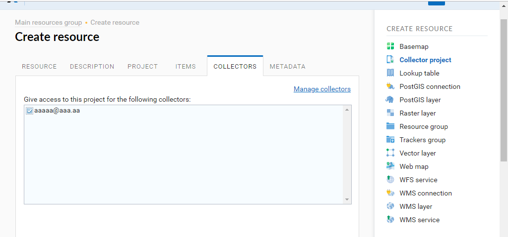

   «Collectors» tab

7. Press "Create".

As a result a Collector project (data collection project) will be created.

You can have unlimited number of projects in your Web GIS. In each of them you can restrain or allow access only for a certain set of participants from a data collection team.

Team participants: mobile app installation and start of data collection
------------------------------------------------------------------------

Data collection team participant should download and install the NextGIS Collector mobile app on his mobile device.
You could download it from Google Play Store using following the link - `NextGIS Collector`_
or find it by the name in Google Play Store.

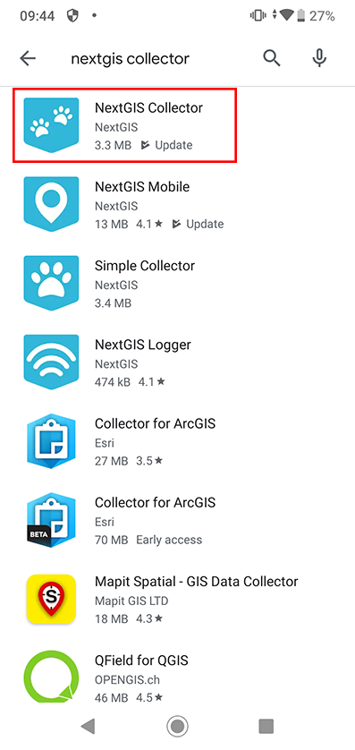

  Search in Play Market

After instalation completed start the app, skip information windows and give necessary permissions:

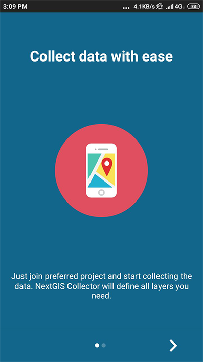

   Screen 1

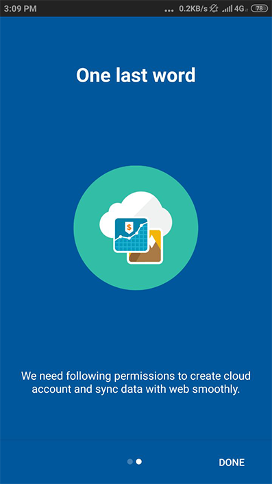

   Screen 2

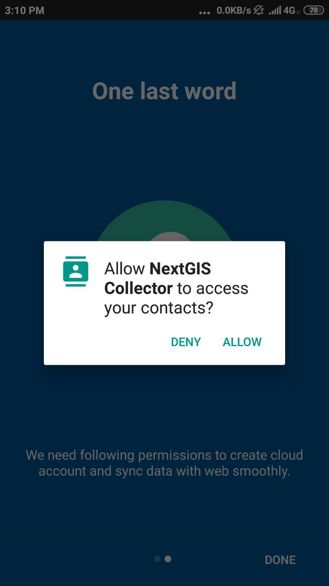

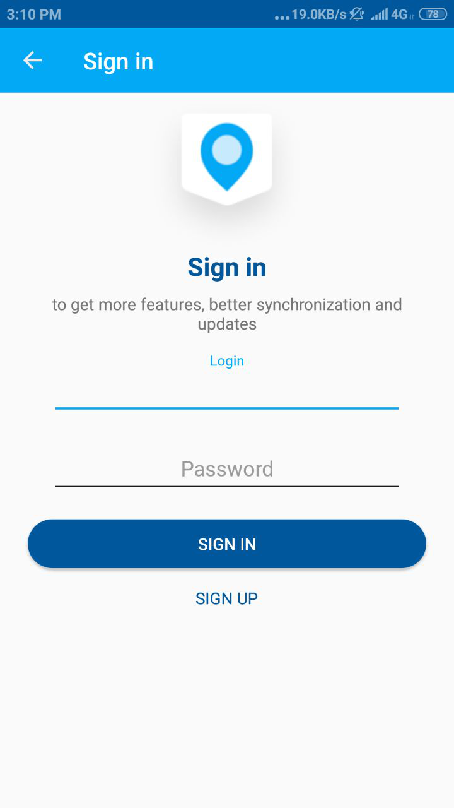

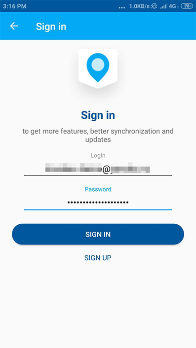

After successful signing in you will see a list of projects.

Suppose, there is a data collection project with starting screen as a list of forms in Web GIS.
When you choose this test project, the NextGIS Collector mobile app will display a list of layers.
You can also switch the mode to a map.

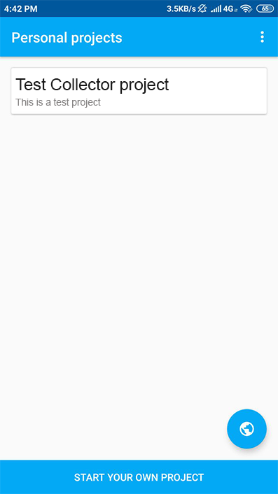

   Choose data collection project.

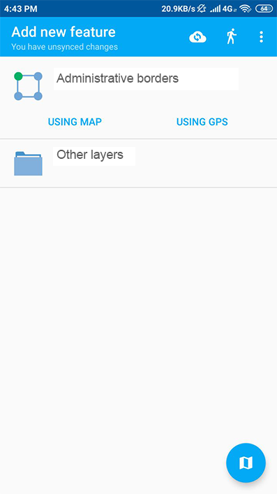

   Editable layers of the project

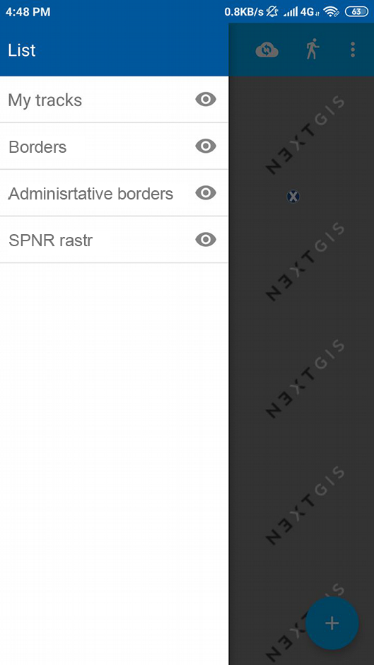

   A list of layers in a view mode "Map"

After all above-mentioned is done, data collection team participant could begin editing of layers.
The process of editing and editing tools are similar to those in NextGIS Mobile.

.. important::
    We advice to collect data with activated gps. 
