.. _collector:

.. _nextgis.com: http://nextgis.com/
.. _NextGIS Collector: https://play.google.com/store/apps/details?id=com.nextgis.collector

Как начать сбор данных в вашей Веб ГИС
======================================

.. note::
    Описываемая в данном разделе функциональность доступна в Веб ГИС, созданной с помощью сервиса nextgis.com_ и
    находящейся на тарифном плане `Премиум <http://nextgis.ru/pricing/#premium/>`_

Введение
--------

Сбор пространственных данных необходим для того, чтобы получить географическую и атрибутивную информацию об объектах,
расположенных на местности. Географическая составляющая описывается координатами. Атрибутивная информация - это
описание характеристик (свойств) объекта.

.. note::
    В качестве **примера** можно привести задачу мониторинга за состоянием объектов дорожной инфраструктуры.
    Дорожно-эксплуатационное предприятие должно осуществлять периодический контроль за состоянием дорожного полотна.
    Соответственно объектами для сбора пространственных данных в данном случае выступят повреждения дорожного покрытия.
    Географическая составляющая информации - координаты местоположения таких повреждений. Атрибутивная информация - это
    тип повреждения, его размеры, описание расположения в границах дорожного полотна, фотография повреждения. Для того,
    чтобы упростить процедуру сбора такой информации и предоставить инструмент для сбора таких данных и была разработана
    система NextGIS Collector.

Однако прежде чем перейти к техническому описанию возможностей системы необходимо рассмотреть основных участников
процесса сбора данных для лучшего понимания принципов работы системы.

В процессе сбора пространственных данных можно выделить две роли:

* Организатор сбора данных.
* Участник сбора данных.

   Абстрактные роли, выделяемые в процессе сбора данных

В роли *организатора сбора данных* выступает субъект, который организует процесс сбора данных, собирает команду
участников, контролирует процесс и верифицирует полученные данные. В этой роли может выступать как группа людей, так
и отдельный человек. В примере, который был приведен выше, в роли организатора сбора данных выступало
дорожно-эксплуатационное предприятие.

Ниже приведены примеры организаторов сбора данных и задач, которые у них возникают.

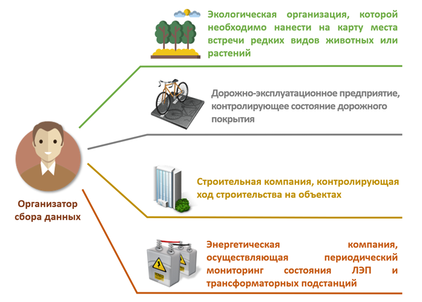

   Примеры  организаторов сбора данных

В роли *участника сбора данных* выступает человек, который осуществляет сбор данных на местности. В его задачи входит
описание свойств реального объекта на местности. До активного распространения мобильных устройств сбор данных
осуществлялся с помощью блокнота и письменных принадлежностей. Сегодня мобильные устройства помогают существенно
упростить этот процесс и уменьшить количество ошибок, поэтому предполагается, что каждый участник сбора данных
обеспечен мобильным устройством.

.. _collector_technology:

Принципы работы с NextGIS Collector
-----------------------------------

NextGIS Collector - технология, которая создана для упрощения сбора пространственных данных на местности.

NextGIS Collector дает возможность владельцу Веб ГИС, созданной на nextgis.com, организовать команду из
нескольких человек и начать сбор данных с помощью мобильных устройств.

NextGIS Collector представляет собой технологический стек, который призван объединить поток данных между
организатором и участниками сбора данных для эффективного контроля за процессом и облегчения сбора данных
(процесс сбора данных описан в предыдущем разделе).

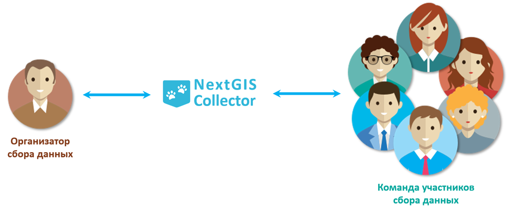

   Место NextGIS Collector среди участников процесса сбора данных

Можно выделить следующие этапы работы, характерные для процесса сбора данных в NextGIS Collector:

1. Организатор сбора регистрируется на nextgis.com_ и создает Веб ГИС на тарифном
   плане `Премиум <http://nextgis.ru/pricing/#premium/>`_.
2. Организатор сбора устанавливает `NextGIS Formbuilder <http://nextgis.ru/nextgis-formbuilder>`_, создает формы для сбора данных, загружает их в свою Веб ГИС (`документация <https://docs.nextgis.ru/docs_formbuilder/source/toc.html>`_).
3. Участники команды сбора данных регистрируются на nextgis.com_.
4. Организатор сбора данных добавляет участников команды сбора данных в свою Веб ГИС и создает проект сбора данных.
5. Участники команды устанавливают приложение `NextGIS Collector`_ и подключается к проекту.
6. Участники команды начинают сбор данных. Данные автоматически отправляются в Веб ГИС организатора.

Схематически этапы работы c NextGIS Collector можно представить так:

.. raw:: html

   <iframe width="560" height="315" src="https://www.youtube.com/embed/fal_oUeGiLE"
    frameborder="0" allow="accelerometer;
    autoplay; encrypted-media; gyroscope; picture-in-picture" allowfullscreen></iframe>

Таким образом, для начала сбора данных нужно следующее:

- Организатор сбора данных должен иметь Веб ГИС, которая находится на тарифном
  плане `Премиум <http://nextgis.ru/pricing/#premium/>`_.
- Каждый участник команды по сбору данных должен иметь при себе мобильный телефон на базе ОС Android.
- Каждый участник команды по сбору данных должен быть зарегистрирован в системе nextgis.com_ и
  знать свой email и пароль, которые он использовал при регистрации.

.. _collector_add_members:

Организатор сбора данных: добавление участников команды в Веб ГИС
-----------------------------------------------------------------

Первый этап работы с системой предполагает регистрацию участников команды по
сбору данных в Веб ГИС организатора сбора данных. Как было сказано выше,
участники команды по сбору данных должны иметь при себе мобильный телефон на базе ОС Android.
На каждый из телефонов будет установлено мобильное приложение `NextGIS Collector`_ -
оно позволит вносить изменения в данные и синхронизировать эти изменения
с Веб ГИС организатора сбора данных.

Кроме того, каждый участник команды по сбору данных должен быть зарегистрирован
на сервисе nextgis.com_. Участник команды может сделать это самостоятельно
и передать организатору сбора данных свой логин. Логин nextgis.com_ - это e-mail,
который участник использовал при регистрации.

После того, как каждый участник команды по сбору данных зарегистрируется в
системе nextgis.com_, организатор сбора данных будет иметь список e-mail
участников команды по сбору данных.

Для добавления участников команды в Веб ГИС необходимо выполнить следующие действия:

1. Открыть Веб ГИС как администратор системы.

2. Откроется главная страница с ресурсами вашей Веб ГИС. Необходимо открыть «Основное меню»:

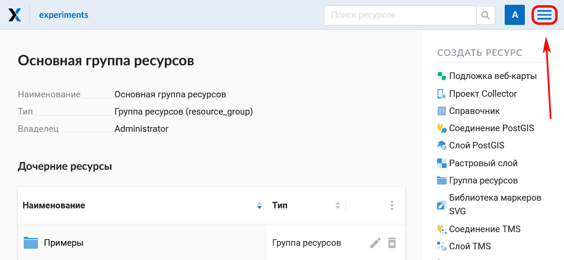

   Открыть основное меню
   
3. В основном меню необходимо выбрать «Панель управления»:

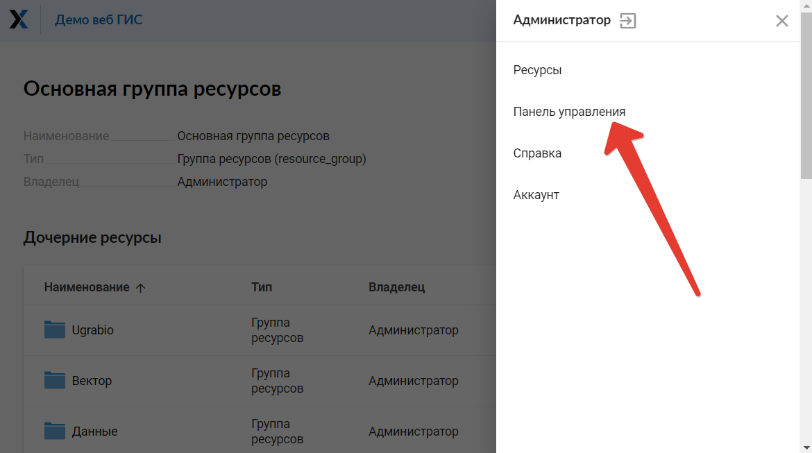

   Выбрать «Панель управления»

4. В секции «Настройки» панели управления необходимо выбрать ссылку «Проекты Collector»:

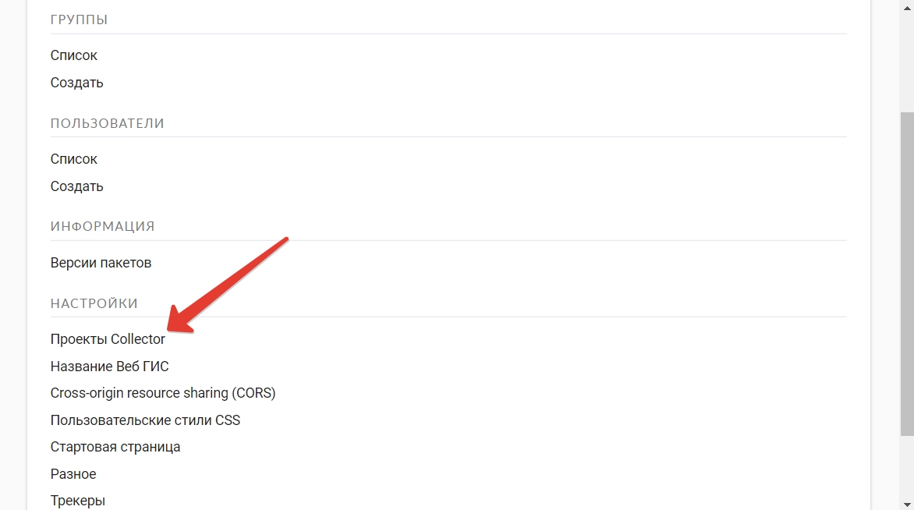

   Выбрать «Проекты Collector»

5. Откроется секция «Список участников»:

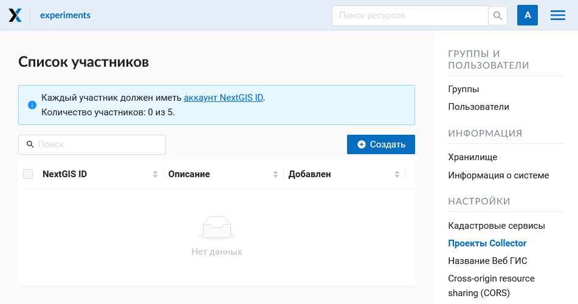

   Общий вид страницы «Список участников»

6. Для добавления участника команды по сбору данных в Веб ГИС необходимо нажать кнопку «Создать»,
вы будете перенаправлены на страницу «Создать нового участника». Здесь необходимо ввести полный email-адрес NextGIS ID.

.. note::
    Рекомендуется заполнять поле «Описание» фамилией и именем участника команды по сбору данных,
    чтобы в дальнейшем иметь данные о пользователях NextGIS Collector в одном месте. В таблице пользователей
    работает поиск, поэтому всегда можно найти участника. Эта особенность становится актуальной при
    большом количестве участников.

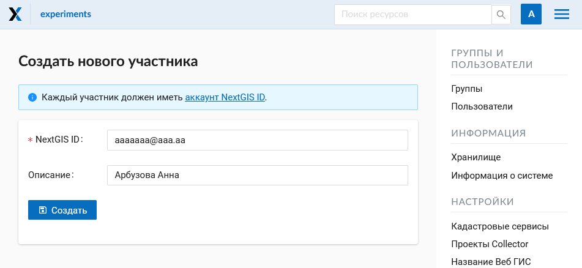

   Создание нового участника команды по сбору данных

7. В результате выполнения действий этого этапа в вашей Веб ГИС будут зарегистрированы участники
команды по сбору данных.

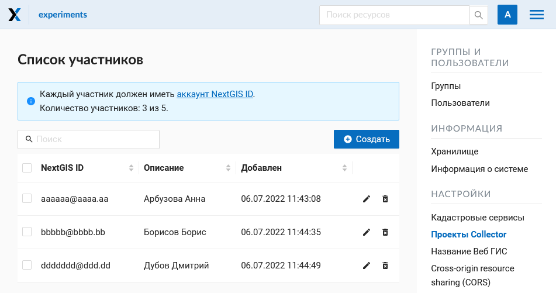

   Пример заполненной таблицы участников команды по сбору данных

Зарегистрированные пользователи смогут при установке
мобильного приложения `NextGIS Collector`_ и успешной авторизации в нем получить проекты
сбора данных из вашей Веб ГИС и начать сбор данных. Однако в каждом отдельном проекте
вы сможете контролировать доступ различных пользователей. Детальнее это будет описано ниже.

.. _collector_create_project:

Организатор сбора данных: создание проекта сбора данных
-------------------------------------------------------

Проект сбора данных - это ресурс в вашей Веб ГИС, который представляет собой набор слоев
данных для редактирования. В Веб ГИС «проект сбора данных» сокращенно называется «Проект Collector».
Проект сбора данных предоставляет возможность участнику команды по сбору данных возможность редактировать слои,
содержащиеся в нем. Владелец Веб ГИС имеет возможность ограничивать доступ к проекту
отдельным участникам команды по сбору данных.

Вы можете создать проект сбора данных в NextGIS Formbuilder (наиболее простой вариант, описан `здесь <https://docs.nextgis.ru/docs_formbuilder/source/workflow.html#nextgis-web>`_) или в Веб ГИС.

Если вы хотите создать проект сбора данных в Веб ГИС, сначала нужно создать необходимые слои данных в NextGIS Formbuilder или загрузить имеющиеся.

Предположим, что в нашей Веб ГИС уже загружены слои данных и мы хотим создать проект
и предоставить возможность участникам команды по сбору данных собирать или редактировать
уже имеющиеся данные нашей Веб ГИС. Для этого необходимо выполнить следующие действия:

1. Открыть Веб ГИС.

2. Создать подложку, если сборщику на мобильном устройстве нужно будет видеть карту.

3. Выбрать в панели «Создать ресурс» ссылку «Проект Collector»:

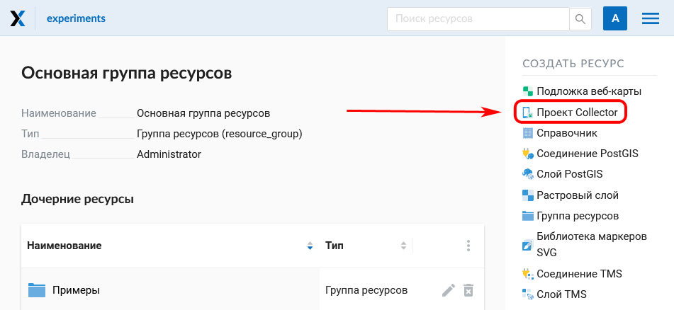

   Выбор пункта создания ресурса «Проект Collector»

4. Ввести наименование проекта. Это наименование будет доступно в мобильном приложении `NextGIS Collector`_:

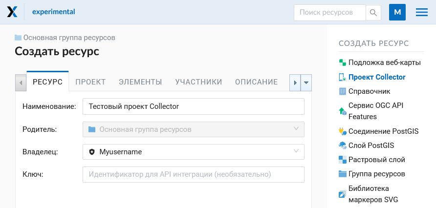

   Окно создания проекта Collector

5. Далее необходимо открыть вкладку «Проект» и заполнить поля «Вид начального экрана» и
«Данные для входа NextGIS Collector».

«Вид начального экрана» - опция, которая задает стартовый экран в мобильном приложении `NextGIS Collector`_ -
это может быть либо список слоев, либо карта.

«Данные для входа NextGIS Collector» - имя и пароль пользователя Веб ГИС с соответствующими правами доступа. Не имеет отношения к аккаунтам участников, пользователей мобильных приложений.

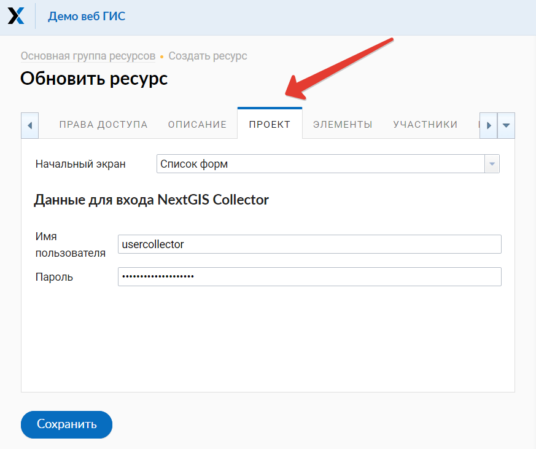

   Внешний вид вкладки «Проект»

6. Следующий этап - добавление необходимых элементов в проект.

Элемент проекта Collector может быть редактируемым слоем данных, слоем данных для только для отображения,
картографической подложкой или формой для сбора данных.

.. note::
            Добавление слоёв PostGIS в проект Collector возможно, но работа с такими слоями на данный момент не поддерживается мобильным приложением NextGIS Collector.

Добавление аналогично добавлению слоев при создании веб-карты - необходимо нажать кнопку «+ Слой»
для добавления слоя или формы сбора данных. В списке выбирайте слой, не форму. Кнопка  «+ Группа» позволяет
создать группу элементов. Внутри дерева элементов работает перетягивание. Чтобы удалить элемент из списка, кликните Х в конце строки. 

При нажатии на элемент можно посмотреть и отредактировать его параметры.

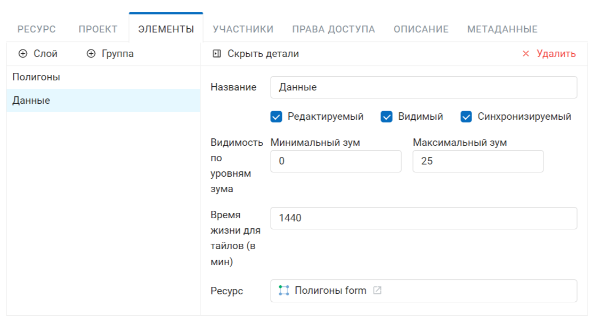

   Внешний вид вкладки «Элементы»

Каждый элемент проекта Collector имеет следующие атрибуты:

- «Название» - название слоя, которое будет доступно в мобильном приложении NextGIS Collector.
- «Редактируемый» - будет ли пользователь мобильного приложения NextGIS Collector иметь возможность редактирования слоя.
- «Видимый» - контролирует видимость слоя в в мобильном приложении NextGIS Collector.
- «Синхронизируемый» - будут ли правки слоя синхронизироваться с вашей Веб ГИС.
- «Видимость по уровням зума» - определяет, при каком приближении карты виден этот слой. Включает два параметра: «Минимальный зум» и «Максимальный зум».
- «Время жизни» - время кеширования тайлов (актуален для тайловых слоев).

Чтобы вернуться к списку элементов, нажмите "Скрыть детали".

7. При необходимости, добавьте в проект подложку.

8. Далее необходимо предоставить доступ необходимым участникам команды сбора данных. На вкладке «Участники»
путем установления галок выбираем тех участников команды по сбору данных, которые должны участвовать в этом проекте:

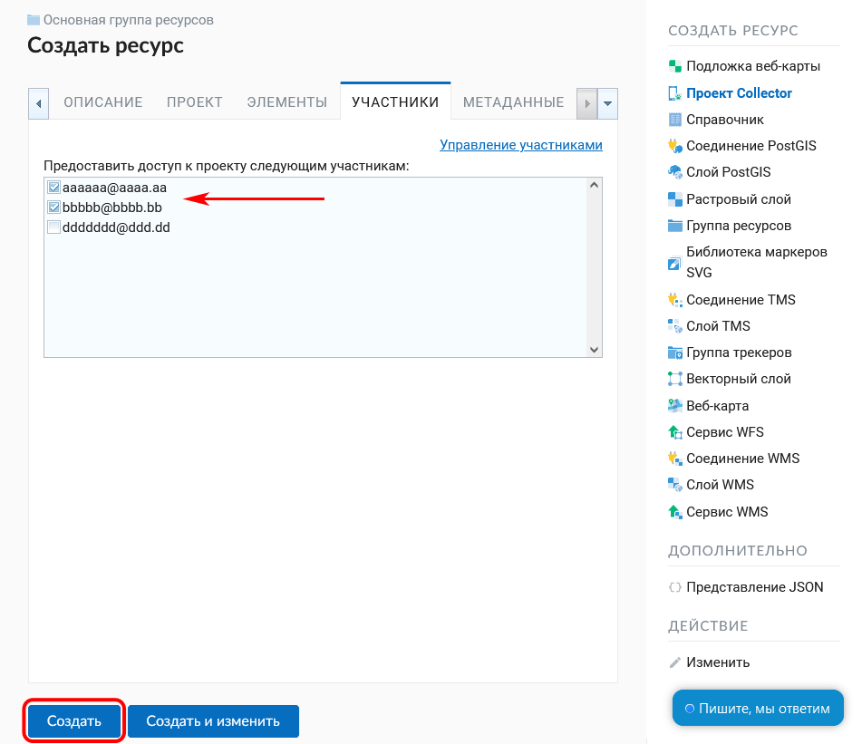

   Внешний вид вкладки «Участники»

9. Сохраняем проект.

В результате будет создан проект Collector (проект по сбору данных).

Таких проектов в вашей Веб ГИС может быть неограниченное количество. В каждом из проектов вы можете ограничивать
или разрешать доступ только определенному набору участников из команды участников по сбору данных.

.. _collector_start_data:

Участники команды: установка мобильного приложения и начало сбора данных
------------------------------------------------------------------------

Участнику команды по сбору данных необходимо загрузить и установить себе на телефон 
мобильное приложение NextGIS Collector. Его можно установить из Google Play Store по ссылке - `NextGIS Collector`_
или найти по названию в Google Play Store.

 .. figure:: _static/ngc-user-01.png
   :name: ngc-user-01
   :align: center
   :width: 10cm

   Поиск в Play Market

После установки запустить приложение, пропустить информационные окна и дать необходимые разрешения:

 .. figure:: _static/ngc-user-021_ru.png
   :name: ngc-user-02
   :align: center
   :width: 10cm

   Экран 1

 .. figure:: _static/ngc-user-031_ru.png
   :name: ngc-user-03
   :align: center
   :width: 10cm

   Экран 2

 .. figure:: _static/ngc-user-041_ru.png
   :name: ngc-user-04
   :align: center
   :width: 10cm
   
   Экран запроса доступа

 .. figure:: _static/ngc-user-05_ru.png
   :name: ngc-user-05
   :align: center
   :width: 10cm
   
   Экран авторизации

По умолчанию предлагается войти через сервер my.nextgis.com, при необходимости можно `использовать собственный сервер <https://docs.nextgis.ru/docs_collector/source/auth.html#ngidop>`_.
При авторизации по NextGIS ID введите полностью email-адрес.

 .. figure:: _static/ngc-user-06_ru.png
   :name: ngc-user-06
   :align: center
   :width: 10cm
   
   Авторизация в облачном сервисе

После успешного входа участник команды по сбору данных увидит список проектов.
Предположим, что в Веб ГИС был создан проект по сбору данных с настройкой стартовой страницы в виде списка.
При выборе этого тестового проекта мобильное приложение NextGIS Collector отобразит список слоев.
Также можно переключить в режим карты.

 .. figure:: _static/ngc-user-07_ru.png
   :name: ngc-user-07
   :align: center
   :width: 10cm

   Выберите проект для сбора

 .. figure:: _static/ngc-user-08_ru.png
   :name: ngc-user-08
   :align: center
   :width: 10cm

   Редактируемые слои проекта

 .. figure:: _static/ngc-user-09.png
   :name: ngc-user-09
   :align: center
   :width: 10cm

   Список слоев проекта в режиме просмотра "Карта"

Участник команды сбора данных может начинать редактирование слоев. Инструменты редактирования
и подхода к редактированию аналогичны используемым в NextGIS Mobile.

.. important::
    Лучше собирать данные при работающем gps. 

.. _collector_checklist:

Чек-лист для администратора
---------------------------

Это краткая инструкция для администратора Веб ГИС по организации сбора полевых данных через NextGIS Collector. Это список операций, которые нужно выполнить администратору.

1. Сформулировать перечень параметров объекта, данные по которому будут собираться.
2. Установить локально текущую версию настольного ПО NextGIS.
3. Создать Веб ГИС на nextgis.com, убедиться, что подключен сбор данных (Премиум).
4. Добавить себя как участника. ☰ - Панель управления - Проекты Collector. Ввести e-mail, зарегистрированый на nextgis.com
5. В Веб ГИС создать аккаунт с соответствующими правами, от имени которого будут добавляться записи в Веб ГИС. Например:
   Полное имя: Collector. Логин: Collector. Пароль. Описание: Аккаунт для работы NextGIS Collector. Участник групп - только Administrator.
6. Запустить Formbuilder. Включить версию Pro. Создать новую форму. Задать псевдонимы полей. Задать дефолтные варианты в списках.
7. В Formbuilder отправить форму в Веб ГИС. Эта операция создаст векторный слой с формой и векторным стилем. Одновременно создать проект Collector (при этом будет создана подложка и проект сбора данных) и веб-карту для визуалиции собранных данных.
8. Проверить форму на своём устройстве. 
9. Добавить остальных участников. Проще будет, если они будут регистрироваться на свой аккаунт в gmail. Его клиент всегда есть на смартфоне, и уже залогиненый. Ввести имя и фамилии сборщиков.

