.. _collector:

.. _nextgis.com: http://nextgis.com/
.. _NextGIS Collector: https://play.google.com/store/apps/details?id=com.nextgis.collector

How to begin data collection in your Web GIS
==============================================

.. note:: 
	You can use described functionality in Web GIS created in nextgis.com_ service on `Premium plan <http://nextgis.com/pricing/#premium/>`_
  
Introduction
------------

Collecting spatial data is used to get geographic and attributive information about objects located in some area. Geographic information is a set of coordinates. Attributive information is a description of the object's features.

.. note::
    As an **example** we can describe a task of monitoring the condition of road infrastructure objects.
    A road maintenance service should perform monitoring of the roadbed condition.
    Objects of spatial data collecting in this case are roadbed damages.
    Geographical information in this example is coordinates of the damages. Attributive information includes
    damage type, its size, a description of its location within roadbed, photos of the damage.
    The NextGIS Collector was developed to simplify the procedure of such data collection and to give an instrument to do it.

However before a technical description of this system possibilities let's look at the main participants of data collection in order to better understand how this system works.

There are two roles in a process of spatial data collection:

* An organizer of data collection.
* A participant of data collection.

.. figure:: _static/ngc-data-collection-team-clt_eng.png
   :name: Abstract roles in the process of data collection
   :align: center

   Abstract roles in the process of data collection
   
An *organizer of data collection* is a subject who organizes the process of data collection, gathers a team of participants, controls the process and verifies the data. An organizer could be a group of people as well as an individual. In the above-mentioned example a road maintenance service was the organizer.

Below there are some more examples of data collection organizers and their tasks.

.. figure:: _static/ngc-team-lead_eng.png
   :name: Examples of data collection organizers
   :align: center

   Examples of data collection organizers

A *participant of data collection* is a person who collects data in the field. His task is to describe properties of a real object in the field. Before active spreading of mobile devices people collected data using a paper notebook. Nowadays mobile devices help to simplify this process and decrease the number of mistakes, so we assume that every participant of data collection has a mobile device.

Principles of work with NextGIS Collector
-----------------------------------------

NextGIS Collector is a technology created to simplify spatial data collection in the field.

NextGIS Collector allows the owner of a Web GIS created on nextgis.com to organize a team and to begin data collection using mobile devices.

NextGIS Collector is a technological stack allowing users to create a dataflow between an organizer and participants of data collection for effective process supervision and easier data collection (the process is described in the previous section).

.. figure:: _static/ngc-data-collection-team-ngc_eng.png
   :name: A place of NextGIS Collector among participants of data collection process
   :align: center

   The place of NextGIS Collector in the data collection process

There are several stages of data collection process in NextGIS Collector:

1. The organizer of data collection registers in nextgis.com_ and creates a Web GIS on `Premium plan <http://nextgis.com/pricing/#premium/>`_.
2. The organizer installs `NextGIS Formbuilder <http://nextgis.com/nextgis-formbuilder>`_, creates data collection forms and uploads them to the Web GIS (`see documentation <https://docs.nextgis.com/docs_formbuilder/source/toc.html>`_). 
3. A team of data collection participants registers in nextgis.com_.
4. The organizer of data collection adds a team of data collection participants to his Web GIS and creates a project of data collection.
5. Data collection participants install the `NextGIS Collector`_ app and join the project.
6. Data collection participants begin data collection. Data is sent to Web GIS automatically.

These stages of work with NextGIS Collector could be described schematically as follows:

.. raw:: html

   <iframe width="560" height="315" src="https://www.youtube.com/embed/xsMcjVUUEQQ" 
    frameborder="0" allow="accelerometer;
    autoplay; encrypted-media; gyroscope; picture-in-picture" allowfullscreen></iframe>

To sum up, to begin data collection:

- The data collection organizer should have a Web GIS on `Premium plan <https://youtu.be/xsMcjVUUEQQ>`_.
- Every data collection team participant should have a mobile device with Android OS.
- Every data collection team participant should register in nextgis.com_ and know his registration email and password.

Organizer of data collection: adding team participants in Web GIS
----------------------------------------------------------------------

The first stage of work with the system is adding data collection participants in the Web GIS of the data collection organizer. Data collection team participants should have a mobile device with Android OS. They need to install the `NextGIS Collector`_ mobile app on each of mobile devices - it will allow them to update data and synchronize updates with the Web GIS of the data collection organizer.

Besides, each data collection team participant should be registered in nextgis.com_. Team participant can do it himself and pass his login to the data collection organizer. A login in nextgis.com_ is the email used for a registration.

When all data collection team participants are registered in nextgis.com_, the data collection organizer will have a list of their emails.

To add team participants to the Web GIS you need to do the following:

1. Open Web GIS as administrator.

2. The home page of your Web GIS resources will be opened. Open the "Main menu" panel:

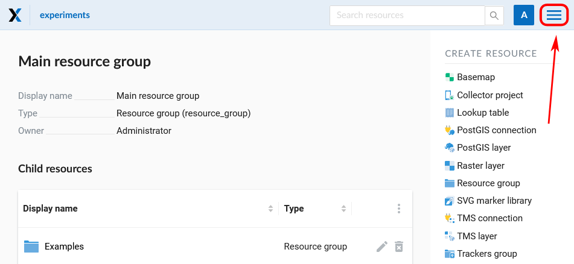

   Open main menu

3. In the main menu select «Control panel»:

.. figure:: _static/ngc-stages-002_eng.png
   :name: ngc-stages-002
   :align: center

   Select «Control panel»

4. In «Settings» of the control panel select «Collector projects»:

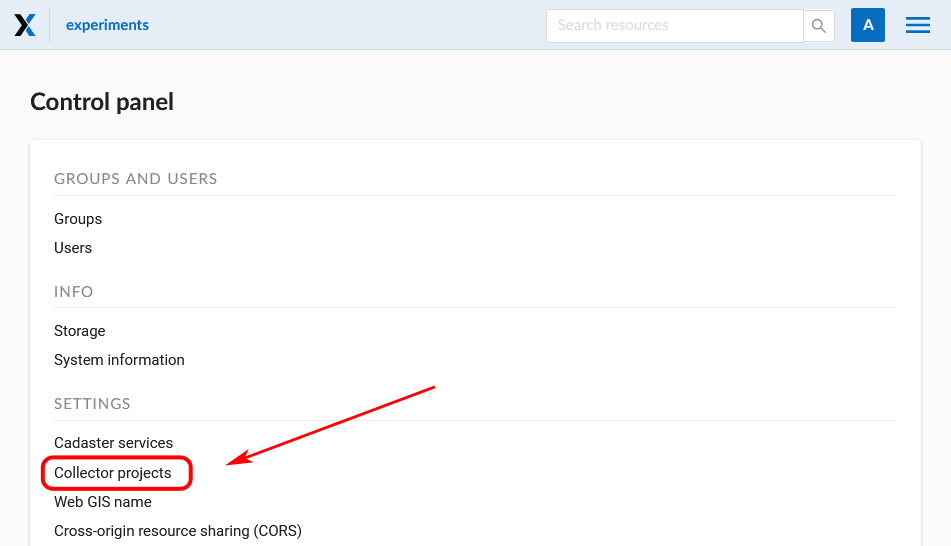

   Select «Collector projects»

5. A page for managing data collection participants will be opened:

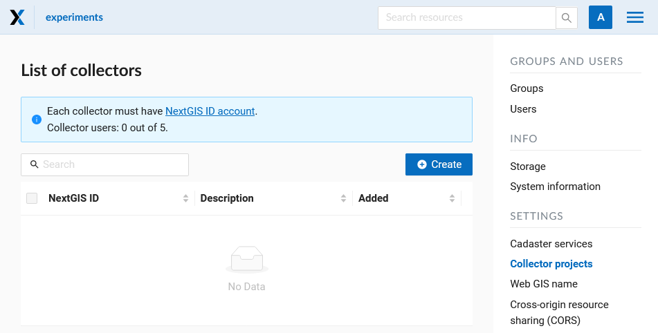

   List of collectors

6. To add a team participant to the Web GIS press "Create" button. It will redirect you to the "Create new collector" page. Make sure to type in full email adress that serves as NextGIS ID login.

.. note::
    We recommend filling up the field "Description" with the name and the surname of the team participant in order to have data about all NextGIS Collector users in one place. You can always find the participant you need with a search tool in a table of Collector users, which is quite suitable when there are a lot of participants.

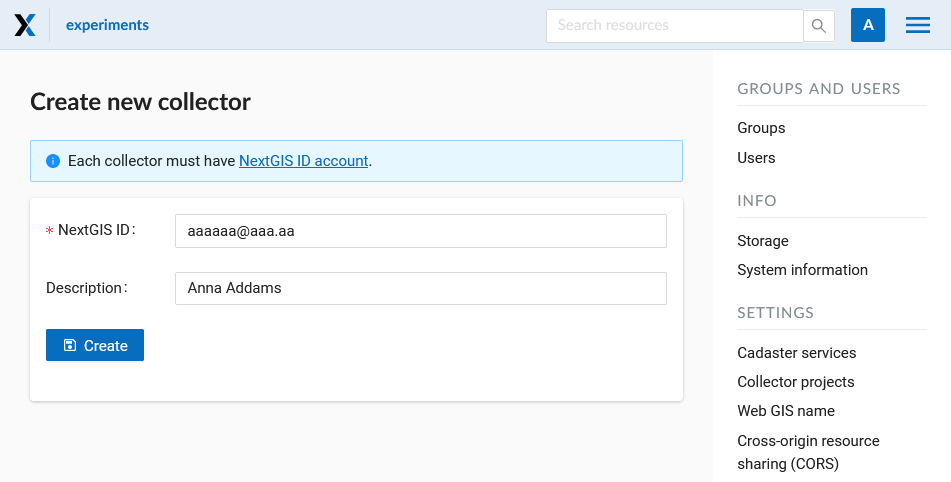

   Creating a new data collection participant

7. As a result of this stage all data collection team participants will be registered in your Web GIS.

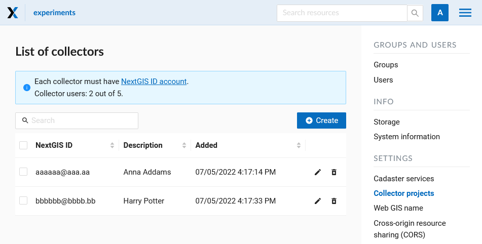

   An example of a filled list of collectors

Users with a registration in your Web GIS can access data collection projects from your Web GIS and begin data collection after they installed the `NextGIS Collector`_ mobile app and successfully sign in there. However you can control the access of different users to each individual project. It is described in details below.

Organizer of data collection: creation of a data collection project
-------------------------------------------------------------------

Data collection project is a resource in your Web GIS, it is a set of layers for editing.
In a Web GIS "data collection project" is called "Collector Project".
Data collection project allows a data collection team participant to edit its layers.
Web GIS owner can restrain access to the project for separate participants.

You can create a Collector project via NextGIS Formbuilder (the simplest way, described `here <https://docs.nextgis.com/docs_formbuilder/source/workflow.html#nextgis-web>`_) or in your WebGIS.

If you want to use your WebGIS to create a Collector project, first you need to create necessary data layers in NextGIS Formbuilder or upload them from a file.

Let's suppose that layers with data are already uploaded to your Web GIS, and you want to create a project
and allow data collection team participants to collect or edit data in your Web GIS. 
To do it:

1. Open the Web GIS.

2. Create a basemap if the collector will need to see a map on the mobile app.

3. In «Create resource» select «Collector project»:

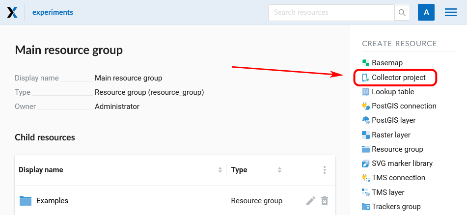

   Select «Collector project»

4. Name your project. This name will be displayed in the `NextGIS Collector`_ mobile app :

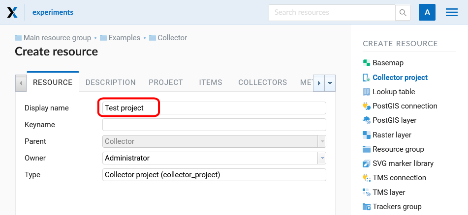

5. In the "Project" tab select "Starting screen" and fill in "NextGIS Collector user credentials".

The starting screen in the `NextGIS Collector`_ mobile app could be a list of forms or a map.

«NextGIS Collector user credentials» - user name and password of a Web GIS user with necessary permissions to access data used in the project. This user is not related to accounts of actual data collectors.

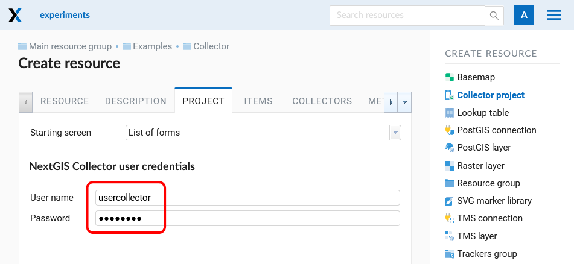

   "Project" tab

6. The next stage is adding necessary items to the project on the "Items" tab.

An item of Collector project could be an editable data layer, display-only data layer, basemap or a form for data collection.

.. note::
            You could add PostGIS layers in Collector project, but the NextGIS Collector mobile app does not support work with them for now

Adding of items is like adding layers when creating a Web Map. Press the "Add item" button to add a layer or a data collection form. Select the vector layer in the resource list, not the form. Press "Add group" to create a group of items. Drag-and-drop of items is available within the item tree.

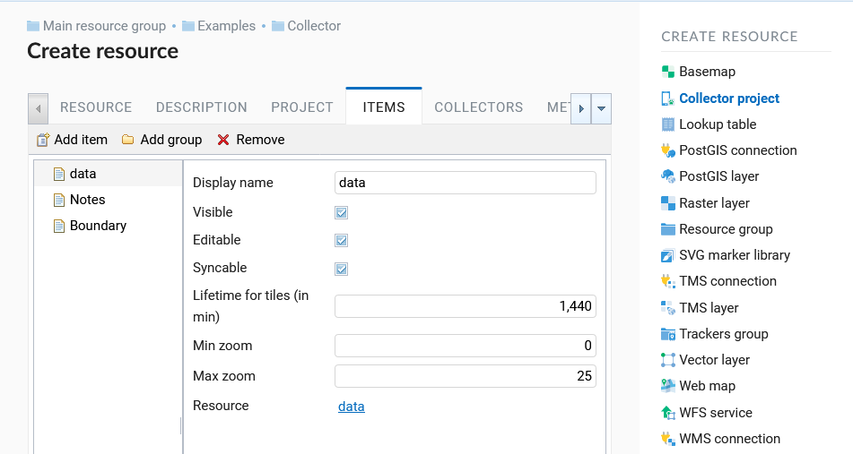

   "Items" tab

Each item of Collector project has the following attributes:

- «Display name» - a layer name which is displayed in the NextGIS Collector mobile app.
- «Visible» - controls layer's visibility in the NextGIS Collector mobile app.
- «Editable» - allow or deny editing of the layer in the NextGIS Collector mobile app.
- «Syncable» - allow or deny synchronization of the layer with your Web GIS.
- «Lifetime for tiles (in min)» - time of tiles cashing (is actual for tiling layers).
- «Min zoom» - minimal zoom of the layer's visibility.
- «Max zoom» - maximum zoom of the layer's visibility.

7. Add basemap if necessary.

8. Then on the "Collectors" tab ticking net give permissions to the users participating in the project:

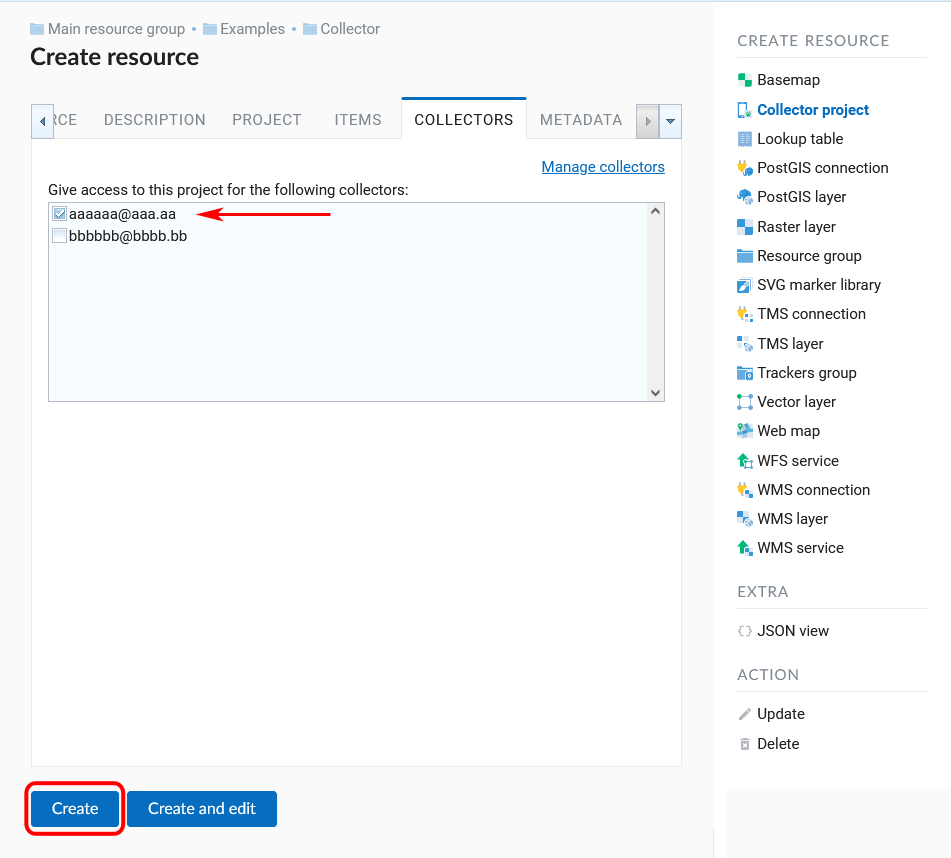

   «Collectors» tab

9. Press "Create".

As a result a Collector project (data collection project) will be created.

You can have unlimited number of projects in your Web GIS. In each of them you can restrain or allow access for a particular set of participants from the data collection team.

Team participants: mobile app installation and start of data collection
------------------------------------------------------------------------

Data collection team participant should download and install the NextGIS Collector mobile app on his mobile device.
You could download it from Google Play Store using the following link - `NextGIS Collector`_
or find it by the name in Google Play Store.

.. figure:: _static/ngc-user-01_eng.png
   :name: ngc-user-02
   :align: center
   :width: 10cm
   
   Search in Play Market

After the instalation is completed, start the app, skip information screens and give necessary permissions:

.. figure:: _static/ngc-user-02.png
   :name: ngc-user-02
   :align: center
   :width: 10cm

   Screen 1

.. figure:: _static/ngc-user-03.png
   :name: ngc-user-03
   :align: center
   :width: 10cm

   Screen 2

.. figure:: _static/ngc-user-04.png
   :name: ngc-user-04
   :align: center
   :width: 10cm
   
   Access screen
   

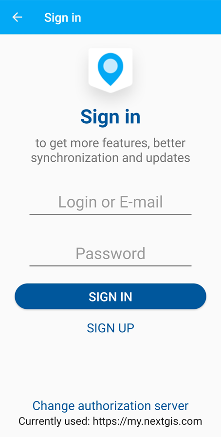
   
   Authorization

By default the server used is my.nextgis.com, you can also choose to :ref:`use on-premise server <ngcollector_auth>`.
If you're using NextGIS ID, make sure to enter the full email address.

.. figure:: _static/ngc-user-06.png
   :name: ngc-user-06
   :align: center
   :width: 10cm
   
   Signing in with NextGIS ID

After successful signing in you will see a list of projects.

Let's suppose that there is a data collection project with a list of forms as a starting screen.
When you choose this test project, the NextGIS Collector mobile app will display a list of layers.
You can also switch the mode to a map.

.. figure:: _static/ngc-user-07.png
   :name: ngc-user-07
   :align: center
   :width: 10cm

   Choose data collection project

.. figure:: _static/ngc-user-08.png
   :name: ngc-user-08
   :align: center
   :width: 10cm

   Editable layers of the project

.. figure:: _static/ngc-user-09.png
   :name: ngc-user-09
   :align: center
   :width: 10cm

   List of layers in the "Map" mode

After completing these steps a data collection team participant can begin editing layers.
The process of editing and the editing tools are similar to those in NextGIS Mobile.

.. important::
    We recommend collecting data with activated GPS. 

Administrator's check-list
--------------------------

This a short version of a Web GIS administrator check-list. Follow the steps to get your data collection up and running.

1. Formulate a list of feature attributes that you're going to collect and describe in the field.
2. Install NextGIS Software on your desktop.
3. Create a Web GIS at nextgis.com, make sure you're on Premium.
4. Add yourself as a user. ☰ - Control panel - Collector projects. Enter your e-mail, registered at nextgis.com
5. Create an account to send data from NextGIS Collector app and give it the necessary permissions. For example:
   Full name: Collector. Login: Collector. Password. Description: NextGIS Collector Account. Groups: Administrator.
6. Run NextGIS Formbuilder, unlock Pro. Create a form, set field aliases for readability. Set default values for lists.
7. Using Formbuilder, upload the form to your Web GIS. This will create a vector layer with style. While uploading the form, create Collector project (a basemap and data collection project will be created) and a Web Map for data visualisation.
8. Check the form on your device.
9. Continue adding other users. For simplicity, ask users to register using gmail account. Gmail client is already on every android, and already signed in. Add names for the data collectors.
