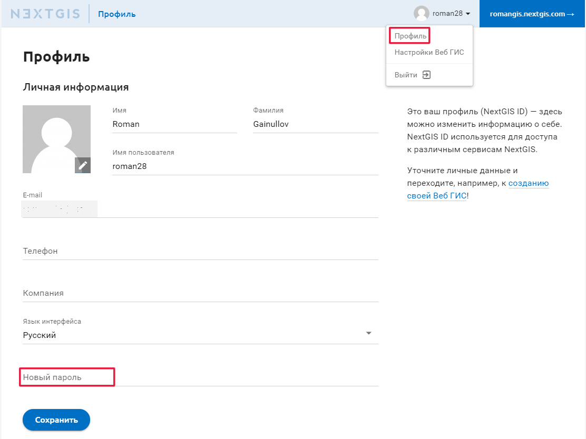

.. _ngcom_create:

Создание аккаунта и Вeб ГИС
============================

.. _ngcom_create_account:

Создание аккаунта (NextGIS ID)
-------------------------------

До начала работы с :ref:`Веб ГИС <ngcom_description>` вам необходимо создать аккаунт (NextGIS ID). NextGIS ID используется для доступа ко всем сервисам NextGIS, включая Сервис Веб ГИС.

Для создания аккаунта необходимо пройти по `ссылке <https://my.nextgis.com/signup/?next=/webgis/>`_ или нажать на 
кнопку "Создать Веб ГИС" на главной странице сайта nextgis.ru (см. :numref:`NextGIS_main_page_pic`): 

.. figure:: _static/NextGIS_main_page.png
   :name: NextGIS_main_page_pic
   :align: center
   :width: 16cm

   Главная страница сайта nextgis.ru.

Откроется форма регистрации аккаунта, в которой необходимо заполнить поля E-mail и Пароль, подтвердить согласие с `Пользовательским соглашением <http://nextgis.ru/terms>`_ и `Политикой конфиденциальности NextGIS <http://nextgis.ru/privacy>`_, а затем нажать на кнопку "Создать аккаунт" (см. :numref:`signup_form_pic`)

.. figure:: _static/Signup_form.png
   :name: signup_form_pic
   :align: center
   :width: 16cm    

   Форма регистрации аккаунта.

.. note::

   Аккаунт можно также создать, авторизовавшись через социальные сети, в которых вы зарегистрированы.

После нажатия кнопки "Создать аккаунт" на экране появится уведомление о необходимости подтверждения указанного вами в форме регистрации адреса электронной почты (см. :numref:`confirm_email_pic`)

.. figure:: _static/Confirm_email.png
   :name: confirm_email_pic
   :align: center
   :width: 16cm    

   Уведомление о необходимости подтверждения e-mail.

Не закрывая страницу с уведомлением, проверьте свою электронную почту - на указанный в форме регистрации e-mail должно прийти письмо со ссылкой для его подтверждения. В том случае, если письмо не пришло в течение 10-15 минут, можно нажать ссылку "Выслать письмо еще раз" в уведомлении (см. :numref:`confirm_email_pic`). Также через уведомление можно изменить адрес электронной почты, если в нем была допущена ошибка.

Получив письмо, перейдите по ссылке для подтверждения адреса электронной почты. Откроется страница личного кабинета с данными вашего профиля, в котором вы можете заполнить данные о себе, выбрать язык интерфейса и изменить пароль своего аккаунта. Для применения любых изменений нажмите кнопку "Сохранить" (см. :numref:`profile_pic`): 

.. figure:: _static/Profile.png
   :name: profile_pic
   :align: center
   :width: 16cm    
  
   Страница профиля в личном кабинете NextGIS.

.. warning::

   Для аккаунтов с неподтвержденным адресом электронной почты создание Веб ГИС недоступно.

.. _ngcom_ngid_change_password:

Изменение пароля NextGIS ID
-----------------

Чтобы изменить пароль учетной записи NextGIS ID, нужно перейти в настройки профиля https://my.nextgis.com/profile и установить новый пароль (см. :numref:`ngid_change_pass`).

   Изменения пароля NextGIS ID

.. _ngcom_create_webgis:

Создание Веб ГИС
-----------------

Завершив создание аккаунта, вы можете приступить к созданию вашей Веб ГИС.

Для создания Веб ГИС необходимо заполнить форму создания Веб ГИС, в которой назначаются URL и  
имя вашей Веб ГИС, выбирается язык интерфейса. Также следует выбрать `тарифный план <http://nextgis.ru/nextgis-com/plans>`_ (см. :numref:`WebGIS_creation_1_pic`): 

.. figure:: _static/WebGIS_creation_1.png
   :name: WebGIS_creation_1_pic
   :align: center
   :width: 16cm    

   Форма создания Веб ГИС.

Закончив заполнять форму, нажмите на кнопку "Создать Веб ГИС" (см. :numref:`WebGIS_creation_2_pic`): 

.. figure:: _static/WebGIS_creation_2.png
   :name: WebGIS_creation_2_pic
   :align: center
   :width: 16cm     

   Создание Веб ГИС.

.. warning::

   После создания Веб ГИС изменить её URL и язык интерфейса будет невозможно!

Будет открыта страница "Настройки Веб ГИС" в вашем личном кабинете с информацией о том, что ваша Веб ГИС находится в процессе создания. 
Когда процесс создания завершится, на вашу электронную почту придет письмо с логином и паролем для авторизации в Веб ГИС.
(см. :numref:`WebGIS_creation_3_pic`): 

.. figure:: _static/WebGIS_creation_3.png
   :name: WebGIS_creation_3_pic
   :align: center
   :width: 16cm    

   Страница "Настройки Веб ГИС" в процессе создания Веб ГИС.

После того как Веб ГИС будет создана, внешний вид страницы "Настройки Веб ГИС" в вашем личном кабинете изменится: на ней появится наименование вашей Веб ГИС, поле изменения пароля для Веб ГИС, информация о текущем плане, а также ссылка для перехода в Веб ГИС в правом верхнем углу (см. :numref:`WebGIS_settings_pic`): 

.. figure:: _static/WebGIS_settings.png
   :name: WebGIS_settings_pic
   :align: center
   :width: 16cm     

   Страница "Настройки Веб ГИС"

Для перехода в Веб ГИС воспользуйтесь ссылкой на странице "Настройки Веб ГИС". Откроется окно с Основной группой ресурсов (см. :numref:`WebGIS_main_pic`): 

.. figure:: _static/WebGIS_main.png
   :name: WebGIS_main_pic
   :align: center
   :width: 16cm    

   Окно "Основная группа ресурсов".
   
   Красным прямоугольником выделена кнопка вызова меню, в котором содержатся команды "Ресурсы", "Панель управления" (только у пользователей плана "Премиум") и "Справка".

Для начала работы с Веб ГИС следует авторизоваться в ней, нажав кнопку "Войти" в правом верхнем углу и указав логин и пароль для авторизации в Веб ГИС.

.. warning::

   Логин и пароль для авторизации в Веб ГИС отличаются от логина и пароля аккаунта NextGIS ID!

Если у вас возникнут вопросы по работе с Веб ГИС, можно воспользоваться командой "Справка", нажав кнопку вызова меню в правом верхнем углу (см. :numref:`WebGIS_menu_pic`): 

.. figure:: _static/WebGIS_menu.png
   :name: WebGIS_menu_pic
   :align: center
   :width: 16cm    

   Меню Веб ГИС с командой "Справка".

После выбора команды "Справка" откроется страница со ссылками на документацию, правовые документы и контактную информацию NextGIS (см. :numref:`help_pic`): 

.. figure:: _static/Help.png
   :name: help_pic
   :align: center
   :width: 16cm     

   Страница "Помощь".
   
   
.. _ngcom_change_password_webgis:

Изменение паролей входа в Веб ГИС
-----------------

По вашему желанию мы имеете возможность изменять пароли пользователей для входа в вашу Веб ГИС .
Это функция доступна в разделе "Пользователи" в Панели управления (см. :numref:`list_users`). Пароль можно изменить как для администратора, так и для остальных пользователей в Веб ГИС (см. :numref:`admin_change_password`).

.. figure:: _static/list_users.png
   :name: list_users
   :align: center
   :width: 16cm    

   Список пользователей Веб ГИС
   
   .. figure:: _static/admin_change_password.png
   :name: admin_change_password
   :align: center
   :width: 16cm    

   Изменение пароля пользователя Веб ГИС
   
   
В случае, если вы забыли пароль администратора и не можете войти в Веб ГИС, то установите новый пароль на https://my.nextgis.com/ (см. :numref:`Web_GIS_change_password`)

   .. figure:: _static/Web_GIS_change_password.png
   :name: Web_GIS_change_password
   :align: center
   :width: 16cm    

   Изменение пароля администратора Веб ГИС
