.. _ngcom_create:

Создание аккаунта и Вeб ГИС
===========================

.. _ngcom_create_account:

Создание аккаунта (NextGIS ID)
-------------------------------

До работы с любыми сервисами и ПО NextGIS, включая :ref:`Веб ГИС <ngcom_description>`, необходимо создать аккаунт (NextGIS ID).

Для создания аккаунта необходимо пройти по `ссылке <https://my.nextgis.com/signup/?next=/webgis/>`_ или нажать на 
кнопку "Создать Веб ГИС" на главной странице сайта nextgis.ru (см. :numref:`NextGIS_main_page_pic`): 

.. figure:: _static/NextGIS_main_page.png
   :name: NextGIS_main_page_pic
   :align: center
   :width: 16cm

   Главная страница сайта nextgis.ru.

Откроется форма регистрации аккаунта, в которой необходимо заполнить поля E-mail и Пароль, подтвердить согласие с `Пользовательским соглашением <http://nextgis.ru/terms>`_ и `Политикой конфиденциальности NextGIS <http://nextgis.ru/privacy>`_, а затем нажать на кнопку "Создать аккаунт" (см. :numref:`signup_form_pic`)

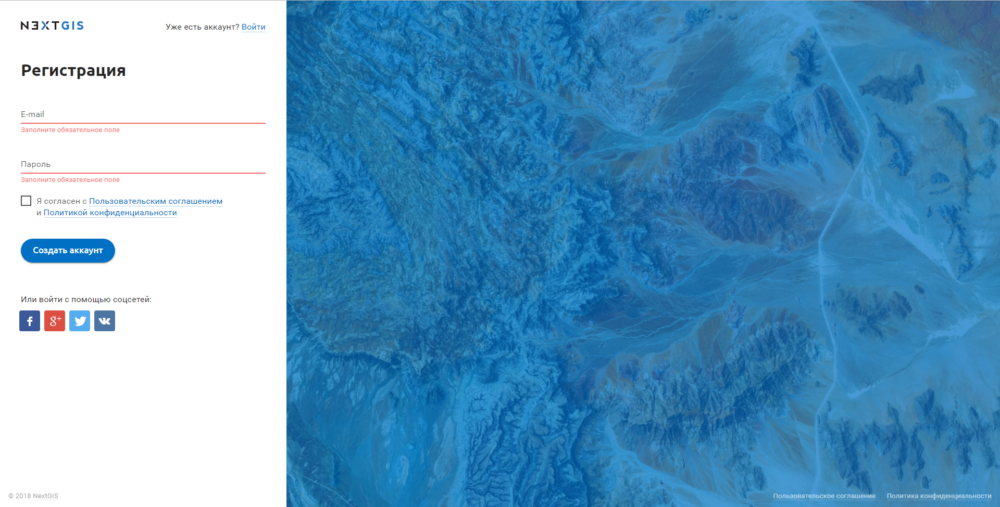

   Форма регистрации аккаунта.

.. note::

   Аккаунт можно также создать, авторизовавшись через социальные сети, в которых вы зарегистрированы.

После нажатия кнопки "Создать аккаунт" на экране появится уведомление о необходимости подтверждения указанного вами в форме регистрации адреса электронной почты (см. :numref:`confirm_email_pic`)

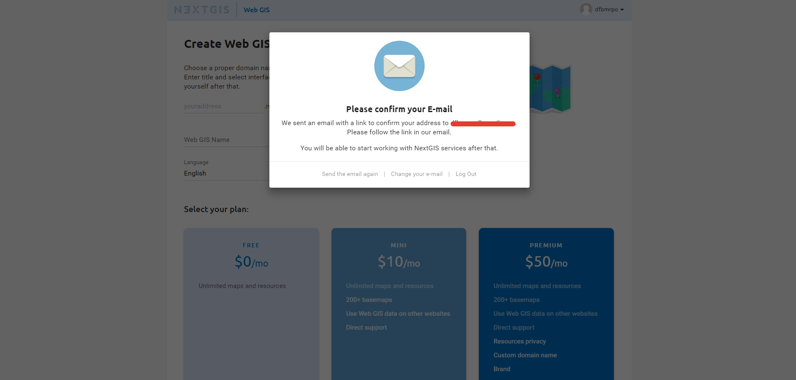

   Уведомление о необходимости подтверждения e-mail.

Не закрывая страницу с уведомлением, проверьте свою электронную почту - на указанный в форме регистрации e-mail должно прийти письмо со ссылкой для его подтверждения. В том случае, если письмо не пришло в течение 10-15 минут, можно нажать ссылку "Выслать письмо еще раз" в уведомлении (см. :numref:`confirm_email_pic`). Также через уведомление можно изменить адрес электронной почты, если в нем была допущена ошибка.

Получив письмо, перейдите по ссылке для подтверждения адреса электронной почты. Откроется страница личного кабинета с данными вашего профиля, в котором вы можете заполнить данные о себе, выбрать язык интерфейса и изменить пароль своего аккаунта. Для применения любых изменений нажмите кнопку "Сохранить" (см. :numref:`profile_pic`): 

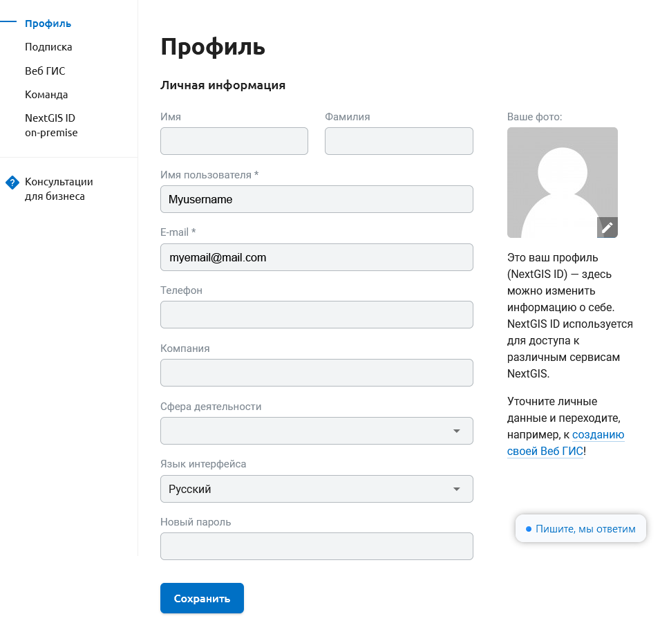
  
   Страница профиля в личном кабинете NextGIS.

.. warning::

   Для аккаунтов с неподтвержденным адресом электронной почты создание Веб ГИС недоступно.

.. _ngcom_ngid_change_password:

Изменение пароля NextGIS ID
---------------------------

Чтобы изменить пароль учетной записи NextGIS ID, нужно перейти в настройки профиля https://my.nextgis.com/profile и установить новый пароль (см. :numref:`ngid_change_pass`).

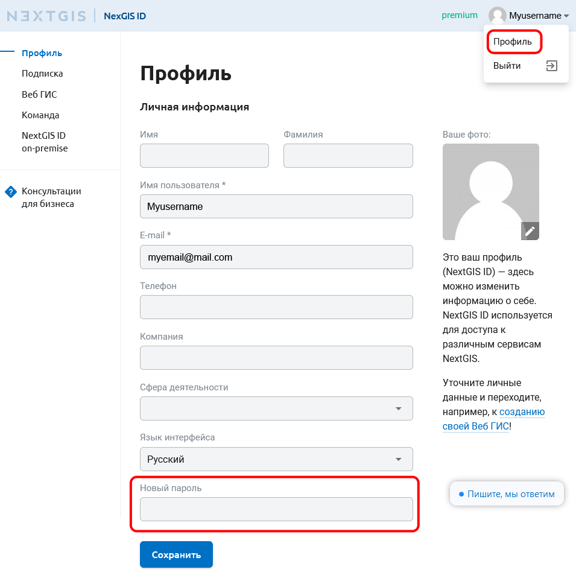

   Изменения пароля NextGIS ID

.. _ngcom_create_webgis:

Создание Веб ГИС
-----------------

Завершив создание аккаунта, вы можете приступить к созданию вашей Веб ГИС.

Для создания Веб ГИС необходимо заполнить форму создания Веб ГИС, в которой назначаются URL и  
имя вашей Веб ГИС, выбирается язык интерфейса. Также следует выбрать `тарифный план <http://nextgis.ru/nextgis-com/plans>`_ (см. :numref:`WebGIS_creation_1_pic`): 

.. figure:: _static/WebGIS_creation_1.png
   :name: WebGIS_creation_1_pic
   :align: center
   :width: 16cm    

   Форма создания Веб ГИС.

Закончив заполнять форму, нажмите на кнопку "Создать Веб ГИС" (см. :numref:`WebGIS_creation_2_pic`): 

.. figure:: _static/WebGIS_creation_2.png
   :name: WebGIS_creation_2_pic
   :align: center
   :width: 16cm     

   Создание Веб ГИС.

Будет открыта страница "Настройки Веб ГИС" в вашем личном кабинете с информацией о том, что ваша Веб ГИС находится в процессе создания. 
Когда процесс создания завершится, на вашу электронную почту придет письмо с логином и паролем для авторизации в Веб ГИС.
(см. :numref:`WebGIS_creation_3_pic`): 

.. figure:: _static/WebGIS_creation_3.png
   :name: WebGIS_creation_3_pic
   :align: center
   :width: 16cm    

   Страница "Настройки Веб ГИС" в процессе создания Веб ГИС.

После того как Веб ГИС будет создана, внешний вид страницы "Настройки Веб ГИС" в вашем личном кабинете изменится: на ней появится наименование вашей Веб ГИС, поле изменения пароля для Веб ГИС, информация о текущем плане, а также ссылка для перехода в Веб ГИС в правом верхнем углу (см. :numref:`WebGIS_settings_pic`): 

.. figure:: _static/WebGIS_settings.png
   :name: WebGIS_settings_pic
   :align: center
   :width: 16cm     

   Страница "Настройки Веб ГИС"

Для перехода в Веб ГИС воспользуйтесь ссылкой на странице "Настройки Веб ГИС". Откроется окно с Основной группой ресурсов (см. :numref:`WebGIS_main_pic`): 

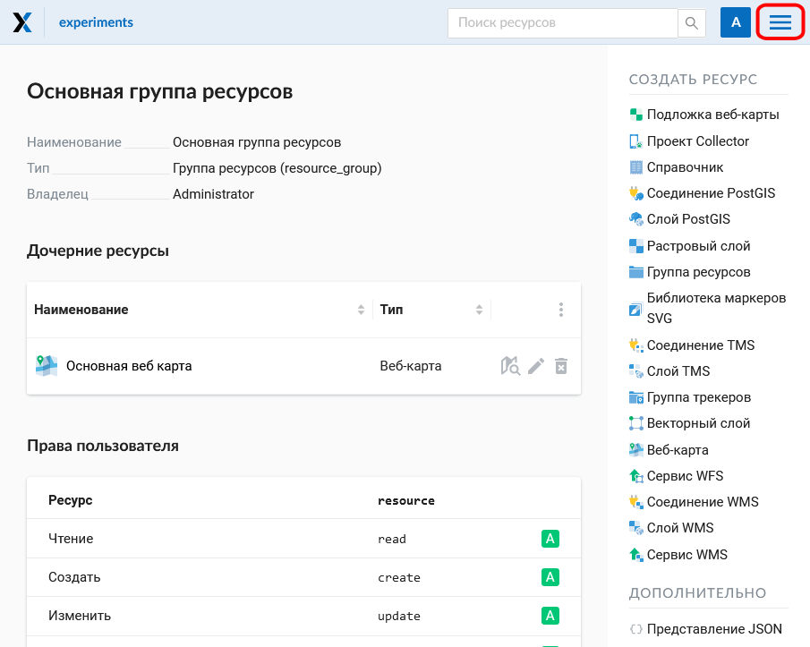

   Окно "Основная группа ресурсов".
   
   Красным прямоугольником выделена кнопка вызова меню, в котором содержатся команды "Ресурсы", "Панель управления" (только у пользователей плана "Премиум") и "Справка".

Для начала работы с Веб ГИС следует авторизоваться в ней, нажав кнопку "Войти" в правом верхнем углу и указав логин и пароль для авторизации в Веб ГИС.

.. warning::

   Логин и пароль для авторизации в Веб ГИС отличаются от логина и пароля аккаунта NextGIS ID!

Если у вас возникнут вопросы по работе с Веб ГИС, можно воспользоваться командой "Справка", нажав кнопку вызова меню в правом верхнем углу (см. :numref:`WebGIS_menu_pic`): 

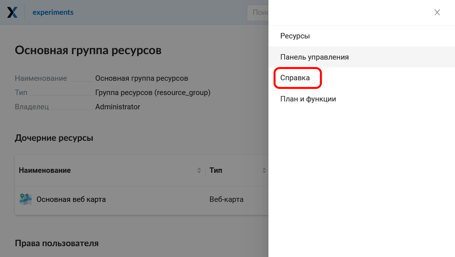

   Меню Веб ГИС с командой "Справка".

После выбора команды "Справка" откроется страница со ссылками на документацию, правовые документы и контактную информацию NextGIS (см. :numref:`help_pic`): 

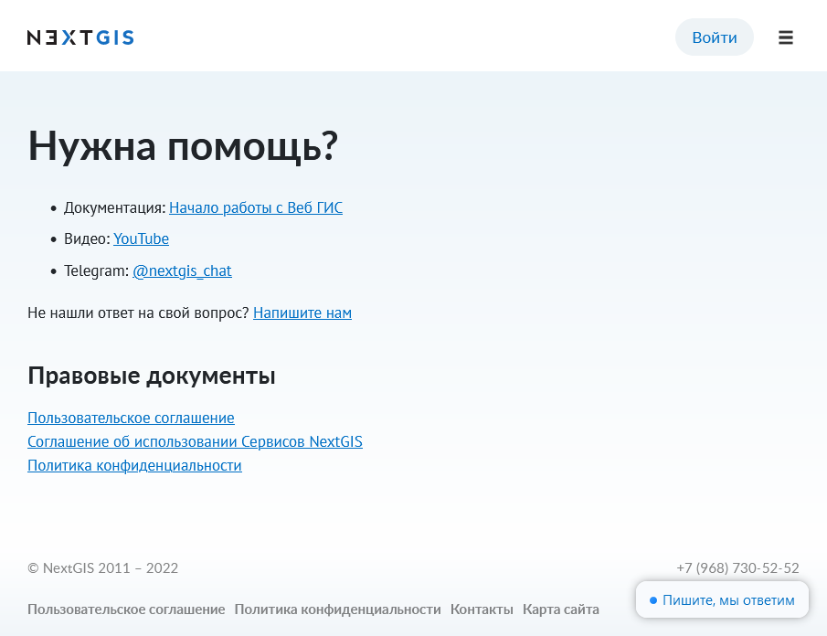

   Страница "Помощь".
   

Управление командой
-----------------

.. warning::
   Данный функционал доступен только для пользователей плана `Premium <http://nextgis.ru/nextgis-com/plans>`_.

.. note::
   Данный раздел относится к пользователям NextGIS, имеющим аккаунт на my.nextgis.com, а не к `пользователям <https://docs.nextgis.ru/docs_ngweb/source/admin_tasks.html#ngw-create-group>`_ определенной Веб ГИС.
   

В соответствии с тарифными планами nextgis.com владелец Premium аккаунта имеет возможность дать доступ к Pro-функциям `NextGIS QGIS <https://nextgis.ru/nextgis-qgis#pro>`_, `Mobile <https://nextgis.ru/nextgis-mobile#pro>`_ и `Formbuilder <https://nextgis.ru/nextgis-formbuilder#pro>`_ еще 4 пользователям.

Механизм управления командой позволяет добавить в свою команду любого пользователя NextGIS по его никнейму. Управление командой доступно через личный кабинет на https://my.nextgis.com/teammanage в разделе “Команда” (см. :numref:`Team_on_panel`).

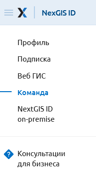

   Раздел “Команда” в левой панели Личного кабинета
   
По умолчанию в команде уже находится администратор, который приобрел подписку на Premium (см. :numref:`First_administrator`). Он имеет возможность добавить новых пользователей, нажав кнопку “Добавить” и найдя их по никнейму NextGIS ID (см. :numref:`list_users`). Пользователи должны быть уже зарегистрированы на my.nextgis.com. Логин пользователя можно увидеть в его профиле на https://my.nextgis.com/. Если пользователь забыл свой логин и не может войти в профиль, он должен восстановить `доступ <https://docs.nextgis.ru/docs_ngcom/source/faq_webgis.html#nextgis-id>`_.

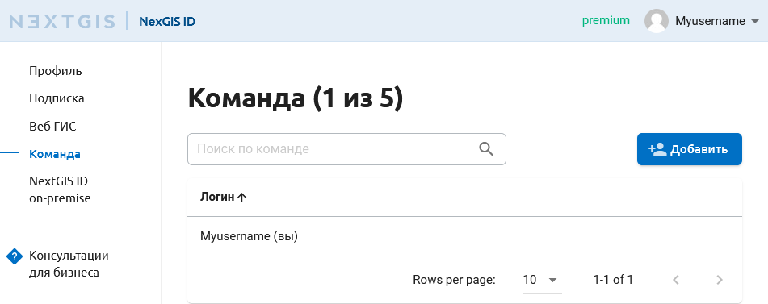

   Состав команды по умолчанию (только администратор)
   
   
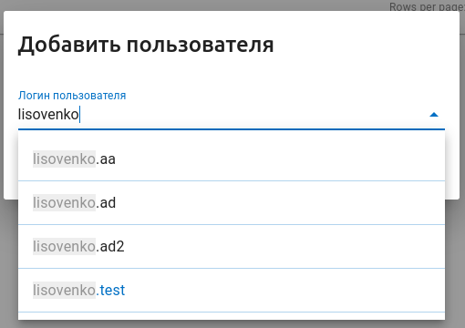

   Добавление пользователя
   
   
Каждый добавленный пользователь появится в списке (см. :numref:`all_users`). В любой момент пользователя можно удалить и/или заменить на другого, если достигнут доступный по тарифу лимит на размер команды (см. :numref:`limit_users`)

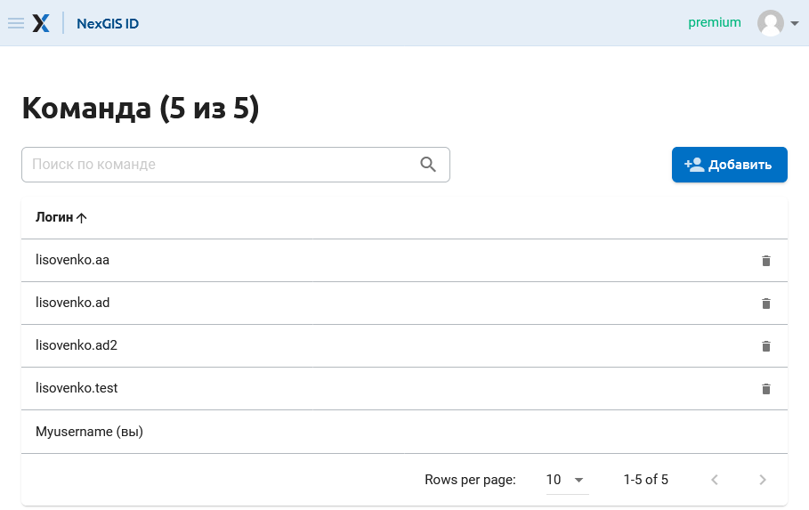

   Список пользователей, добавленных в команду
   
   
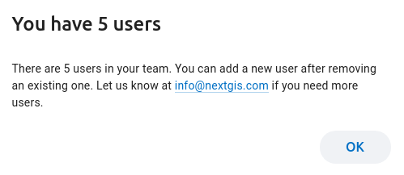

   Сообщение о превышении лимита пользователей в команде
