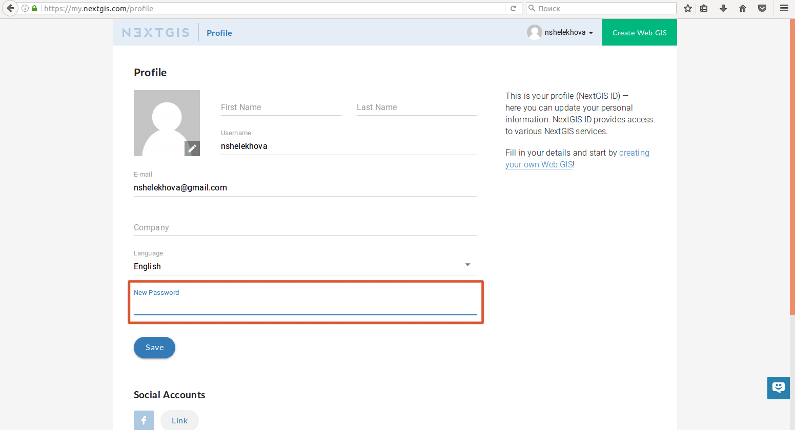

.. _ngcom_create:

How to create account (NextGIS ID) and Web GIS
================================================

.. _ngcom_create_account:

How to create account (NextGIS ID)
-----------------------------------

Before you can start working with your :ref:`Web GIS <ngcom_description>` you need to create an account (NextGIS ID). NextGIS ID is required for access to all NextGIS Services, including Web GIS service.

In order to create an account click `here <https://my.nextgis.com/signup/?next=/webgis/>`_ or press "Create Web GIS" button on the main page of nextgis.com website (see :numref:`NextGIS_main_page_pic`): 

.. figure:: _static/NextGIS_main_page.png
   :name: NextGIS_main_page_pic
   :align: center
   :width: 16cm    

   nextgis.com main page.   

A signup form will open, where you need to fill in E-mail and Password fields, agree to `Terms of Service <http://nextgis.com/terms>`_ and `Privacy Policy <http://nextgis.com/privacy>`_, аnd click "Create account" button (see :numref:`signup_form_pic`):

.. figure:: _static/Signup_form.png
   :name: signup_form_pic
   :align: center
   :width: 16cm    

   Signup form.
      
.. note::

   You can also create an account by authorising with your existing social media account.
   
After you click "Create account" button a window will pop-up telling you to confirm email address you've indicated in the signup form (see :numref:`confirm_email_pic`):

.. figure:: _static/Confirm_email.png
   :name: confirm_email_pic
   :align: center
   :width: 16cm    

   "Please confirm your E-mail" window.

Don't close this window and check your email, you should receive a letter with an account confirmation link. In case you don't receive this letter in 10-15 minutes, click "Send the email again" link in the "Please confirm your E-mail" window (see :numref:`confirm_email_pic`). You can also change your email address in case you made an error during signup. 

When you receive the letter click on the link to confirm your email address. After you do that your Profile page will open where you can fill in your personal information, select language of the interface and change your password. To apply changes press "Save" button (see :numref:`profile_pic`): 

.. figure:: _static/Profile.png
   :name: profile_pic
   :align: center
   :width: 16cm    
  
   Profile page at nextgis.com. 

.. warning::

   You will not be able to create Web GIS until you confirm your email address.

.. _ngcom_ngid_change_password:

How to change password NextGIS ID
-----------------

To change the password for the NextGIS ID account, go to the profile settings https://my.nextgis.com/profile and set a new password (см. :numref:`ngid_change_pass_en`).

   Changing password NextGIS ID

.. _ngcom_create_webgis:

How to create Web GIS
---------------------

After you've successfully created your account you can start creating your Web GIS.

To create Web GIS you need to complete a Web GIS creation form by indicating domain name (URL) and name of your Web GIS and selecting its default interface language. You'll also need to select its `Plan <http://nextgis.com/nextgis-com/plans>`_ (see :numref:`WebGIS_creation_1_pic`): 

.. figure:: _static/WebGIS_creation_1.png
   :name: WebGIS_creation_1_pic
   :align: center
   :width: 16cm    

   Web GIS creation form.

After you finish completing all required fields press "Create Web GIS" button (see :numref:`WebGIS_creation_2_pic`): 

.. figure:: _static/WebGIS_creation_2.png
   :name: WebGIS_creation_2_pic
   :align: center
   :width: 16cm     

   Web GIS creation.

.. note::

   You won't be able to change domain name and default language of your Web GIS after it's been created!
   
"Web GIS Settings" page will open informing you that your Web GIS is being created. When the creation process is complete you'll receive an email with your Web GIS login and password (see :numref:`WebGIS_creation_3_pic`): 

.. figure:: _static/WebGIS_creation_3.png
   :name: WebGIS_creation_3_pic
   :align: center
   :width: 16cm    

   "Web GIS Settings" page during Web GIS creation.

After your Web GIS is created the outlook of "Web GIS Settings" page will change: it will contain your Web GIS address, fields for changing your Web GIS password, your current Plan information, and a link to your Web GIS in the upper right corner (see :numref:`WebGIS_settings_pic`): 

.. figure:: _static/WebGIS_settings.png
   :name: WebGIS_settings_pic
   :align: center
   :width: 16cm     

   "Web GIS Settings" page.

To open your Web GIS click the link on "Web GIS Settings" page. Web GIS Main resource group will open (see :numref:`WebGIS_main_pic`): 

.. figure:: _static/WebGIS_main.png
   :name: WebGIS_main_pic
   :align: center
   :width: 16cm    

   Main resource group.
   
   A red rectangle indicates a menu containing "Resources", "Control panel" (only for Premium users) and "Help" sections.
   
To start working in your Web GIS first sign in with your Web GIS login and password using a "Sign in" button in the upper right corner.

.. warning::

   Your Web GIS login and password differ from your NextGIS ID login and password!

If you have questions about your Web GIS you can go to "Help" section of the menu by clicking on menu button in the upper right corner (see :numref:`WebGIS_menu_pic`): 

.. figure:: _static/WebGIS_menu.png
   :name: WebGIS_menu_pic
   :align: center
   :width: 16cm    

   Web GIS menu with "Help" button.

A "Help" page with links to user documentation, legal documents and NextGIS contact information will open (see :numref:`help_pic`): 

.. figure:: _static/Help.png
   :name: help_pic
   :align: center
   :width: 16cm     

   "Help" page.
   
