.. _ngcom_create:

How to create account (NextGIS ID) and Web GIS
================================================

.. _ngcom_create_account:

How to create account (NextGIS ID)
-----------------------------------

Before you can start working with your :ref:`Web GIS <ngcom_description>` you need to create an account (NextGIS ID). NextGIS ID is required to access all NextGIS Services, including Web GIS service.

In order to create an account click `here <https://my.nextgis.com/signup/?next=/webgis/>`_ or press **"Create Web GIS"** button on the main page of nextgis.com website (see :numref:`NextGIS_main_page_pic`): 

.. figure:: _static/NextGIS_main_page.png
   :name: NextGIS_main_page_pic
   :align: center
   :width: 16cm    

   nextgis.com main page  

A sign-up form will open, where you need to fill in E-mail and Password fields, agree to `Terms of Service <http://nextgis.com/terms>`_ and `Privacy Policy <http://nextgis.com/privacy>`_, аnd click **"Create account"** button (see :numref:`signup_form_pic`):

.. figure:: _static/Signup_form.png
   :name: signup_form_pic
   :align: center
   :width: 16cm    

   Sign-up form
      
.. note::

   You can also create an account by authorising with your existing social media account.
   
After you click the **"Create account"** button, your Profile page will open where you can fill in your personal information, select language of the interface and change your password. In case you made an error during sign-up, you can also change your email address in the profile. To apply changes press **"Save"** (see :numref:`profile_pic`): 

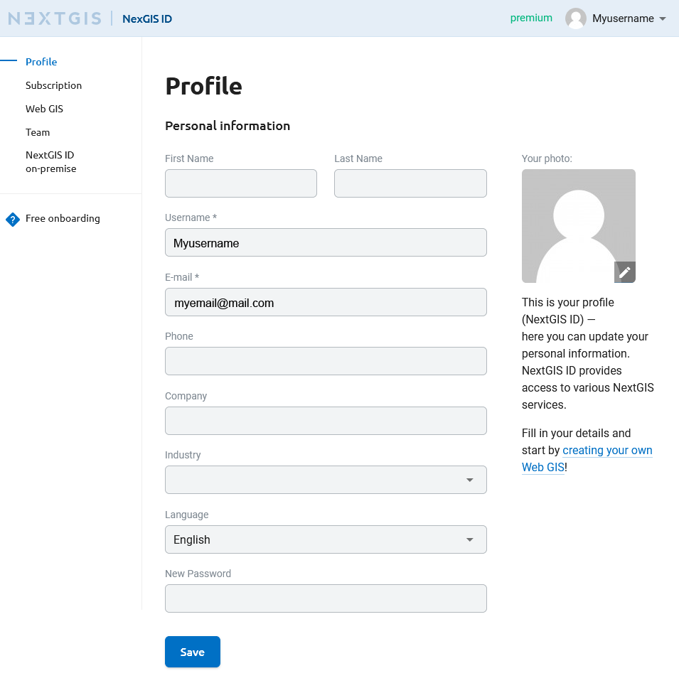
  
   Profile page at nextgis.com

Check your email, you should receive a letter with an account confirmation link. When you receive the letter, click on the link to confirm your email address.

.. warning::

   You will not be able to create Web GIS until you confirm your email address.
   
In case you don't receive this letter in 10-15 minutes, click **"Create Web GIS"** button,  then click "Send the email again" link in the "Please confirm your E-mail" window (see :numref:`confirm_email_pic`). 
   
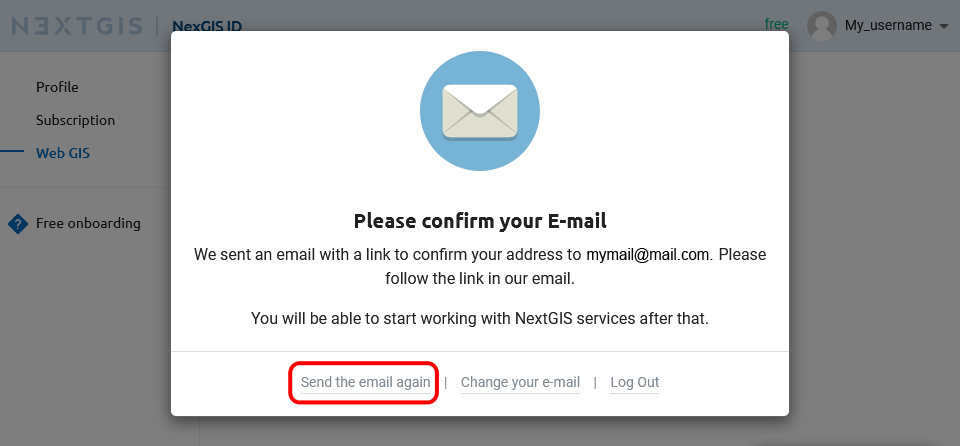

   "Please confirm your E-mail" window

.. _ngcom_ngid_change_password:

How to change NextGIS ID password
---------------------------------

To change the password for the NextGIS ID account, go to the profile settings https://my.nextgis.com/profile and set a new password (см. :numref:`ngid_change_pass_en`).

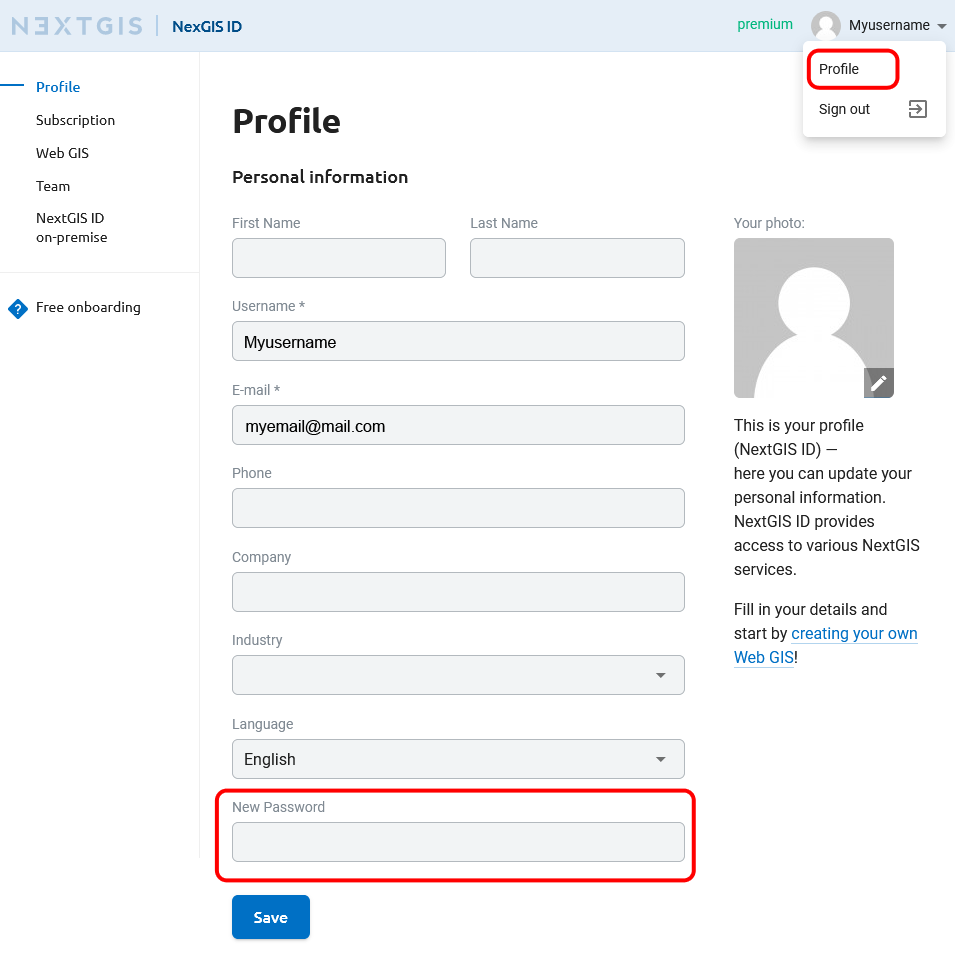

   Changing password NextGIS ID

.. _ngcom_create_webgis:

How to create Web GIS
---------------------

After you've successfully created your account you can start creating your Web GIS.

To create Web GIS you need to complete a Web GIS creation form by indicating domain name (URL) and selecting a data center (see :numref:`WebGIS_creation_1_pic`): 

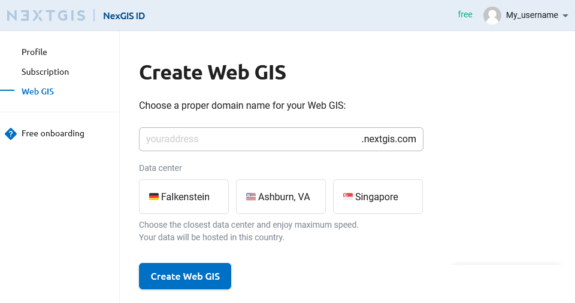

   Web GIS creation form

After you finish completing all required fields, press **"Create Web GIS"** button. A message will apear informing you that your Web GIS is being created (see :numref:`WebGIS_creation_2_pic`): 

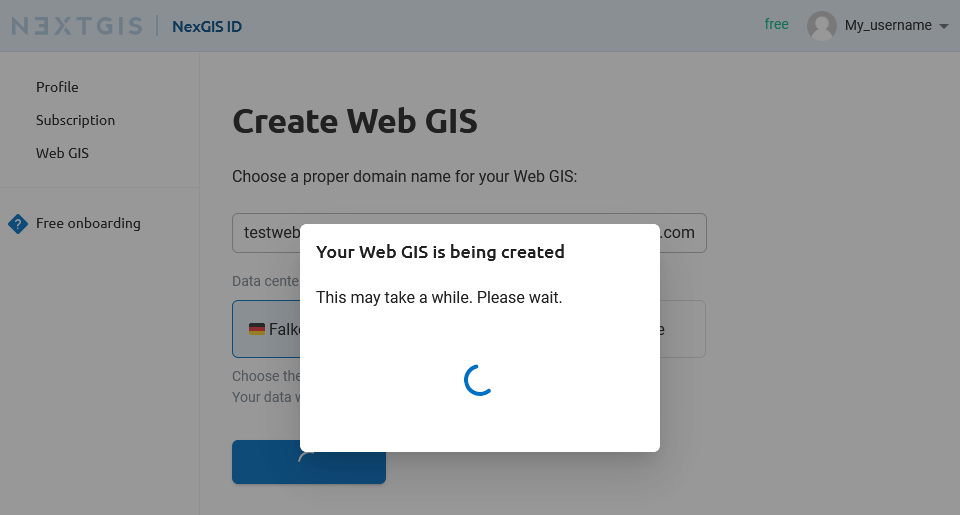

   Web GIS creation
   
When the creation process is complete, a message will appear. From this message you can open your newly created Web GIS or upgrade your `Plan <http://nextgis.com/nextgis-com/plans>`_ (see :numref:`WebGIS_creation_3_pic`):

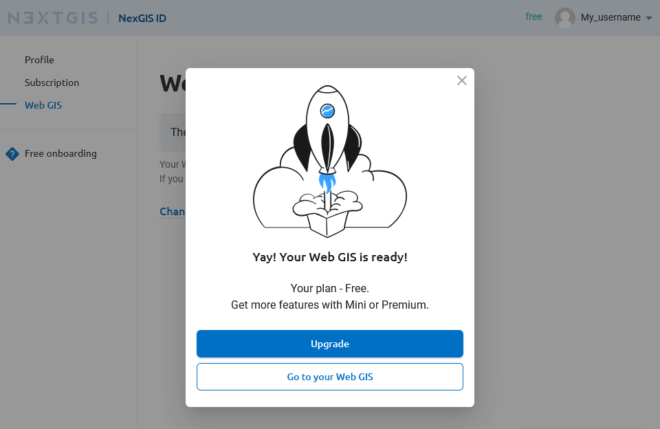

   Message announcing successful Web GIS creation

You'll receive an email with your Web GIS login and password. After your Web GIS is created, the outlook of the "Web GIS Settings" page will change: it will contain your Web GIS address and fields for changing your Web GIS password (see :numref:`WebGIS_settings_pic`): 

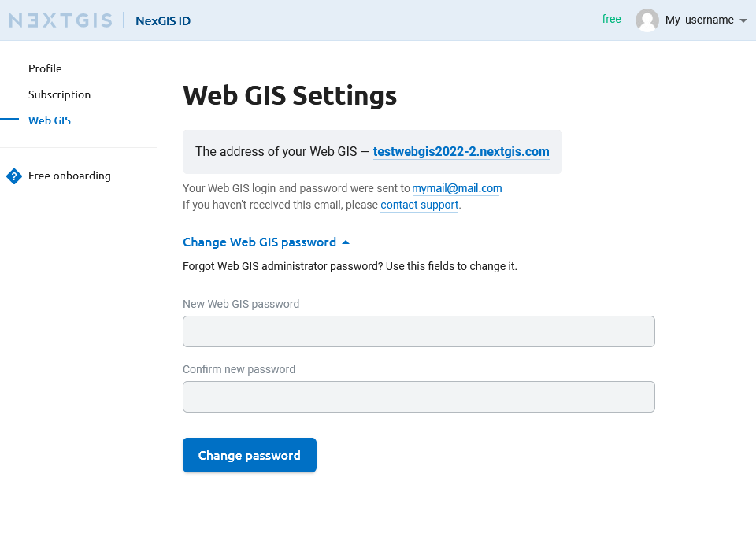

   "Web GIS Settings" page

To open your Web GIS click the link on the "Web GIS Settings" page. Web GIS Main resource group will open (see :numref:`WebGIS_main_pic`): 

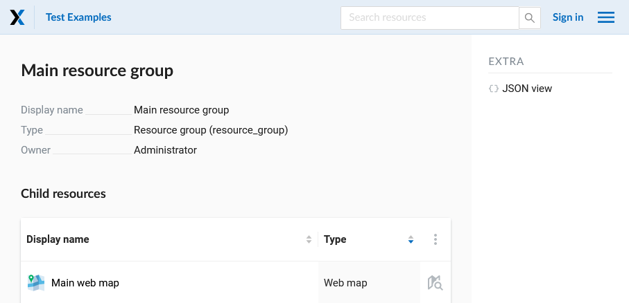
   
   Window of the Main resource group

.. _ngcom_webgis_signin:

How to sign in to your Web GIS
------------------------------

To start working in your Web GIS, first sign in using a **"Sign in"** button in the upper right corner.

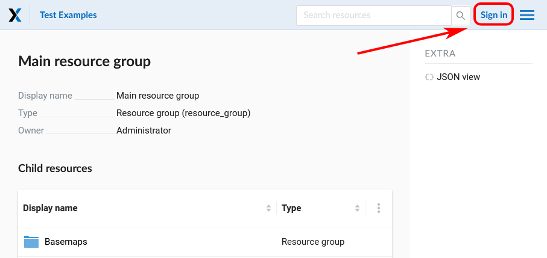
   
   Signing in from Web GIS main page

In the opened dialog press the green button that reads "Sign in with NextGIS ID".

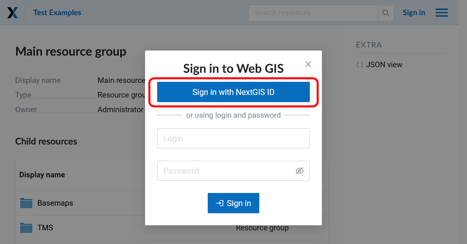
   
   Selecting sign-in via NextGIS

You will be redirected to my.nextgis.com authorization page. Enter your username or email you used for registration and your password. 

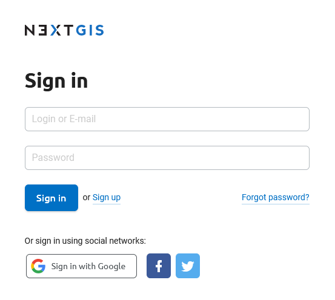
   
   Signing in with NextGIS

After the authorization is completed successfully you will be redirected back to the Web GIS.

.. _ngcom_main_menu:

Main menu
---------

A red rectangle indicates a menu containing "Resources", "Control panel" (only for Premium users) and "Help" sections.

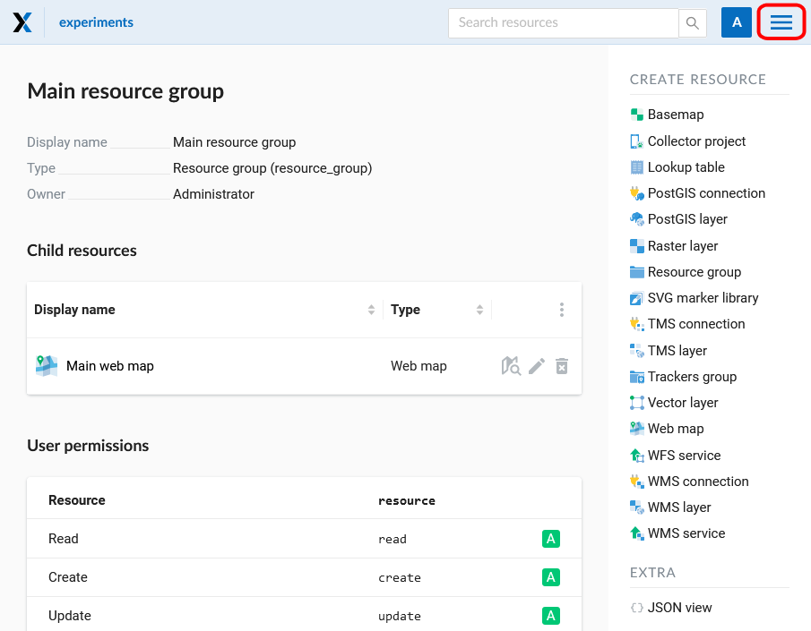

   Main resource group
   
If you have questions about your Web GIS, you can go to the "Help" section of the menu. 

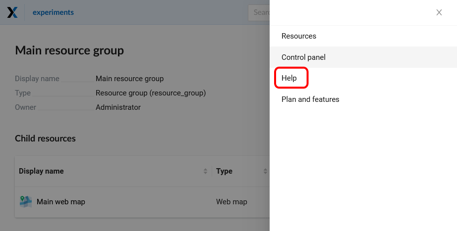

   Web GIS menu with "Help" button

"Help" page with links to user documentation, legal documents and NextGIS contact information will open (see :numref:`help_pic`): 

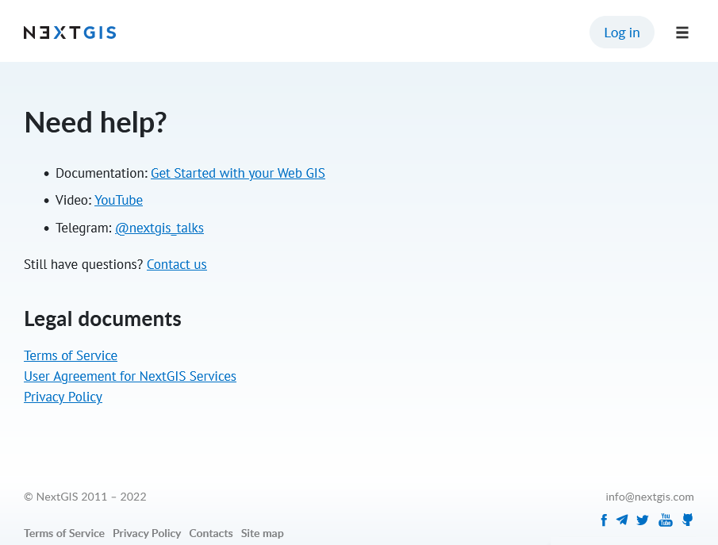

   "Help" page
   

.. _ngcom_ream_management:

Team management
---------------

.. warning::
   This functionality is only available for `Premium <http://nextgis.com/nextgis-com/plans>`_ users.
   
   
According to nextgis.com plans, the Premium account holder has an opportunity to give access to Premium-functions of `NextGIS QGIS <https://nextgis.com/nextgis-qgis#pro>`_, `Mobile <https://nextgis.com/nextgis-mobile#pro>`_ и `Formbuilder <https://nextgis.com/nextgis-formbuilder#pro>`_ to 4 more users who have a NextGIS ID.

Team management allows adding any NextGIS user by username to your team. Team management is available through your personal account at https://my.nextgis.com/teammanage in the Team section (see :numref:`Team_on_panel`).

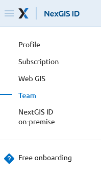

   The Team section of the Personal Account
   
By default, the team includes the owner of the Premium subscription (see :numref:`First_administrator`). The owner can add team members by clicking the **Add** button and finding them by using their NextGIS ID username (see :numref:`teamlist_users`). Team members must already be registered on my.nextgis.com. The username can be seen in the `profile <https://my.nextgis.com/>`_. Team member will have Free plan under subscription, it's normal, he/she will also have access Premium-functionality.

If the user has forgotten his username and cannot login, he can `restore <https://docs.nextgis.com/docs_ngcom/source/faq_webgis.html#access-recovery-and-passwords>`_ access.

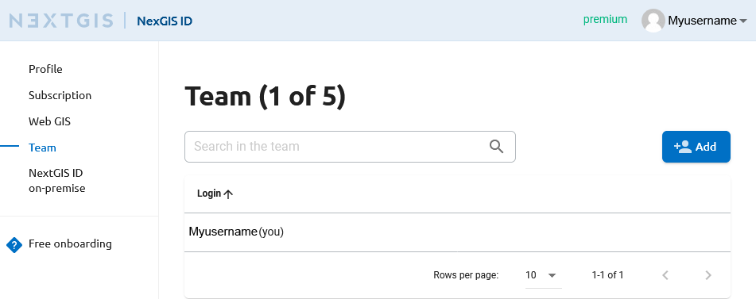

   Default view (owner only)
   
   
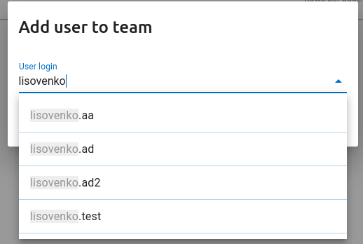

   Adding user to the team
   
Each added team member will appear in the list (see :numref:`all_users`). At any moment, a team member can be removed and/or replaced by another if the limit of the team is reached (see :numref:`limit_users`).

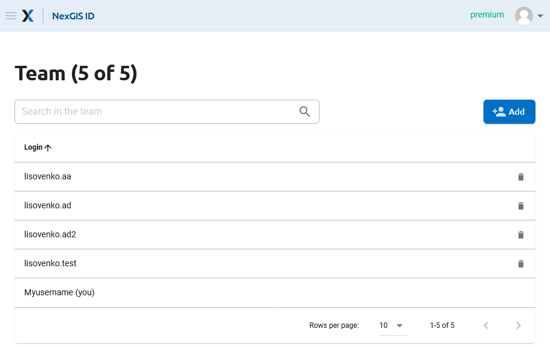

   Users added to the team
   
   
.. figure:: _static/limit_users.png
   :name: limit_users
   :align: center
   :width: 12cm    

   Message about exceeding the limit of members in the team

.. _ngcom_auth_id_webgis:

Allow team members to access Web GIS using NextGIS ID
-----------------------------------------------

Users added to the `team <https://docs.nextgis.com/docs_ngcom/source/create.html#ngcom-team-management>` do not automatically become users of the Web GIS. To get access to the Web GIS, the user must log in to it.
By default a new Web GIS user has no permissions. Set up permissions for your team before their first login.
It can be done in one of two ways:

* The best way is to set up permissions for a `user group <https://docs.nextgis.com/docs_ngweb/source/admin_tasks.html#ngw-create-group>`_ with the option "New users" enabled. Users will be included in this group upon their first login to the Web GIS.
* An alternative way is to set up permissions for the principal "Authenticated".
