.. _ngcom_create:

Аккаунт
===========================

.. _ngcom_create_account:

Создание аккаунта (NextGIS ID)
------------------------------

До работы с любыми сервисами и ПО NextGIS, включая :ref:`Веб ГИС <ngcom_description>`, необходимо создать аккаунт (NextGIS ID).

Для создания аккаунта необходимо пройти по `ссылке <https://my.nextgis.com/signup/>`_ или нажать на 
кнопку **Войти** на главной странице сайта nextgis.ru (см. :numref:`NextGIS_main_page_pic`): 

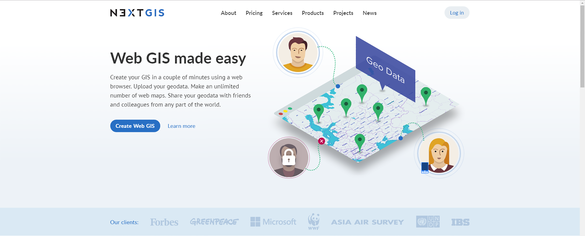

   Главная страница сайта nextgis.ru

Откроется форма регистрации аккаунта. 

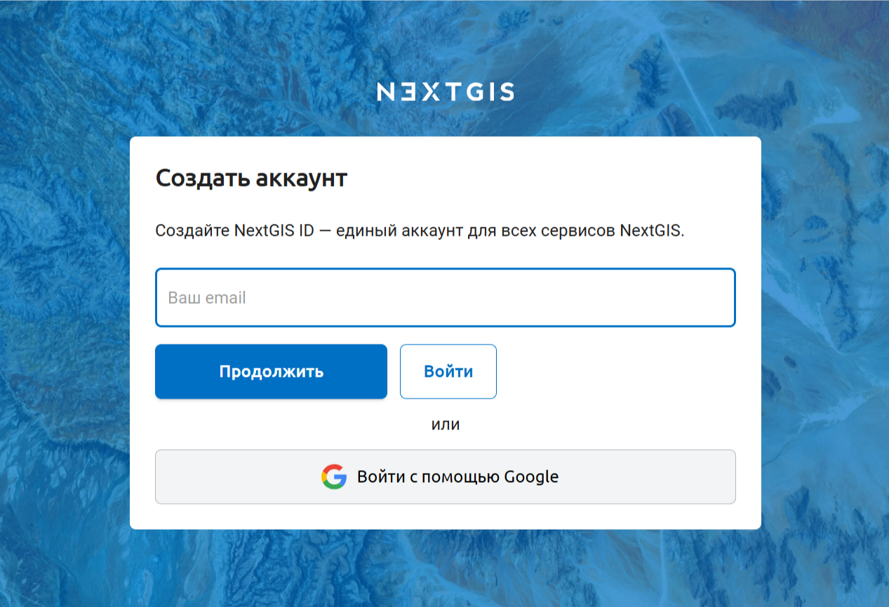

   Создание аккаунта: ввод электронной почты

Введите адрес электронной почты - это будет ваш логин для входа в сервисы NextGIS. Нажмите **Продолжить**. На указанную почту будет отправлен код подтверждения. 

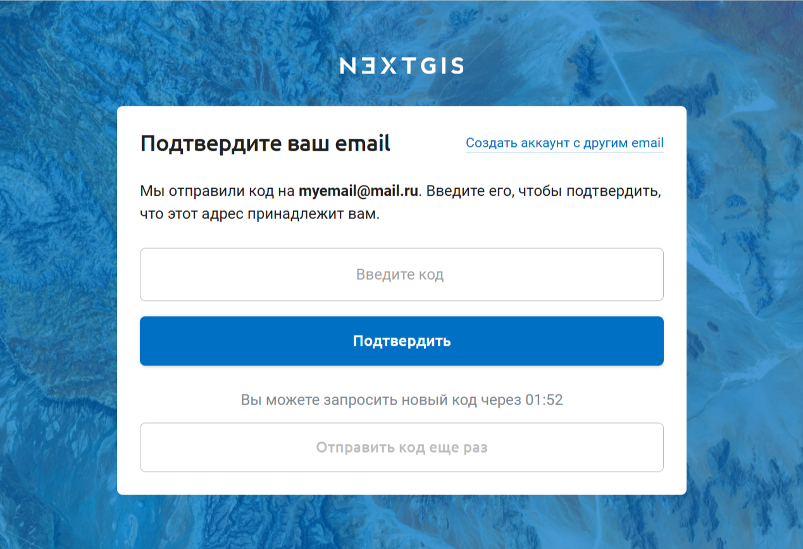

   Создание аккаунта: подтверждение электронной почты

Введите полученный код и нажмите **Подтвердить**. Код можно повторно запросить через две минуты. Если вы увидели, что сделали ошибку в адресе электронной почты, нажмите **Создать аккаунт с другим email**.

После подтверждения адреса электронной почты введите имя, которое будет отображаться в профиле, и выберите из списка страну для корректного отображения доступных способов оплаты.

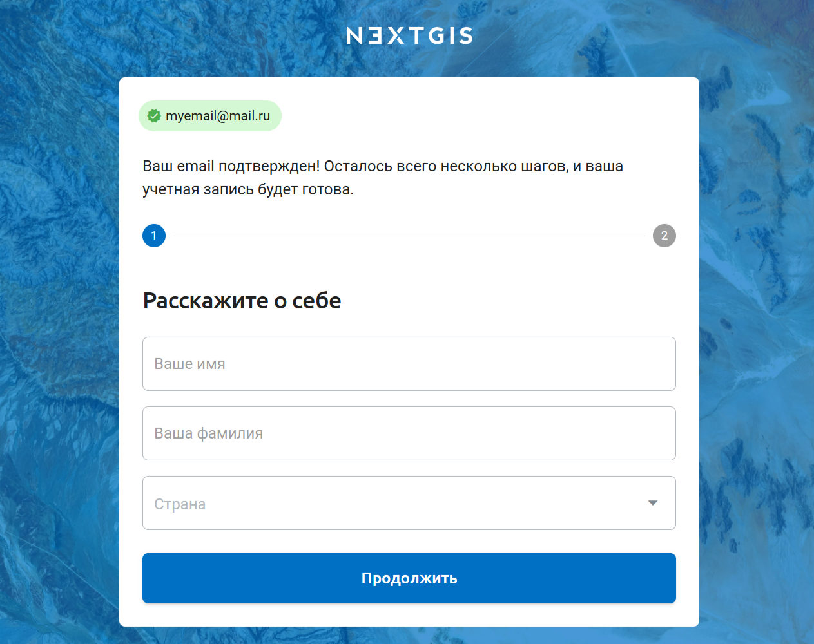

   Создание аккаунта: информация о пользователе

На следующем шаге необходимо придумать пароль и подтвердить согласие с `Пользовательским соглашением <http://nextgis.ru/terms>`_ и `Политикой конфиденциальности NextGIS <http://nextgis.ru/privacy>`_, а затем нажать на кнопку **Создать аккаунт** (см. :numref:`ngid_set_password_pic`).

Пароль должен содержать от 8 до 128 символов и включать хотя бы одну строчную букву, одну заглавную букву, одну цифру и один из специальных символов: ``! " # $ % & ' ( ) * + , - . / : ; < = > ? @ [ ] ^ ` { | } ~ _``. 

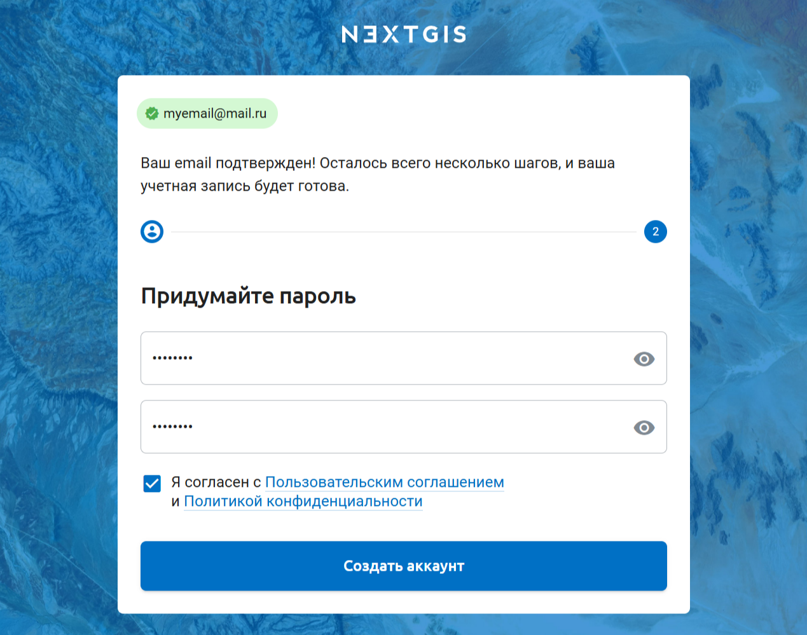

   Создание аккаунта: ввод пароля

.. note:: Аккаунт можно также создать, авторизовавшись через учётную запись Google.

После нажатия кнопки **Создать аккаунт** откроется страница `создания Веб ГИС <https://docs.nextgis.ru/docs_ngcom/source/create_webgis.html>`_.

   
.. warning::

   Для ранее созданных аккаунтов с неподтвержденным адресом электронной почты создание Веб ГИС и использование сервисов NextGIS недоступно.

Нажмите **Создать Веб ГИС**, и на экране появится уведомление о необходимости подтверждения адреса электронной почты (см. :numref:`confirm_email_pic`), в котором следует выбрать **"Выслать письмо еще раз"**. Проверьте свою электронную почту - на указанный в форме регистрации e-mail должно прийти письмо со ссылкой для его подтверждения. Получив письмо, перейдите по ссылке для подтверждения адреса электронной почты. 

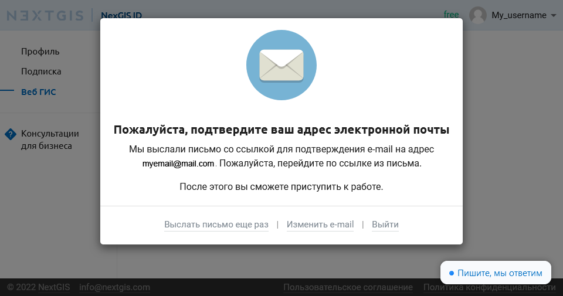

   Уведомление о необходимости подтверждения e-mail

.. _ngcom_ngid_login:

Вход по NextGIS ID
-------------------

NextGIS ID используется для входа в `личный кабинет <https://my.nextgis.com>`_, а также для авторизации в Веб ГИС, `Toolbox <https://toolbox.nextgis.com/>`_ и другие сервисы NextGIS.

При выборе авторизации через NextGIS ID откроется следующая страница:

.. figure:: _static/ngid_signup_signin_ru.png
   :name: ngid_login_pic
   :align: center
   :width: 16cm  

   Страница входа через NextGIS ID

Введите адрес электронной почты, который вы использовали при создании аккаунта, нажмите **Продолжить**. На следующей странице введите пароль от аккаунта и нажмите **Войти**.

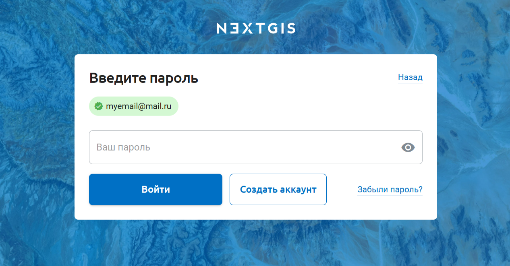

   Страница ввода пароля

В разных сервисах и ПО есть свои нюансы перехода к авторизации, см. `Где используется NextGIS ID <https://docs.nextgis.ru/docs_ngcom/source/create.html#ngcom-ngid-use>`_.

.. _ngcom_ngid_my:

Личный кабинет
--------------

Авторизовавшись в `личном кабинете <https://my.nextgis.com/profile>`_ вы можете:

* Изменить личные данные, в том числе `пароль <https://docs.nextgis.ru/docs_ngcom/source/create.html#ngcom-ngid-change-password>`_ ;
* Управлять подпиской;
* `Создать Веб ГИС <https://docs.nextgis.ru/docs_ngcom/source/create_webgis.html>`_ (доступно только после подтверждения электронной почты);
* Скачать программы NextGIS;
* Просматривать `список команд <https://docs.nextgis.ru/docs_ngcom/source/teams.html#ngcom-team-view>`_, в которых участвуете и `Управлять своей командой <https://docs.nextgis.ru/docs_ngcom/source/teams.html#ngcom-team-management>`_ (доступно на плане `Premium <https://nextgis.ru/pricing-base/>`_);
* Привязать идентификатор NGID on-premise (для пользователей, использующих собственный сервер).

.. _ngcom_ngid_profile:

Профиль
~~~~~~~~

Ваш профиль располагается по адресу https://my.nextgis.com/profile.

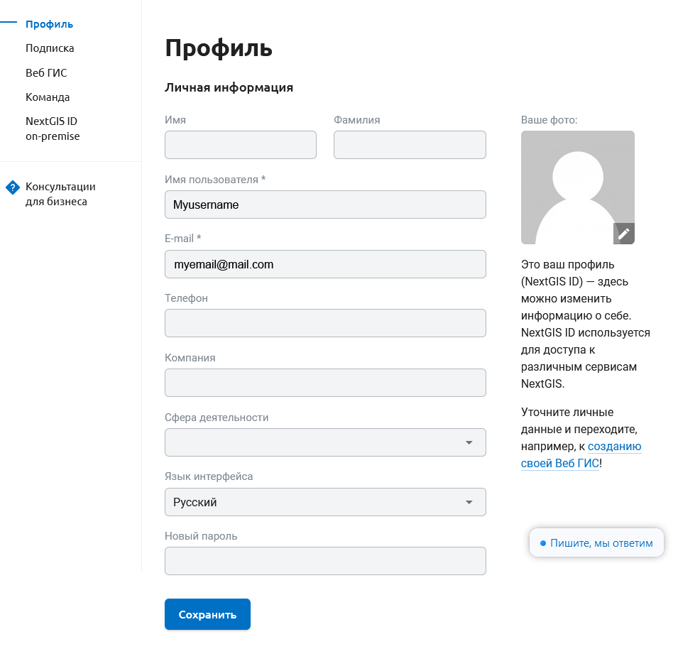
  
   Страница профиля в личном кабинете NextGIS

В профиле можно:

* `Сменить пароль <https://docs.nextgis.ru/docs_ngcom/source/create.html#ngcom-ngid-change-password>`_ NextGIS ID.
* Изменить имя пользователя или задать имя и фамилию, которые будут отображаться вместо него.
* Добавить информацию о компании и сфере деятельности, контактный номер телефона.
* Выбрать язык интерфейса личного кабинета. Если вы хотите сменить язык отображения Веб ГИС, это нужно сделать в `меню пользователя <https://docs.nextgis.ru/docs_ngweb/source/admin_interface.html#ngw-change-lang>`_ Веб ГИС.
* Привязать аккаунт Telegram для получения уведомлений.
* Экспортировать данные аккаунта в виде файлов CSV.
* Удалить аккаунт NextGIS ID и связанные с ним персональные данные.

.. _ngcom_ngid_profile_del:

Удалить аккаунт
~~~~~~~~~~~~~~~~

Чтобы удалить аккаунт, на странице профиля в разделе "Управление профилем" нажмите **Удалить профиль**.

Ваш профиль и персональные данные будут удалены. 

.. important:: Это действие нельзя отменить.

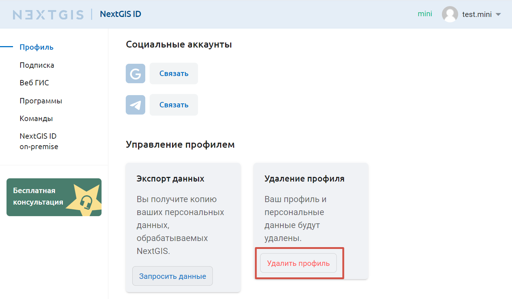

   Удаление профиля

.. _ngcom_ngid_change_password:

Изменение пароля NextGIS ID
~~~~~~~~~~~~~~~~~~~~~~~~~~~~~

Чтобы изменить пароль учетной записи NextGIS ID, нужно перейти в настройки `профиля <https://my.nextgis.com/profile>`_ и установить новый пароль (см. :numref:`ngid_change_pass`).

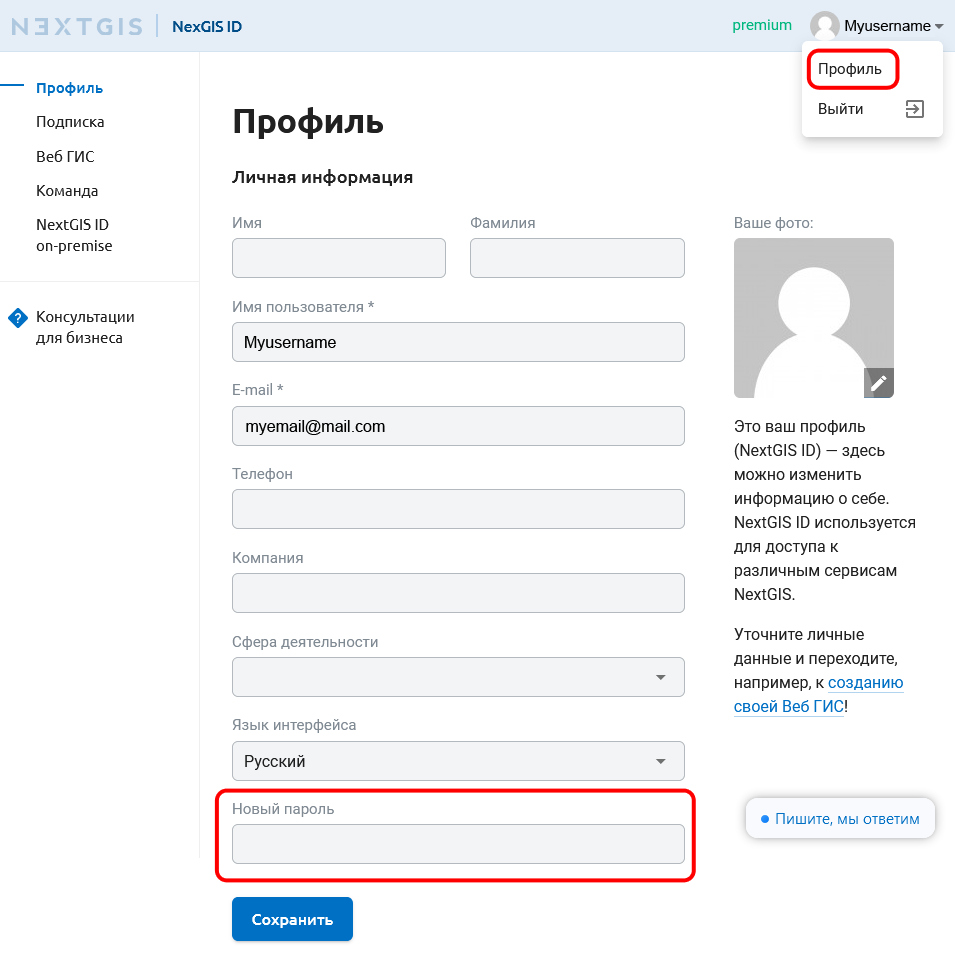

   Изменения пароля NextGIS ID

.. _ngcom_ngid_telegram:

Подключение уведомлений в Telegram
~~~~~~~~~~~~~~~~~~~~~~~~~~~~~~~~~~~~~~

Если связать свой Личный кабинет NextGIS с аккаунтом Telegram, уведомления о новых заказах на `NextGIS Data <https://data.nextgis.com/ru/>`_ будут приходить не только на почту (где могут попасть в спам), но и в Telegram. Скачивать данные вы также сможете прямо из мессенджера.

В `профиле <https://my.nextgis.com/profile>`_ в разделе "Социальные аккаунты" нажмите **Связать** рядом со значком Telegram. Вы будете перенаправлены в телеграм-бот. Нажмите **Запустить**, чтобы завершить привязку аккаунта.

Посмотрите, как это работает, в видео:

.. raw:: html

   <iframe width="560" height="315" src="https://rutube.ru/play/embed/1eecbd9eea8f2005af959fac49442e0d/" frameBorder="0" allow="clipboard-write; autoplay" webkitAllowFullScreen mozallowfullscreen allowFullScreen></iframe>

Посмотреть видео на `youtube <https://youtu.be/zyJVOHpuqyI>`_, `rutube <https://rutube.ru/video/1eecbd9eea8f2005af959fac49442e0d/?r=wd>`_.

.. _ngcom_ngid_download:

Программы
~~~~~~~~~~

В разделе "Программы" личного кабинета вы можете скачать установочные файлы настолького приложения NextGIS QGIS и мобильных приложений: `NextGIS Collector <https://docs.nextgis.ru/docs_collector/source/auth.html#>`_, `NextGIS Mobile <https://docs.nextgis.ru/docs_ngmobile/source/auth.html#>`_, `NextGIS Tracker <https://docs.nextgis.ru/docs_ngtracker/source/setting_up.html#ngtr-set-send>`_.

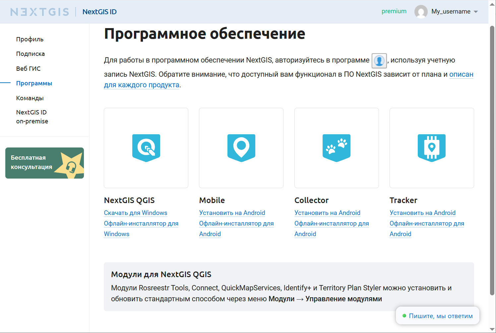

   Раздел личного кабинета "Программы"

.. _ngcom_ngid_use:

Где используется NextGIS ID
------------------------------

Облачные сервисы (При разворачивании на собственном сервере используется `NextGIS ID on-premise <https://docs.nextgis.ru/docs_ngid/source/index.html>`_)

* Веб ГИС на платформе NextGIS Web

Собственную Веб ГИС вы можете `создать <https://docs.nextgis.ru/docs_ngcom/source/create_webgis.html>`_ из профиля.

С помощью NextGID ID вы можете `войти <https://docs.nextgis.ru/docs_ngweb/source/admin_interface.html#ngw-admin-login>`_ в свою Веб ГИС или Веб ГИС владельца `команды <https://docs.nextgis.ru/docs_ngcom/source/teams.html>`_, в которую вы добавлены.

* `Toolbox <https://docs.nextgis.ru/docs_toolbox_prem/source/auth.html#>`_
* `GeoServices <https://docs.nextgis.ru/docs_geoservices/source/auth.html#>`_
* `QuckMapServices <https://qms.nextgis.com/about>`_

* Получение заказов, сделанных на `NextGIS Data <https://data.nextgis.com/ru/>`_

Мобильные приложения

* `NextGIS Collector <https://docs.nextgis.ru/docs_collector/source/auth.html#>`_
* `NextGIS Mobile <https://docs.nextgis.ru/docs_ngmobile/source/auth.html#>`_
* `NextGIS Tracker <https://docs.nextgis.ru/docs_ngtracker/source/setting_up.html#ngtr-set-send>`_

Настольные приложения

* `NextGIS QGIS <https://docs.nextgis.ru/docs_ngqgis/source/auth.html#>`_

Модули расширения QGIS

* `NextGIS Connect <https://docs.nextgis.ru/docs_ngconnect/source/ngc_install.html#ng-connect-new-connection>`_
* `Rosreestr Tools <https://docs.nextgis.ru/docs_rosreestr_tools/source/rosreestrintro.html#ngq-rr-auth>`_

