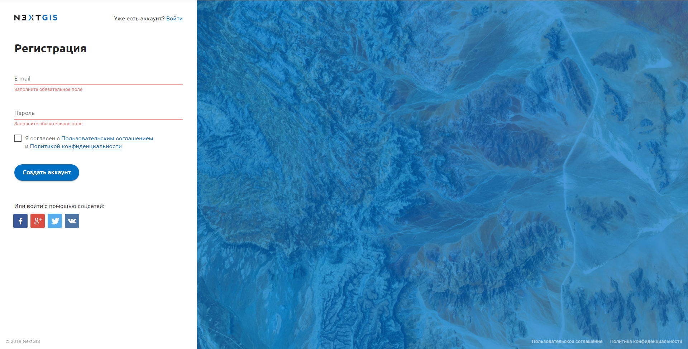
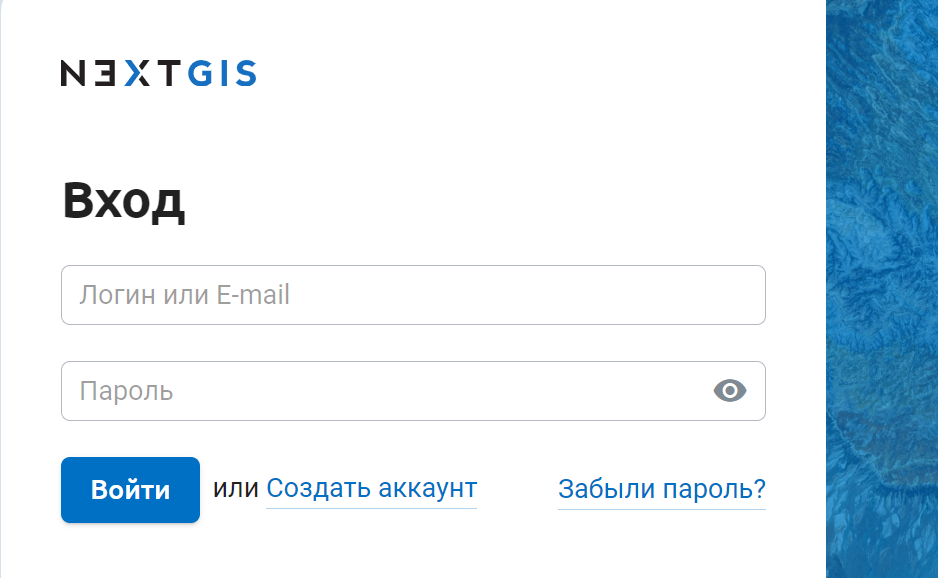

.. _ngcom_create:

Создание аккаунта
===========================

.. _ngcom_create_account:

Создание аккаунта (NextGIS ID)
------------------------------

До работы с любыми сервисами и ПО NextGIS, включая :ref:`Веб ГИС <ngcom_description>`, необходимо создать аккаунт (NextGIS ID).

Для создания аккаунта необходимо пройти по `ссылке <https://my.nextgis.com/signup/?next=/webgis/>`_ или нажать на 
кнопку **"Создать Веб ГИС"** на главной странице сайта nextgis.ru (см. :numref:`NextGIS_main_page_pic`): 

.. figure:: _static/NextGIS_main_page.png
   :name: NextGIS_main_page_pic
   :align: center
   :width: 16cm

   Главная страница сайта nextgis.ru.

Откроется форма регистрации аккаунта, в которой необходимо заполнить поля E-mail и Пароль, подтвердить согласие с `Пользовательским соглашением <http://nextgis.ru/terms>`_ и `Политикой конфиденциальности NextGIS <http://nextgis.ru/privacy>`_, а затем нажать на кнопку **"Создать аккаунт"** (см. :numref:`signup_form_pic`)

   Форма регистрации аккаунта.

.. note::

   Аккаунт можно также создать, авторизовавшись через социальные сети, в которых вы зарегистрированы.

После нажатия кнопки **"Создать аккаунт"** откроется страница личного кабинета с данными вашего профиля, в котором вы можете заполнить данные о себе, выбрать язык интерфейса и изменить пароль своего аккаунта. 
Также через профиль можно изменить адрес электронной почты, если в нем была допущена ошибка.
Для применения любых изменений нажмите кнопку **"Сохранить"** (см. :numref:`profile_pic`): 

.. figure:: _static/Profile_ru.png
   :name: profile_pic
   :align: center
   :width: 16cm    
  
   Страница профиля в личном кабинете NextGIS.
   
Проверьте свою электронную почту - на указанный в форме регистрации e-mail должно прийти письмо со ссылкой для его подтверждения. Получив письмо, перейдите по ссылке для подтверждения адреса электронной почты. 

.. warning::

   Для аккаунтов с неподтвержденным адресом электронной почты создание Веб ГИС недоступно.

В том случае, если письмо не пришло в течение 10-15 минут, нажмите **"Создать Веб ГИС"**, и на экране появится уведомление о необходимости подтверждения адреса электронной почты (см. :numref:`confirm_email_pic`), в котором следует выбрать **"Выслать письмо еще раз"**.

.. figure:: _static/Confirm_email_ru.png
   :name: confirm_email_pic
   :align: center
   :width: 16cm    

   Уведомление о необходимости подтверждения e-mail.

.. _ngcom_ngid_login:

Вход по NextGIS ID
-------------------

При выборе авторизации через NextGIS ID откроется следующая страница:

   Страница входа через NextGIS ID

Введите адрес электронной почты, который вы использовали при создании аккаунта, и пароль и нажмите **Войти**. 

.. _ngcom_ngid_profile:

Профиль
-------------

Ваш профиль располагается по адресу https://my.nextgis.com/profile.

В профиле вы можете:

* Изменить личные данные;
* Управлять подпиской;
* Создать Веб ГИС (доступно только после подтверждения электронной почты);
* Скачать программы NextGIS;
* Управлять командой (доступно на плане Premium);
* Привязать идентификатор NGID on-premise (для пользователей, использующих собственный сервер).

.. _ngcom_ngid_change_password:

Изменение пароля NextGIS ID
---------------------------

Чтобы изменить пароль учетной записи NextGIS ID, нужно перейти в настройки профиля https://my.nextgis.com/profile и установить новый пароль (см. :numref:`ngid_change_pass`).

.. figure:: _static/ngid_change_pass_ru.png
   :name: ngid_change_pass
   :align: center
   :width: 16cm    

   Изменения пароля NextGIS ID

.. _ngcom_ngid_use:

Где используется NextGIS ID
------------------------------

Облачные сервисы (При разворачивании на собственном сервере используется `NextGIS ID on-premise <https://docs.nextgis.ru/docs_ngid/source/toc.html>`_)

* Веб ГИС на платформе NextGIS Web

Собственную Веб ГИС вы можете `создать <https://docs.nextgis.ru/docs_ngcom/source/create_webgis.html>`_ из профиля.

С помощью NextGID ID вы можете `войти <https://docs.nextgis.ru/docs_ngweb/source/admin_interface.html#ngw-admin-login>`_ в свою Веб ГИС или Веб ГИС владельца `команды <https://docs.nextgis.ru/docs_ngcom/source/teams.html>`_, в которую вы добавлены.

* `Toolbox <https://docs.nextgis.ru/docs_toolbox_prem/source/auth.html#>`_
* `GeoServices <https://docs.nextgis.ru/docs_geoservices/source/auth.html#>`_
* `QuckMapServices <https://qms.nextgis.com/about>`_

* Получение заказов, сделанных на data.nextgis.com

Мобильные приложения

* `NextGIS Collector <https://docs.nextgis.ru/docs_collector/source/auth.html#>`_
* `NextGIS Mobile <https://docs.nextgis.ru/docs_ngmobile/source/auth.html#>`_
* `NextGIS Tracker <https://docs.nextgis.ru/docs_ngtracker/source/setting_up.html#ngtr-set-send>`_

Настольные приложения

* `NextGIS QGIS <https://docs.nextgis.ru/docs_ngqgis/source/auth.html#>`_
* `Formbuilder <https://docs.nextgis.ru/docs_formbuilder/source/gui.html#ngfb-auth>`_

Модули расширения QGIS

* `NextGIS Connect <https://docs.nextgis.ru/docs_ngconnect/source/ngc_install.html#ng-connect-new-connection>`_
* `Rosreestr Tools <https://docs.nextgis.ru/docs_rosreestr_tools/source/rosreestrintro.html#ngq-rr-auth>`_

