.. _ngcom_create:

Account
===========================

.. _ngcom_create_account:

How to create account (NextGIS ID)
-----------------------------------

Before you can start working with your :ref:`Web GIS <ngcom_description>` you need to create an account (NextGIS ID). NextGIS ID is required to access all NextGIS Services, including Web GIS service.

To sign up, use `this link <https://my.nextgis.com/signup/>`_ or press 
**Sign in** on the main page of the `nextgis.com <https://nextgis.com/>`_ Web site (see :numref:`NextGIS_main_page_pic`): 

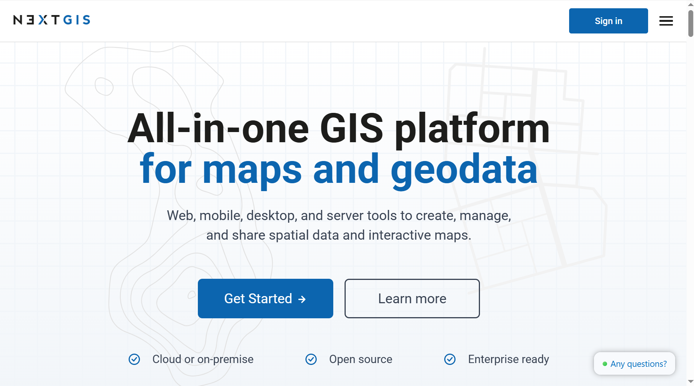

   Nextgis.com main page

.. figure:: _static/ngid_signup_signin_en.png
   :name: ngid_signup_signin_pic
   :align: center
   :width: 16cm  

   Sign in page

Press **Create account** and enter your email, it will be your login for NextGIS services.

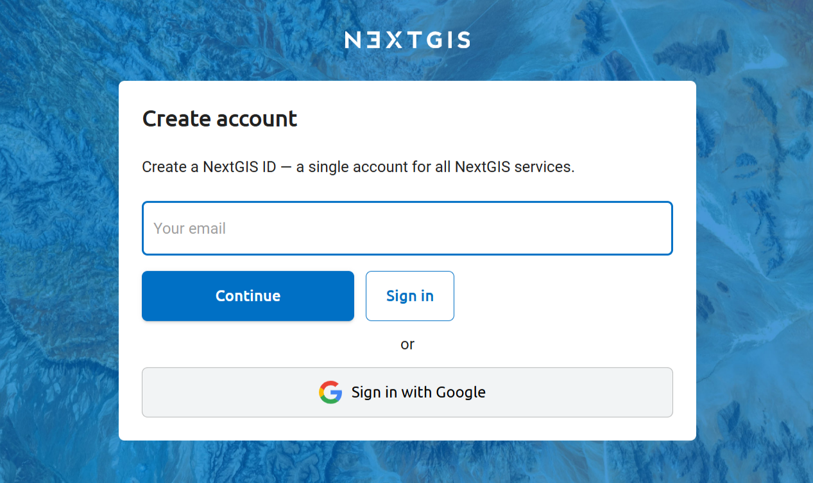

   Account creation: entering email

Click **Continue**. An email verification code will be sent to the address you entered. 

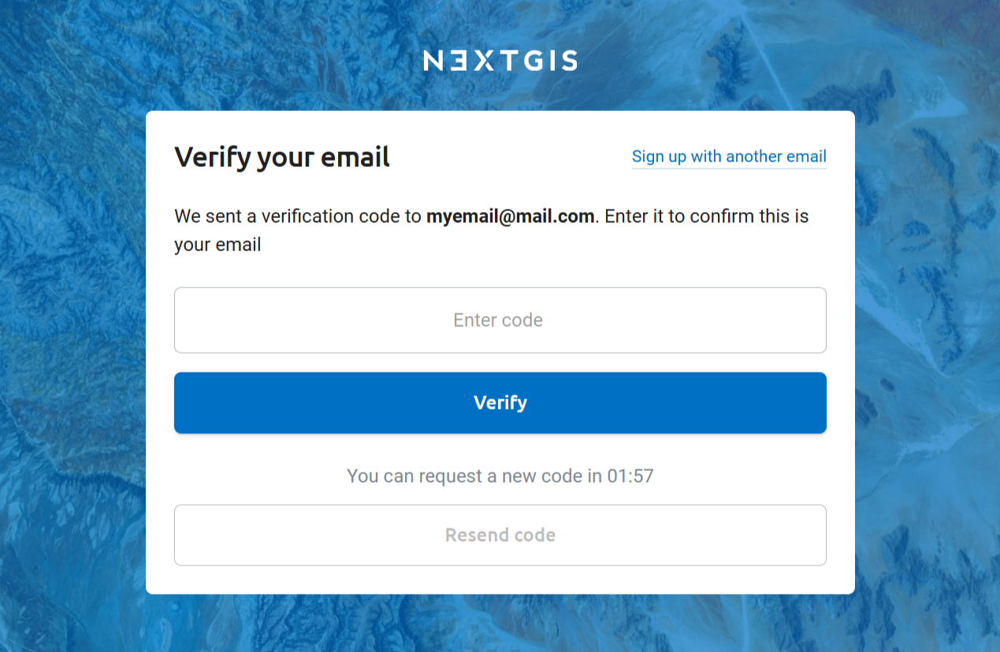

   Account creation: confirming email

Enter the verification code and click **Verify**. You can request a new code after two minues. If you realise you've made a typo in the email address, click **Sign up with another email**.

After verifying your email enter the name that will be indicated in your profile and select a country from the dropdown list to see the correct information on available payment methods.

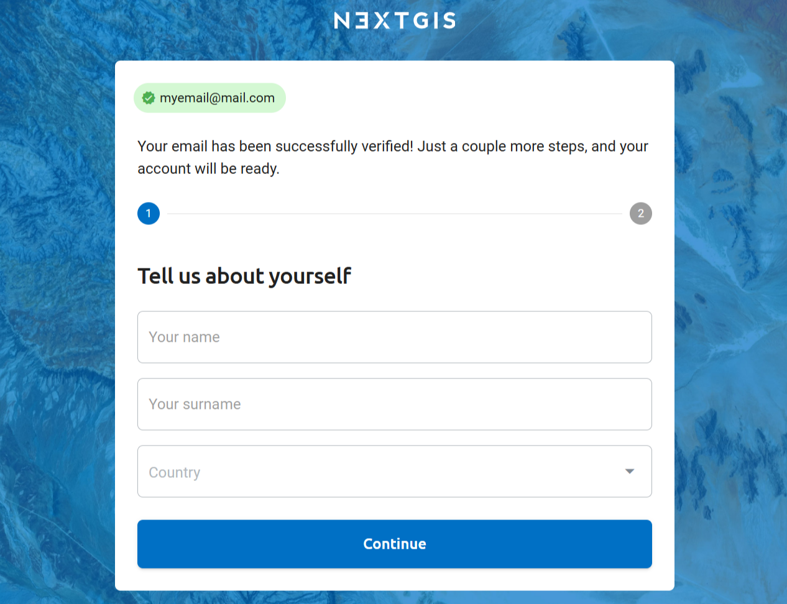

   Account creation: user info

On the next step enter a password, confirm that you agree to `Terms of Service <https://nextgis.com/terms/>`_ and `Privacy Policy <https://nextgis.com/privacy/>`_ and then click **Create account** to complete the process.

Password must be at least 8 characters long and include one lowercase letter, one uppercase letter, one number, and one of special characters: ``! " # $ % & ' ( ) * + , - . / : ; < = > ? @ [ ] ^ ` { | } ~ _``. 

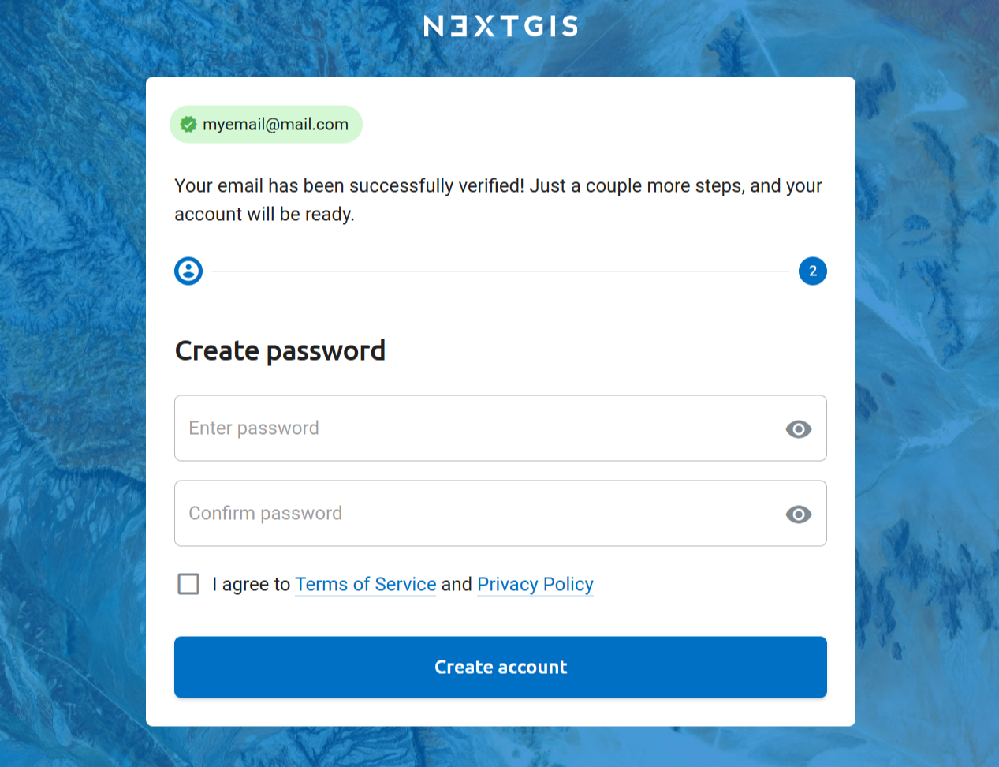

   Account creation: password

.. note:: Also you can create a NextGIS ID by signing in with your Google account.

After clicking the **Create account** button you'll be redirected to the page where you can `create a Web GIS <https://docs.nextgis.com/docs_ngcom/source/create_webgis.html>`_.

   
.. warning::

   You will not be able to create Web GIS and access other NextGIS services until you confirm your email address.

To verify your email account click **Create Web GIS** button, then click **Send the email again** link in the "Please confirm your E-mail" window (see :numref:`confirm_email_pic`).  Check your email, you should receive a letter with an account confirmation link.  When you receive the letter, click on the link to confirm your email address. 

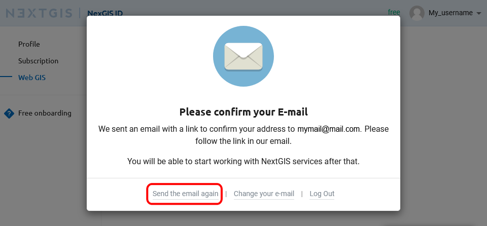

   “Please confirm your E-mail” window

.. _ngcom_ngid_login:

Sign-in via NextGIS ID
-------------------

NextGIS ID is used to log in to your `account profile <https://my.nextgis.com>`_, your Web GIS, `Toolbox <https://toolbox.nextgis.com/>`_ and other NextGIS services (see `full list below <https://docs.nextgis.com/docs_ngcom/source/create.html#ngcom-ngid-use>`_).

After selecting sign-in with NextGIS ID, you'll be redirected to the following page:

.. figure:: _static/ngid_signup_signin_en.png
   :name: ngid_login_pic
   :align: center
   :width: 16cm  

   Signing in with NextGIS

Enter the email address you used for creating your account and press **Continue**. On the next page enter the password and press **Sign in**.

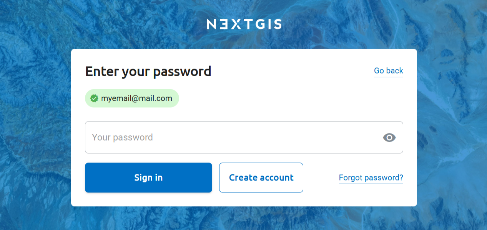

   Entering password

The process of logging in varies depending on particular software and services, see `Where can I use NextGIS ID <https://docs.nextgis.com/docs_ngcom/source/create.html#ngcom-ngid-use>`_.

.. _ngcom_ngid_my:

My account
--------------

After logging in to your `account <https://my.nextgis.com/profile>`_ you can:

* Modify your personal information, including `password <https://docs.nextgis.com/docs_ngcom/source/create.html#ngcom-ngid-change-password>`_ ;
* Manage your subscription;
* `Create a Web GIS <https://docs.nextgis.com/docs_ngcom/source/create_webgis.html>`_ (after confirming your email address);
* Download NextGIS software installers;
* View `the list of teams <https://docs.nextgis.com/docs_ngcom/source/teams.html#ngcom-team-view>`_ that you are a member of; 
* `Manage your team <https://docs.nextgis.com/docs_ngcom/source/teams.html#ngcom-team-management>`_ (available on `Premium <https://nextgis.com/pricing-base/>`_);
* Bind NGID on-premise identifier.

.. _ngcom_ngid_profile:

Profile
~~~~~~~~

You'll find your profile on https://my.nextgis.com/profile.

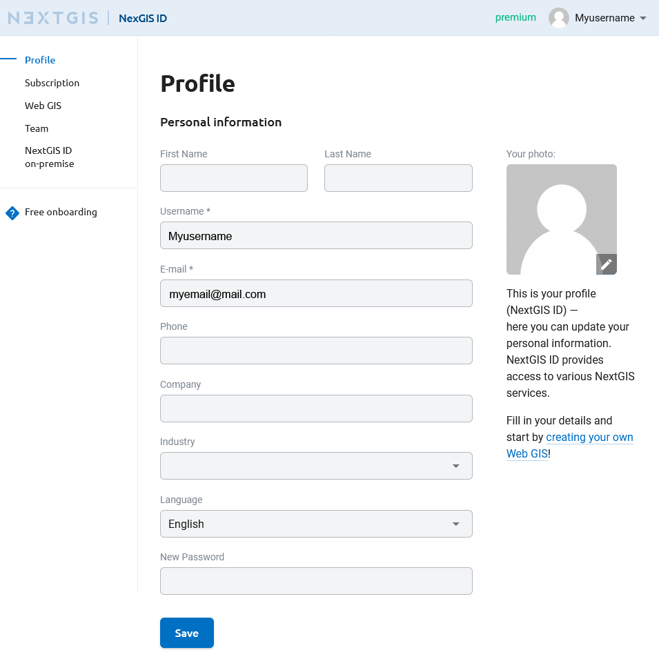
  
   Profile page at nextgis.com

On the Profile page you can:

* `Change your NextGIS ID password <https://docs.nextgis.com/docs_ngcom/source/create.html#ngcom-ngid-change-password>`_.
* Change your username or enter name and surname to be displayed instead of it.
* Add company and industry info and phone number.
* Select language of the account interface. This setting affects only my.nextgis.com. If you want to choose the language of your Web GIS, go to the `user menu <https://docs.nextgis.com/docs_ngweb/source/admin_interface.html#ngw-change-lang>`_ of the Web GIS.
* Add Telegram account to get notifications.
* Export your account data as CSV files.
* Delete NextGIS ID account and personal data associated with it.

.. _ngcom_ngid_profile_del:

Delete profile
~~~~~~~~~~~~~~~~

To delete your account, go to the Profile page and in the "Profile management" section select **Delete profile**.

Your account and personal data will be deleted. 

.. important:: This action cannot be undone.

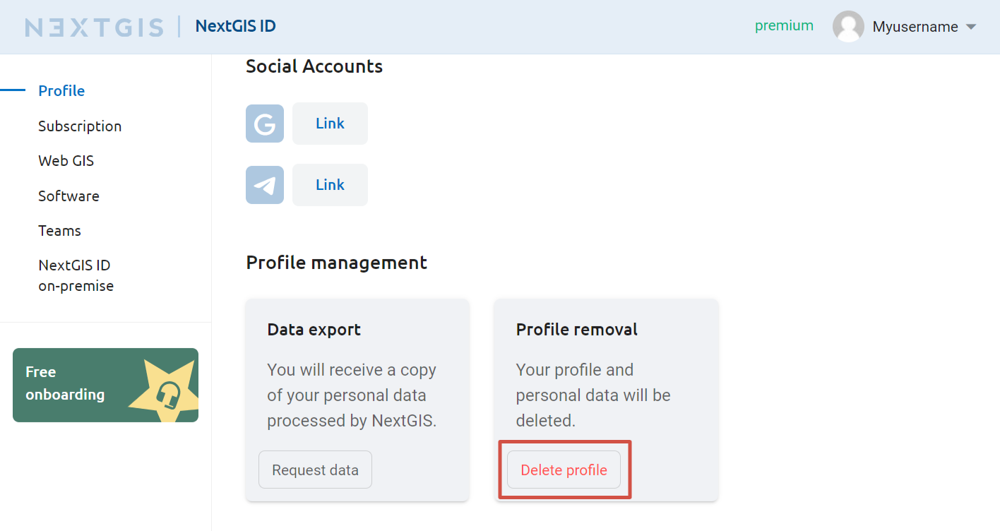

   Deleting account

.. _ngcom_ngid_change_password:

Change NextGIS ID password
~~~~~~~~~~~~~~~~~~~~~~~~~~~~~

To change the password for the NextGIS ID account, go to the `profile settings <https://my.nextgis.com/profile>`_ and set a new password (see :numref:`ngid_change_pass`).

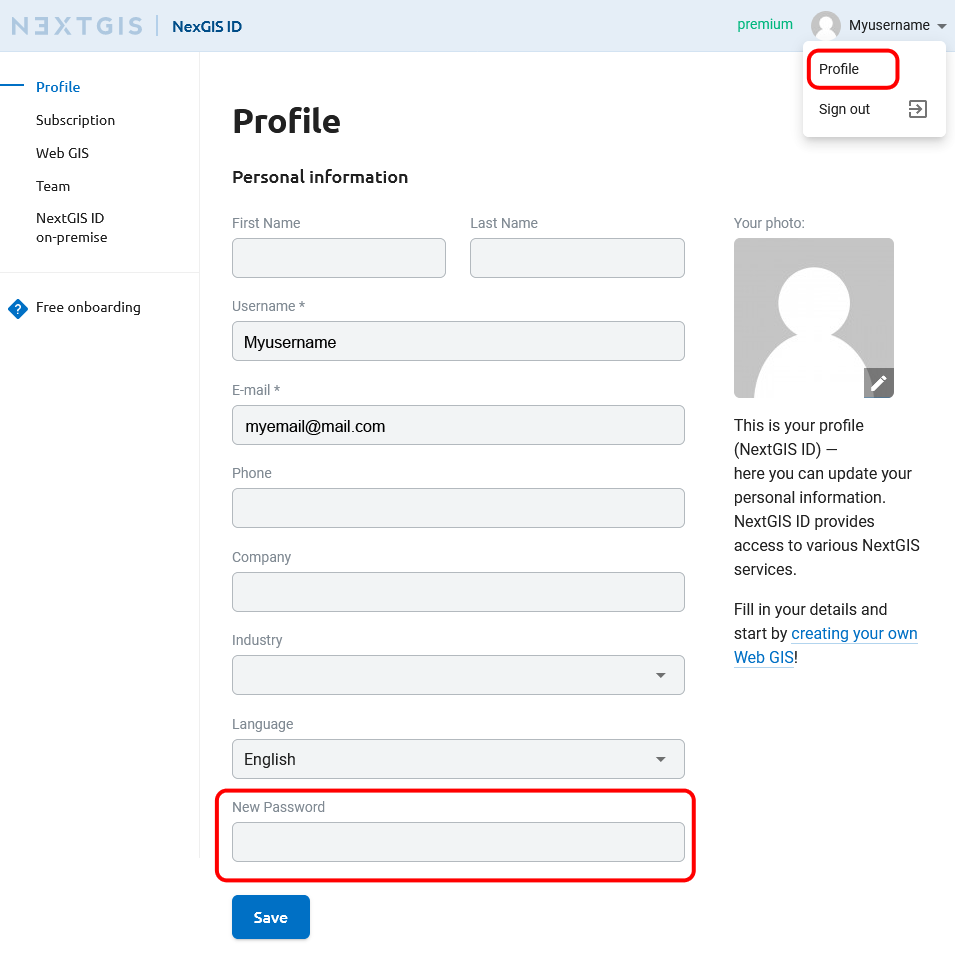

   Changing NextGIS ID password

.. _ngcom_ngid_telegram:

Get notifications in Telegram messenger
~~~~~~~~~~~~~~~~~~~~~~~~~~~~~~~~~~~~~~~~

Add Telegram account to get notifications about orders you made on `NextGIS Data <https://data.nextgis.com/en/>`_ not just by email (where they may get into spam folder), but also in Telegram. You can also download the data directly from the messenger.

In your `Profile <https://my.nextgis.com/profile>`_ go to the "Social Accounts" section and click **Link** by the Telegram logo. You'll be redirected to the chat bot. Press **Start** to complete linking.

.. _ngcom_ngid_download:

Software
~~~~~~~~~~

On the Software page of your account you can download online and offline installers for NextGIS mobile apps  `NextGIS Collector <https://docs.nextgis.com/docs_collector/source/auth.html#>`_, `NextGIS Mobile <https://docs.nextgis.com/docs_ngmobile/source/auth.html#>`_, `NextGIS Tracker <https://docs.nextgis.com/docs_ngtracker/source/setting_up.html#ngtr-set-send>`_.

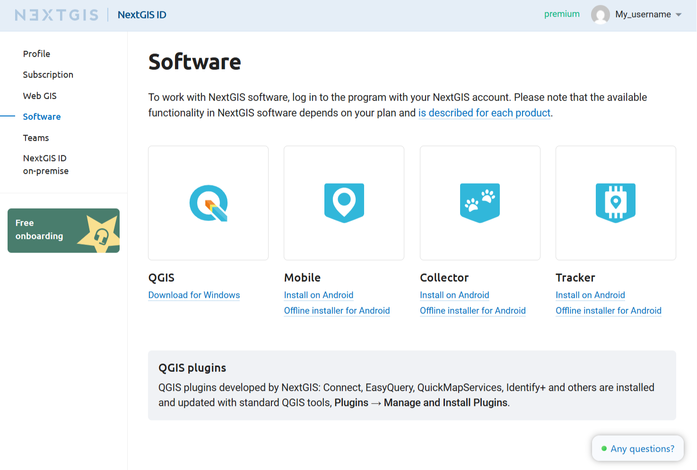

   Software download page

.. _ngcom_ngid_use:

Where can I use NextGIS ID
------------------------------

Cloud services (For on-premise services use `NextGIS ID on-premise <https://docs.nextgis.com/docs_ngid/source/index.html>`_)

* Web GIS created on NextGIS Web

To create a Web GIS, go to your `account <https://docs.nextgis.com/docs_ngcom/source/create_webgis.html>`__.

You can use NGID to `log in <https://docs.nextgis.com/docs_ngweb/source/admin_interface.html#ngw-admin-login>`_ to your own Web GIS or the Web GIS of the `team owner <https://docs.nextgis.com/docs_ngcom/source/teams.html>`_, if you are added to the team.

* `Toolbox <https://docs.nextgis.com/docs_toolbox_prem/source/auth.html#>`_
* `GeoServices <https://docs.nextgis.com/docs_geoservices/source/auth.html#>`_
* `QuckMapServices <https://qms.nextgis.com/about>`_

* Download data ordered on `NextGIS Data <https://data.nextgis.com/en/>`_

Mobile apps

* `NextGIS Collector <https://docs.nextgis.com/docs_collector/source/auth.html#>`_
* `NextGIS Mobile <https://docs.nextgis.com/docs_ngmobile/source/auth.html#>`_
* `NextGIS Tracker <https://docs.nextgis.com/docs_ngtracker/source/setting_up.html#ngtr-set-send>`_

Desktop apps

* `NextGIS QGIS <https://docs.nextgis.com/docs_ngqgis/source/auth.html#>`_
* `Formbuilder <https://docs.nextgis.com/docs_formbuilder/source/gui.html#ngfb-auth>`_

QGIS plugins

* `NextGIS Connect <https://docs.nextgis.com/docs_ngconnect/source/ngc_install.html#ng-connect-new-connection>`_
* `Rosreestr Tools <https://docs.nextgis.com/docs_rosreestr_tools/source/rosreestrintro.html#ngq-rr-auth>`_

