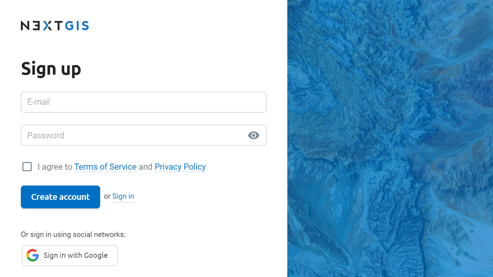
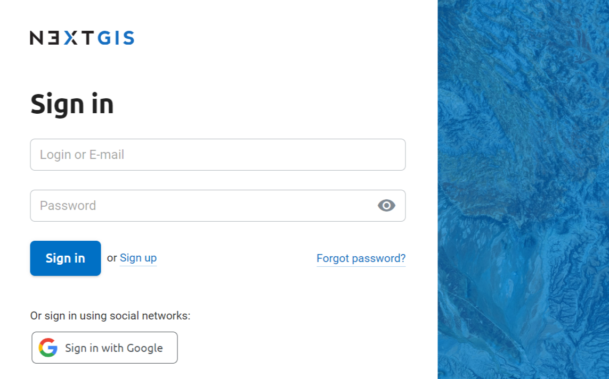

.. _ngcom_create:

How to create account (NextGIS ID)
================================================

.. _ngcom_create_account:

How to create account (NextGIS ID)
-----------------------------------

Before you can start working with your :ref:`Web GIS <ngcom_description>` you need to create an account (NextGIS ID). NextGIS ID is required to access all NextGIS Services, including Web GIS service.

In order to create an account click `here <https://my.nextgis.com/signup/?next=/webgis/>`_ or press **"Create Web GIS"** button on the main page of nextgis.com website (see :numref:`NextGIS_main_page_pic`): 

.. figure:: _static/NextGIS_main_page.png
   :name: NextGIS_main_page_pic
   :align: center
   :width: 16cm    

   nextgis.com main page  

A sign-up form will open, where you need to fill in E-mail and Password fields, agree to `Terms of Service <http://nextgis.com/terms>`_ and `Privacy Policy <http://nextgis.com/privacy>`_, аnd click **"Create account"** button (see :numref:`signup_form_pic`):

   Sign-up form
      
.. note::

   You can also create an account by authorising with your existing social media account.
   
After you click the **"Create account"** button, your Profile page will open where you can fill in your personal information, select language of the interface and change your password. In case you made an error during sign-up, you can also change your email address in the profile. To apply changes press **"Save"** (see :numref:`profile_pic`): 

.. figure:: _static/Profile_en.png
   :name: profile_pic
   :align: center
   :width: 16cm    
  
   Profile page at nextgis.com

Check your email, you should receive a letter with an account confirmation link. When you receive the letter, click on the link to confirm your email address.

.. warning::

   You will not be able to create Web GIS until you confirm your email address.
   
In case you don't receive this letter in 10-15 minutes, click **"Create Web GIS"** button,  then click "Send the email again" link in the "Please confirm your E-mail" window (see :numref:`confirm_email_pic`). 
   
.. figure:: _static/Confirm_email_en.png
   :name: confirm_email_pic
   :align: center
   :width: 16cm    

   "Please confirm your E-mail" window

.. _ngcom_ngid_login:

Sign-in via NextGIS ID
-----------------------

After selecting sign-in with NextGIS ID, you'll be redirected to the following page:

   Signing in with NextGIS

Enter the email address you used for creating your account and your password, then press **Sign in**. 

.. _ngcom_ngid_profile:

Profile
-------------

You'll find your profile on https://my.nextgis.com/profile.

Here you can:

* Modify your personal information;
* Manage your subscription;
* `Create a Web GIS <https://docs.nextgis.com/docs_ngcom/source/create_webgis.html>`_ (after confirming your email address);
* Download NextGIS software installers;
* View `the list of teams <https://docs.nextgis.com/docs_ngcom/source/teams.html#ngcom-team-view>`_ that you are a member of; * `Manage your team <https://docs.nextgis.com/docs_ngcom/source/teams.html#ngcom-team-management>`_ (available on `Premium <https://nextgis.com/pricing-base/>`_);
* Bind NGID on-premise identifier.

.. _ngcom_ngid_change_password:

How to change NextGIS ID password
---------------------------------

To change the password for the NextGIS ID account, go to the profile settings https://my.nextgis.com/profile and set a new password (см. :numref:`ngid_change_pass_en`).

.. figure:: _static/ngid_change_pass_en_2.png
   :name: ngid_change_pass_en
   :align: center
   :width: 16cm    

   Changing password NextGIS ID

