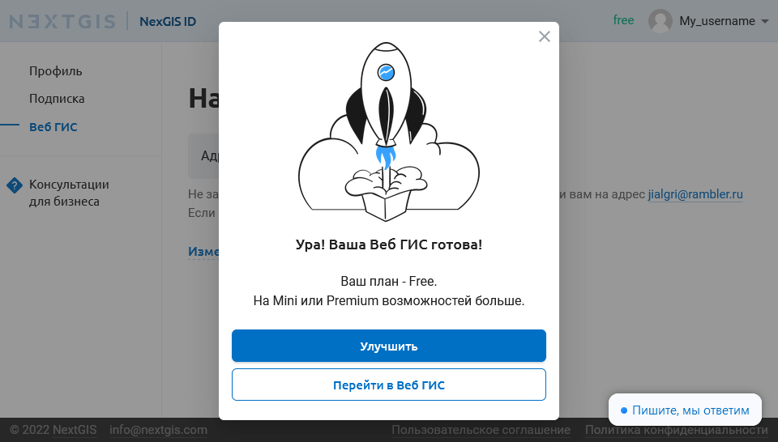

.. _ngcom_create:

Создание аккаунта и Вeб ГИС
===========================

.. _ngcom_create_account:

Создание аккаунта (NextGIS ID)
-------------------------------

До работы с любыми сервисами и ПО NextGIS, включая :ref:`Веб ГИС <ngcom_description>`, необходимо создать аккаунт (NextGIS ID).

Для создания аккаунта необходимо пройти по `ссылке <https://my.nextgis.com/signup/?next=/webgis/>`_ или нажать на 
кнопку **"Создать Веб ГИС"** на главной странице сайта nextgis.ru (см. :numref:`NextGIS_main_page_pic`): 

.. figure:: _static/NextGIS_main_page.png
   :name: NextGIS_main_page_pic
   :align: center
   :width: 16cm

   Главная страница сайта nextgis.ru.

Откроется форма регистрации аккаунта, в которой необходимо заполнить поля E-mail и Пароль, подтвердить согласие с `Пользовательским соглашением <http://nextgis.ru/terms>`_ и `Политикой конфиденциальности NextGIS <http://nextgis.ru/privacy>`_, а затем нажать на кнопку **"Создать аккаунт"** (см. :numref:`signup_form_pic`)

.. figure:: _static/Signup_form.png
   :name: signup_form_pic
   :align: center
   :width: 16cm    

   Форма регистрации аккаунта.

.. note::

   Аккаунт можно также создать, авторизовавшись через социальные сети, в которых вы зарегистрированы.

После нажатия кнопки **"Создать аккаунт"** откроется страница личного кабинета с данными вашего профиля, в котором вы можете заполнить данные о себе, выбрать язык интерфейса и изменить пароль своего аккаунта. 
Также через профиль можно изменить адрес электронной почты, если в нем была допущена ошибка.
Для применения любых изменений нажмите кнопку **"Сохранить"** (см. :numref:`profile_pic`): 

.. figure:: _static/Profile_ru.png
   :name: profile_pic
   :align: center
   :width: 16cm    
  
   Страница профиля в личном кабинете NextGIS.
   
Проверьте свою электронную почту - на указанный в форме регистрации e-mail должно прийти письмо со ссылкой для его подтверждения. Получив письмо, перейдите по ссылке для подтверждения адреса электронной почты. 

.. warning::

   Для аккаунтов с неподтвержденным адресом электронной почты создание Веб ГИС недоступно.

В том случае, если письмо не пришло в течение 10-15 минут, нажмите **"Создать Веб ГИС"**, и на экране появится уведомление о необходимости подтверждения адреса электронной почты (см. :numref:`confirm_email_pic`), в котором следует выбрать **"Выслать письмо еще раз"**.

   Уведомление о необходимости подтверждения e-mail.

.. _ngcom_ngid_change_password:

Изменение пароля NextGIS ID
---------------------------

Чтобы изменить пароль учетной записи NextGIS ID, нужно перейти в настройки профиля https://my.nextgis.com/profile и установить новый пароль (см. :numref:`ngid_change_pass`).

   Изменения пароля NextGIS ID

.. _ngcom_create_webgis:

Создание Веб ГИС
-----------------

Завершив создание аккаунта, вы можете приступить к созданию вашей Веб ГИС.

Для создания Веб ГИС необходимо заполнить форму, в которой назначается адрес вашей Веб ГИС, а также выбрать центр обработки данных.

   Форма создания Веб ГИС.

Закончив заполнять форму, нажмите на кнопку **"Создать Веб ГИС"**.
Появится сообщение о том, что Веб ГИС находится в процессе создания (см. :numref:`WebGIS_creation_2_pic`): 

   Создание Веб ГИС.

Когда процесс создания завершится, появится уведомление, из которого вы можете открыть вновь созданную Веб ГИС или перейти на страницу улучшения `тарифного плана <http://nextgis.ru/nextgis-com/plans>`_ (см. :numref:`WebGIS_creation_3_pic`):
 

   Сообщение о завершении создания Веб ГИС.

На вашу электронную почту придет письмо с логином и паролем для авторизации в Веб ГИС.
После того как Веб ГИС будет создана, внешний вид страницы "Настройки Веб ГИС" в вашем личном кабинете изменится: на ней появится ссылка на вашу Веб ГИС и поле изменения пароля для Веб ГИС (см. :numref:`WebGIS_settings_pic`):

   Страница "Настройки Веб ГИС"

Для перехода в Веб ГИС воспользуйтесь ссылкой на странице "Настройки Веб ГИС". Откроется окно с Основной группой ресурсов (см. :numref:`WebGIS_main_guest_pic`): 

   Окно "Основная группа ресурсов"
      

.. _ngcom_webgis_signin:

Вход в Веб ГИС
--------------

Для начала работы с Веб ГИС следует авторизоваться в ней, нажав кнопку **"Войти"** в правом верхнем углу.

   
   Вход с главной страницы Веб ГИС

В открывшемся диалоговом окне нажмите синюю кнопку "Войти через NextGIS ID".

   
   Выбор входа по NextGIS ID

Вы будете перенаправлены на страницу авторизации my.nextgis.com. Введите имя пользователя или емейл, использованный при регистрации аккаунта, и пароль. 

   
   Страница входа NextGIS ID

После успешной авторизации вы будете возвращены на страницу Веб ГИС.

.. _ngcom_main_menu:

Главное меню
------------

Красным прямоугольником выделена кнопка вызова меню, в котором содержатся команды "Ресурсы", "Панель управления" (только у пользователей плана "Премиум") и "Справка".

.. figure:: _static/WebGIS_main_ru.png
   :name: WebGIS_main_pic
   :align: center
   :width: 16cm    

   Вызов главного меню

Если у вас возникнут вопросы по работе с Веб ГИС, можно воспользоваться командой "Справка". 

.. figure:: _static/WebGIS_menu_ru.png
   :name: WebGIS_menu_pic
   :align: center
   :width: 16cm    

   Меню Веб ГИС с командой "Справка".

После выбора команды "Справка" откроется страница со ссылками на документацию, правовые документы и контактную информацию NextGIS (см. :numref:`help_pic`): 

.. figure:: _static/Help_ru.png
   :name: help_pic
   :align: center
   :width: 16cm     

   Страница "Помощь".
   

.. _ngcom_team_management:

Управление командой
-------------------

.. warning::
   Данный функционал доступен только для пользователей плана `Premium <http://nextgis.ru/nextgis-com/plans>`_.
   

В соответствии с тарифными планами nextgis.com владелец Premium аккаунта имеет возможность дать доступ к Pro-функциям `NextGIS QGIS <https://nextgis.ru/nextgis-qgis#pro>`_, `Mobile <https://nextgis.ru/nextgis-mobile#pro>`_ и `Formbuilder <https://nextgis.ru/nextgis-formbuilder#pro>`_ еще 4 пользователям, у которых есть NextGIS ID.

Механизм управления командой позволяет добавить в свою команду любого пользователя NextGIS по его никнейму. Управление командой доступно через личный кабинет на https://my.nextgis.com/teammanage в разделе “Команда” (см. :numref:`Team_on_panel`).

.. figure:: _static/Team_on_panel_ru.png
   :name: Team_on_panel
   :align: center
   :width: 7cm    

   Раздел “Команда” в левой панели Личного кабинета
   
По умолчанию в команде уже находится администратор, который приобрел подписку на Premium (см. :numref:`First_administrator`). Он имеет возможность добавить новых пользователей, нажав кнопку **“Добавить”** и найдя их по никнейму NextGIS ID (см. :numref:`list_users`). Пользователи должны быть уже зарегистрированы на my.nextgis.com. Логин пользователя можно увидеть в его профиле на https://my.nextgis.com/. Если пользователь забыл свой логин и не может войти в профиль, он должен восстановить `доступ <https://docs.nextgis.ru/docs_ngcom/source/faq_webgis.html#nextgis-id>`_.

   Состав команды по умолчанию (только администратор)
   
   
.. figure:: _static/list_users.png
   :name: list_users
   :align: center
   :width: 14cm    

   Добавление пользователя
   
   
Каждый добавленный пользователь появится в списке (см. :numref:`all_users`). В любой момент пользователя можно удалить и/или заменить на другого, если достигнут доступный по тарифу лимит на размер команды (см. :numref:`limit_users`)

   Список пользователей, добавленных в команду
   
   
.. figure:: _static/limit_users.png
   :name: limit_users
   :align: center
   :width: 12cm    

   Сообщение о превышении лимита пользователей в команде

.. _ngcom_auth_id_webgis:

Авторизация в Веб ГИС через NextGIS ID в облаке
-----------------------------------------------

Участник, только что добавленный в `команду <https://docs.nextgis.ru/docs_ngcom/source/create.html#ngcom-team-management>`_ не становится автоматически `пользователем Веб ГИС <https://docs.nextgis.ru/docs_ngweb/source/admin_tasks.html#id5>`_. Чтобы попасть в Веб ГИС пользователь должен в ней авторизоваться.

По умолчанию новый пользователь Веб ГИС не имеет никаких прав. Задайте категорию прав для участников своей команды перед первой авторизацией.
Есть два способа, как можно это сделать:

* Предпочтительный способ - назначить права для какой-либо `группы пользователей <https://docs.nextgis.ru/docs_ngweb/source/admin_tasks.html#ngw-create-group>`_, установив флаг “Новые пользователи”. Пользователь будет включен в эту группу при первом входе в Веб ГИС.
* Альтернативный способ - назначать права на ресурсы для субъекта “Прошедший проверку”.
