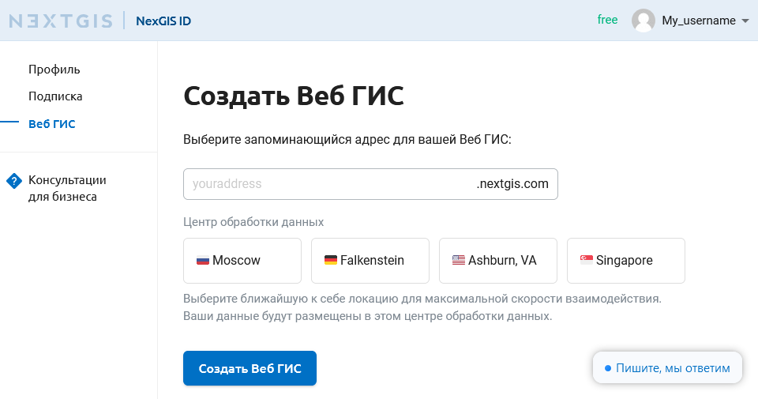
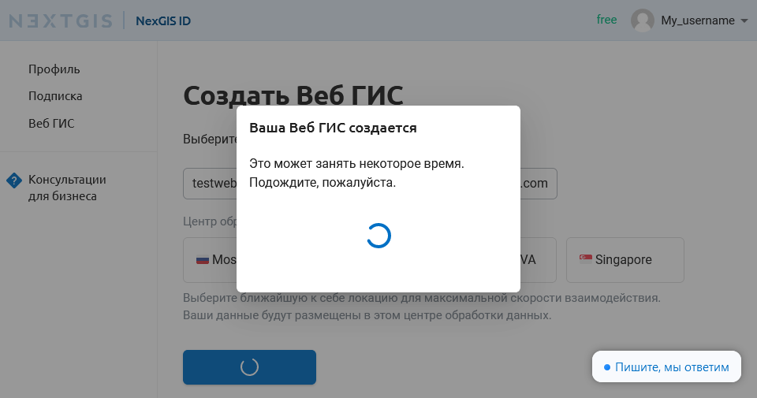
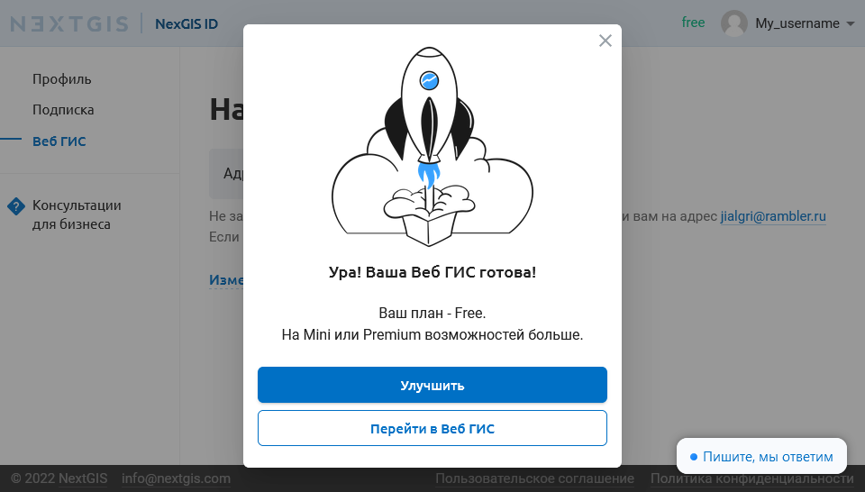
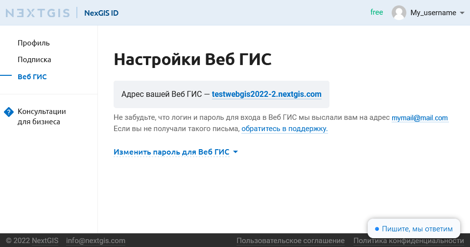
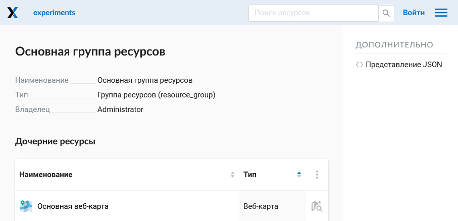
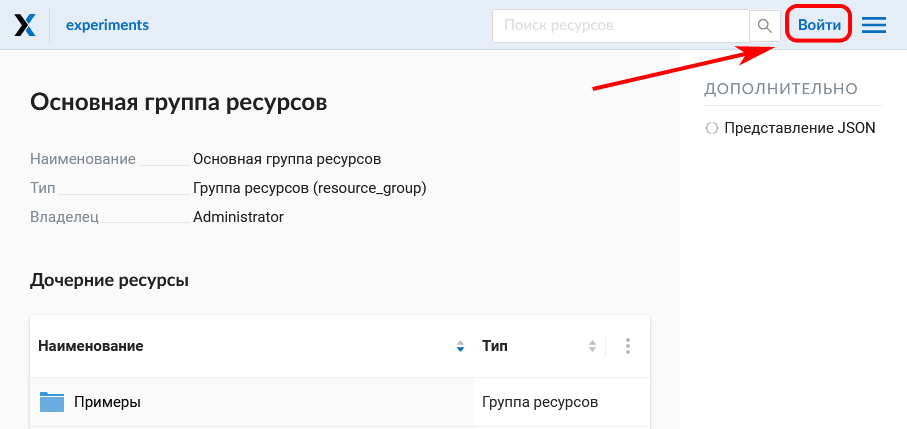
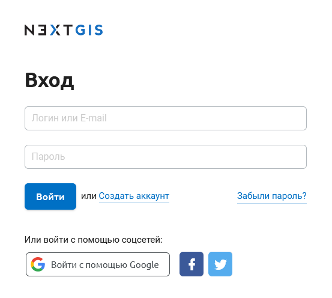
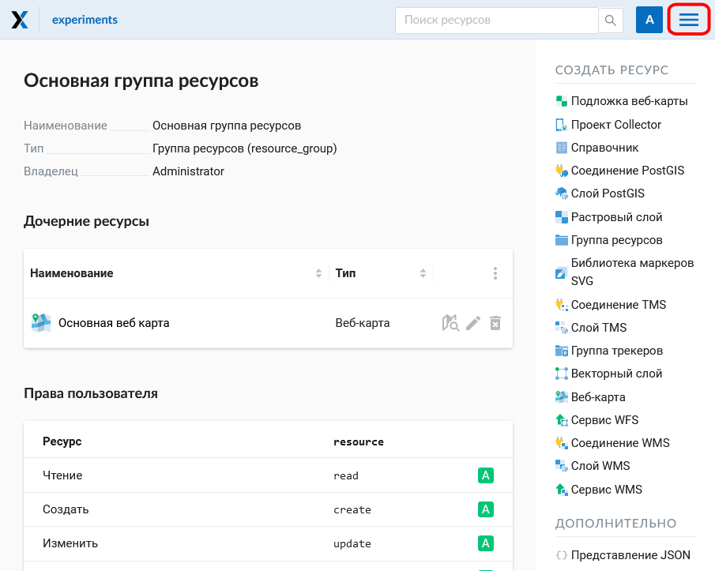
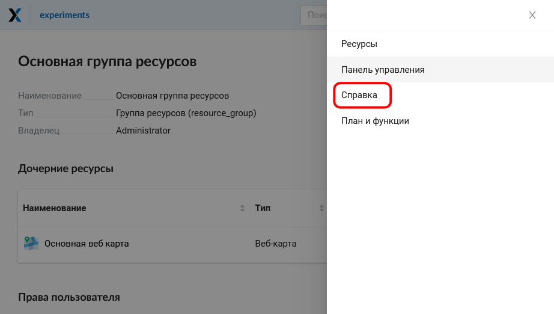
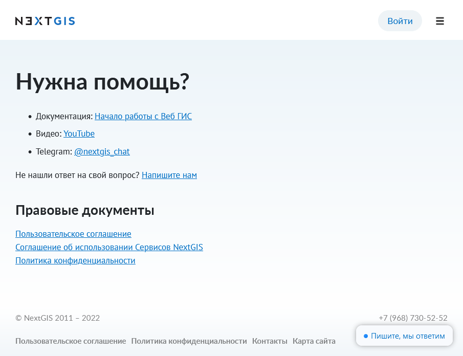

.. _ngcom_create_webgis:

Создание Веб ГИС
==================

Завершив создание аккаунта, вы можете приступить к созданию вашей Веб ГИС.

Для создания Веб ГИС необходимо заполнить форму, в которой назначается адрес вашей Веб ГИС, а также выбрать центр обработки данных.

   Форма создания Веб ГИС.

Закончив заполнять форму, нажмите на кнопку **"Создать Веб ГИС"**.
Появится сообщение о том, что Веб ГИС находится в процессе создания (см. :numref:`WebGIS_creation_2_pic`): 

   Создание Веб ГИС.

Когда процесс создания завершится, появится уведомление, из которого вы можете открыть вновь созданную Веб ГИС или перейти на страницу улучшения `тарифного плана <http://nextgis.ru/nextgis-com/plans>`_ (см. :numref:`WebGIS_creation_3_pic`):
 

   Сообщение о завершении создания Веб ГИС.

После того как Веб ГИС будет создана, внешний вид страницы "Настройки Веб ГИС" в вашем личном кабинете изменится: на ней появится ссылка на вашу Веб ГИС (см. :numref:`WebGIS_settings_pic`):

   Страница "Настройки Веб ГИС"

Для перехода в Веб ГИС воспользуйтесь ссылкой на странице "Настройки Веб ГИС". Откроется окно с Основной группой ресурсов (см. :numref:`WebGIS_main_guest_pic`): 

   Окно "Основная группа ресурсов"
      

.. _ngcom_webgis_signin:

Вход в Веб ГИС
--------------

Для начала работы с Веб ГИС следует авторизоваться в ней, нажав кнопку **"Войти"** в правом верхнем углу.

   
   Вход с главной страницы Веб ГИС

В открывшемся диалоговом окне нажмите синюю кнопку "Войти через NextGIS ID".

.. figure:: _static/ngweb_signin_nextgisid_ru.png
   :name: ngweb_signin_nextgisid_pic
   :align: center
   :width: 16cm
   
   Выбор входа по NextGIS ID

Вы будете перенаправлены на страницу авторизации my.nextgis.com. Введите имя пользователя или емейл, использованный при регистрации аккаунта, и пароль. 

   
   Страница входа NextGIS ID

После успешной авторизации вы будете возвращены на страницу Веб ГИС.

Подробное описание функционала Веб ГИС вы найдёте `здесь <https://docs.nextgis.ru/docs_ngweb/source/index.html>`_.

.. _ngcom_main_menu:

Главное меню
------------

Красным прямоугольником выделена кнопка вызова меню, в котором содержатся команды "Ресурсы", "Панель управления" (только у пользователей плана "Премиум") и "Справка".

   Вызов главного меню

Если у вас возникнут вопросы по работе с Веб ГИС, можно воспользоваться командой "Справка". 

   Меню Веб ГИС с командой "Справка".

После выбора команды "Справка" откроется страница со ссылками на документацию, правовые документы и контактную информацию NextGIS (см. :numref:`help_pic`): 

   Страница "Помощь".
   
