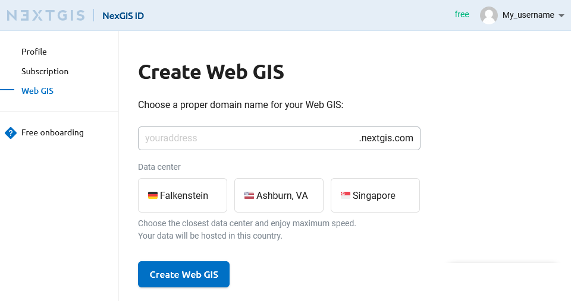
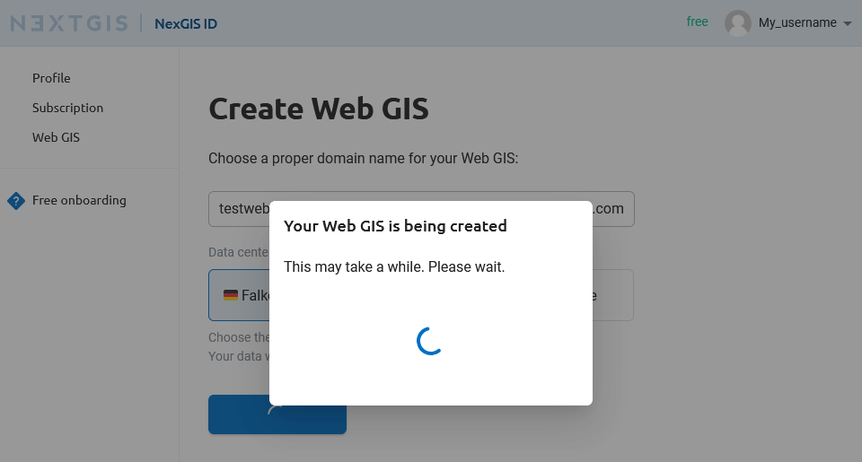
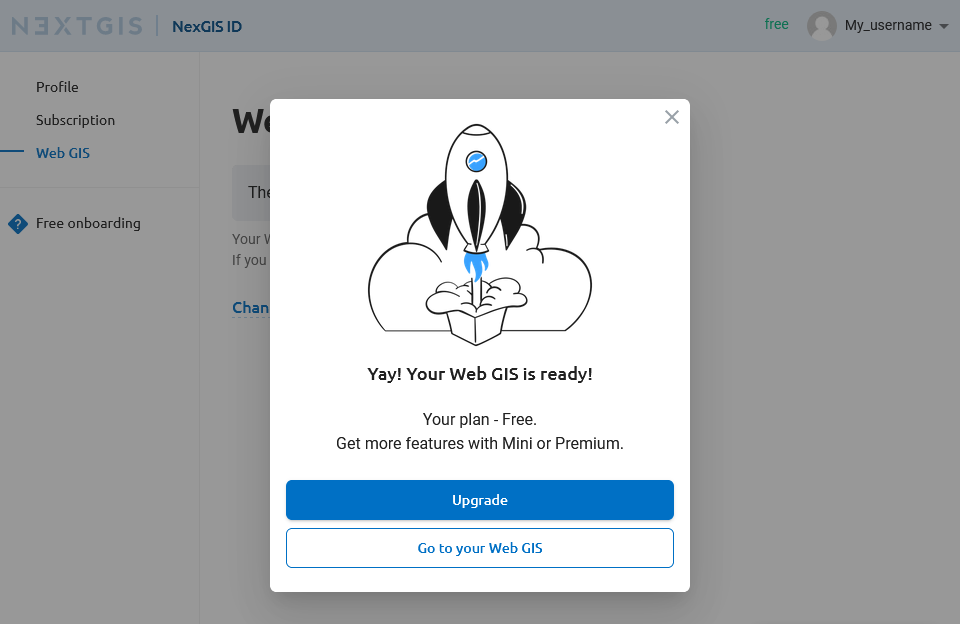
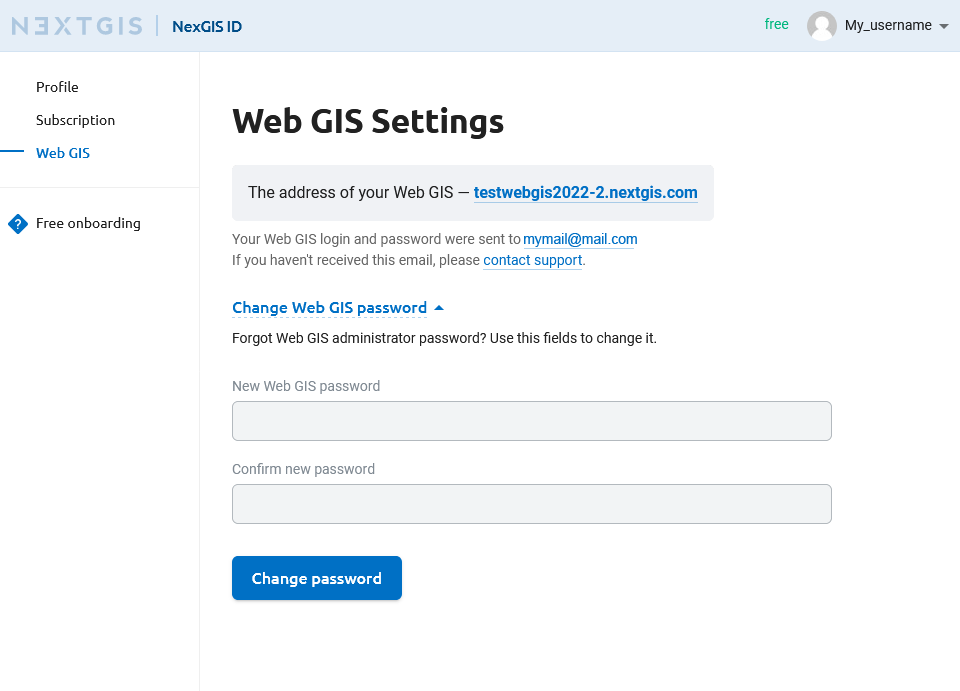
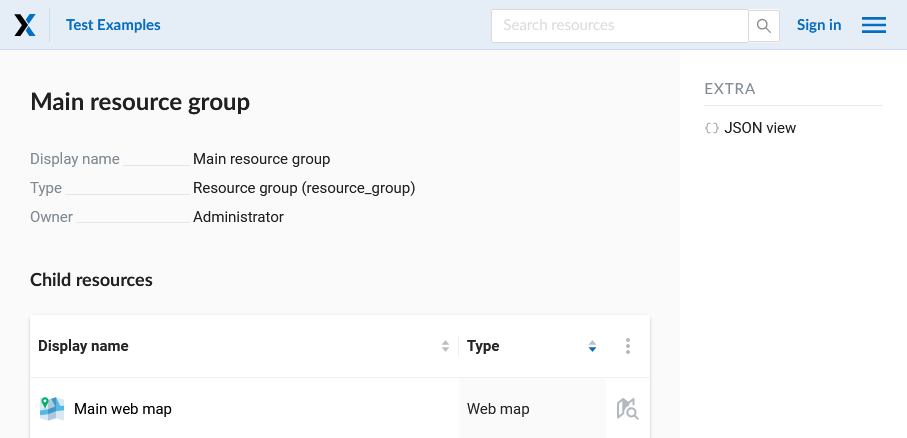
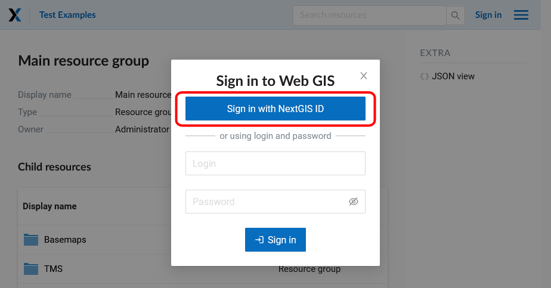
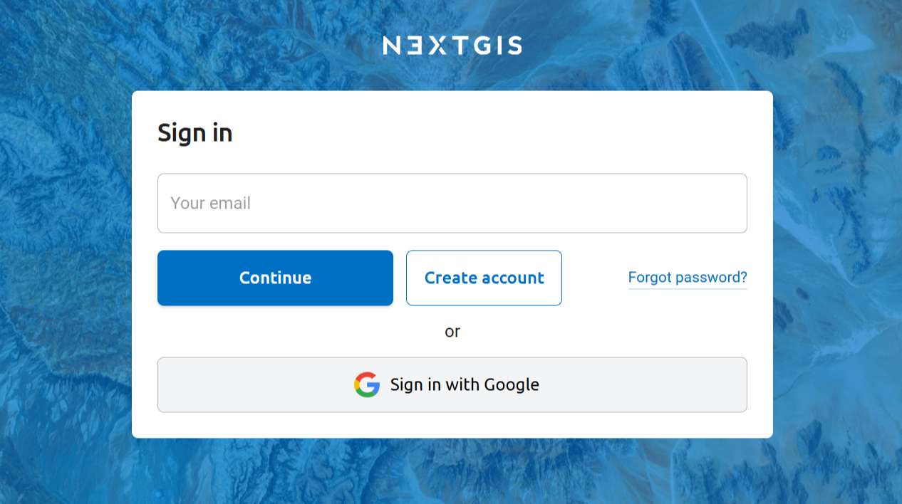
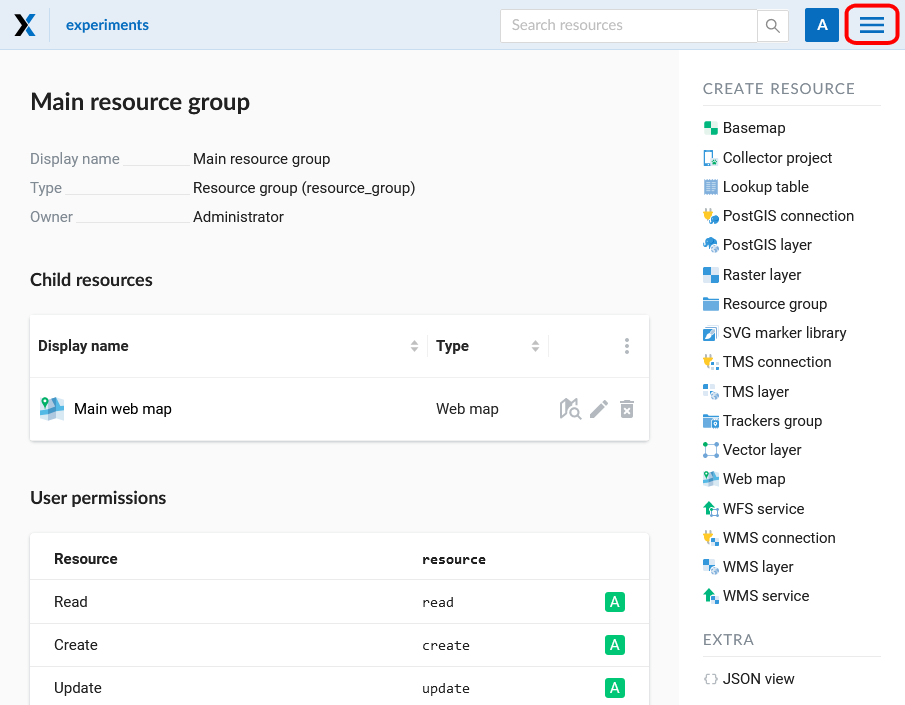
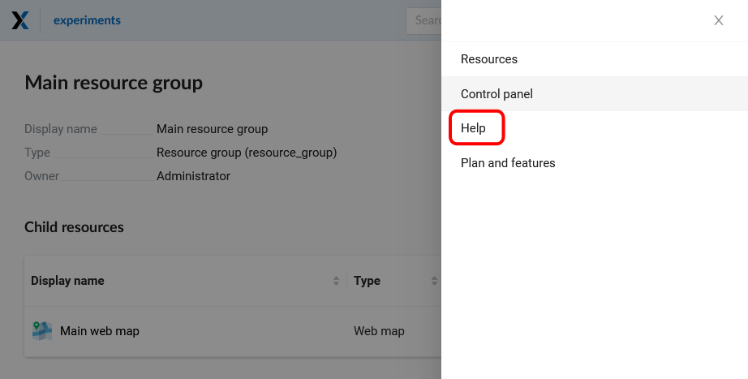
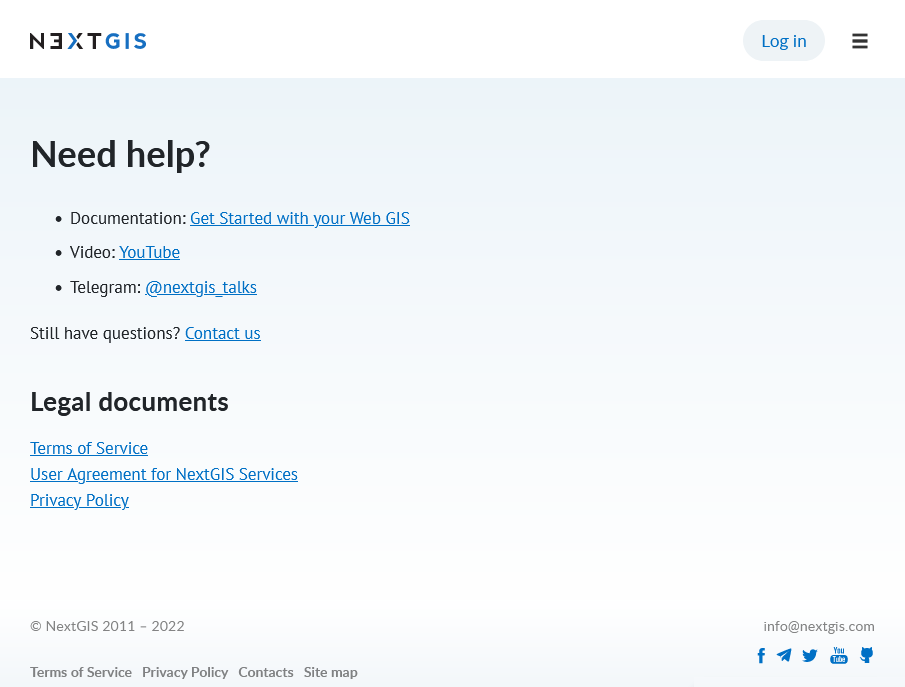

.. _ngcom_create_webgis:

How to create Web GIS
=======================

After you've successfully created your account you can start creating your Web GIS.

To create Web GIS you need to complete a Web GIS creation form by indicating domain name (URL) and selecting a data center (see :numref:`WebGIS_creation_1_pic`): 

   Web GIS creation form

After you finish completing all required fields, press **"Create Web GIS"** button. A message will apear informing you that your Web GIS is being created (see :numref:`WebGIS_creation_2_pic`): 

   Web GIS creation
   
When the creation process is complete, a message will appear. From this message you can open your newly created Web GIS or upgrade your `Plan <http://nextgis.com/nextgis-com/plans>`_ (see :numref:`WebGIS_creation_3_pic`):

   Message announcing successful Web GIS creation

You'll receive an email with your Web GIS login and password. After your Web GIS is created, the outlook of the "Web GIS Settings" page will change: it will contain your Web GIS address and fields for changing your Web GIS password (see :numref:`WebGIS_settings_pic`): 

   "Web GIS Settings" page

To open your Web GIS click the link on the "Web GIS Settings" page. Web GIS Main resource group will open (see :numref:`WebGIS_main_pic`): 

   
   Window of the Main resource group

.. _ngcom_webgis_signin:

How to sign in to your Web GIS
------------------------------

To start working in your Web GIS, first sign in using a **"Sign in"** button in the upper right corner.

.. figure:: _static/ngweb_before_signin_en.png
   :name: webgis_before_signin_pic
   :align: center
   :width: 16cm
   
   Signing in from Web GIS main page

In the opened dialog press the green button that reads "Sign in with NextGIS ID".

   
   Selecting sign-in via NextGIS

You will be redirected to my.nextgis.com authorization page. Enter your username or email you used for registration, then on the next page enter your password. 

   
   Signing in with NextGIS

After the authorization is completed successfully you will be redirected back to the Web GIS.

.. _ngcom_main_menu:

Main menu
---------

A red rectangle indicates a menu containing "Resources", "Control panel" (only for Premium users) and "Help" sections.

   Main resource group
   
If you have questions about your Web GIS, you can go to the "Help" section of the menu. 

   Web GIS menu with "Help" button

"Help" page with links to user documentation, legal documents and NextGIS contact information will open (see :numref:`help_pic`): 

   "Help" page
   
