.. _ngcom_data_edit:

.. _nextgis.com: http://nextgis.com/

Как редактировать данные
=====================================

.. note::
    Описываемая в данном разделе функциональность доступна в Веб ГИС, созданной с помощью сервиса nextgis.com_ и находящейся на тарифном плане `Премиум <http://nextgis.ru/pricing/#premium/>`_

:ref:`Веб ГИС <ngcom_description>` позволяет редактировать объекты на карте, атрибуты, а также добавлять описания и вложения (в том числе фотографии) отдельных объектов в :ref:`Векторных слоях <ngcom_vector_layer>` и :ref:`Слоях PostGIS <ngcom_postgis_layer>`.

Настройка прав доступа к редактированию
----------------------------------------

По умолчанию редактирование веб-карты всегда отключено. Чтобы пользователь смог вносить изменения в слои на карте, редактирование нужно включить в настройках веб-карты. Изменить доступность возможности редактирования можно в окне "Обновить ресурс" Веб-карты. Как открыть это окно, описано в разделе :ref:`Обновление ресурса <ngw_update_resource>` документации NextGIS Web.
На вкладке "Настройки" можно разрешить или запретить редактирование всех слоев карты, поставив или сняв галочку напротив опции «Разрешить редактирование слоев» (см. :numref:`webmap_allow_editting`), соответственно:

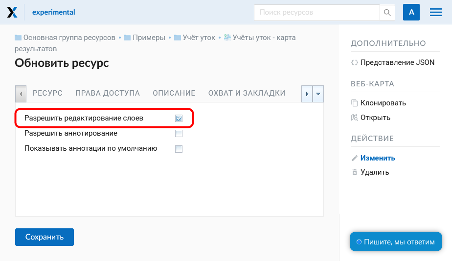

   Опция «Разрешить редактирование слоев»

.. note:: 
	По умолчанию редактирование слоев отключено.
	
Для того, чтобы запретить редактирование определенных слоев отдельным пользователям, на вкладке «Права доступа» окна "Обновить ресурс" необходимо добавить правило, которое запретит записывать данные (право «Данные: Запись») определенному пользователю или группе пользователей (см. :numref:`webmap_forbid_editting`). Если у человека недостаточно прав, он не сможет перейти в режим редактирования.

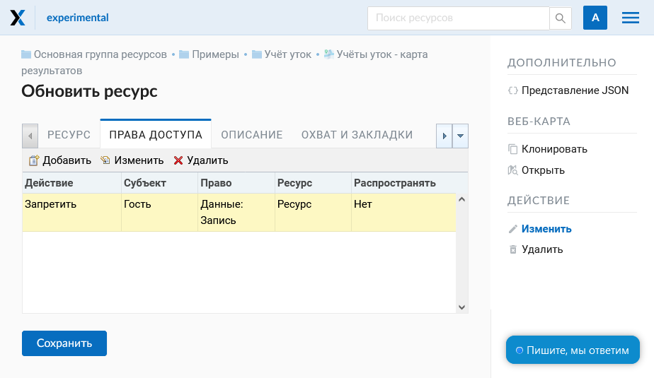

   Изменение прав доступа к редактированию для отдельных пользователей
	
.. _ngcom_data_edit_objects:

Редактирование объекта через Веб-карту
--------------------------------------

1. Откройте :ref:`Веб-карту <ngcom_webmap_create>` и выделите слой, в котором находится редактируемый объект.
2. Откройте выпадающее меню, нажав на кнопку "Слой" (см. :numref:`webmap_edit`), и поставьте галочку напротив пункта "Редактирование".

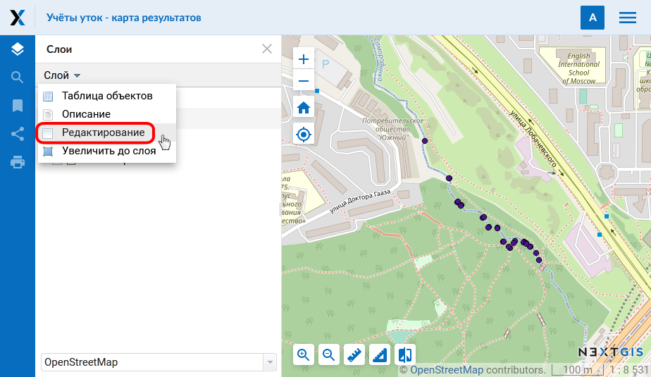

   Меню "Слой".

3. На Веб-карте появится панель инструментов, позволяющая провести редактирование (см. :numref:`webmap_edit_panel`):

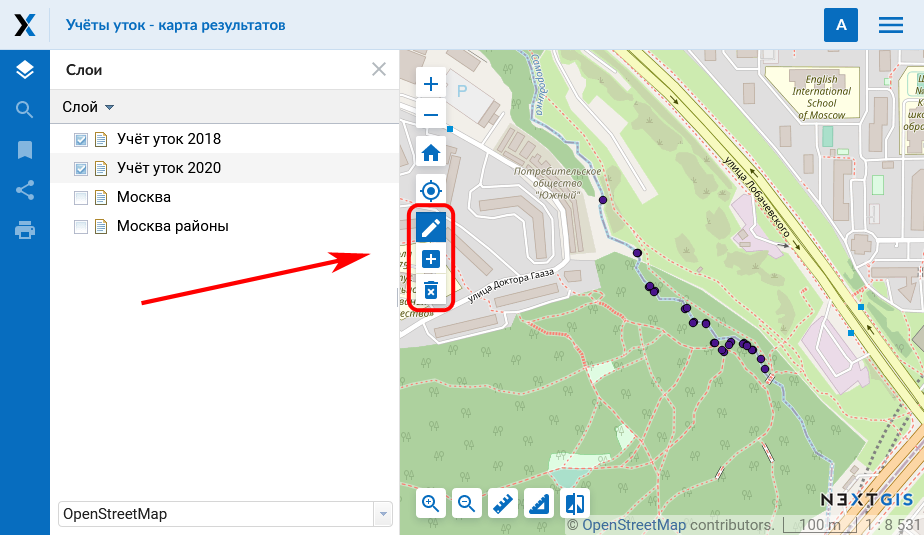

   Панель инструментов для редактирования
   
Создание нового объекта (точка, линия, полигон)
~~~~~~~~~~~~~~~~~~~~~~~~~~~~~~~~~~~~~~~~~~~~~~~~

1. На панели инструментов для редактирования нажмите кнопку "Создать объекты" (иконка с белым крестиком на синем поле, см. :numref:`webmap_create_objects`):

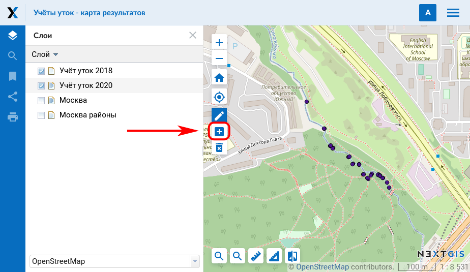

   Кнопка "Создать объекты" на панели инструментов для редактирования

2. Возле курсора мыши появится синий кружок, с помощью которого можно добавлять новые объекты. Щелкните в том месте карты, где необходимо создать новый объект. Можно добавить несколько новых объектов подряд. При создании линии необходимо щелчками на карте указать положение ее начала и конца. При создании полигона каждый последующий щелок будет указывать положение очередного его узла, чтобы завершить создание полигона, необходимо щелкнуть по его начальной точке. При создании узлов будет работать прилипание.
3. Для того, чтобы завершить создание новых объектов, нажмите на кнопку "Слой" (см. :numref:`webmap_edit`), и снимите галочку напротив пункта "Редактирование".
4. Откроется диалоговое окно, в котором необходимо выбрать, сохранять ли внесенные изменения, не сохранять или остаться в режиме редактирования:

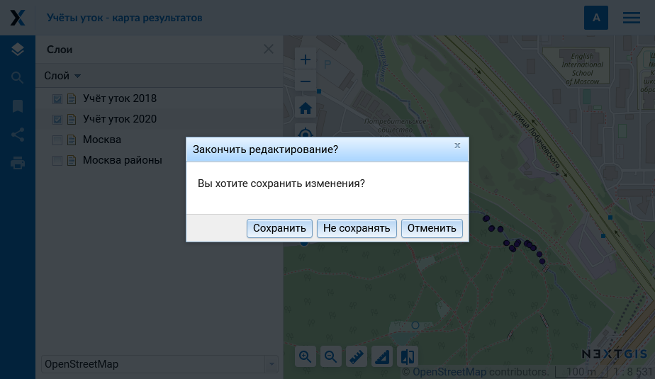

   Диалоговое окно завершения редактирования

Удаление объекта
~~~~~~~~~~~~~~~~

1. На панели инструментов для редактирования нажмите кнопку "Удалить объекты" (иконка с корзиной, см. :numref:`webmap_delete_objects`):

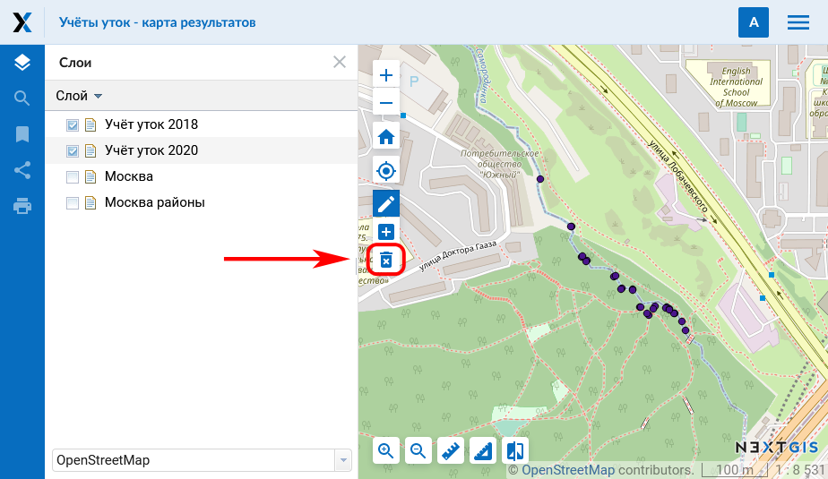

   Кнопка "Удалить объекты" на панели инструментов для редактирования

2. Объекты, положение которых можно изменить, изменят интенсивность цвета на более слабую. Курсор превратится в черный крестик.

3. Выберите на карте объекты, которые хотите удалить, щелкнув по ним курсором мыши. Выбранные объекты снова станут темными.

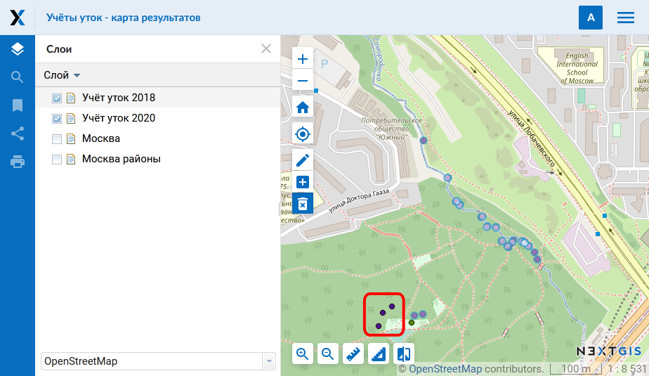
   
   Слой с фиолетовыми маркерами активен. Рамкой показаны точки, выбранные для удаления
   
4. Нажмите на кнопку "Слой" (см. :numref:`webmap_edit`), и снимите галочку напротив пункта "Редактирование".
5. Откроется диалоговое окно, в котором необходимо выбрать "Сохранить", чтобы завершить процесс удаления (см. :numref:`webmap_finish_edit`).

Изменение положения объекта или его узлов
~~~~~~~~~~~~~~~~~~~~~~~~~~~~~~~~~~~~~~~~~~~

1. Убедитесь, что на панели инструментов для редактирования нажмата кнопка "Изменить объекты" (иконка с карандашом, она активна по умолчанию при переходе в режим редактировния, см. :numref:`webmap_change_objects`):

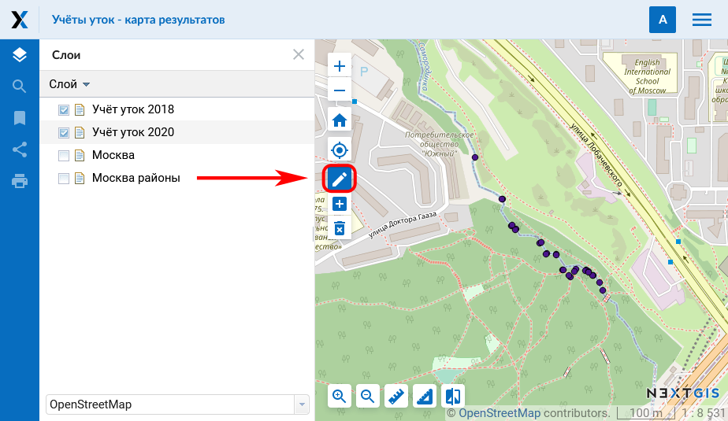

   Кнопка "Изменить объекты" на панели инструментов для редактирования

2. Объекты, положение которых можно изменить, изменят интенсивность цвета на более слабую.
3. Наведите курсор на объект (точка) или один из его узлов (линия, полигон) и переместите его, зажав левую кнопку мыши и отпустив ее на новом месте. При изменении узлов будет работать прилипание.

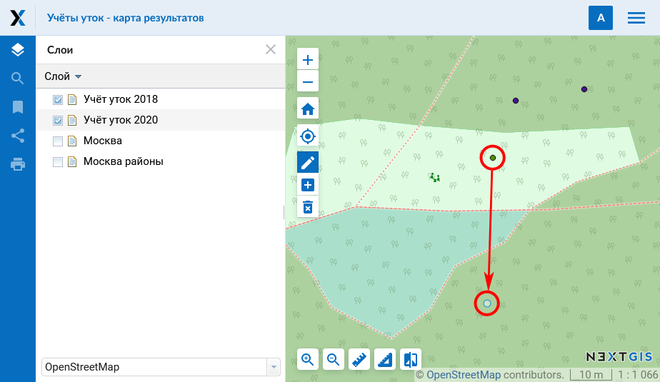
   
   Перемещение точки. До завершения редактирования на карте отображается одновременно старое и новое положение выбранной точки

4. Нажмите на кнопку "Слой" (см. :numref:`webmap_edit`), и снимите галочку напротив пункта "Редактирование".
5. Откроется диалоговое окно, в котором необходимо выбрать "Сохранить", чтобы завершить процесс изменения (см. :numref:`webmap_finish_edit`).

.. note:: 
	Одновременно можно редактировать несколько слоев. Для этого необходимо зайти в режим редактирования в каждом слое, который нужно изменить. Прилипание в этом случае будет работать к объектам всех редактируемых слоев.
	

Редактирование атрибутов объекта
--------------------------------

Редактировать атрибуты объекта можно двумя способами: 
1) через форму редактирования объекта в :ref:`Таблице объектов <ngw_feature_table>` или 
2) через форму редактирования объекта в :ref:`веб-клиенте <ngw_webmaps_client>` Веб-карты (если слой, в котором находится редактируемый объект, добавлен на :ref:`Веб-карту <ngcom_webmap_create>`).

.. _ngcom_data_edit_table:

Редактирование атрибутов объекта через Таблицу объектов
~~~~~~~~~~~~~~~~~~~~~~~~~~~~~~~~~~~~~~~~~~~~~~~~~~~~~~~~

#. Откройте окно свойств Векторного слоя или Слоя PostGIS;
#. Выберите :menuselection:`Векторный слой --> Таблица объектов` на правой панели :ref:`веб-интерфейса <ngw_admin_interface>` Веб ГИС;
#. В открывшейся таблице выберите объект, который вы хотите отредактировать (при необходимости воспользуйтесь поиском объекта по атрибутам с помощью поля :guilabel:`Поиск`), и нажмите кнопку :guilabel:`Редактировать`;
#. В открывшейся форме отредактируйте значения атрибутов объекта на вкладке :guilabel:`Атрибуты`, добавьте описание и вложения на вкладках :guilabel:`Описание` и :guilabel:`Вложения` соответственно.
#. Нажмите кнопку :guilabel:`Сохранить`. Если атрибуты, описание и вложения успешно сохранены, то их можно будет просмотреть, выбрав объект в :ref:`Таблице объектов <ngw_feature_table>` и нажав кнопку :guilabel:`Открыть`.

.. _ngcom_data_edit_webmap:

Редактирование атрибутов объекта через Веб-карту
~~~~~~~~~~~~~~~~~~~~~~~~~~~~~~~~~~~~~~~~~~~~~~~~~

1. Откройте :ref:`Веб-карту <ngcom_webmap_create>` и включите видимость слоя, в котором находится редактируемый объект;
2. Найдите объект на Веб-карте (при необходимости воспользуйтесь поиском объекта по атрибутам с помощью строки поиска в Панели инструментов или в :ref:`Таблице объектов <ngw_feature_table>`, открыть которую можно через меню :guilabel:`Слой` в верхнем левом углу веб-клиента Веб-карты. Быстро перейти к объекту на карте из Таблицы объектов можно с помощью кнопки :guilabel:`Перейти`);
3. Кликните по объекту. В открывшемся окне с описанием свойств объекта нажмите кнопку :guilabel:`Редактировать` (см. :numref:`webgis_change_attr`);

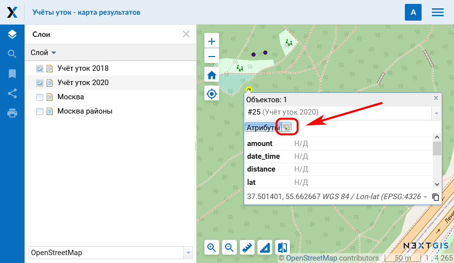
   
   Иконка редактирования в окне свойств объекта

4. В открывшейся форме отредактируйте значения атрибутов объекта на вкладке :guilabel:`Атрибуты`, добавьте описание и вложения на вкладках :guilabel:`Описание` и :guilabel:`Вложения` соответственно;

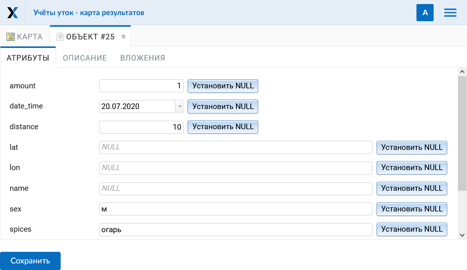
   
   Редактирование атрибутов объекта

5. Нажмите кнопку :guilabel:`Сохранить`. Если атрибуты, описание и вложения успешно сохранены, то их можно будет просмотреть через Веб-карту, щелкнув по объекту инструментом идентификации, или через Таблицу объектов, нажав кнопку :guilabel:`Открыть`.

.. note:: 
	Измененные атрибуты объектов Слоев PostGIS сохраняются во внешней базе :term:`PostGIS`. Атрибуты объектов Векторных слоев, описания и вложения объектов Векторных слоев и Слоев PostGIS сохраняются в вашей Веб ГИС.

.. note:: 
	Вы также можете редактировать **геометрии и атрибуты** объектов в Векторных слоях :ref:`с помощью настольного приложения QGIS <ngcom_ngqgis_connect_data_edit>`.
