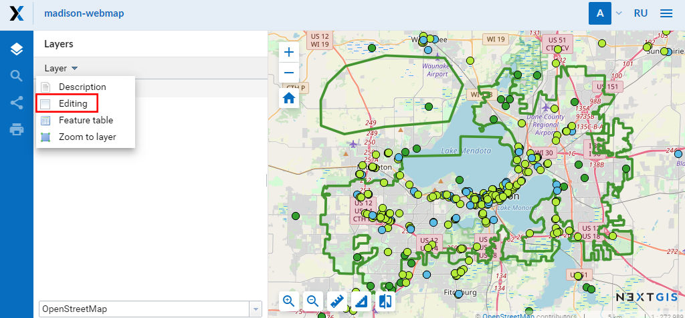
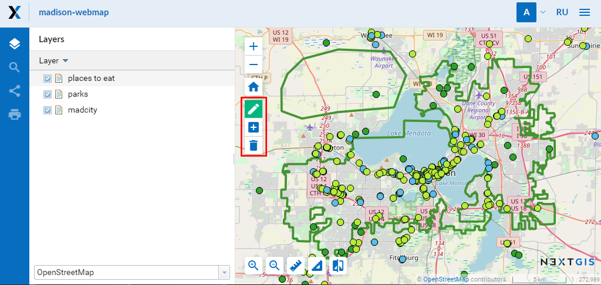
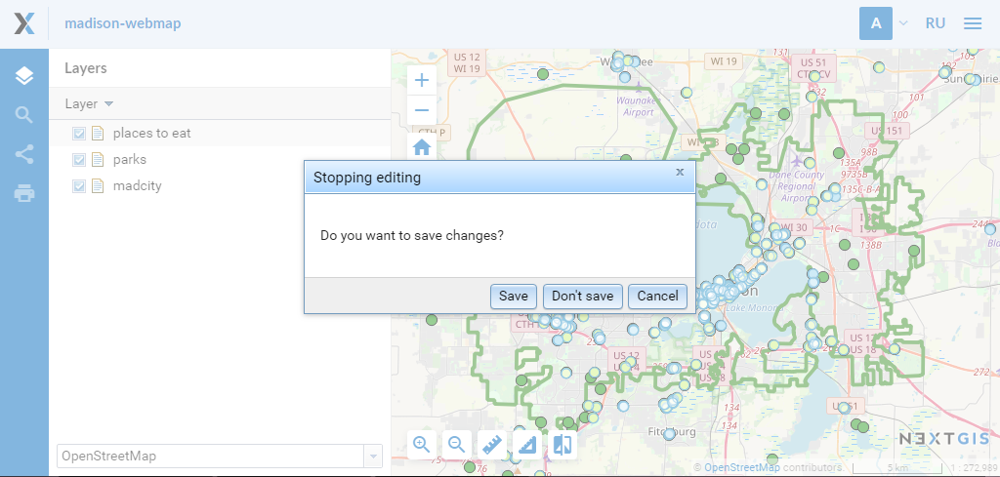
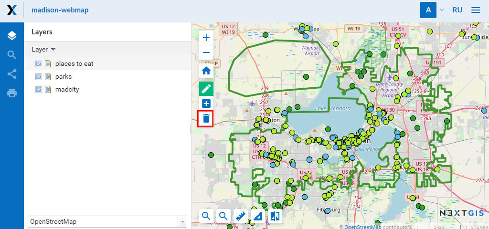
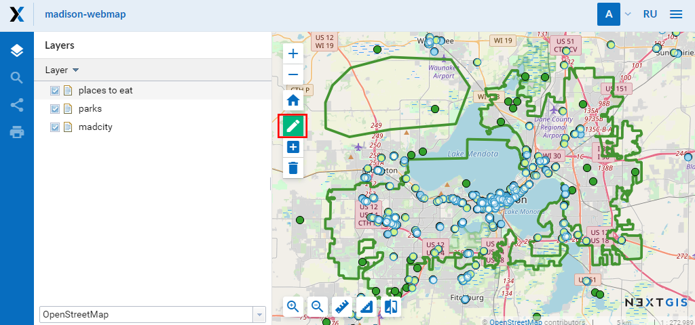
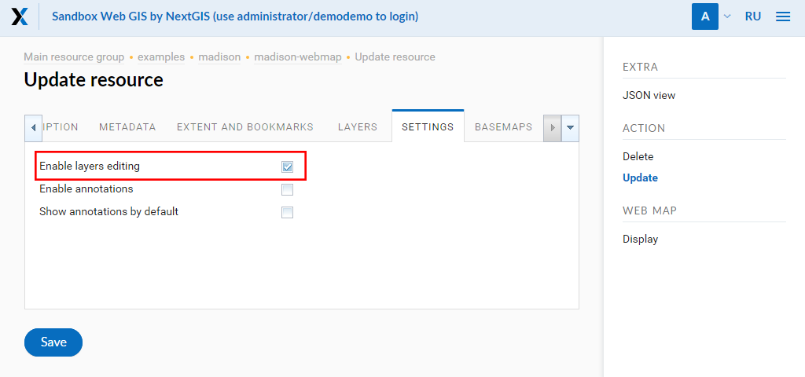
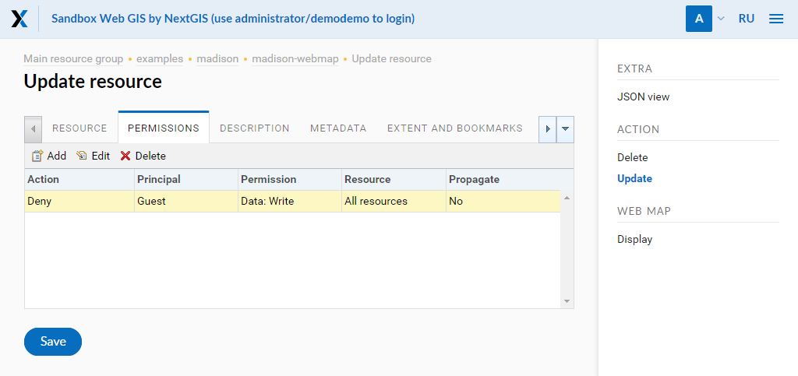

.. _ngcom_data_edit:

How to edit data
=====================================
	
.. note:: 
	You can use described functionality in Web GIS created in nextgis.com service on `Premium plan <http://nextgis.com/pricing/#premium/>`_
	
:ref:`Web GIS <ngcom_description>` allows to edit objects, attributes and add descriptions and attachments (including photos) of separate features in :ref:`Vector layers <ngcom_vector_layer>` and :ref:`PostGIS layers <ngcom_postgis_layer>`.

.. _ngcom_data_edit_objects:

Edit a feature on a Web map
----------------------------

1. Open :ref:`Web map <ngcom_webmap_create>` and select the layer with an feature you need to edit.
2. Open dropdown menu pressing "Layer" button (see :numref:`webmap_edit`) and tick a box next to "Editing" field.

   "Layer" menu.

3. Editing toolbar will appear on a Web map (see :numref:`webmap_edit_panel`):

   Editing toolbar.
   
Create a new feature (point, line, polygon)
~~~~~~~~~~~~~~~~~~~~~~~~~~~~~~~~~~~~~~~~~~

1. On the editing toolbar activate "Create features" button (it will be highlighted in green, see :numref:`webmap_create_objects`):

   "Create features" button on the editing toolbar.

2. A blue circle will appear nearby a mouse pointer, with it you can add new features. Click on the map, where you can create a new feature. You can add several new features one after another. While creating a line you need to indicate its start and end points by clicking on a map. While creating a polygon each new click on a map will indicate its new vertice, to finish a polygon you need to click on its start point. During vertices adding an adhesion will work.
3. To finish new features creation press "Layer" button (see :numref:`webmap_edit`) and clear a tick box next to "Editing" field.
4. In opened dialog select "Save", if you want to save changes, select "Don't save", if you do not want to save them or "Cancel", if you want to stay in the edit mode:

   Dialog window of finishing edits.

Delete a feature
~~~~~~~~~~~~~~~~

1. On the editing toolbar activate "Delete features" button (it will be highlighted in green, :numref:`webmap_delete_objects`):

   "Delete features" button on the editing toolbar.

2. Select features you would like to delete by clicking on them with a left button of a mouse.
3. Press "Layer" button (see :numref:`webmap_edit`) and clear a tick box next to "Editing" field.
4. In opened dialog select "Save" (see :numref:`webmap_finish_edit`).

Modify a feature
~~~~~~~~~~~~~~~~~

1. Make sure that on the editing toolbar "Modify features" button is active (it is active by default when you enter the edit mode, see :numref:`webmap_change_objects`):

   "Modify features" button on the editing toolbar.

2. Features you can modify will reduce their color intensity.
3. Select a feature (point) or one of its vertices (line, polygon) with a mouse pointer and holding it with a left button of a mouse change its location,  then release on a new place. During vertices modifying an adhesion will work.
4. Press "Layer" button (see :numref:`webmap_edit`) and clear a tick box next to "Editing" field.
5. In opened dialog select "Save" (see :numref:`webmap_finish_edit`).

.. note:: 
	You can edit several layers simultaneously. To do it enter the edit mode in every layer you want to edit. An adhesion will work for features of all editing layers.
	
Setting of permission for editing
-----------------------------------

You can change permission for editing in "Update resource" dialog of a Web map. You can find how to enter it in :ref:`Update resource <ngw_update_resource>` of NextGIS Web documentation.
You can allow or deny editing of all map layers on the "Settings" tab by ticking or clearing a box next to "Enable layers editing" field (see :numref:`webmap_allow_editting`):

   "Enable layers editing" field.

.. note:: 
	By default a box next to "Enable layers editing" field is clear.
	
To forbid some users editing of separate layers add a rule to deny separate users data writing (permission "Data:Write")on "Permissions" tab of "Update resorce" dialog (see :numref:`webmap_forbid_editting`). If user does not have a permission, he cannot enter the edit mode.

   Changes of editing permission for separate users.

Edit feature's attributes
----------------------

There 2 ways to edit feature's attributes: 
1) using edit form in :ref:`Feature table <ngw_feature_table>` or
2) using edit form in Web map :ref:`web client <ngw_webmaps_client>` (if the relevant layer is added to :ref:`Web map <ngcom_webmap_create>`).

.. _ngcom_data_edit_table:

Edit attributes using Feature table
~~~~~~~~~~~~~~~~~~~~~~~~~~~~~~~~~~~

#. Open the Properties page of :ref:`Vector layer <ngcom_vector_layer>` or :ref:`PostGIS layer <ngcom_postgis_layer>`;
#. Select :menuselection:`Vector layer --> Feature table` on the right side of Web GIS :ref:`admin console <ngw_admin_interface>`;
#. In the opened dialog window select a feature you want to edit (if necessary search it by its attributes using :guilabel:`Search` bar) and press :guilabel:`Edit` button;
#. In the opened form edit feature attributes values in :guilabel:`Attributes` tab, add description and attachments in :guilabel:`Description` and :guilabel:`Attachments` tabs;
#. Press :guilabel:`Save` button. If attributes, description and attachments are saved successfully you'll be able to view them by selecting the feature in Feature table and pressing :guilabel:`Open` button.

.. _ngcom_data_edit_webmap:

Edit attributes using Web map
~~~~~~~~~~~~~~~~~~~~~~~~~~~~~

#. Open :ref:`Web map <ngcom_webmap_create>` and switch on the visibility of the relevant layer;
#. Find a feature on the Web map (if necessary search it by its attributes using :guilabel:`Search` bar in the Toolbar or in :ref:`Feature table <ngw_feature_table>` which can be opened via :guilabel:`Layer` dropdown menu in the upper left corner of Web map web client. You can quickly find the selected feature on Web map using :guilabel:`Go to` button in Feature table);
#. Click on the feature with :ref:`identify tool <ngw_webmaps_client_tools>`. In the opened dialog window with feature properties press :guilabel:`Edit` button;
#. In the opened form edit feature attributes values in :guilabel:`Attributes` tab, add description and attachments in :guilabel:`Description` and :guilabel:`Attachments` tabs;
#. Press :guilabel:`Save` button. If attributes, description and attachments are saved successfully you'll be able to view them on Web map by clicking on the feature with identify tool, or by selecting the feature in Feature table and pressing :guilabel:`Open` button.

.. note:: 
	Updated attributes in PostGIS layers are saved directly to external :term:`PostGIS` database. Updated attributes in Vector layers, as well as descriptions and attachments in Vector layers and PostGIS layers are saved to your Web GIS.

.. note:: 
	You can also edit **geometries and attributes** of Vector layers features :ref:`with desktop app NextGIS QGIS <ngcom_ngqgis_connect_data_edit>`.

	Read more on data editing :ref:`here <ngw_attributes_edit>`.

How to delete data from Web GIS read :ref:`here <ngcom_resource_delete>`.
