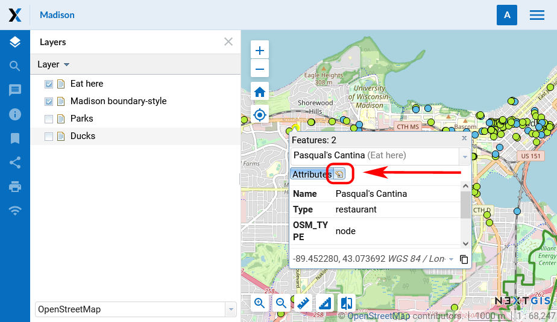

.. _ngcom_data_edit:

.. _nextgis.com: http://nextgis.com/

How to edit data
=====================================
	
.. note:: 
	You can use described functionality in Web GIS created in nextgis.com_ service on `Premium plan <http://nextgis.com/pricing/#premium/>`_
	
:ref:`Web GIS <ngcom_description>` allows to edit objects and their attributes and to add descriptions and attachments (including photos) of features in :ref:`Vector layers <ngcom_vector_layer>` and :ref:`PostGIS layers <ngcom_postgis_layer>`.

.. _ngcom_data_edit_allow:

How to set up editing permission
-----------------------------------

By default, Web Map editing is always disabled. In order for the user to be able to make changes to the layers on the map, editing must be enabled in the Web Map settings.
You can change permission for editing in "Update resource" dialog of a Web Map. You can find how to enter it in :ref:`Update resource <ngw_update_resource>` of NextGIS Web documentation.
You can allow or deny editing of all map layers on the "Settings" tab by ticking or clearing a box next to "Enable layers editing" field (see :numref:`webmap_allow_editting`):

.. figure:: _static/webgis_allow_editting_eng_2.png
   :name: webmap_allow_editting
   :align: center
   :width: 20cm

   "Enable layers editing" field

.. note:: 
	By default a box next to "Enable layers editing" field is clear.
	
To forbid some users to edit layers add a rule to deny specified users or groups of users to write data (permission ``"Resource:Modify"``) on the "Permissions" tab of the "Update resorce" dialog (see :numref:`webmap_forbid_editting`). For user without permission the edit mode is unavailable.

.. figure:: _static/webgis_forbid_editting_eng_3.png
   :name: webmap_forbid_editting
   :align: center
   :width: 16cm

   Changes of editing permission for separate users

.. _ngcom_data_edit_objects:

Edit a feature on a Web Map
----------------------------

1. Open :ref:`Web Map <ngcom_webmap_create>` and select the layer with the feature you need to edit.
2. Open dropdown menu by pressing the "Layer" button (see :numref:`webmap_edit`), then tick the box next to "Editing".

.. figure:: _static/webgis_edit_objects_eng_3.png
   :name: webmap_edit
   :align: center
   :width: 20cm

   "Layer" menu

3. Editing toolbar will appear on the Web Map (see :numref:`webmap_edit_panel`):

   Editing toolbar
   
Create a new feature (point, line, polygon)
~~~~~~~~~~~~~~~~~~~~~~~~~~~~~~~~~~~~~~~~~~

1. On the editing toolbar activate "Create features" button (see :numref:`webmap_create_objects`):

   "Create features" button on the editing toolbar

2. A blue circle will appear nearby a mouse pointer, with it you can add new features. Click on the map to create a new feature. You can add several new features one after another. While creating a line you need to indicate its start and end points by clicking on the map. While creating a polygon each new click on the map will indicate its new vertice, to finish a polygon you need to click on its start point. You can use adhesion while creating vertices.
3. To finish creation of the new feature press "Layer" button (see :numref:`webmap_edit`) and clear the tick box next to "Editing".
4. In the opened dialog select "Save" to save changes, "Don't save" to discard them, or "Cancel" to stay in the edit mode:

.. figure:: _static/webgis_finish_editting_eng_2.png
   :name: webmap_finish_edit
   :align: center
   :width: 20cm

   Dialog window of finishing edits

Delete a feature
~~~~~~~~~~~~~~~~

1. On the editing toolbar activate "Delete features" button (see :numref:`webmap_delete_objects`):

.. figure:: _static/webgis_delete_objects_eng_2.png
   :name: webmap_delete_objects
   :align: center
   :width: 20cm

   "Delete features" button on the editing toolbar.

2. Features you can modify will reduce their color intensity and have a blue outline. The pointer will become a black cross.
3. Left-click to select the features you would like to delete.

.. figure:: _static/webgis_delete_objects_select_en.png
   :name: webgis_delete_objects_select
   :align: center
   :width: 20cm
   
   The layer with the purple points is active. The marked points have been selected to be deleted
   
4. Press "Layer" button (see :numref:`webmap_edit`) and clear the tick box next to "Editing".
5. In the opened dialog select "Save" (see :numref:`webmap_finish_edit`).

Modify a feature
~~~~~~~~~~~~~~~~~

1. On the editing toolbar activate "Modify features" button (pencil icon, see :numref:`webmap_change_objects`):

   "Modify features" button on the editing toolbar

2. Features you can modify will reduce their color intensity.
3. Select a feature (point) or one of its vertices (line, polygon) with the pointer and drag it,  then release on a new place. For vertices modifying an adhesion will work.

.. figure:: _static/webgis_move_objects_en.png
   :name: webgis_move_objects
   :align: center
   :width: 20cm
   
   Moving a point. Before you confirm the edit, both its initial and its final location will be visible on the map

4. Press "Layer" button (see :numref:`webmap_edit`) and clear the tick box next to "Editing".
5. In the opened dialog select "Save" (see :numref:`webmap_finish_edit`).

.. note:: 
	You can edit several layers simultaneously. To do it enter the edit mode in every layer you want to edit. Adhesion will work for features of all these layers.
	
	
Edit feature's attributes
----------------------

There are 2 ways to edit feature's attributes: 
1) using edit form in :ref:`Feature table <ngw_feature_table>` or
2) using edit form in Web Map :ref:`web client <ngw_webmaps_client>` (if the relevant layer is added to :ref:`Web Map <ngcom_webmap_create>`).

.. _ngcom_data_edit_table:

Edit attributes using Feature table
~~~~~~~~~~~~~~~~~~~~~~~~~~~~~~~~~~~

#. Open the Properties page of :ref:`Vector layer <ngcom_vector_layer>` or :ref:`PostGIS layer <ngcom_postgis_layer>`;
#. Select :menuselection:`Vector layer --> Feature table` on the right side of Web GIS :ref:`admin console <ngw_admin_interface>`;
#. In the opened dialog window select a feature you want to edit (if necessary search it by its attributes using :guilabel:`Search` bar) and press :guilabel:`Edit` button;
#. In the opened form edit feature attributes values in :guilabel:`Attributes` tab, add description and attachments in :guilabel:`Description` and :guilabel:`Attachments` tabs;
#. Press :guilabel:`Save` button. If attributes, description and attachments are saved successfully you'll be able to view them by selecting the feature in Feature table and pressing :guilabel:`Open` button.

.. _ngcom_data_edit_webmap:

Edit attributes using Web Map
~~~~~~~~~~~~~~~~~~~~~~~~~~~~~

1. Open :ref:`Web Map <ngcom_webmap_create>` and switch on the visibility of the relevant layer;
2. Find the feature on the Web Map (if necessary search it by its attributes using :guilabel:`Search` bar in the Toolbar or in the :ref:`Feature table <ngw_feature_table>` which can be opened via :guilabel:`Layer` dropdown menu in the upper left corner of Web Map web client. You can quickly find the selected feature on Web Map using :guilabel:`Go to` button in Feature table);
3. Click on the feature. In the opened dialog window with feature properties press :guilabel:`Edit` button;

   
   Edit icon in the feature properties
   
4. In the opened form edit the values of feature attributes in :guilabel:`Attributes` tab, add description and attachments in :guilabel:`Description` and :guilabel:`Attachments` tabs;

   
   Editing attributes
   
5. Press :guilabel:`Save` button. If attributes, description and attachments are saved successfully you'll be able to view them on the Web Map by clicking on the feature or by selecting the feature in the Feature table and pressing the :guilabel:`Open` button.

.. note:: 
	Updated attributes in PostGIS layers are saved directly to the external :term:`PostGIS` database. Updated attributes in Vector layers, as well as descriptions and attachments in Vector layers and PostGIS layers are saved to your Web GIS.

.. note:: 
	You can also edit **geometries and attributes** of Vector layers features :ref:`with desktop app QGIS <ngcom_ngqgis_connect_data_edit>`.

	Read more on data editing :ref:`here <ngw_attributes_edit>`.
