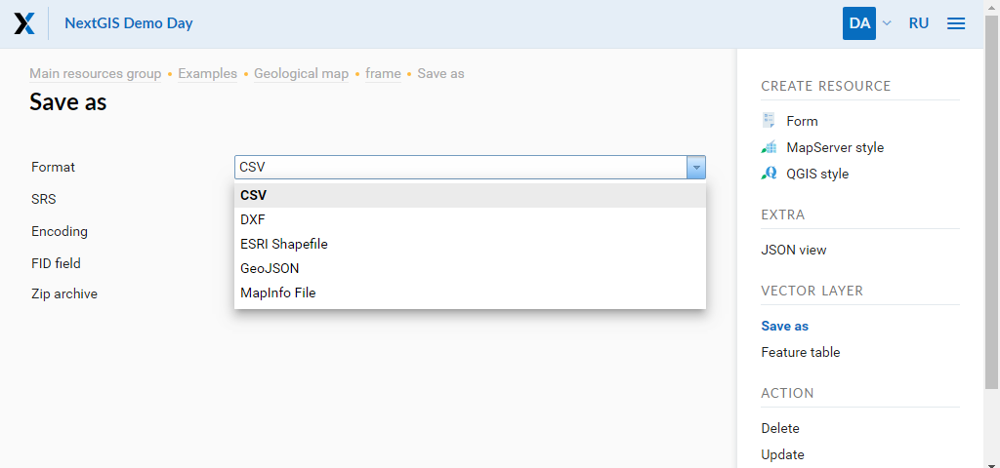
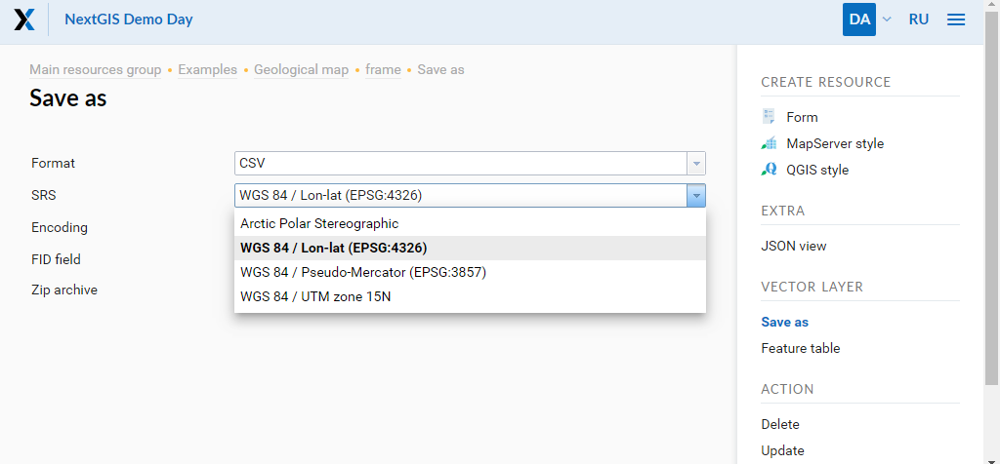
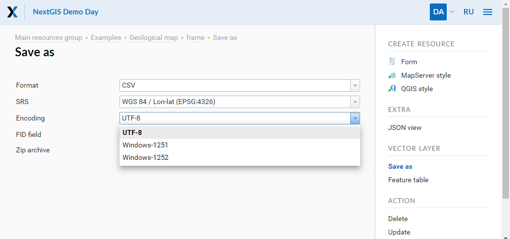
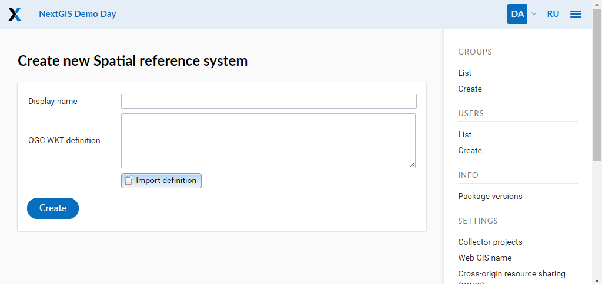
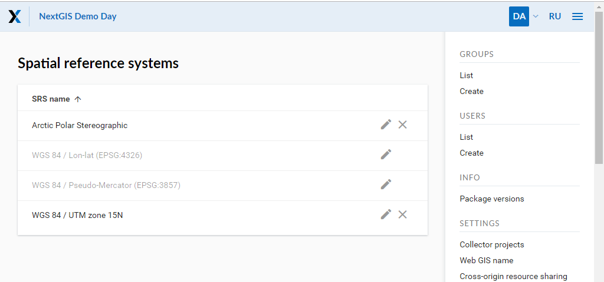

.. _ngcom_data_export:

How to export data
======================================

:ref:`Web GIS <ngcom_description>` allows to export data from :ref:`Vector layers <ngcom_vector_layer>` and :ref:`PostGIS layer <ngcom_postgis_layer>` in :term:`GeoJSON`, :term:`CSV`, ESRI Shape, AutoCAD DXF and Mapinfo TAB formats. Depending on a format, additional file components are exported making further use of exported data more convenient. For example CSVT (field structure description) and PRJ (coordinate system description) are added to CSV and CPG (codepage) to ESRI Shape.

To export data:

#. Open the Properties page of Vector layer or PostGIS layer from which you want to export data;
#. Select :menuselection:`Vector layer --> Save as` on the right side of Web GIS :ref:`admin console <ngw_admin_interface>`;
#. Save file in chosen format to your device.

In "Format" field select data format you need: CSV, DXF, ESRI Shapefile, GeoJSON or Mapinfo File:

   "Format" field.

In "SRS" field (Spatial reference system) in addition to standart coordinate systems Longitude-Latitude (EPSG: 4326) amd Mercator (EPSG: 3857) you can select custom coordinate systems created earlier (how to add custom SRS see below): 

   "SRS" field.

In "Encoding" field you can choose among UTF-8, Windows-1251, Windows-1252 encoding for your data:

   "Encoding" field.

“FID field” is used for setting a field name to be added to a exported data where the object identifiers will be placed (the default is “ngw_id”).

Output in ESRI Shapefile or MapInfo TAB results in a Zip archive with necessary files. For single-file formats (like GeoJSON or CSV) creation of Zip archive is optional.

All export options are available through HTTP API.

For example, this inquiry will get you data in CSV format, EPSG:4326, UTF-8 encoding, zipped:

https://demo.nextgis.com/api/resource/4077/export?format=csv&srs=4326&zipped=true&fid=ngw_id&encoding=UTF-8

Custom coordinate systems
---------------------------------

.. note::
    Custom SRS functionality is available on `Premium <http://nextgis.com/pricing/#premium/>`_ and `Corporate <http://nextgis.com/pricing/#corporate/>`_ plans. 

.. note::
    Only userswith administrative privileges can add and modify SRS.

To add a new SRS open "Control panel" (see item 1 in :numref:`admin_index_pic`) and press "Create" in "Spatial reference systems": 

   Creation of a new SRS.
   
You can give an SRS display name and its definition in OGC WKT format. You can also import definitions from common formats as PROJ, MapInfo and EPSG, after the import they will get converted to OGC WKT format. Then press "Create" button.

You can find a list of created and available SRS in the "List" of "Spatial reference systems" in "Control panel". In this list there are two SRS by default: «WGS 84 / Lon-lat (EPSG:4326)» and «WGS 84 / Pseudo-Mercator (EPSG:3857)», which can’t be removed or edited (except name):

   A list of SRS.
   
The added SRS can be used for various purposes:

1. To capture coordinates on Web maps. If you have set up additional SRS (one or several), you can now conveniently capture coordinates in this SRS from anywhere on the map:

.. figure:: _static/use_of_custom_srs1_eng.png
   :name: use_of_custom_srs1_pic
   :align: center
   :width: 16cm    

   The use of custom SRS.
   
2. To export vector layers. All custom SRS are also available for data export (see above).

3. To extend API requests. Support for custom SRS is gradually added to NextGIS Web API too. For example, this request will return a feature in a required SRS:

    /api/resource/{id}/feature/{fid}?srs=990002

Custom SRS identifier (990002 in this example) can be known by editing a created SRS, for example:

    /srs/990002/edit

.. note:: 
	Geometry and attributes data export is supported. Features' descriptions, metadata and images can't be exported in the described way but can be requested using :ref:`NextGIS API <ngcom_ngapi>`.

.. note:: 
	You can also export data from Vector layers :ref:`with desktop app NextGIS QGIS <ngcom_ngqgis_connect_data_export>`.
