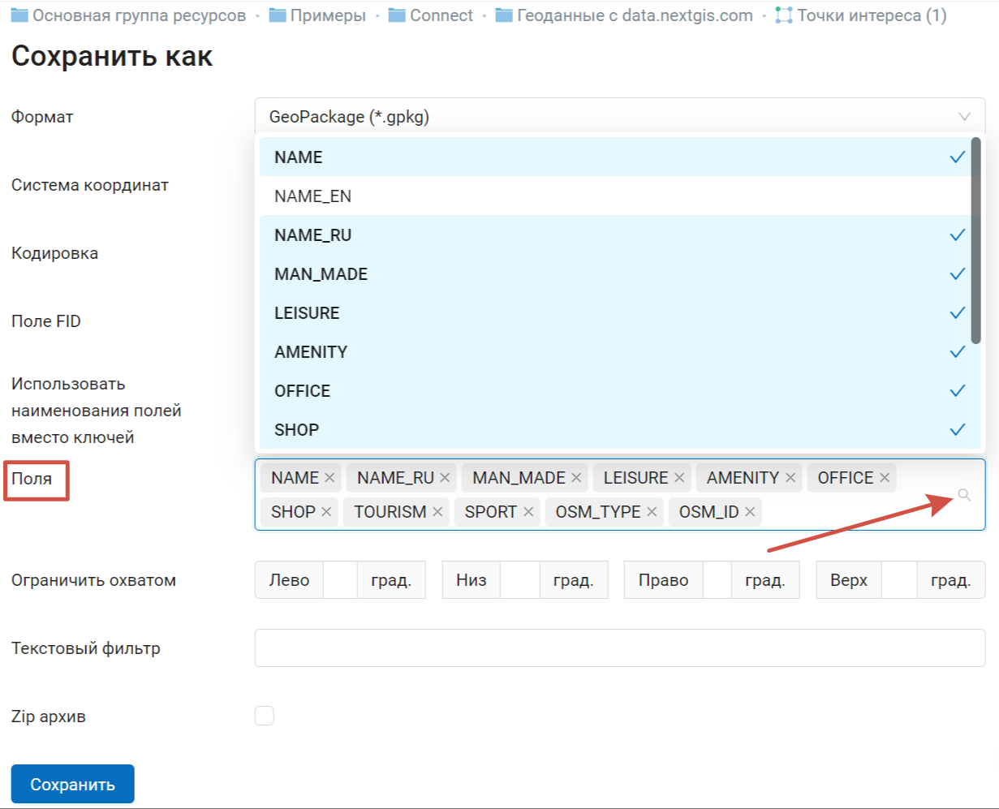

.. _ngcom_data_export:

Как экспортировать данные
======================================

:ref:`Веб ГИС <ngcom_description>` позволяет выгружать данные из :ref:`Векторных слоев <ngcom_vector_layer>` и :ref:`Слоев PostGIS <ngcom_postgis_layer>` в форматах:

* :term:`GeoJSON`
* :term:`CSV` и CSV для Microsoft Excel
* :term:`ESRI Shapefile`
* AutoCAD DXF
* Mapinfo TAB
* MapInfo MIF/MID
* :term:`GeoPackage`.
* KML
* KMZ

При экспорте в определенные форматы создаются дополнительные полезные файлы, например CSVT (описание полей) и PRJ (описание проекции) для CSV, CPG (кодовая страница) для ESRI Shapefile.

Для того, чтобы экспортировать данные:

#. Откройте окно свойств Векторного слоя или Слоя PostGIS, данные которого вы хотите экспортировать;
#. Выберите пункт :menuselection:`Векторный слой --> Сохранить как` на правой панели :ref:`веб-интерфейса <ngw_admin_interface>` Веб ГИС;
#. Сохраните файл в выбранном формате к себе на устройство.

В поле *Формат* следует указать требуемый формат данных:

   Поле "Формат"

В поле *Система координат* помимо стандартных вариантов Широта-Долгота (EPSG: 4326) и Меркатор (EPSG: 3857) есть возможность выбрать другие системы координат, добавленные ранее (о том, как добавить настраиваемые системы координат см. в `этом разделе <https://docs.nextgis.ru/docs_ngcom/source/srs.html>`_): 

   Поле "Система координат"

В поле *Кодировки* можно выбрать для выходного файла одну из кодировок: UTF-8, Windows-1251, Windows-1252:

   Поле "Кодировки"

Настройка *Поле FID* предназначена для задания имени атрибутивного поля, которое будет создано в экспортируемом слое и в которое будут помещены идентификаторы объектов в системе (по умолчанию «ngw_id»).

Далее можно включить опцию *Использовать наименования полей вместо ключей*. Ключ - техническое обозначение поля, в котором используется только латиница без дополнительных символов. Наименование может быть на любом языке, обычно оно отображается как подпись колонки или поля в форме.

   Наименование поля с верхним индексом и его ключ

В следующем поле можно указать *поля* таблицы данных, которые будут включены в файл при экспорте. По умолчанию все поля добавлены. Для того, чтобы удалить лишние, можно нажать на крестик рядом с соответствующим ключом или снять галочку в выпадающем меню. Чтобы снова добавить поле, отметьте его в выпадающем меню.

   Выбор полей

Опция *Ограничить охватом* позволяет экспортировать не все объекты слоя, а только те, которые находятся в нужной области. Охват задается в градусах.

Также можно ограничить выборку объекта при помощи *текстового фильтра*. Поиск производится по всем полям, для которых не отключен `полнотекстовый поиск <https://docs.nextgis.ru/docs_ngweb/source/admin_interface.html#ngweb-admin-layers-attr>`_, так же как в таблице атрибутов.

При экспорте в такие форматы, как ESRI Shapefile или MapInfo TAB, в результате создаётся Zip-архив с нужными файлами. Для однофайловых форматов (например, GeoJSON) создание архива является опциональным. 

   Активный флажок "Zip архив" при выборе формата GeoJSON

Для разработчиков все параметры экспорта доступны через HTTP API.
Например, такой запрос выдаст данные слоя в формате CSV, системе координат EPSG:4326, кодировке UTF-8:

https://demo.nextgis.ru/api/resource/4077/export?format=CSV&srs=4326&zipped=true&fid=ngw_id&encoding=UTF-8

.. note:: 
	Поддерживается экспорт геометрий и атрибутов объектов. Описания, метаданные и изображения объектов вышеописанным способом не экспортируются, но могут быть :ref:`переданы по NextGIS API <ngcom_ngapi>`.

.. note:: 
	Вы также можете экспортировать данные из Векторных слоев :ref:`с помощью настольного приложения NextGIS QGIS <ngcom_ngqgis_connect_data_export>`.
