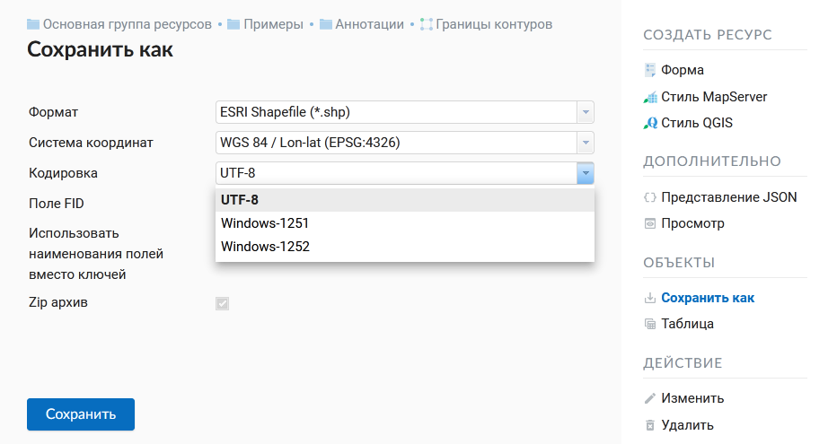
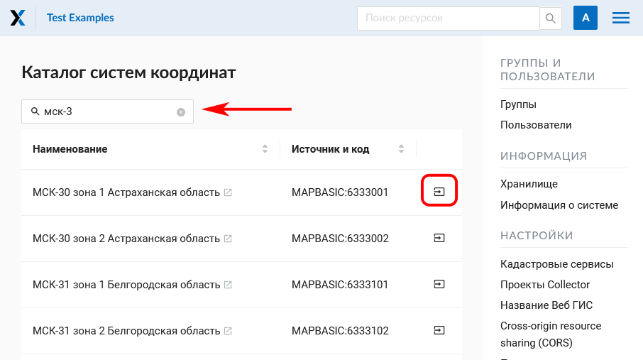
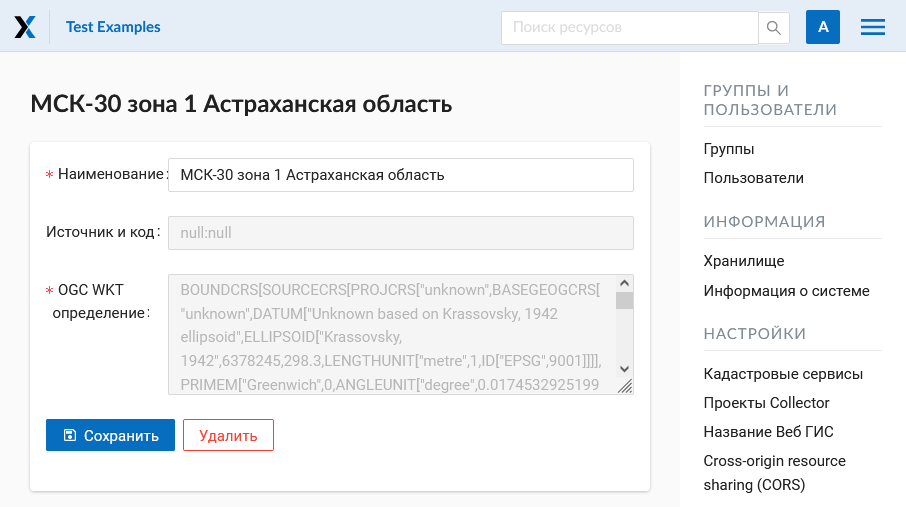
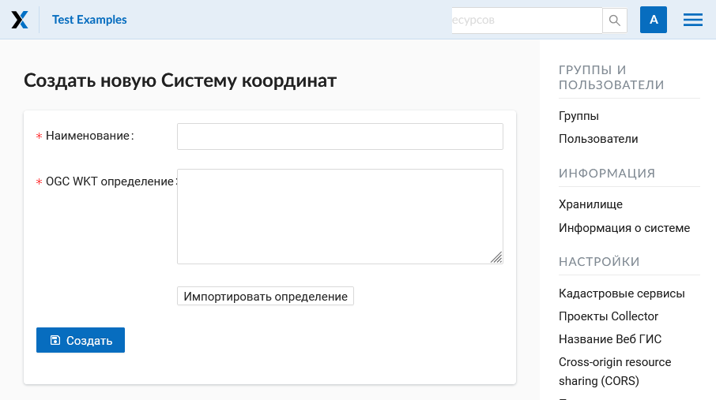

.. _ngcom_data_export:

Как экспортировать данные
======================================

:ref:`Веб ГИС <ngcom_description>` позволяет выгружать данные из :ref:`Векторных слоев <ngcom_vector_layer>` и :ref:`Слоев PostGIS <ngcom_postgis_layer>` в форматах:

* :term:`GeoJSON`
* :term:`CSV`
* CSV для Microsoft Excel
* :term:`ESRI Shapefile`
* AutoCAD DXF
* Mapinfo TAB
* MapInfo MIF/MID
* :term:`GeoPackage`.

При экспорте в определенные форматы создаются дополнительные полезные файлы, например CSVT (описание полей) и PRJ (описание проекции) для CSV, CPG (кодовая страница) для ESRI Shapefile.

Для того, чтобы экспортировать данные:

#. Откройте окно свойств Векторного слоя или Слоя PostGIS, данные которого вы хотите экспортировать;
#. Выберите пункт :menuselection:`Векторный слой --> Сохранить как` на правой панели :ref:`веб-интерфейса <ngw_admin_interface>` Веб ГИС;
#. Сохраните файл в выбранном формате к себе на устройство.

В поле "Формат" следует указать требуемый формат данных:

   Поле "Формат"

В поле "Система координат" помимо стандартных вариантов Широта-Долгота (EPSG: 4326) и Меркатор (EPSG: 3857) есть возможность выбрать другие системы координат, добавленные ранее (о том, как добавить настраиваемые системы координат см. ниже): 

   Поле "Система координат"

В поле "Кодировки" можно выбрать для выходного файла одну из кодировок: UTF-8, Windows-1251, Windows-1252:

   Поле "Кодировки"

Настройка «Поле FID» предназначена для задания имени атрибутивного поля, которое будет создано в экспортируемом слое и в которое будут помещены идентификаторы объектов в системе (по умолчанию «ngw_id»).

При экспорте в такие форматы, как ESRI Shapefile или MapInfo TAB, в результате создаётся Zip-архив с нужными файлами. Для однофайловых форматов (например, GeoJSON) создание архива является опциональным. 

   Активный флажок "Zip архив" при выборе формата GeoJSON

Для разработчиков все параметры экспорта доступны через HTTP API.
Например, такой запрос выдаст данные слоя в формате CSV, системе координат EPSG:4326, кодировке UTF-8:

https://demo.nextgis.com/api/resource/4077/export?format=CSV&srs=4326&zipped=true&fid=ngw_id&encoding=UTF-8

Настраиваемые системы координат
---------------------------------

.. note::
    Функциональность по поддержке пользовательских систем координат доступна на планах `Премиум <http://nextgis.ru/pricing/#premium/>`_ и `Корпоративный <http://nextgis.ru/pricing/#corporate/>`_

.. note::
    Добавление и изменение систем координат доступно только пользователям с правами администратора.

Новую систему координат можно импортировать из каталога или создать самостоятельно.

Для того, чтобы **добавить СК из каталога**, нужно перейти в "Панель управления" и в разделе "Системы координат" нажать  "Каталог". На странице каталога в строку поиска начните вводить название нужной системы координат. В появившемся списке результатов поиска нажмите на иконку со стрелкой. 

   Поиск системы координат в каталоге
   
Откроется окно импорта, где можно задать название, под которым система координат будет отображаться в списке в вашей Веб ГИС.

.. figure:: _static/new_srs_import_ru.png
   :name: new_srs_import
   :align: center
   :width: 20cm    

   Импорт системы координат из каталога
   

   Завершение импорта системы координат
   
В следующем окне нажмите **Сохранить** для завершения импорта.

Для того, чтобы **создать новую систему координат**, нужно перейти в "Панель управления" (см. :numref:`ngweb_main_page_administrative_interface_pic`, п.1) и в разделе "Системы координат" нажать "Создать": 

   Создание новой системы координат
   
Здесь можно указать имя и описание СК в формате OGC WKT. Также поддерживается импорт описаний из распространенных форматов, таких как PROJ, MapInfo и EPSG, при импорте описаний они будут приведены к формату OGC WKT. После чего следует нажать кнопку "Создать".

Список уже добавленных и доступных систем координат можно посмотреть, перейдя в "Панель управления" и в разделе "Системы координат" выбрав "Список". В данном списке всегда будут присутствовать 2 служебные системы координат: «WGS 84 / Lon-lat (EPSG:4326)» и «WGS 84 / Pseudo-Mercator (EPSG:3857)», которые нельзя ни отредактировать (только название), ни удалить:

.. figure:: _static/list_srs_ru.png
   :name: list_srs_pic
   :align: center
   :width: 20cm    

   Список систем координат
   
Дополнительные системы координат можно использовать для разных целей:

1. В окне идентификации веб карты для определения координат места клика. Раньше можно было смотреть координаты только в EPSG:4326 и EPSG:3857. Теперь в окне индентификации можно быстро получить координаты и в заданных пользователем СК:

.. figure:: _static/use_of_custom_srs1_ru.png
   :name: use_of_custom_srs1_pic
   :align: center
   :width: 20cm    

   Использование настраиваемых систем координат
   
2. При экспорте векторного слоя в файл. Все настроенные системы координат также доступны для экспорта данных (см. выше).

3. При работе через API. Поддержка новых СК постепенно добавляется к разным методам API. Так, например, выглядит запрос для получения объекта слоя в нужной СК:

/api/resource/{id}/feature/{fid}?srs=990002

Идентификатор СК (в данном примере 990002) можно узнать из URL, открыв на редактирование созданную систему, например:

/srs/990002/edit

.. note:: 
	Поддерживается экспорт геометрий и атрибутов объектов. Описания, метаданные и изображения объектов вышеописанным способом не экспортируются, но могут быть :ref:`переданы по NextGIS API <ngcom_ngapi>`.

.. note:: 
	Вы также можете экспортировать данные из Векторных слоев :ref:`с помощью настольного приложения NextGIS QGIS <ngcom_ngqgis_connect_data_export>`.
