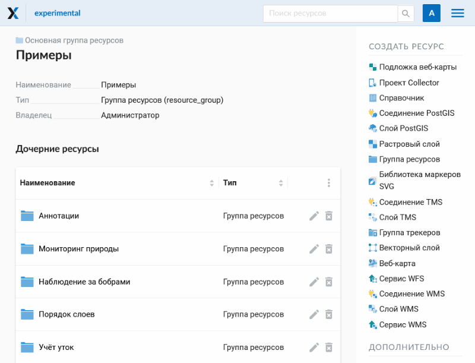
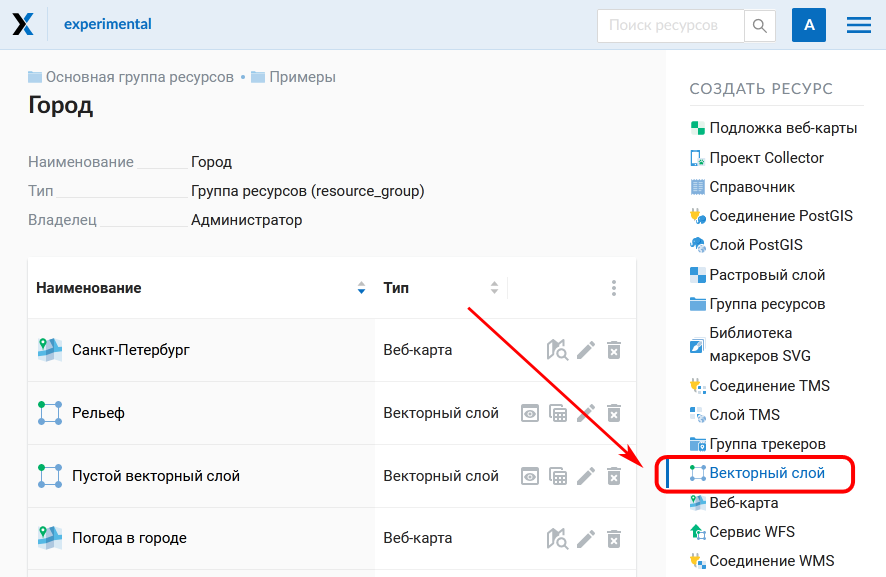
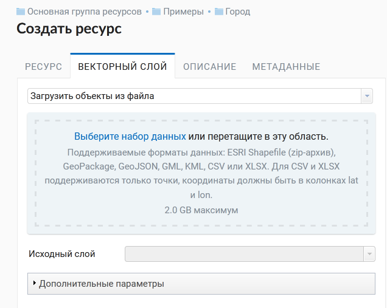
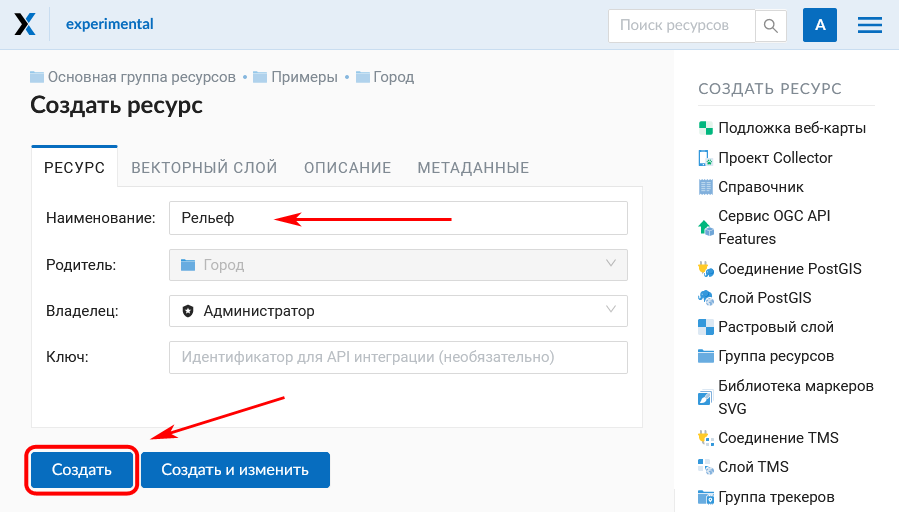

.. _ngcom_data_upload:

Как загружать данные
================================

Загрузка растровых и векторных геоданных в :ref:`Веб ГИС <ngcom_description>` происходит путем создания ресурсов :ref:`Растровый слой <ngcom_raster_layer>` и :ref:`Векторный слой <ngcom_vector_layer>`.

.. note:: 
	Ограничение на размер загружаемых файлов зависит от выбранного тарифного плана. Для **Premium** - 2.0 GB, для **Free** - 128 Mb, для **Mini** - 256 Mb. Для растров это ограничение соответствует файлам без сжатия в EPSG:3857.

.. _ngcom_data_preview:

Быстрый просмотр
-----------------

Чтобы быстро посмотреть загруженные данные - нажмите на кнопку **Просмотр** в правом меню в разделе **Дополнительно**. 

.. note:: 
	Для векторных данных (vector layer) предварительный просмотр возможен как для слоя, так и для стиля. Для растровых - только для стиля. Для TMS и WFS слоев просмотр также доступен.

Функция предварительного просмотра в интерфейсе описана `здесь <https://docs.nextgis.ru/docs_ngweb/source/layers.html#ngw-data-preview>`_.

.. _ngcom_raster_layer:

Растровые данные
-------------------------------

.. _ngcom_raster_requirements:

Требования к исходным данным
^^^^^^^^^^^^^^^^^^^^^^^^^^^^

* Поддерживаемый формат: GeoTIFF
* Данные должны быть географически привязаны и иметь корректно сформированное описание системы координат (в тегах GeoTIFF).

Создание растрового слоя
^^^^^^^^^^^^^^^^^^^^^^^^

#. Откройте :ref:`Группу ресурсов <ngcom_resources_group>`, в которой вы хотите создать слой (на главной странице Веб ГИС по умолчанию открыта Основная группа ресурсов);
#. Выберите :menuselection:`Создать ресурс --> Растровый слой` на правой панели :ref:`веб-интерфейса <ngw_admin_interface>` Веб ГИС;
#. В открывшемся окне заполните поле :guilabel:`Наименование` на вкладке :guilabel:`Ресурс` и выберите файл с растровыми геоданными на вкладке :guilabel:`Растровый слой`;
#. Нажмите кнопку :guilabel:`Создать`. Если Растровый слой создался успешно, то информация о нем появится в блоке :guilabel:`Дочерние ресурсы` соответствующей Группы ресурсов.

Если вы планируете напрямую из Веб ГИС подключать этот растр в QGIS, при загрузке включите режим Загрузить как Cloud Optimized GeoTIFF (COG).

.. important::
	Если вы планируете просматривать Растровый слой с помощью :ref:`Веб-карты <ngcom_webmap_create>` или публиковать его по протоколу :term:`WMS`, необходимо создать для него `Стиль <https://docs.nextgis.ru/docs_ngcom/source/styles.html#ngcom-raster-style>`_.

   
   Создание растрового слоя

Больше информации о загрузке растровых геоданных в Веб ГИС - :ref:`здесь <ngw_create_raster_layer>`. 

.. _ngcom_raster_volume:

Замечания по загрузке растров большого объёма
^^^^^^^^^^^^^^^^^^^^^^^^^^^^^^^^^^^^^^^^^^^^^^

Данные БПЛА, космической съемки высокого разрешения и другие растры могут занимать значительный объем. При этом, сам по себе размер файла растра не очень репрезентативен, так как реальный объем данных может быть значительно больше из-за сжатия. Чтобы быстро показывать растровые данные на веб картах и раздавать с помощью сервисов, они должны быть специальным образом преобразованы перед загрузкой в Веб ГИС и созданием соответствующих растровых слоёв.

Существует три ограничения, касающиеся загрузки растров большого размера:

#. Максимальный размер загружаемого файла - зависит от вашего `плана <https://nextgis.ru/pricing-base/>`_, по умолчанию на плане Премиум - **2 Гб**. С некоторыми ограничениями это значение можно изменить в облаке и, без ограничений, `на своем сервере <https://nextgis.ru/pricing>`_;
#. Размер распакованного на сервере растра - после распаковки в облаке максимальный размер не должен превышать  **4 Гб**. Размер распакованного растра можно вычислить по формуле: количество пикселей * количество каналов * количество байт на пиксель.
#. Общий объем данных - на плане Премиум вы можете загрузить до **50 Гб** данных  (это значение `можно увеличить <https://nextgis.ru/pricing-base/#volume-premium>`_);

Время загрузки растра на сервер не ограничено. 

.. _ngcom_vector_layer:

Векторные данные
----------------

.. _ngcom_vector_requirements:

Требования к исходным данным
^^^^^^^^^^^^^^^^^^^^^^^^^^^^

Поддерживаемые форматы: ESRI Shapefile (zip-архив без вложенных папок и других архивов, один слой - один архив), GeoPackage, GeoJSON, GML, KML, CSV или  XLSX. Для CSV и XLSX поддерживаются только точки, координаты должны быть в колонках lat и lon.

Если нужно загрузить данные в другом формате, вы можете использовать :ref:`NextGIS Connect <ngcom_ngqgis_connect_data_upload>`.

.. warning:: 
	Мы рекомендуем не использовать кириллицу в названиях полей атрибутов. Несмотря на то, что такие данные могут быть загружены в Веб ГИС и показаны на картах, в некоторых случаях вы можете испытывать проблемы с визуализацией и при работе с такими данными через WFS, в NextGIS Mobile (особенно если условные обозначения сформированы на базе одного из таких полей). Переименуйте поля латиницей перед загрузкой и используйте синонимы полей (алиасы) для их отображения кириллицей на картах.

Создание векторного слоя
^^^^^^^^^^^^^^^^^^^^^^^^

#. Откройте :ref:`Группу ресурсов <ngcom_resources_group>`, в которой вы хотите создать слой (на главной странице Веб ГИС по умолчанию открыта Основная группа ресурсов);
#. Выберите :menuselection:`Создать ресурс --> Векторный слой` на правой панели :ref:`веб-интерфейса <ngw_admin_interface>` Веб ГИС;
#. В открывшемся окне выберите файл с векторными геоданными на вкладке :guilabel:`Векторный слой` или задайте тип геометрии, чтобы создать пустой векторный слой.
#. Заполните поле :guilabel:`Наименование` на вкладке :guilabel:`Ресурс`;
#. Нажмите кнопку :guilabel:`Создать`. Если Векторный слой создался успешно, то информация о нем появится в блоке :guilabel:`Дочерние ресурсы` соответствующей Группы ресурсов.

   Выбор действия "Векторный слой"

   Окно загрузки векторного файла

   Наименование векторного слоя и завершение создания ресурса

.. important::
	Если вы планируете просматривать Векторный слой с помощью :ref:`Веб-карты <ngcom_webmap_create>` или публиковать его по протоколу :term:`WMS`, необходимо создать для него :ref:`Стиль <ngcom_styles>`.

Веб ГИС может принимать многослойные наборы данных на входе. Если в архиве содержится несколько слоев, то после его загрузки пользователю будет предложено выбрать слой, на основе которого будет создан ресурс "Векторный слой".

Больше информации о загрузке векторных геоданных в Веб ГИС - :ref:`здесь <ngw_create_vector_layer>`.

.. note:: 
	Вы также можете загружать растровые и векторные данные в Веб ГИС :ref:`с помощью настольного приложения NextGIS QGIS <ngcom_ngqgis_connect_data_upload>`.
