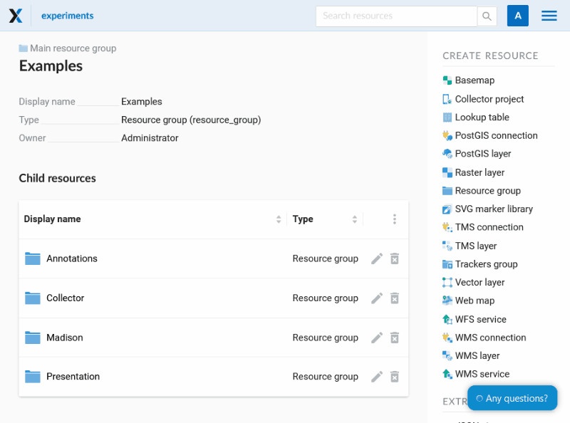

.. _ngcom_data_upload:

How to upload data
================================

Raster and vector geodata are uploaded to :ref:`Web GIS <ngcom_description>` by creation of :ref:`Raster layer <ngcom_raster_layer>` and :ref:`Vector layer <ngcom_vector_layer>` resources respectively.

.. note:: 
	The size limit for uploaded files depends on the selected plan. For **Premium** - 2.0 GB, for **Free** - 128 Mb and **Mini** - 256 Mb. For rasters, this limit corresponds to uncompressed files in EPSG: 3857.

.. _ngcom_data_preview:

Quick preview
-------------

To quickly view the downloaded data - click on the **Preview** button on the right menu in the **Additional** section.

.. note:: 
	For vector data, previews are available for both the layer and the style. For rasters - for style only. For TMS and WFS layers, preview is also available.

The preview function in the frontend is described `here <https://docs.nextgis.com/docs_ngweb/source/layers.html#data-preview>`_

.. _ngcom_raster_layer:

Raster data
-----------

Input data requirements
^^^^^^^^^^^^^^^^^^^^^^^

* Supported format: :term:`GeoTIFF` (with 3 or 4 bands, RGB or RGBA)
* Inputs must be geographically referenced and have correctly set CRS description as GeoTIFF metadata.

Creating raster layer
^^^^^^^^^^^^^^^^^^^^^

#. Open the :ref:`Resource group <ngcom_resources_group>` where you want to create a data layer (by default the main page of Web GIS has Main resource group displayed);
#. Select :menuselection:`Create resource --> Raster layer` on the right side of the Web GIS :ref:`admin console <ngw_admin_interface>`;
#. In the opened dialog, go to :guilabel:`Resource` tab and type a name for the new layer in the field :guilabel:`Display name`. Then go to :guilabel:`Raster layer` tab and select a file with raster geodata;
#. Press :guilabel:`Create` button. If Raster layer is created successfully, you'll see its name in :guilabel:`Child resources` pane of the relevant Resource group.

If you plan to add this raster to QGIS directly from your Web GIS, turn on Upload as Cloud Optimized GeoTIFF (COG) checkbox.

.. important::
	If you plan to display the Raster layer on a :ref:`Web Map <ngcom_webmap_create>` or publish it using :term:`WMS` protocol, you need to create a `Style <https://docs.nextgis.com/docs_ngcom/source/styles.html#ngcom-styles>`_ for it first.

.. _ngcom_raster_requirements:

   Raster upload process

Read more about upload of raster geodata to Web GIS :ref:`here <ngw_create_raster_layer>`. 

.. _ngcom_raster_volume:

Uploading large rasters
^^^^^^^^^^^^^^^^^^^^^^^

UAS, remote sensing data and other rasters are often huge.
The file size is not very informative as the real data size might be much larger because of compression.
To ensure fast rendering on Web Maps and serving, rasters with TMS and WMS used to create raster layers should be properly processed before upload.

There are three important limitations for uploading large raster files:

#. File size - maximum file size being uploaded is **2 Gb**. This limit can't be changed on Premium, but can be changed `on-premise <https://nextgis.com/pricing/>`_;
#. Raster size on the server - afther the file is extracted to the cloud, it must not be larger than **4 Gb**. You can calculate the size of the extracted raster using the following formula: number of pixels * number of channels * bytes per pixel. 
#. Total data volume - you can upload up to **50 Gb** of data on Premium (this limit can be `raised <https://nextgis.com/pricing-base/#volume-premium>`_);

There is no limitation for processing time.

.. _ngcom_vector_layer:

Vector data
-----------

Input data requirements
^^^^^^^^^^^^^^^^^^^^^^^

* Supported formats: ESRI Shapefile (zip-archived, no sub-folders, no sub-archives, one zip - one layer), GeoJSON, GML, KML or GeoPackage.

Use :ref:`NextGIS Connect <ngcom_ngqgis_connect_data_upload>` if you need to upload data in other formats.

.. warning:: 
	Avoid using Unicode symbols in data field names. While such data can be uploaded, you may experience problems working with it via WFS, in NextGIS Mobile or visualization (especially if styles are using such fields). Use plain Latin for field names and set up field aliases to show Unicode names.

Creating vector layer
^^^^^^^^^^^^^^^^^^^^^

#. Open :ref:`Resource group <ngcom_resources_group>` where you want to create a data layer (by default from the main page of Web GIS you can access Main resource group);
#. Select :menuselection:`Create resource --> Vector layer` on the right side of the Web GIS :ref:`admin console <ngw_admin_interface>`;
#. In the opened dialog, go to :guilabel:`Resource` tab and type a name for the new layer in the field :guilabel:`Display name`. Then in :guilabel:`Vector layer` tab select a file with vector geodata;
#. Press :guilabel:`Create` button. If Vector layer is created successfully, you'll see its name in :guilabel:`Child resources` pane of the relevant Resource group.

.. important::
	If you plan to display Vector layer on a :ref:`Web Map <ngcom_webmap_create>` or publish it using :term:`WMS` protocol you need to add a :ref:`Style <ngcom_styles>` for it first.

   Vector upload process

Web GIS can process multy-layer datasets. If an archive contains several layers, then after it is uploaded, you will be asked to select which layer will be used for creating Vector layer resource.

Read more about upload of vector geodata to Web GIS :ref:`here <ngw_create_vector_layer>`.

.. note:: 
	You can also upload raster and vector geodata to Web GIS :ref:`with NextGIS QGIS <ngcom_ngqgis_connect_data_upload>`.
