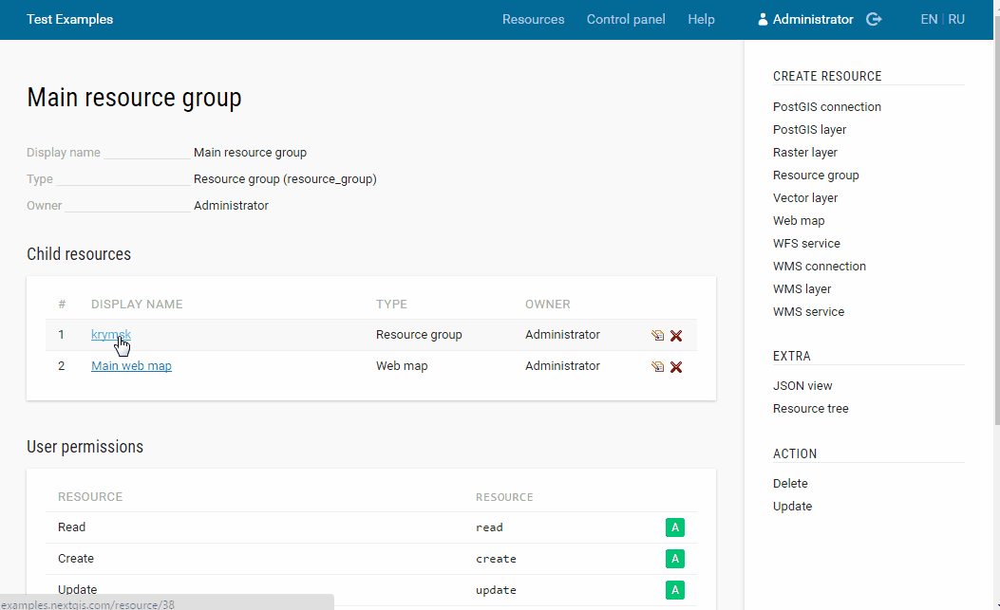
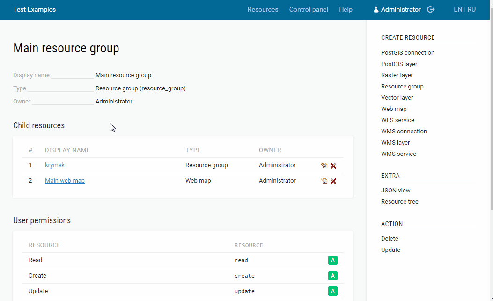

.. _ngcom_data_upload:

Как загружать данные
================================

Загрузка растровых и векторных геоданных в :ref:`Веб ГИС <ngcom_description>` происходит путем создания ресурсов :ref:`Растровый слой <ngcom_raster_layer>` и :ref:`Векторный слой <ngcom_vector_layer>`.

.. _ngcom_raster_layer:

Растровые данные
-------------------------------

#. Откройте :ref:`Группу ресурсов <ngcom_resources_group>`, в которой вы хотите создать слой (на главной странице Веб ГИС по умолчанию открыта Основная группа ресурсов);
#. Выберите :menuselection:`Создать ресурс --> Растровый слой` на правой панели :ref:`веб-интерфейса <ngw_admin_interface>` Веб ГИС;
#. В открывшемся окне заполните поле :guilabel:`Наименование` на вкладке :guilabel:`Ресурс` и выберите файл с растровыми геоданными на вкладке :guilabel:`Растровый слой`;
#. Нажмите кнопку :guilabel:`Создать`. Если Растровый слой создался успешно, то информация о нем появится в блоке :guilabel:`Дочерние ресурсы` соответствующей Группы ресурсов.

.. warning:: 
	Поддерживается только загрузка файлов формата :term:`GeoTIFF` с 3 или 4 каналами (RGB или RGBA).

Больше информации о загрузке растровых геоданных в Веб ГИС - :ref:`здесь <ngw_create_raster_layer>`. 

Если вы планируете просматривать Растровый слой с помощью :ref:`Веб-карты <ngcom_webmap_create>` или публиковать его по протоколу :term:`WMS`, необходимо создать для него :ref:`Стиль <ngcom_styles>`.

.. _ngcom_vector_layer:

Векторные данные
-------------------------------

#. Откройте :ref:`Группу ресурсов <ngcom_resources_group>`, в которой вы хотите создать слой (на главной странице Веб ГИС по умолчанию открыта Основная группа ресурсов);
#. Выберите :menuselection:`Создать ресурс --> Векторный слой` на правой панели :ref:`веб-интерфейса <ngw_admin_interface>` Веб ГИС;
#. В открывшемся окне заполните поле :guilabel:`Наименование` на вкладке :guilabel:`Ресурс`, затем выберите файл с векторными геоданными и укажите его кодировку на вкладке :guilabel:`Векторный слой`;
#. Нажмите кнопку :guilabel:`Создать`. Если Векторный слой создался успешно, то информация о нем появится в блоке :guilabel:`Дочерние ресурсы` соответствующей Группы ресурсов.

.. warning:: 
	Поддерживается только загрузка файлов форматов :term:`ESRI Shape` (упакованных в zip-архив, с кодировкой UTF-8 или Windows-1251) и :term:`GeoJSON` (с кодировкой UTF-8). В файлах не должно быть смешанных и невалидных геометрий, даты не должны иметь значения NULL, не должно быть полей с названиями: id (ID), type (TYPE), source (SOURCE). В файлах формата ESRI Shape не должно быть мультигеометрий.

Больше информации о загрузке векторных геоданных в Веб ГИС - :ref:`здесь <ngw_create_vector_layer>`.

Если вы планируете просматривать Векторный слой с помощью :ref:`Веб-карты <ngcom_webmap_create>` или публиковать его по протоколу :term:`WMS`, необходимо создать для него :ref:`Стиль <ngcom_styles>`.

.. note:: 
	Вы также можете загружать растровые и векторные данные в Веб ГИС :ref:`с помощью настольного приложения NextGIS QGIS <ngcom_ngqgis_connect_data_upload>`.
