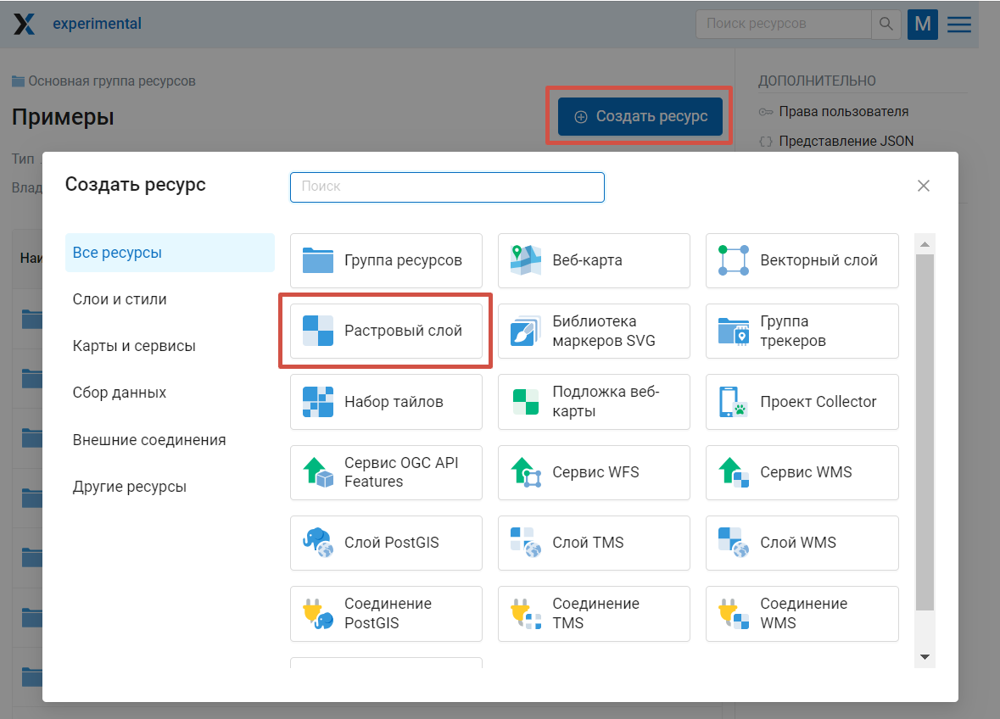
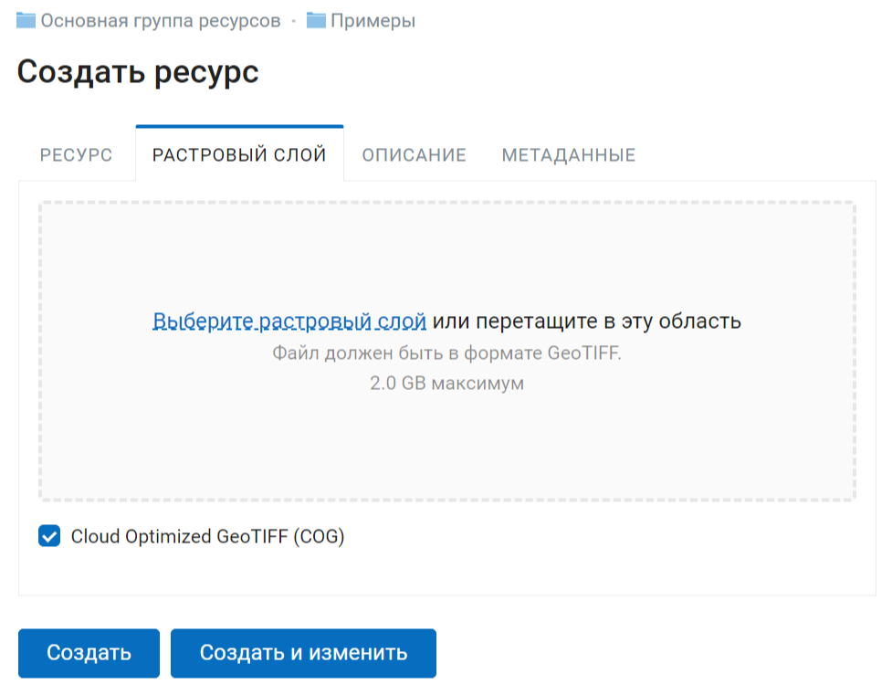
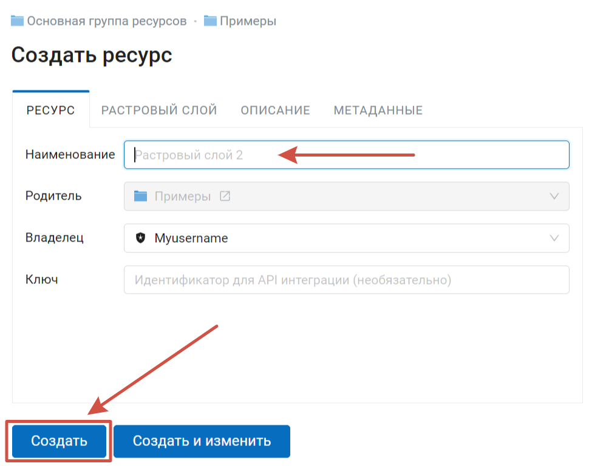
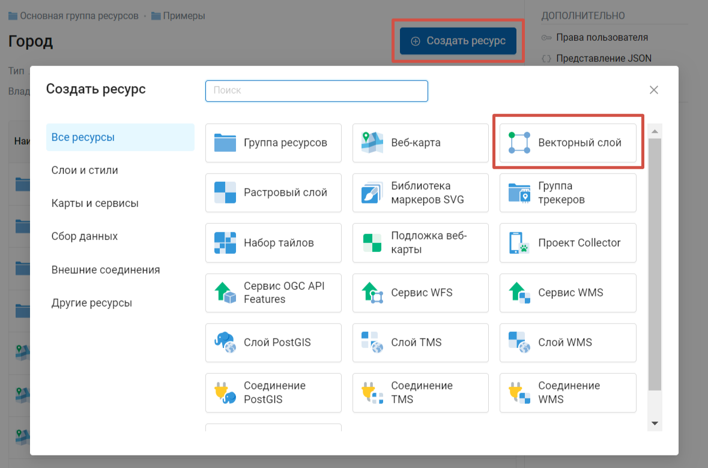
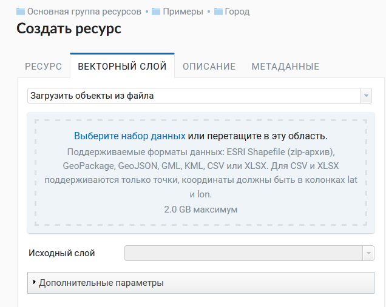
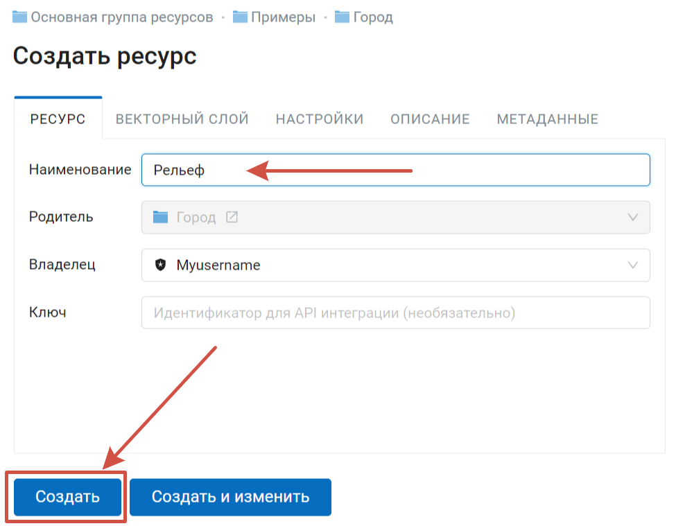

.. _ngcom_data_upload:

Как загружать данные
================================

Загрузка растровых и векторных геоданных в :ref:`Веб ГИС <ngcom_description>` происходит путем создания ресурсов :ref:`Растровый слой <ngcom_raster_layer>` и :ref:`Векторный слой <ngcom_vector_layer>`.

.. note:: 
	Ограничение на размер загружаемых файлов зависит от выбранного тарифного плана. Для **Premium** - 50 GiB, для **Free** - 5 GiB, для **Mini** - 10 GiB. 

.. _ngcom_data_preview:

Быстрый просмотр
-----------------

Чтобы быстро посмотреть загруженные данные - нажмите на кнопку **Просмотр** в правом меню в разделе **Дополнительно**. 

.. note:: 
	Для векторных данных (vector layer) предварительный просмотр возможен как для слоя, так и для стиля. Для растровых - только для стиля. Для TMS и WFS слоев просмотр также доступен.

Функция предварительного просмотра в интерфейсе описана `здесь <https://docs.nextgis.ru/docs_ngweb/source/layers.html#ngw-data-preview>`_.

.. _ngcom_raster_layer:

Растровые данные
-------------------------------

.. _ngcom_raster_requirements:

Требования к исходным данным
^^^^^^^^^^^^^^^^^^^^^^^^^^^^

* Поддерживаемый формат: :term:`GeoTIFF`
* Данные должны быть географически привязаны и иметь корректно сформированное описание системы координат (в тегах GeoTIFF).

Создание растрового слоя
^^^^^^^^^^^^^^^^^^^^^^^^

#. Откройте `Группу ресурсов <https://docs.nextgis.ru/docs_ngweb/source/create_resource.html#ngw-resource-group>`_, в которой вы хотите создать слой (на главной странице Веб ГИС по умолчанию открыта Основная группа ресурсов);
#. Нажмите кнопку **Создать ресурс** и выберите во всплывающем окне тип ресурса "Растровый слой";
#. В открывшемся окне заполните поле :guilabel:`Наименование` на вкладке :guilabel:`Ресурс` и выберите файл с растровыми геоданными на вкладке :guilabel:`Растровый слой`;
#. Нажмите кнопку :guilabel:`Создать`. Если Растровый слой создался успешно, то информация о нем появится в блоке :guilabel:`Дочерние ресурсы` соответствующей Группы ресурсов.

Если вы планируете напрямую из Веб ГИС подключать этот растр в QGIS, при загрузке включите режим Загрузить как Cloud Optimized GeoTIFF (COG).

.. important::
	Если вы планируете просматривать Растровый слой с помощью :ref:`Веб-карты <ngcom_webmap_create>` или публиковать его по протоколу :term:`WMS`, необходимо создать для него `Стиль <https://docs.nextgis.ru/docs_ngcom/source/styles.html#ngcom-raster-style>`_.

   Выбор типа создаваемого ресурса "Растровый слой"

   Окно загрузки растрового файла

   Наименование растрового слоя и завершение создания ресурса

Больше информации о загрузке растровых геоданных в Веб ГИС - :ref:`здесь <ngw_create_raster_layer>`. 

.. seealso:: Если вы загружаете растр большого объема: `как понять, хватит ли места в хранилище? <https://docs.nextgis.ru/docs_ngweb/source/layers.html#ngw-raster-volume>`_.

.. _ngcom_vector_layer:

Векторные данные
----------------

.. _ngcom_vector_requirements:

Требования к исходным данным
^^^^^^^^^^^^^^^^^^^^^^^^^^^^

Поддерживаемые форматы: :term:`ESRI Shapefile` (zip-архив без вложенных папок и других архивов, один слой - один архив), :term:`GeoPackage`, :term:`GeoJSON`, :term:`GML`, :term:`KML`, :term:`CSV` или  :term:`XLSX`. Для CSV и XLSX поддерживаются только точки, координаты должны быть в колонках lat и lon.

Если нужно загрузить данные в другом формате, вы можете использовать `NextGIS Connect <https://docs.nextgis.ru/docs_ngconnect/source/index.html>`_.

Также вы можете `подключать <https://docs.nextgis.ru/docs_ngconnect/source/index.html>`_.

Также вы можете :ref:`подключать <ngcom_data_connect>` в Веб ГИС геоданные из следующих внешних источников:  в Веб ГИС геоданные из следующих внешних источников: 

.. warning:: 
	Мы рекомендуем не использовать кириллицу в названиях полей атрибутов. Несмотря на то, что такие данные могут быть загружены в Веб ГИС и показаны на картах, в некоторых случаях вы можете испытывать проблемы с визуализацией и при работе с такими данными через :term:`WFS`, в NextGIS Mobile (особенно если условные обозначения сформированы на базе одного из таких полей). Переименуйте поля латиницей перед загрузкой и используйте синонимы полей (алиасы) для их отображения кириллицей на картах.

Создание векторного слоя
^^^^^^^^^^^^^^^^^^^^^^^^

#. Откройте `Группу ресурсов <https://docs.nextgis.ru/docs_ngweb/source/create_resource.html#ngw-resource-group>`_, в которой вы хотите создать слой (на главной странице Веб ГИС по умолчанию открыта Основная группа ресурсов);
#. Нажмите кнопку **Создать ресурс** и выберите во всплывающем окне тип ресурса "Векторный слой";
#. В открывшемся окне выберите файл с векторными геоданными на вкладке :guilabel:`Векторный слой` или задайте тип геометрии, чтобы создать пустой векторный слой.
#. Заполните поле :guilabel:`Наименование` на вкладке :guilabel:`Ресурс`;
#. Нажмите кнопку :guilabel:`Создать`. Если Векторный слой создался успешно, то информация о нем появится в блоке :guilabel:`Дочерние ресурсы` соответствующей Группы ресурсов.

   Выбор типа создаваемого ресурса "Векторный слой"

   Окно загрузки векторного файла

   Наименование векторного слоя и завершение создания ресурса

.. important::
	Если вы планируете просматривать Векторный слой с помощью :ref:`Веб-карты <ngcom_webmap_create>` или публиковать его по протоколу :term:`WMS`, необходимо создать для него :ref:`Стиль <ngcom_styles>`.

Веб ГИС может принимать многослойные наборы данных на входе. Если в архиве содержится несколько слоев, то после его загрузки пользователю будет предложено выбрать слой, на основе которого будет создан ресурс "Векторный слой".

Больше информации о загрузке векторных геоданных в Веб ГИС - :ref:`здесь <ngw_create_vector_layer>`.

.. note:: 
	Вы также можете загружать растровые и векторные данные в Веб ГИС :ref:`с помощью настольного приложения NextGIS QGIS <ngcom_ngqgis_connect_data_upload>`.
