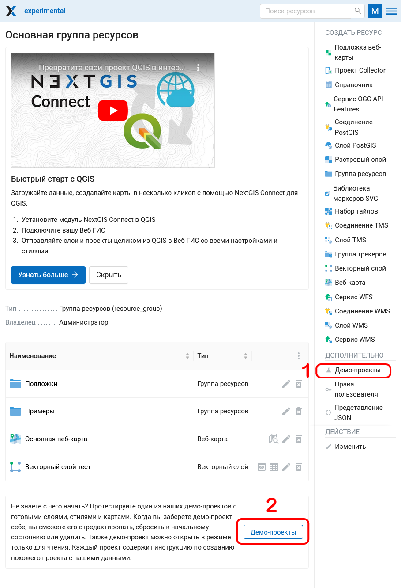
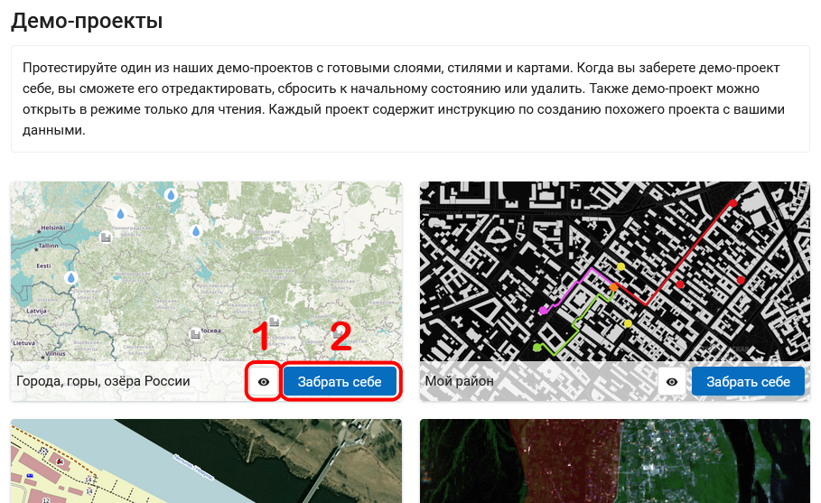
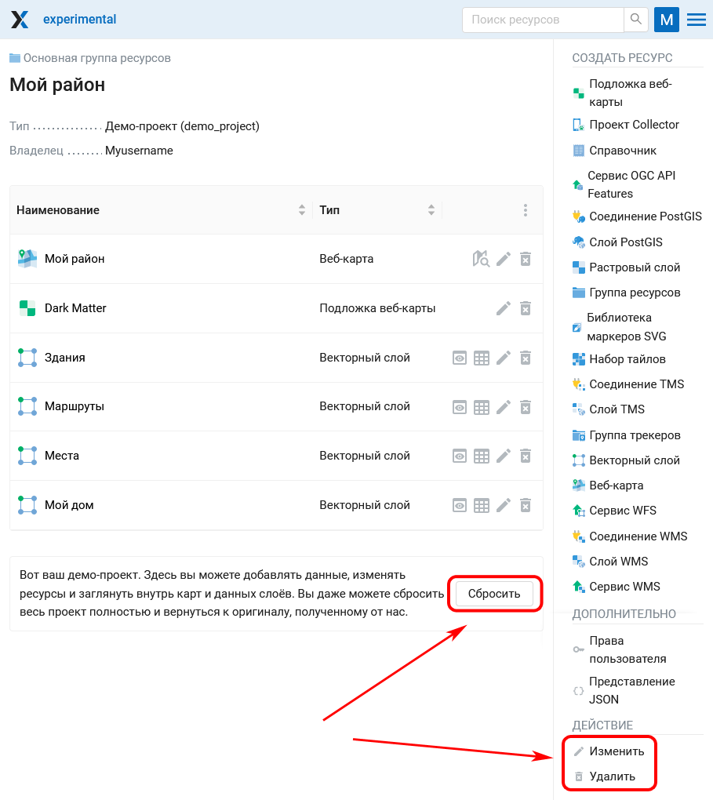
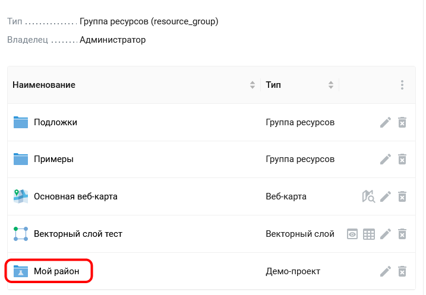

.. sectionauthor:: Юлия Григоренко <grigorenko.j@gmail.com>

Демо-проекты
===============

Это проекты, которые познакомят вас с возможностями NextGIS Web. Если вы создали Веб ГИС и хотите протестировать платформу, но не знаете с чего начать – начните с демо-проектов.

Для того, чтобы получить доступ к демо-проектам, вам нужно зайти на главную страницу **своей Веб ГИС** и авторизоваться в учетной записи **администратора**. Перейти на страницу демо-проектов можно двумя способами:

* Через меню справа
* Нажав на кнопку под списком ваших ресурсов в Веб ГИС

 
   Два пути открытия страницы демо-проектов

.. ngcom_demopr_actions:

Возможности демо-проектов
-----------------------------

На плашке каждого проекта есть две кнопки (см. :numref:`demo_project_main_pic`):

1. Открыть в режиме чтения
2. Забрать себе

 
   Главная страница демо-проектов и кнопки управления

Проекты содержат готовые слои, стили и веб-карты. Это позволяет увидеть, как отображаются разные виды данных в Веб ГИС.

Если выбрать **Забрать себе**, то в основной группе ресурсов вашей Веб ГИС будет создана копия выбранного проекта.

 
   Демо-проект, который забрали в Веб ГИС

Теперь этот проект и его составляющие можно отредактировать, сбросить к начальному состоянию или удалить (см. :numref:`demo_project_cloned_pic`). 

В списке ресурсов Веб ГИС папка демо-проекта, который вы забрали к себе, отмечена специальным значком колбы.

 
   Демо-проект в списке ресурсов Веб ГИС

