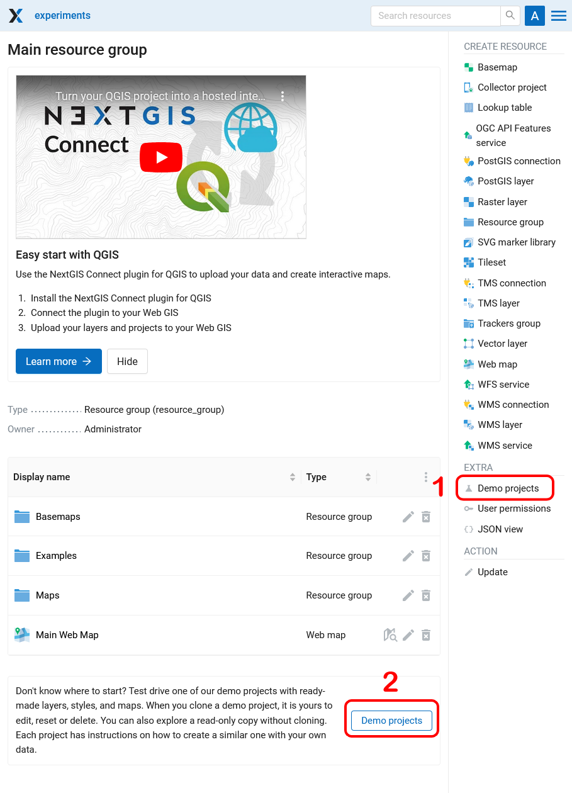
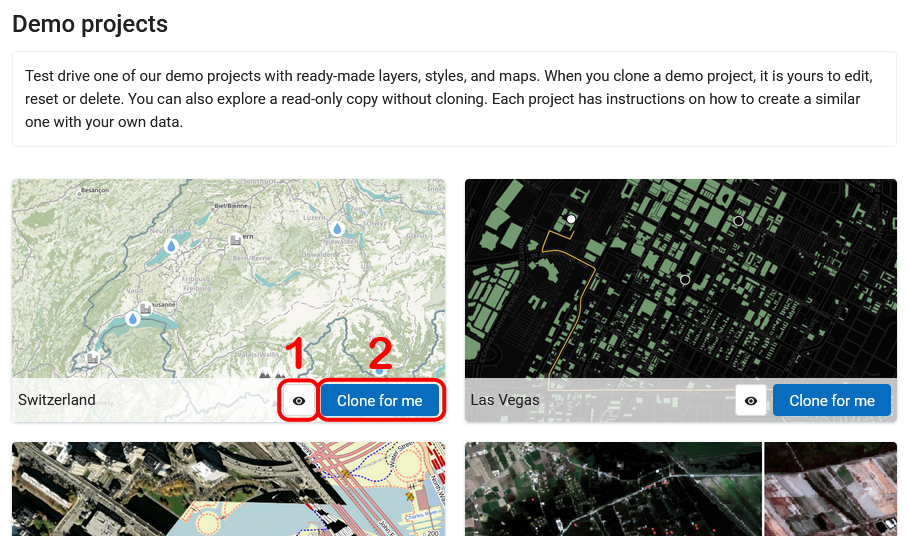
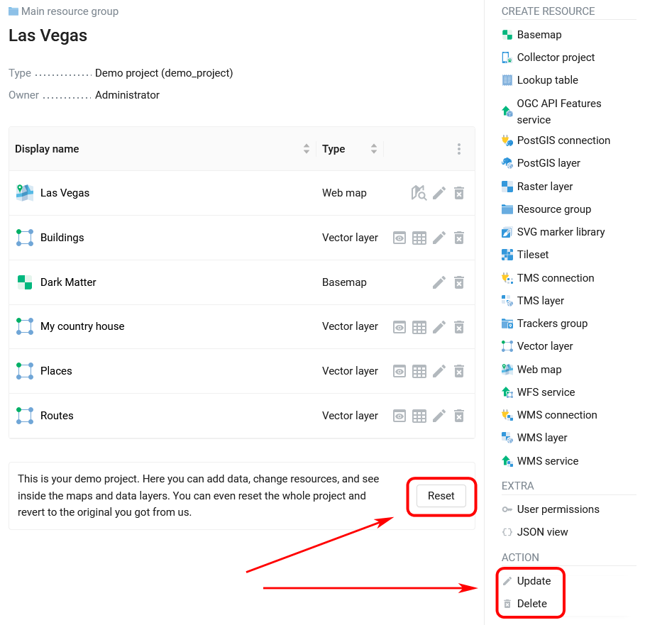
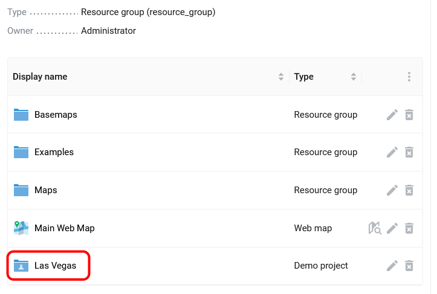

.. sectionauthor:: Юлия Григоренко <grigorenko.j@gmail.com>

Demo projects
===============

These projects showcase the capabilities of NextGIS Web, allowing you to get acquainted with its features. If you've set up a Web GIS and wish to test the platform but don't know where to begin, try out the demo projects.

To access demo projects go to the main page of **your Web GIS** and log in as the **administrator**. You can open the demo projects page in one of two ways:

* From the actions pane on the right
* Using the button below the list of Web GIS resources

 
   Two ways to open demo projects

What you can do with demo projects
-----------------------------

Every project has two buttons (see :numref:`demo_project_main_pic`):

1. Open as read-only
2. Clone for me

 
   Main page of the demo projects and action buttons

The projects include ready-made layers, styles, and maps.  It demonstrates how various types of data are displayed in a Web GIS.

Click **Clone for me** to create a copy of the selected project in the main resource group of your Web GIS.

 
   Demo project cloned to Web GIS

When you clone a demo project, it is yours to edit, reset or delete (see :numref:`demo_project_cloned_pic`). 

In the list of your Web GIS resources the folder of the cloned demo project is marked with a lab flask icon.

 
   Demo project in the list of resources

