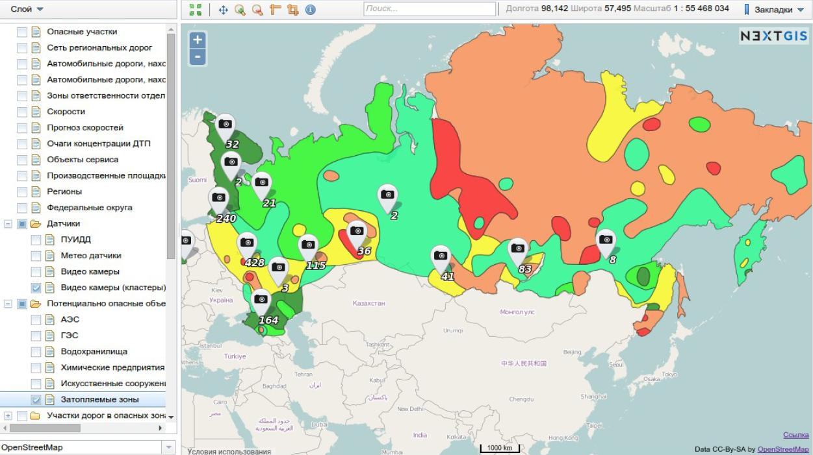

.. _ngcom_description:

Веб-ГИС: описание и возможности
================================

Веб-ГИС - это система, предназначенная для хранения пространственных данных и управления ими через веб-интерфейс или :term:`API`. 

С помощью Веб-ГИС вы сможете:

* Загружать и хранить растровые и векторные геоданные; 
* Подключать геоданные из внешних баз данных и геосервисов;
* Отображать геоданные на веб-картах, а также публиковать их с помощью стандартных протоколов;
* Гибко настраивать стили визуализации геоданных;
* Редактировать атрибуты загруженных геоданных, добавлять их описания и фотографии;
* Просматривать и редактировать геоданные через мобильное приложение `NextGIS Mobile <http://nextgis.ru/nextgis-mobile/>`_ и настольное приложение `NextGIS QGIS <http://nextgis.ru/nextgis-qgis/>`_;
* Создавать собственные клиентские приложения, используя :ref:`NextGIS API <ngw_api_description>`.
