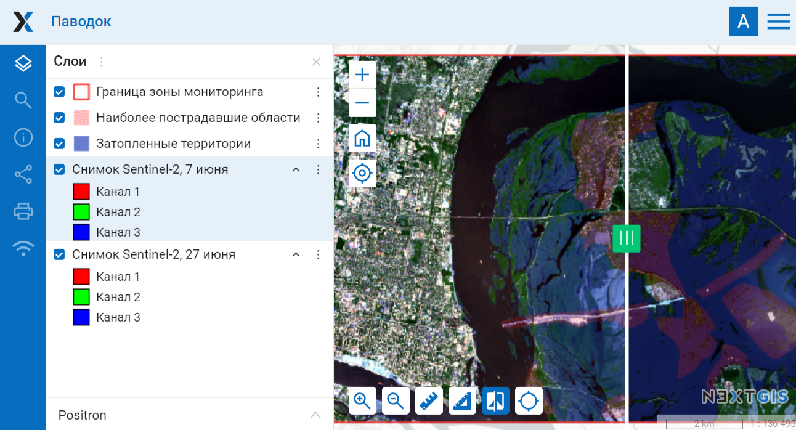

.. _ngcom_description:

Описание и возможности платформы
================================

Веб ГИС - это система, предназначенная для хранения пространственных данных и управления ими через веб-интерфейс или :term:`API`. 

С помощью Веб ГИС вы сможете:

* Загружать и хранить растровые и векторные геоданные; 
* Подключать геоданные из внешних баз данных и геосервисов;
* Отображать геоданные на веб-картах, а также публиковать их с помощью стандартных протоколов;
* Гибко настраивать стили визуализации геоданных;
* Редактировать атрибуты загруженных геоданных, добавлять их описания и фотографии;
* Работать с геоданными через мобильное приложение `NextGIS Mobile <http://nextgis.ru/nextgis-mobile/>`_ и настольное приложение `NextGIS QGIS <http://nextgis.ru/nextgis-qgis/>`_;
* Создавать собственные клиентские приложения, используя :ref:`NextGIS API <ngw_api_description>`.

Посмотрите на платформу в действии в коротком видео:

.. raw:: html

   <iframe width="720" height="405" src="https://rutube.ru/play/embed/9323ef11a606d852933f080c48e9ed1d/" frameBorder="0" allow="clipboard-write; autoplay" webkitAllowFullScreen mozallowfullscreen allowFullScreen></iframe>

Смотреть на `youtube <https://youtu.be/GzReGU2oACI>`_, `rutube <https://rutube.ru/video/9323ef11a606d852933f080c48e9ed1d/>`_.
