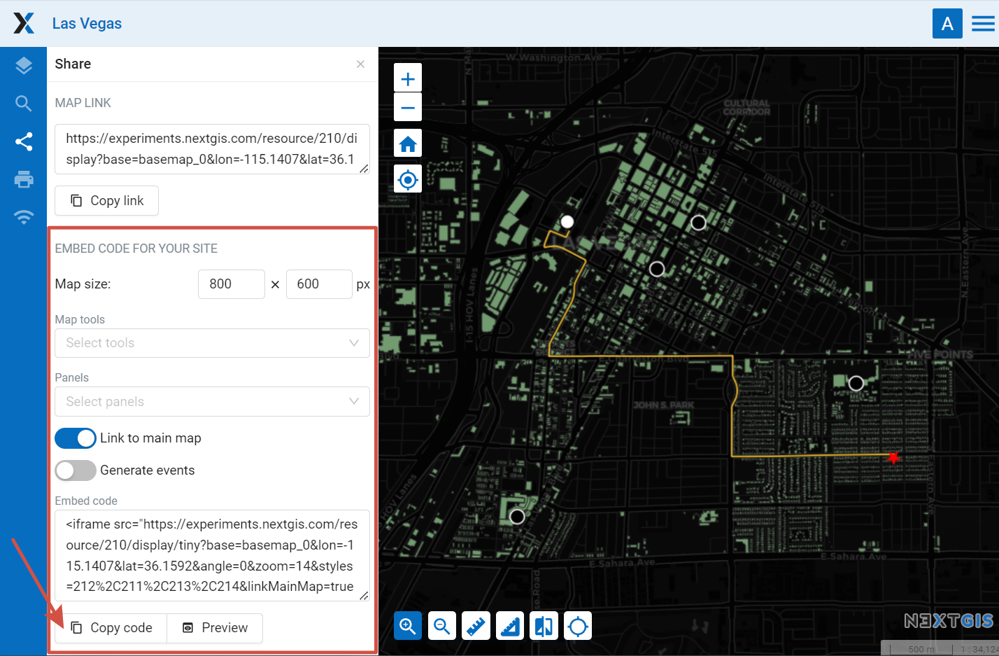
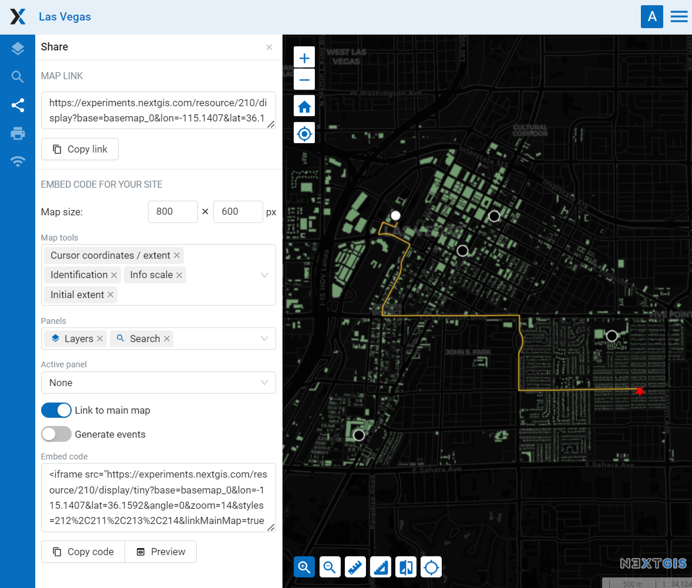

.. _ngcom_embed_webmap:

How to embed a Web Map on your website
======================================

All Web Maps created on nextgis.com can be easily embedded into your website.

.. note:: 
	This functionality is available only to nextgis.com `Mini and Premium <http://nextgis.com/nextgis-com/plans>`_ users.

To embed a Web Map:

* Open Web Map 
* Click on the “Share” panel on the left sidebar
* If you wish to, customize map width and height and `other parameters <https://docs.nextgis.com/docs_ngcom/source/embed_webmap.html#ngcom-embed-webmap-settings>`_.
* Copy the code 
* Paste this code to your site

   Sharing panel
   
   
.. figure:: _static/webmap_on_site_en.png
   :name: webmap_on_site
   :align: center
   :width: 20cm

   Embedded Web Map example

You can preview the embedded map before publishing it by pressing **Preview** button.

.. _ngcom_embed_webmap_settings:

Embeded map settings
------------------------

**Map size** - width and height in pixels.

**Link to the main map** - to go from the site to the map page in the Web GIS.

**Generate events** - for integration and programmatic interaction with the iframe.

You can also embed a Web Map with additional tools and panels. This will allow users, for instance, to enable and disable particular layers. 

**Tools** available for embeded map:

- feature identification;
- measuring area and distance;
- cursor location and extent coordinates;
- scale line;
- initial extent;
- marking user location;
- zoom;
- scale info.

You can also choose which **panels** will be available on the map:

- description;
- layers;
- search.

If several panels are added, you can use the **Active panel** menu to select one of them to be displayed by default or have the map open with the panels minimized.

All settings are included in the code.

   Web Map embedding settings

If you are a developer check out the `code.nextgis.com <https://code.nextgis.com/>`_ library suite
and the `NGW API <https://docs.nextgis.com/docs_ngweb_dev/doc/toc.html>`_.

.. _ngcom_embed_webmap_feature:

How to share a link to a particular Web Map feature
---------------------------------------------------------

Using specially generated GET queries you can share a link to a particular feature of a layer. The link will open with the geographical context that you can select in the Web Map settings.

All you need to do is create links in the information systems. By clicking on them users will be directed to the map with the selected feature and context.

Such links can be automatically generated by your system integrated with NextGIS Web.

Here's an example:

https://demo.nextgis.com/resource/7023/display?panel=layers&hl_lid=7021&hl_attr=OSM_ID&hl_val=135456188&zoom=18

* https://demo.nextgis.com/resource/7023/display?panel=layers - the "pure" Web Map link;
* hl_lid – layer ID;
* hl_attr – attribute (name of attribute field of feature ID);
* hl_val – value of feature ID;
* zoom - value in numbers with 1 as a minimum.

.. figure:: _static/webmap_feature_lik_en.png
   :name: webmap_feature_lik_pic
   :align: center
   :width: 20cm

   Web Map opened via the link

You can make the link manually (`more on how to do it <https://docs.nextgis.com/docs_ngweb/source/webmaps_client.html#ngw-webmaps-client-feature-link>`_).

