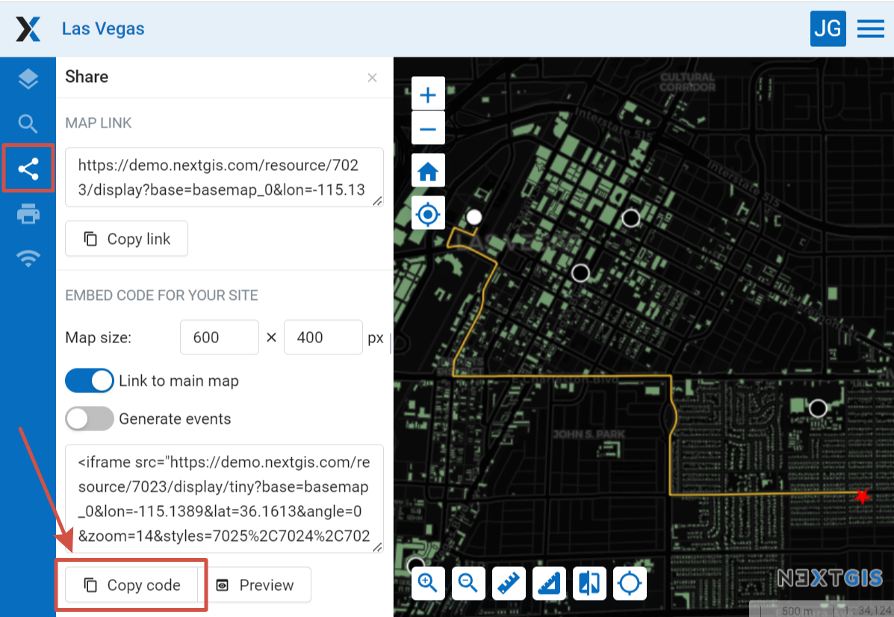
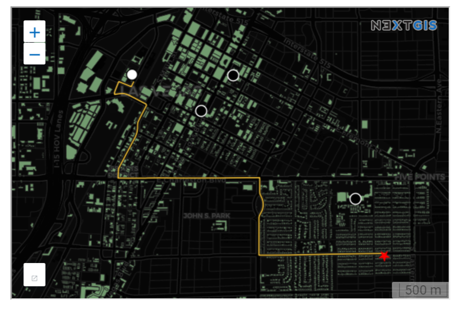
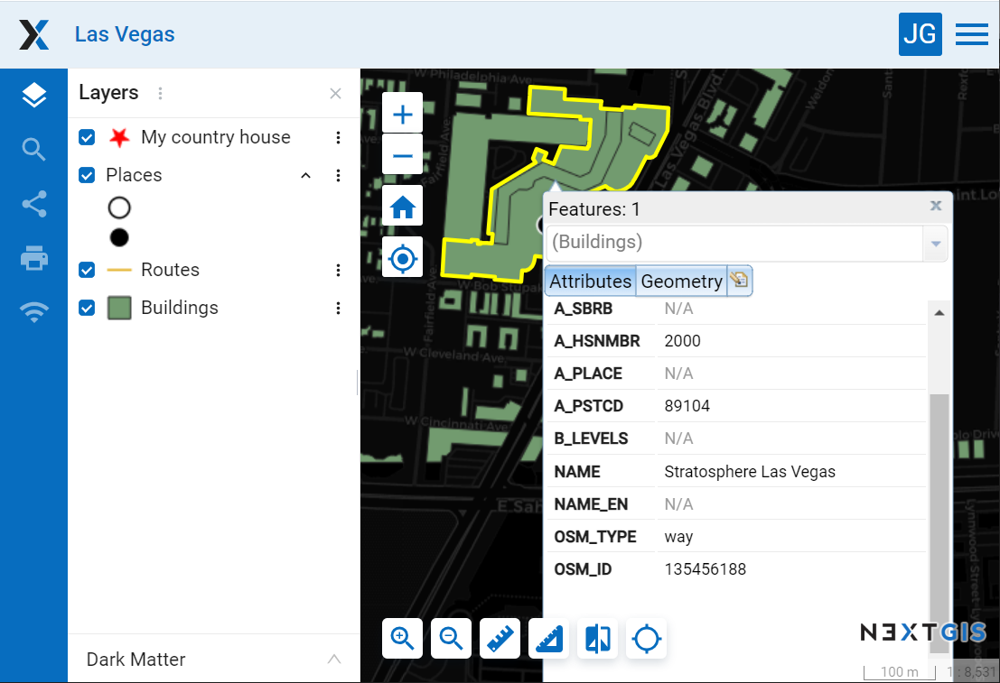

.. _ngcom_embed_webmap:

How to embed a Web Map on your website
======================================

All Web Maps created on nextgis.com can be easily embedded into your website.

.. note:: 
	This functionality is available only to nextgis.com `Mini and Premium users <https://nextgis.com/pricing-base/>`_.

For this:

* Open Web Map
* Click on the "Share" tab on the left sidebar
* Customize your desired map width and height
* Copy the code
* Paste this code on your site

   Options for embedding a Web Map on a site
   
   

   Embedded Web Map example
   
   
There are also additional options:

* Link to the main map - to go from the site to the map page in Web GIS
* Generate events - for integration and programmatic interaction with the iframe
* Preview - to preview the embedded Web Map before publishing it

To embed a Web Map with all the panels available remove ``/tiny`` part from the Web GIS link in iframe code. This will allow users, for instance, to enable and disable particular layers.

If you are a developer check out the `code.nextgis.com <https://code.nextgis.com/>`_ library suite
and the `NGW API <https://docs.nextgis.com/docs_ngweb_dev/doc/toc.html>`_.

.. _ngcom_embed_webmap_feature:

How to share a link to a particular Web Map feature
-------------------------------------

Using specially generated GET queries you can share a link to a particular feature of a layer. The link will open with the geographical context that you can select in the Web Map settings.

All you need to do is create links in the information systems. By clicking on them users will be directed to the map with the selected feature and context.

Such links can be automatically generated by your system integrated with NextGIS Web.

Here's an example:

https://demo.nextgis.com/resource/7023/display?panel=layers&hl_lid=7021&hl_attr=OSM_ID&hl_val=135456188&zoom=18

* https://demo.nextgis.com/resource/7023/display?panel=layers - the "pure" Web Map link;
* hl_lid – layer ID;
* hl_attr – attribute (name of attribute field of feature ID);
* hl_val – value of feature ID;
* zoom - value in numbers with 1 as a minimum.

   Web Map opened via the link

You can make the link manually (`more on how to do it <https://docs.nextgis.com/docs_ngweb/source/webmaps_client.html#ngw-webmaps-client-feature-link>`_).

