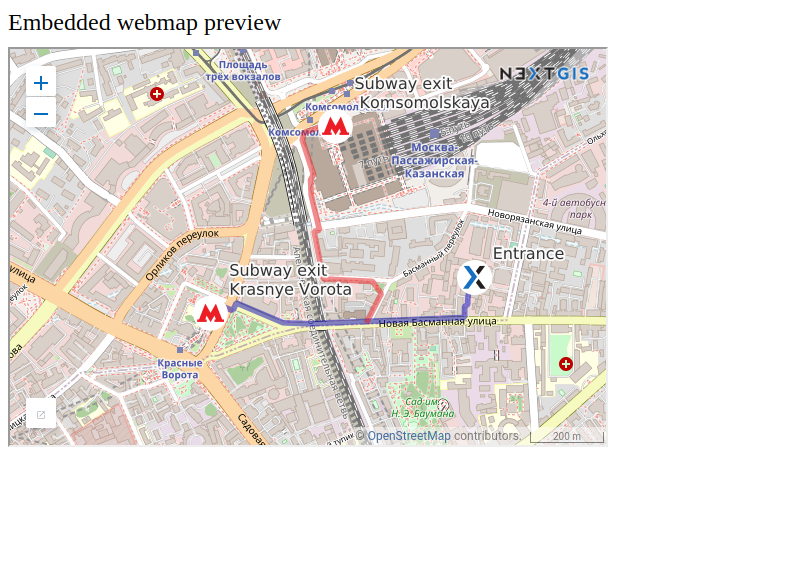

.. _ngcom_embed_webmap:

Как вставить веб-карту на свой веб-сайт
=======================================

Все веб-карты, созданные на nextgis.com, могут быть легко встроены в свой сайт.

.. note:: 
	Для встраивания понадобится предварительно разрешить `кросс-доменные запросы <https://docs.nextgis.ru/docs_ngcom/source/CORS.html>`_ для внешнего сайта.

Для встраивания:

* Откройте веб-карту 
* Нажмите на вкладку «Поделиться» на левой боковой панели
* Настройте желаемую ширину и высоту карты
* Скопируйте код 
* Вставьте код на свой сайт.

.. figure:: _static/embed_webmap.png
   :name: embed_webmap
   :align: center
   :width: 20cm

   Параметры встраивания веб-карты на сайт
   
   

   Пример встроенной на сайт веб-карты

Дополнительные настройки:

* Ссылка на основную карту - для перехода с сайта на страницу карты в Веб ГИС
* Генерация событий - для интеграции и программного взаимодействия с iframe
* Предпросмотр - для предварительного просмотра встроенной веб-карты перед её публикацией

Если вы разработчик, то ознакомьтесь с набором библиотек `code.nextgis.com <https://code.nextgis.com/>`_ и описанием `NGW API <https://docs.nextgis.ru/docs_ngweb_dev/doc/toc.html>`_.
