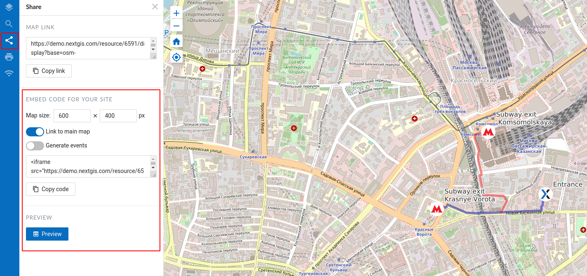

.. _ngcom_embed_webmap:

How to embed a web map on your website
======================================

All web maps created on nextgis.com can be easily embedded into your website.

.. note:: 
	For embedded map to work, `cross-origin resource sharing <https://docs.nextgis.com/docs_ngcom/source/CORS.html>`_ needs to be set for the external website.

For this:

* Open web map
* Click on the "Share" tab on the left sidebar
* Customize your desired map width and height
* Copy the code
* Paste this code on your site

   Options for embedding a web map on a site
   
   
.. figure:: _static/webmap_on_site.png
   :name: svg_qgis_style
   :align: center
   :width: 20cm

   Embedded web map example
   
   
There are also additional options:

* Link to the main map - to go from the site to the map page in Web GIS
* Generate events - for integration and programmatic interaction with the iframe
* Preview - to preview the embedded web map before publishing it

If you are a developer check out the `code.nextgis.com <https://code.nextgis.com/>`_ library suite
and the `NGW API <https://docs.nextgis.ru/docs_ngweb_dev/doc/toc.html>`_.
