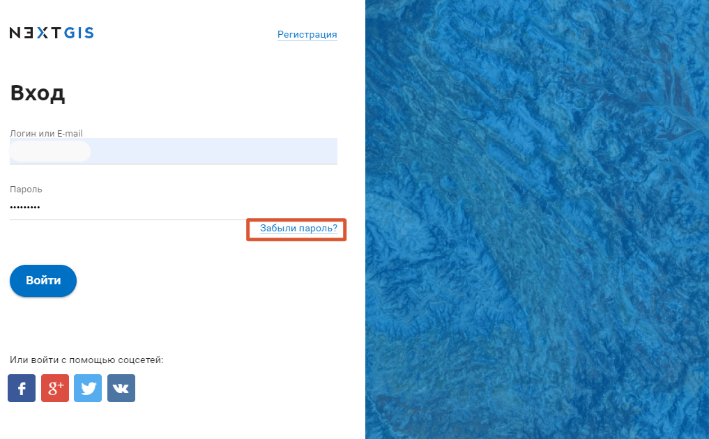
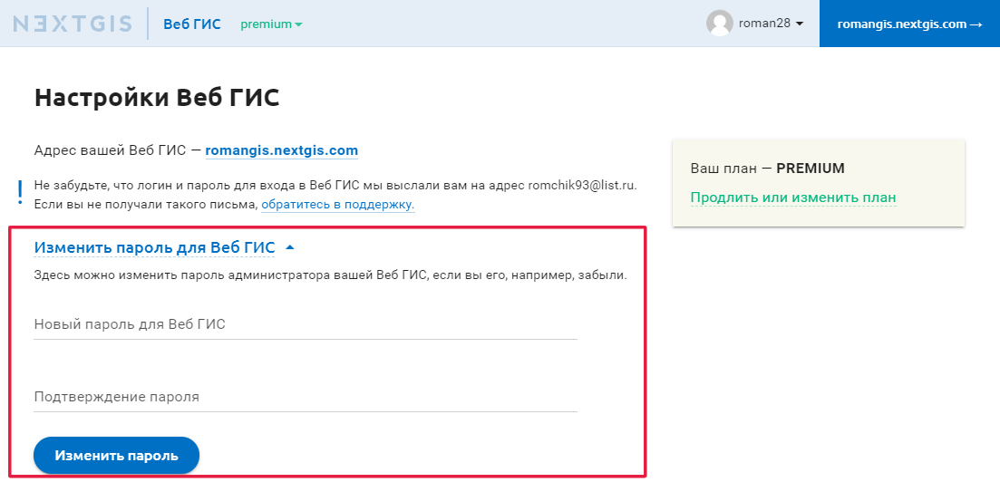
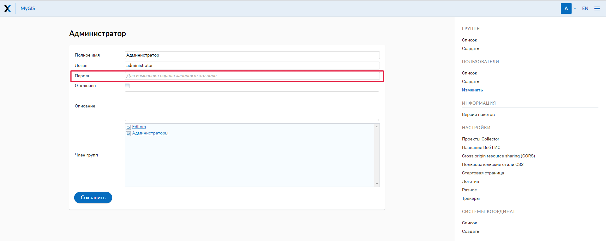

.. _ngcom_faq:

Решение проблем (вопросы и ответы)
================================

В данном разделе вы сможете найти ответы на самые часто задаваемые вопросы по использованию Веб ГИС.

.. _ngcom_change_passwords_webgis:

Восстановление доступа и пароли
-------------------------------

Q: Я забыл пароль от аккаунта (NextGIS ID). Что делать?
~~~~~~~~~~~~~~~~~~~~~~~~~~~~~~~~~~~~~~~~~~~~~~~~~~~~~~~~~~~~~~~~~~~~~~~~~~~~~~~~
**A**: Чтобы восстановить пароль от *NextGIS ID*, выполните следующие действия:

1. Перейдите на `my.nextgis.com <https://my.nextgis.com//>`_
2. Выберите "Забыли пароль?" (см. :numref:`forgot_pass_ngid`)

   Восстановление пароля NextGIS ID

Q: Я забыл пароль от пользователя *administrator* своей Веб ГИС и не могу войти. Что делать?
~~~~~~~~~~~~~~~~~~~~~~~~~~~~~~~~~~~~~~~~~~~~~~~~~~~~~~~~~~~~~~~~~~~~~~~~~~~~~~~~~~~~~~~~~~~~~~~~~~~
**A:** Если вы забыли пароль от адиминистратора вашей Веб ГИС, восттановите его по следующей инструкции:

1. Перейдите на `my.nextgis.com <https://my.nextgis.com//>`_
2. Войдите с помощью NextGIS ID
3. Перейдите в раздел Настройки Веб ГИС
4. Нажмите Изменить пароль Веб ГИС
5. Введите и подтвердите новый пароль

Дождитесь подтверждающего сообщения по почте. После этого вы сможете войти в вашу Веб ГИС с пользователем **administrator** и указанным паролем.

   Изменение пароля администратора Веб ГИС

Q: Я забыл пароль от созданного администратором пользователя Веб ГИС
~~~~~~~~~~~~~~~~~~~~~~~~~~~~~~~~~~~~~~~~~~~~~~~~~~~~~~~~~~~~~~~~~~~~~
**A**: Если вы забыли пароль от любого пользователя, который не является администратором Веб ГИС, выполните следующие действия:

1. Перейдите на `my.nextgis.com <https://my.nextgis.com//>`_
2. Войдите с помощью NextGIS ID
3. Войдите в свою Веб ГИС http://username.nextgis.com/ под пользователем **administrator**
4. Откройте основное меню в правом верхем углу интерфейса
5. Перейдите в Панель управления
6. Откройте список пользователей (см. :numref:`list_users`)
7. Измените пароль в настройках пользователя (см. :numref:`admin_change_password`)

.. figure:: _static/list_users.png
   :name: list_users
   :align: center
   :width: 16cm    

   Список пользователей Веб ГИС
   

   Изменение пароля пользователя Веб ГИС
   

