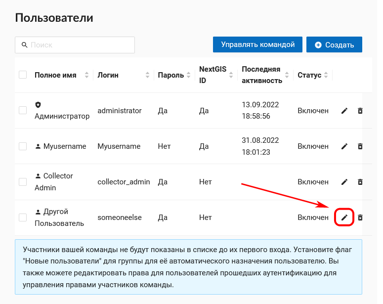
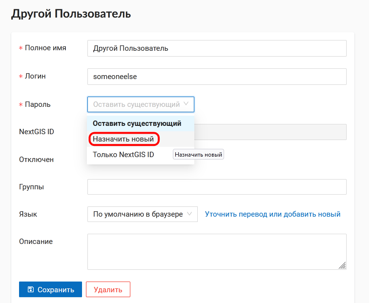

.. _ngcom_faq:

Решение проблем (вопросы и ответы)
================================

В данном разделе вы сможете найти ответы на самые часто задаваемые вопросы по использованию Веб ГИС и решению проблем.

.. _ngcom_webgis_howto_signin:

Вход в Веб ГИС
--------------

У меня есть своя Веб ГИС. Как в нее войти?
~~~~~~~~~~~~~~~~~~~~~~~~~~~~~~~~~~~~~~~~~~

В правом верхнем углу нажмите Войти, во всплывающем окне выберите "Войти через NextGIS ID".  Введите учетные данные от вашего глобального аккаунта NextGIS ID (имя пользователя или емейл-адрес, использованный при регистрации, и пароль). 
Если забыли пароль или логин, инструкция `ниже <https://docs.nextgis.ru/docs_ngcom/source/faq_webgis.html#nextgis-id>`_.

Как предоставить доступ к моей Веб ГИС другому пользователю?
~~~~~~~~~~~~~~~~~~~~~~~~~~~~~~~~~~~~~~~~~~~~~~~~~~~~~~~~~~~~

1) Пользователь заводит аккаунт на `my.nextgis.com <https://my.nextgis.com/>`_. 
2) Владелец Веб ГИС переходит в раздел `Команда <https://docs.nextgis.ru/docs_ngcom/source/create.html#ngcom-team-management>`_ и добавляет участника по его имени пользователя.
3) Пользователь осуществляет первый вход через NextGIS ID.

.. _ngcom_change_passwords_webgis:

Восстановление доступа и пароли
-------------------------------

Я забыл пароль от аккаунта (NextGIS ID). Что делать?
~~~~~~~~~~~~~~~~~~~~~~~~~~~~~~~~~~~~~~~~~~~~~~~~~~~~
Чтобы восстановить пароль от аккаунта (NextGIS ID), выполните следующие действия:

1. Перейдите на `my.nextgis.com <https://my.nextgis.com//>`_
2. Выберите "Забыли пароль?" (см. :numref:`forgot_pass_ngid`)
3. Введите e-mail который вы использовали при создании аккаунта.

На этот e-mail придет информация для восстановления пароля.

.. figure:: _static/forgot_pass_ngid.png
   :name: forgot_pass_ngid
   :align: center
   :width: 16cm    

   Восстановление пароля NextGIS ID

Я забыл и логин и пароль от аккаунта (NextGIS ID). Что делать?
~~~~~~~~~~~~~~~~~~~~~~~~~~~~~~~~~~~~~~~~~~~~~~~~~~~~~~~~~~~~~~
Если вы потеряли информацию и о логине и о пароле от своего аккаунта и не можете получить доступ к своей Веб ГИС, выполните следующие действия:

1. Сообщите на support@nextgis.com адрес своей Веб ГИС. Сопроводите письмо указанием информации которая позволит нам идентифицировать вас, как владельца этой Веб ГИС. Номер договора или номер оплаченного счета, название организации и т.п.
2. Ответным письмом мы сообщим вам логин аккаунта (NextGIS ID) владельца этой Веб ГИС.
3. Следуйте инструкции "Я забыл пароль от аккаунта (NextGIS ID). Что делать?" для дальнейших шагов по восстановлению доступа.

Я забыл пароль от пользователя *administrator* своей Веб ГИС и не могу войти. Что делать?
~~~~~~~~~~~~~~~~~~~~~~~~~~~~~~~~~~~~~~~~~~~~~~~~~~~~~~~~~~~~~~~~~~~~~~~~~~~~~~~~~~~~~~~~~
Если вы забыли пароль от адиминистратора вашей Веб ГИС, восстановите его по следующей инструкции:

1. Перейдите на `my.nextgis.com <https://my.nextgis.com//>`_
2. Войдите с помощью NextGIS ID (адреса электронной почты или имени пользователя, владельца вашей Веб ГИС)
3. Перейдите в раздел Настройки Веб ГИС (ссылка Веб ГИС в панели слева)
4. Нажмите Изменить пароль Веб ГИС
5. Введите и подтвердите новый пароль

Дождитесь подтверждающего сообщения по почте. После этого вы сможете войти в вашу Веб ГИС с пользователем **administrator** и указанным паролем.

.. figure:: _static/Web_GIS_change_password.png
   :name: Web_GIS_change_password
   :align: center
   :width: 16cm    

   Изменение пароля администратора Веб ГИС

Я забыл пароль от созданного администратором пользователя Веб ГИС, как его восстановить?
~~~~~~~~~~~~~~~~~~~~~~~~~~~~~~~~~~~~~~~~~~~~~~~~~~~~~~~~~~~~~~~~~~~~~~~~~~~~~~~~~~~~~~~~
Если вы забыли пароль от любого пользователя, который не является администратором Веб ГИС, выполните следующие действия:

1. Войдите в свою Веб ГИС под пользователем **administrator**
2. Откройте основное меню в правом верхем углу интерфейса
3. Перейдите в Панель управления
4. Откройте список пользователей (см. :numref:`control_list_users`)
5. В настройках пользователя выберите в поле "Пароль" в выпадающем меню "Назначить новый" и введите новый пароль (см. :numref:`admin_change_password`).

   Список пользователей Веб ГИС
   

   Изменение пароля пользователя Веб ГИС

.. _ngcom_personaldata:
   
Персональные данные
-------------------

Как узнать какие персональные данные хранят сервисы NextGIS?
~~~~~~~~~~~~~~~~~~~~~~~~~~~~~~~~~~~~~~~~~~~~~~~~~~~~~~~~~~~~

1. Войдите в личный кабинет на `my.nextgis.com <https://my.nextgis.com//>`_.  Восстановите доступ по инструкции выше, если забыли пароль.
2. Перейдите в Профиль, раздел Управление профилем
3. Выберите Экспорт данных

Все ваши персональные данные обрабатываемые NextGIS будут отправлены вам на почту.

Как полностью удалить мои персональные данные?
~~~~~~~~~~~~~~~~~~~~~~~~~~~~~~~~~~~~~~~~~~~~~~

1. Войдите в личный кабинет на `my.nextgis.com <https://my.nextgis.com//>`_. Восстановите доступ по инструкции выше, если забыли пароль.
2. Перейдите в Профиль, раздел Управление профилем
3. Выберите Удаление профиля

Ваш профиль и персональные данные будут удалены. Это действие нельзя отменить.

.. _ngcom_2_accounts_nextgis:

Два аккаунта NextGIS. Краткая предыстория и объяснения
------------------------------------------------------

Компания NextGIS быстро развивается и у неё есть `несколько <https://nextgis.ru/software/>`_ облачных сервисов и продуктов, использующих авторизацию, один из них - Веб ГИС.

Как правило, стандартному пользователю платформы NextGIS нужно 2 аккаунта: глобальный и локальный. Но, в зависимости от конкретной задачи этого пользователя, возможны ситуации, когда может хватить одного из них.

.. _ngcom_global_account:

Глобальный аккаунт
~~~~~~~~~~~~~~~~~~
Для большинства сервисов требуется **глобальный** аккаунт. Это обычный аккаунт действующий везде единообразно, он дает доступ ко всем сервисам.

Аккаунт создаётся стандартной регистрацией на my.nextgis.com. В качестве имени пользователя при последующем входе с помощью этого аккаунта может выступать Email, указанный при регистрации или логин, указанный в профиле.

.. _ngcom_local_account:

Локальный аккаунт (аккаунт в вашей Веб ГИС)
~~~~~~~~~~~~~~~~~~~~~~~~~~~~~~~~~~~~~~~~~~~
Исторически главный продукт NextGIS - это Веб ГИС. В отличие от других сервисов, которые делят одну большую базу уникальных пользователей, у **каждой** Веб ГИС есть **своя система** учетных записей, действующая **локально** в рамках этой Веб ГИС.

Например, в каждой Веб ГИС есть пользователь *administrator*. Локальность его заключается в том, что c *administrator* одной Веб ГИС нельзя зайти в другую. Другими словами, любые другие сервисы и приложения ничего не знают про этого пользователя, если рядом не указывается из какой он Веб ГИС.

Эти аккаунты создаются в панели управления Веб ГИС пользователем с соответствующими полномочиями (обычно это *administrator*). Они не привязаны ни к каким адресам электронной почты.

.. _ngcom_how_to_use:

Что и где нужно использовать
~~~~~~~~~~~~~~~~~~~~~~~~~~~~

**NextGIS Web (Веб ГИС)**

* Создание самой Веб ГИС - глобальный аккаунт.
* Любые действия требующие авторизации - локальный аккаунт созданный в этой Веб ГИС.

**NextGIS Collector**

* Вход и сбор данных - глобальный аккаунт.

**NextGIS Mobile**

* Разблокировка дополнительных функций приложения - глобальный аккаунт.
* Подключение слоёв из Веб ГИС (невозможно без разблокировки) - локальный аккаунт этой Веб ГИС.

**NextGIS QGIS**

* Разблокировка дополнительных функций приложения - глобальный аккаунт.
* Подключение слоёв из Веб ГИС через NextGIS Connect - локальный аккаунт  этой Веб ГИС.

**NextGIS Formbuilder**

* Разблокировка дополнительных функций приложения - глобальный аккаунт.
* Отправка/получение форм в/из Веб ГИС (невозможно без разблокировки) - локальный аккаунт этой Веб ГИС.

**NextGIS Data**

* Получение заказанных данных - глобальный аккаунт.

**NextGIS Toolbox**

* Запуск инструментов - глобальный аккаунт.

**NextGIS QMS**

* Создание сервисов - глобальный аккаунт.

**NextGIS Geoservices**

* Получение тайлов (ОСМ /вектор, растр/, ПКК /растр/), запросы на информацию о кварталах и участках - глобальный аккаунт.
