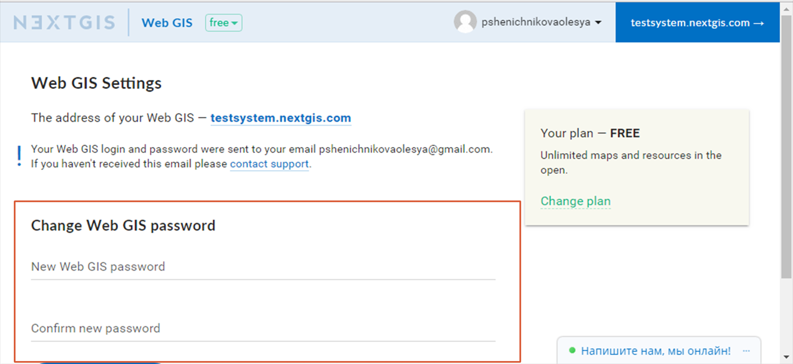
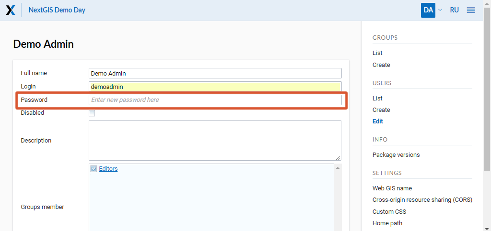

.. _ngcom_faq:

Problem Solving (Q&A)
================================

In this section you can find answers to the most frequently asked questions about using Web GIS.

.. _ngcom_change_passwords_webgis:

Access recovery and passwords
-------------------------------

I forgot my account password (NextGIS ID). What to do?
~~~~~~~~~~~~~~~~~~~~~~~~~~~~~~~~~~~~~~~~~~~~~~~~~~~~~~~~~~~~~~~~~~~~~~~~~~~~~~~~
To recover a password from *NextGIS ID*, follow these steps:

1. Go to `my.nextgis.com <https://my.nextgis.com//>`_
2. Select "Forgot password?"

.. figure:: _static/forgot_pass_ngid_en.png
   :name: forgot_pass_ngid_en
   :align: center
   :width: 16cm    

   Password recovery NextGIS ID

I forgot the password from the user *administrator* of my Web GIS and can not log in. What to do?
~~~~~~~~~~~~~~~~~~~~~~~~~~~~~~~~~~~~~~~~~~~~~~~~~~~~~~~~~~~~~~~~~~~~~~~~~~~~~~~~~~~~~~~~~~~~~~~~~~~
If you have forgotten the password from the administrator of your Web GIS, restore it using the following instructions:

1. Go to `my.nextgis.com <https://my.nextgis.com//>`_
2. Sign in with NextGIS ID
3. Go to Web GIS Settings
4. Click Change Web GIS Password
5. Enter and confirm a new password

Wait for the confirmation message by email. Then you can log in to your Web GIS **administrator** user and specified password.

   Changing Web GIS Administrator Password
   
   
   
I forgot the password for Web GIS user created by the administrator
~~~~~~~~~~~~~~~~~~~~~~~~~~~~~~~~~~~~~~~~~~~~~~~~~~~~~~~~~~~~~~~~~~~~~
If you have forgotten the password for any user who is not a Web GIS administrator, follow these steps: 

1. Go to `my.nextgis.com <https://my.nextgis.com//>`_
2. Log in with NextGIS ID
3. Log in to your Web GIS http://username.nextgis.com/ as user **administrator**
4. Open the main menu in the upper right corner of the interface
5. Go to Control Panel
6. Open the user list
7. Change the password in the user settings (см. :numref:`change_password_user_en`)

   Changing Web GIS User Password
