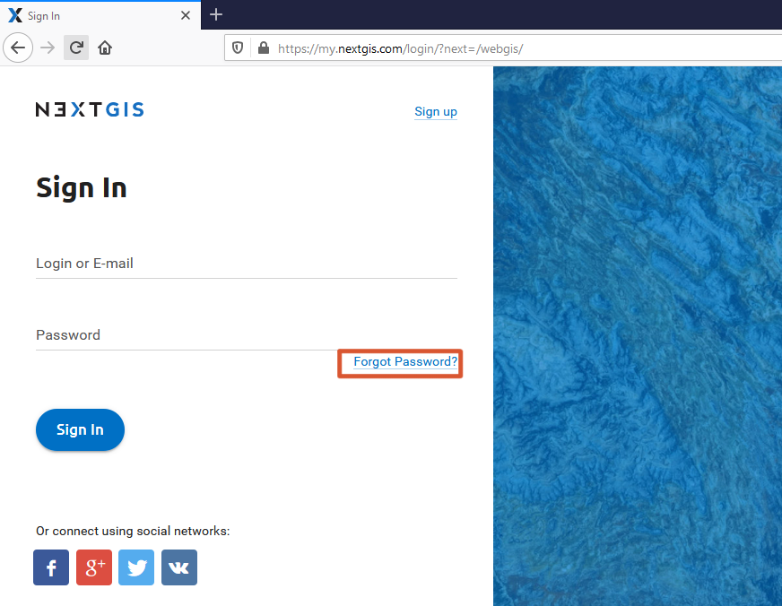
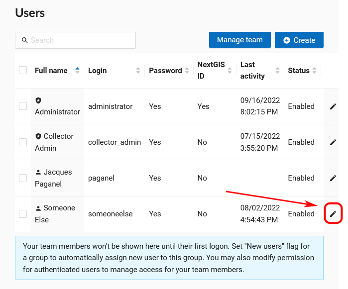
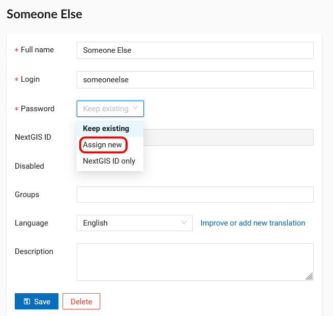

.. _ngcom_faq:

Problem Solving (Q&A)
================================

In this section you can find answers to the most frequently asked questions about using Web GIS.

.. _ngcom_webgis_howto_signin:

How to sign in to Web GIS
--------------------------

I have a Web GIS. How do sign in?
~~~~~~~~~~~~~~~~~~~~~~~~~~~~~~~~~
In the upper right corner press "Sign in", then select "Sign in with NextGIS ID". Enter the credentials of your global NextGIS account (username or email used for registration and password).
If you forgot your password or login, see instructions `below <https://docs.nextgis.com/docs_ngcom/source/faq_webgis.html#ngcom_change_passwords_webgis>`_.

I want to let another user access my Web GIS. How can I do it?
~~~~~~~~~~~~~~~~~~~~~~~~~~~~~~~~~~~~~~~~~~~~~~~~~~~~~~~~~~~
1. The user creates an account on `my.nextgis.com <https://my.nextgis.com/>`_. 
2. The owner of the Web GIS goes to the `Team <https://docs.nextgis.com/docs_ngcom/source/create.html#team-management>`_ page and adds a new team member by username.
3. The user logs in with NextGIS ID.

.. _ngcom_change_passwords_webgis:

Access recovery and passwords
-------------------------------

I forgot my account password (NextGIS ID). What to do?
~~~~~~~~~~~~~~~~~~~~~~~~~~~~~~~~~~~~~~~~~~~~~~~~~~~~~~
To recover a password from *NextGIS ID*, follow these steps:

1. Go to `my.nextgis.com <https://my.nextgis.com//>`_
2. Select "Forgot password?"

   Password recovery NextGIS ID

I forgot both username and password of my account. What to do?
~~~~~~~~~~~~~~~~~~~~~~~~~~~~~~~~~~~~~~~~~~~~~~~~~~~~~~~~~~~~~
If you lost both username (email) and password from your account and can't recover access to your Web GIS, follow these steps:

1. Write us at support@nextgis.com with the address of your Web GIS. Add information that will help us identify you as the owner of this Web GIS. Agreement number or paid invoice or any other information.
2. We will let you know in a reply what your login is.
3. Use instruction above "I forgot my account password (NextGIS ID). What to do?" to recover your password and futher access to your account.

   
I forgot the password for Web GIS user created by the administrator
~~~~~~~~~~~~~~~~~~~~~~~~~~~~~~~~~~~~~~~~~~~~~~~~~~~~~~~~~~~~~~~~~~~~~
If you have forgotten the password for any user who is not a Web GIS administrator, follow these steps: 

1. Log in to your Web GIS https://username.nextgis.com/ as user **administrator**
2. Open the main menu in the upper right corner of the interface
3. Go to Control Panel
4. Open the user list
5. Change the password in the user settings

   
   List of Web GIS users

   Changing Web GIS User Password

.. _ngcom_personaldata:
   
Personal data
-------------

What personal data are stored by NextGIS services?
~~~~~~~~~~~~~~~~~~~~~~~~~~~~~~~~~~~~~~~~~~~~~~~~~~

1. Log in with your account at https://my.nextgis.com. See FAQ sections above to restore access.
2. Go to Profile, Profile management section
3. Choose Data export, press Request data.

You will receive a copy of your personal data processed by NextGIS.

How do I completely remove all personal data stored at NextGIS?
~~~~~~~~~~~~~~~~~~~~~~~~~~~~~~~~~~~~~~~~~~~~~~~~~~~~~~~~~~~~~~~

1. Log in with your account at https://my.nextgis.com. See FAQ sections above to restore access.
2. Go to Profile, Profile management section
3. Choose Profile removal, press Delete profile.

Your profile and personal data will be completely deleted. This can't be undone.

.. _ngcom_2_accounts_nextgis:

Two NextGIS accounts. Background
--------------------------------

NextGIS is growing fast and it has several services and products that use authorization. Web GIS is one of this services.

As a rule, a typical NextGIS platform user needs 2 accounts: a global and a local one. But, for some specific tasks, it is possible that just one of them will be enough.

.. _ngcom_global_account:

Global account
~~~~~~~~~~~~~~
Most services require a **global** account NextGIS ID. This is the typical account that acts uniformly almost everywhere. It gives access to all services.

This account is created by registration at http://my.nextgis.com. Email or login and password provided during registration can be used to sign in with services.

.. _ngcom_local_account:

Local account (your Web GIS account)
~~~~~~~~~~~~~~~~~~~~~~~~~~~~~~~~~~~~
Historically, NextGIS' main service is Web GIS. Unlike other services that use centralized database of users, each Web GIS has its own account system that operates locally within that Web GIS.

These accounts are created in the Web GIS control panel by a user with appropriate authority (usually administrator). They are not tied to any E-mails. Local accounts are used for specific purposes, for example, creating `data collection projects <https://docs.nextgis.com/docs_ngcom/source/collector.html#collector-create-project>`_.

