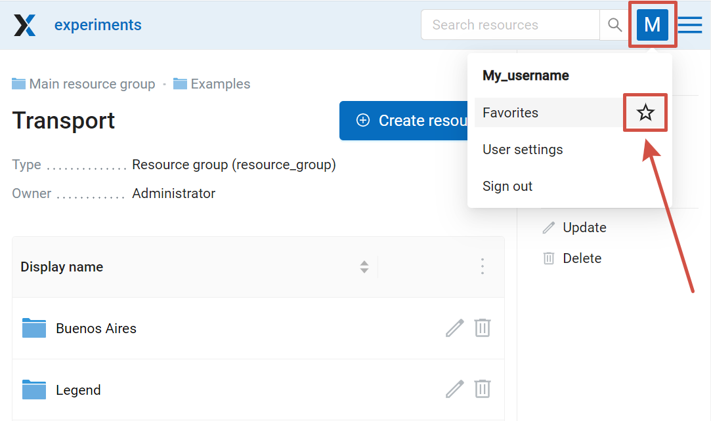
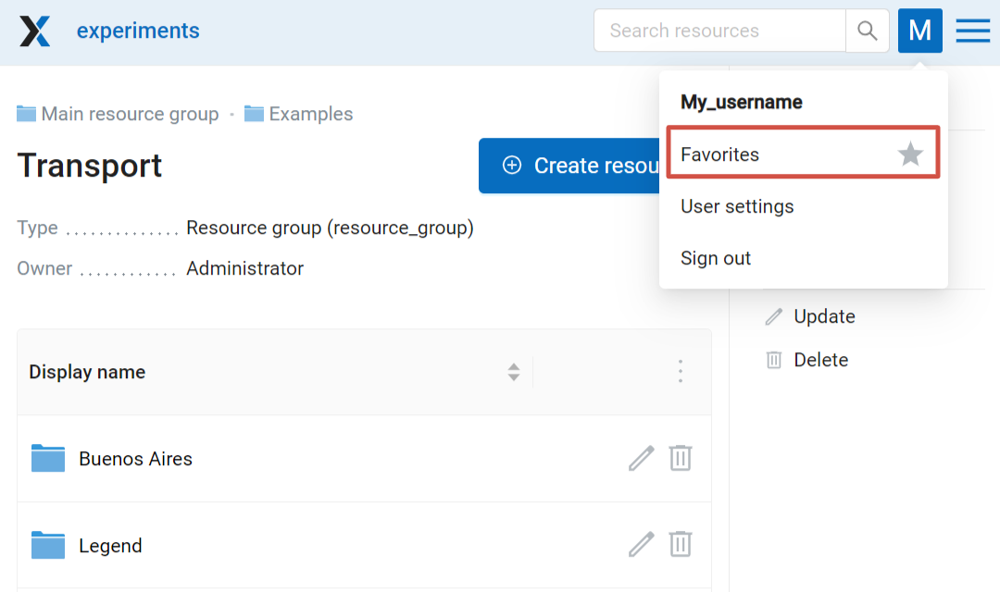
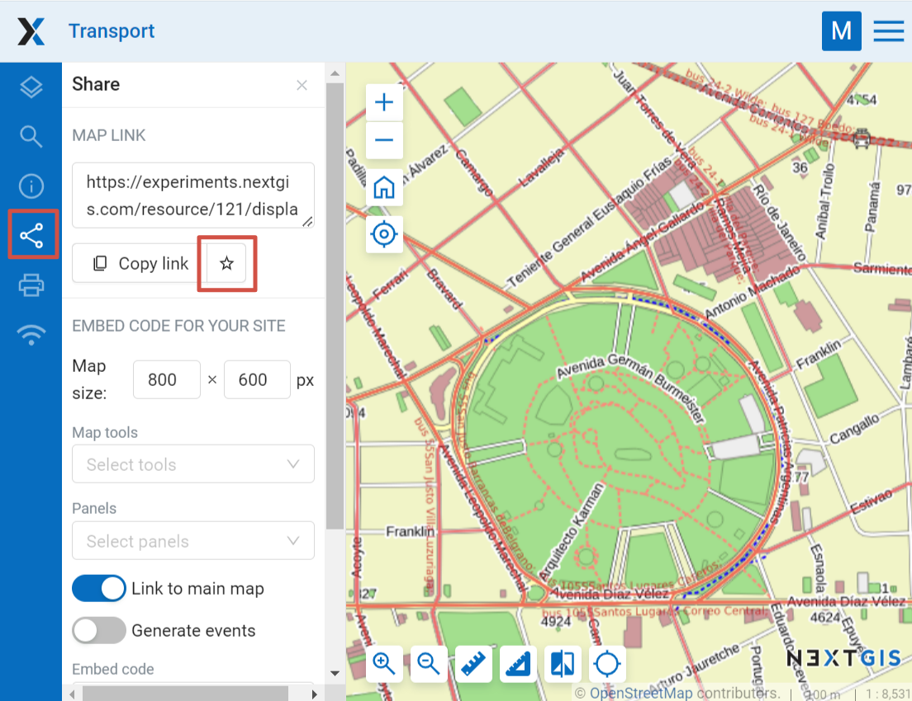
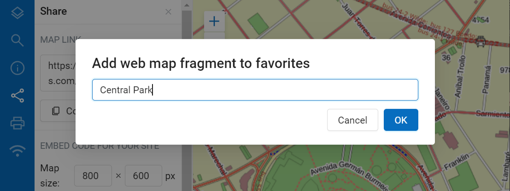
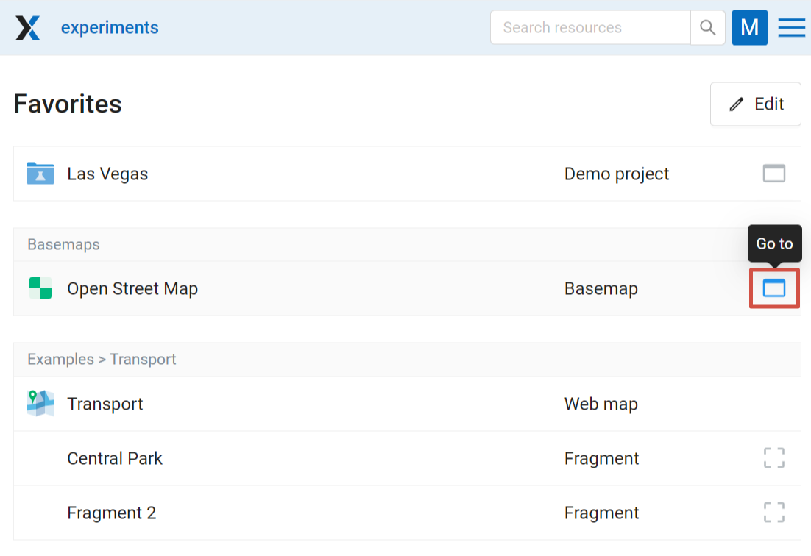
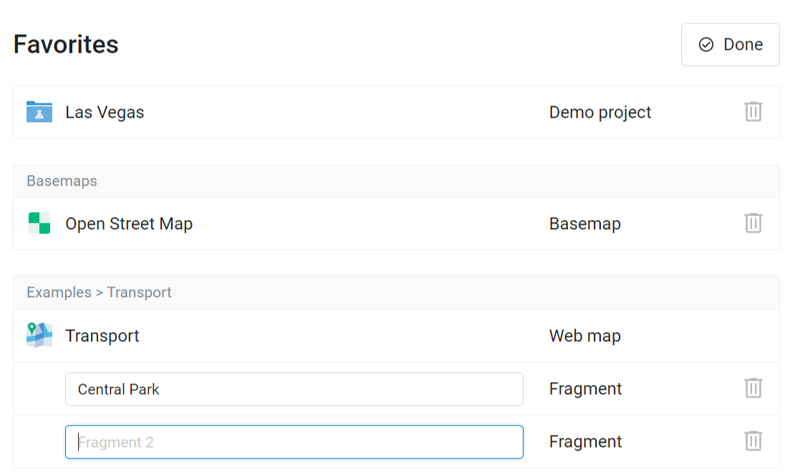

.. sectionauthor:: Юлия Григоренко <grigorenko.j@gmail.com>

.. _ngw_favorites:

How to add Web GIS items to favorites
----------------------------------------------

When your Web GIS contains many layers and maps, having quick access to the most frequently used ones is crucial. In NextGIS Web, you can do this through the Favorites feature.   

To add a resource to Favorites, navigate to its page, click on the user initials in the top panel to open the menu and press the star icon.

   Adding to Favorites

Message "Added to Favorites" will appear and the star will be filled.

To open the Favorites page, click on the Favorites item in the menu.

   Resource added to Favorites

.. _ngw_favorites_wm_fragment:

How to add Web Map fragment to Favorites
~~~~~~~~~~~~~~~~~~~~~~~~~~~~~~~~~~~~~~~~~~~~~

You can add a Web Map to Favorites with the extent different from the initial extent chosen in the Web Map settings. To do so open the map, modify the extent, then open the "Share" tab and press the star next to the "Copy link" button.

   Adding Web Map fragment to Favorites

You can set up a custom name for the fragment or keep the default ("Fragment").

   Name for the fragment

The fragment name can later be edited from the Favorites page (see below).

.. _ngw_favorites_edit:

Favorites list editing
~~~~~~~~~~~~~~~~~~~~~~~~~~~~~~~~~~~~~~~

The Favorites page contains a list of the added resources. Above each one there is the name of the parent resource, if it's not the Main resource group.

   Favorites

To open the page of a resource, press  **Go to** button on the right end of the row. 

Press **Edit** button to modify the list.

   Editing Favorites

To remove a resource from Favorites, click the bin icon on the right. No additional confirmation needed. Deleting from Favorites will not affect the resource itself. You can add it to Favorites and remove it multiple times.

Also from this page you can modify the name of the added Web Map fragments. 

To exit the editing mode, press **Done**.
