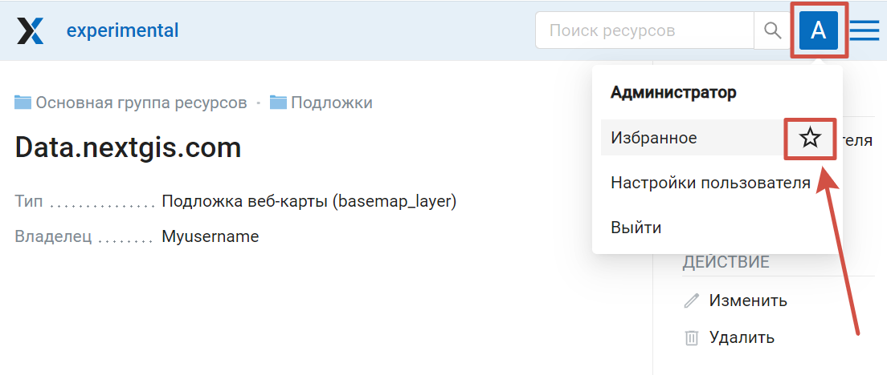
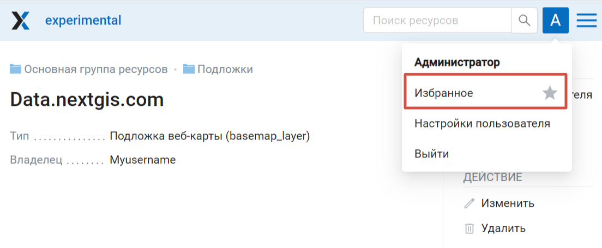
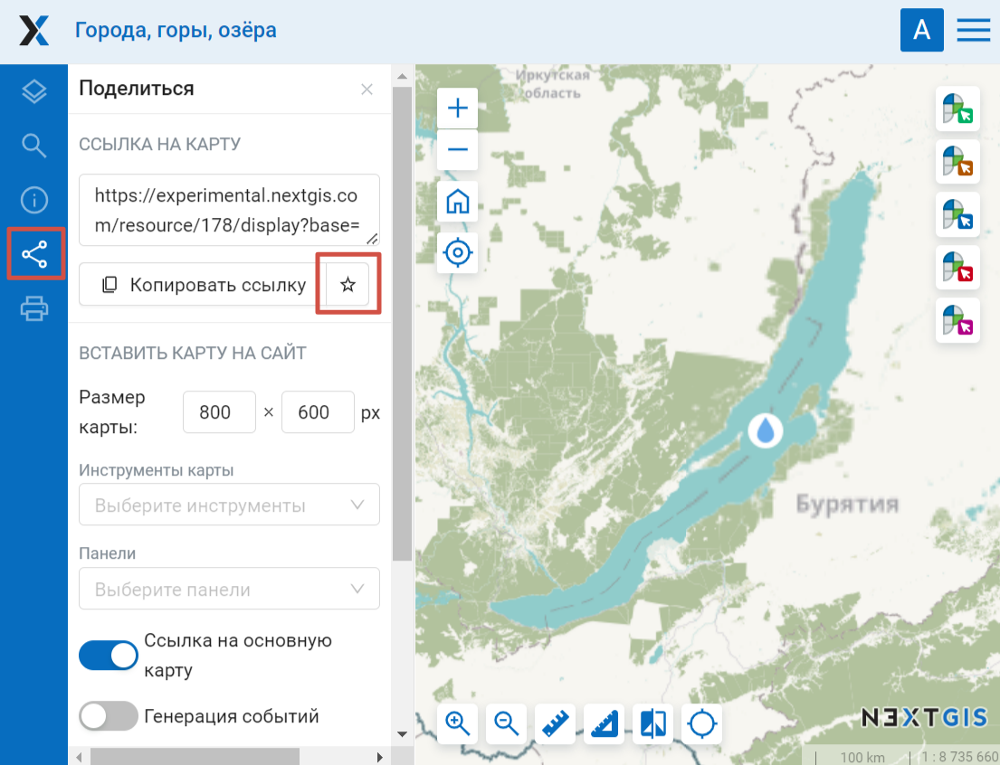
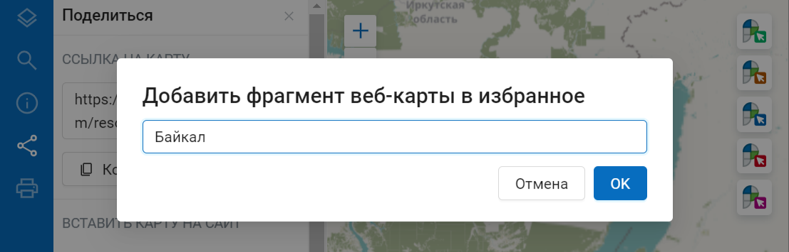
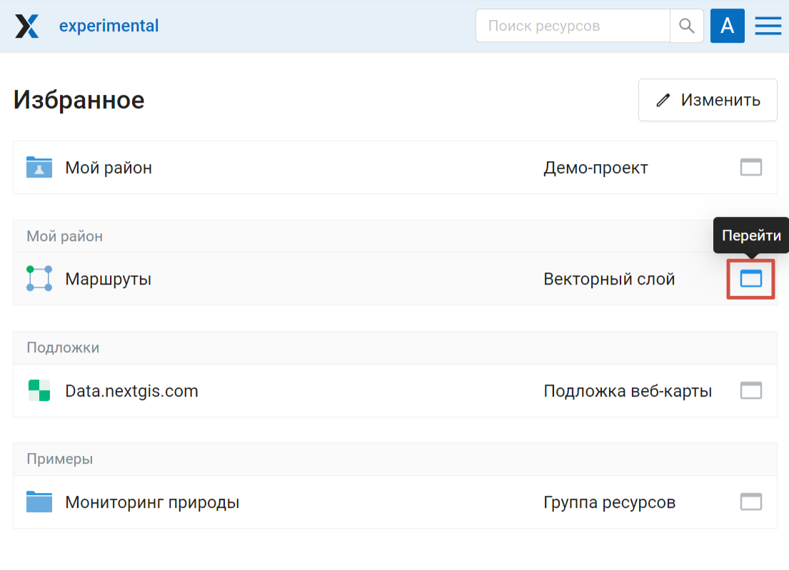
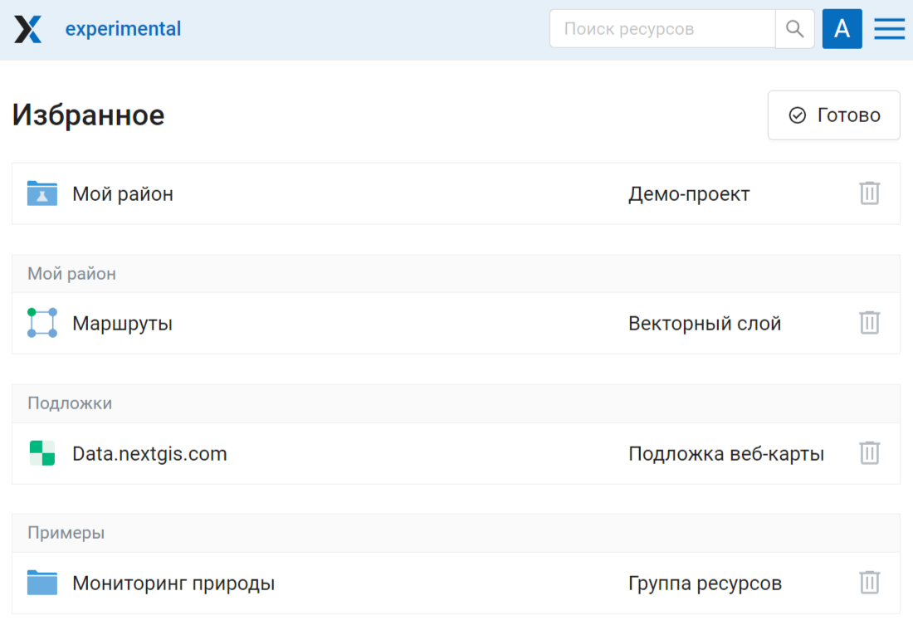
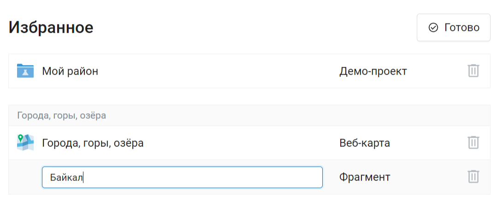

.. sectionauthor:: Юлия Григоренко <grigorenko.j@gmail.com>

.. _ngcom_favorites:

Как добавить элементы Веб ГИС в избранное
----------------------------------------------

Когда в Веб ГИС хранится много слоёв и карт, нужна возможность быстро найти самые важные из них. Для этого в NextGIS Web есть Избранное.  

Чтобы добавить ресурс в избранное, откройте его страницу, нажмите на значок с инициалами пользователя в верхней панели, чтобы вызвать меню, и затем нажмите звездочку.

   Добавление в избранное

Появится сообщение "Добавлено в избранное" и звездочка целиком станет серой.

Чтобы перейти в избранное, нажмите на этот пункт меню.

   Ресурс добавлен в избранное

.. _ngcom_favorites_wm_fragment:

Как добавить фрагмент веб-карты в избранное
~~~~~~~~~~~~~~~~~~~~~~~~~~~~~~~~~~~~~~~~~~~~~

При добавлении в избранное веб-карты можно выбрать нужный охват, отличающийся от начального, заданного в настройках самой карты. Для этого откройте карту, настройте желаемый охват, затем перейдите в панель "Поделиться" и нажмите на звездочку рядом с кнопкой "Копировать ссылку".

   Добавление фрагмента веб-карты в избранное

Можно задать название для этого фрагмента, или оставить значение по умолчанию ("Фрагмент").

   Название для добавляемого в избранное фрагмента

Название фрагмента можно затем отредактировать из списка избранного (см. ниже).

.. _ngcom_favorites_edit:

Список избранного и его редактирование
~~~~~~~~~~~~~~~~~~~~~~~~~~~~~~~~~~~~~~~

Страница избранного содержит список добавленных ресурсов, над каждым из них указан ресурс-родитель, если он отличается от Основной групы ресурсов.

   Избранное

Рядом с каждым ресурсом находится кнопка **Перейти**, нажав на которую, вы попадете на страницу соответствующего ресурса.

Кнопка **Изменить** переводит в режим редактирования списка.

   Редактирование списка избранного

Здесь вы можете удалить ресурс из избранного, нажав на иконку мусорного ведра справа от него. Дополнительного подтверждения удаления не требуется. На сам ресурс это действие не повлияет, его можно добавлять в избранное и убирать из него по мере необходимости.

Также можно изменить название фрагмента карты, добавленного в избранное. 

Чтобы вернуться в обычный режим, нажмите **Готово**.

Посмотрите, как работать с избранным, в нашем `видео <https://youtu.be/sCWNxPsduJM>`_.
